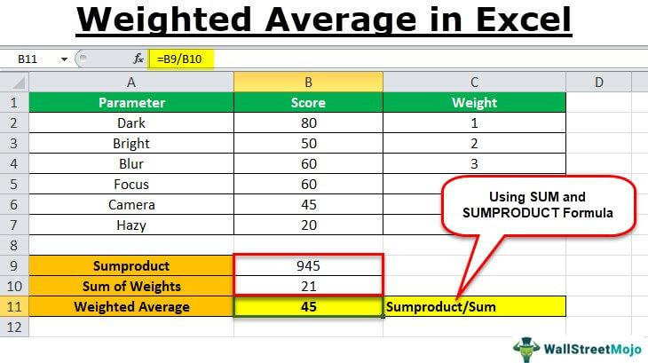

In recent years, algorithmic trading has revolutionized the financial markets by significantly enhancing the speed and operational efficiency of trades. A central element within these algorithms is the application of mathematical and statistical methods, among which weighted average calculations are particularly crucial. These calculations are vital as they distill vast datasets into actionable insights, helping traders optimize execution strategies effectively.

Weighted averages differ from simple averages by assigning varying levels of importance to different data points. This weighted approach provides traders with a refined and more accurate perspective on financial metrics, allowing for more strategic decision-making. Traders leverage weighted averages to navigate complex trading environments, leading to informed decisions that align more closely with market dynamics.



This article focuses on the diverse applications of weighted average calculations in algorithmic trading. It examines their profound impact on financial decision-making by illustrating how these calculations enhance the functionality and precision of trading algorithms. To fully understand their significance in algorithmic trading, it is essential to grasp the methods used to calculate weighted averages and appreciate their contribution to refining trading techniques.

## Table of Contents

## Understanding Weighted Average Calculations

Weighted averages provide a nuanced perspective on financial metrics by assigning varying levels of importance, or weights, to different data points, making them crucial for applications in fields like algorithmic trading. Unlike simple averages, which treat all data points equally, weighted averages consider the relevance or significance of each data point, thus offering a more precise reflection of the underlying data, especially in the context of financial markets.

In financial computations, various factors such as volatility, liquidity, time decay, or historical significance often necessitate the application of weighted averages. For instance, in a trading scenario, recent data might be weighted more heavily due to its higher relevance, especially in fast-evolving market conditions. This can be crucial for accurately assessing trends and making real-time trading decisions.

Mathematically, the weighted average is calculated using the following formula:

$$
\text{Weighted Average} = \frac{\sum_{i=1}^{n} w_i \cdot x_i}{\sum_{i=1}^{n} w_i}
$$

Where $x_i$ represents the data points and $w_i$ their corresponding weights. The numerator consists of the sum of products of each data point and its weight, while the denominator is the sum of the weights. This formula highlights how weighted averages can be tailored by altering the weights to influence which data points drive the average.

In the complex environment of financial markets, precision is paramount. Weighted averages provide this precision, as they allow traders and algorithms to focus on the factors deemed most critical for decision-making, unlike equal-weighted analyses that might dilute key insights by not differentiating between data points of varying significance. Properly weighted analyses can identify trends or signals that might be overlooked by simpler approaches, thus enhancing the strategic execution of trades and improving the overall decision-making framework in trading algorithms.

## Applications of Weighted Averages in Algorithmic Trading

Weighted averages are essential tools in [algorithmic trading](/wiki/algorithmic-trading), providing a means to refine trading strategies and achieve specific objectives. One prominent application of weighted averages is the Volume-Weighted Average Price (VWAP). VWAP serves as a benchmark that traders use to execute orders progressively throughout the trading period, thereby minimizing the market impact. By weighting each price according to the [volume](/wiki/volume-trading-strategy) traded at that price, VWAP gives a representation of the average price an asset has traded at throughout the day, adjusted for volume. This can be particularly useful for institutional investors looking to execute large trades without causing significant price fluctuations.

In practical terms, the VWAP is calculated using the formula:

$$
\text{VWAP} = \frac{\sum_{i}(P_i \times V_i)}{\sum_{i} V_i}
$$

where $P_i$ is the price of the transaction, and $V_i$ is the volume of the transaction.

Another critical application is the use of Exponential Moving Averages (EMA), which emphasize recent data points by assigning them higher weights. This characteristic makes EMA a valuable tool for traders seeking to identify market trends and signals more promptly than a Simple Moving Average (SMA) would allow. The formula for EMA involves a smoothing [factor](/wiki/factor-investing) $\alpha$, commonly set as $\alpha = \frac{2}{N+1}$, where $N$ is the number of days in the EMA.

The EMA is calculated as:

$$
\text{EMA}_t = \alpha \times P_t + (1 - \alpha) \times \text{EMA}_{t-1}
$$

EMA provides traders with more responsive signals, which can be pivotal for making timely entry and [exit](/wiki/exit-strategy) decisions in rapidly changing markets.

Furthermore, weighted averages play a crucial role in portfolio rebalancing. By employing weighted averages, traders can dynamically adjust the weights of assets in their portfolios according to current market conditions or predefined risk preferences. This dynamic adjustment helps in maintaining the desired risk-reward balance, crucial for optimizing portfolio performance.

Beyond these applications, weighted averages aid in price discovery processes by providing a smoothed representation of market prices over defined periods. This can be particularly beneficial for [arbitrage](/wiki/arbitrage) opportunities, where traders capitalize on price discrepancies of the same asset in different markets. Additionally, in risk management, weighted averages offer a comprehensive view of potential trade-offs, allowing traders to evaluate the risk exposures of their strategies effectively.

Overall, the use of weighted averages in algorithmic trading exemplifies their capacity to support sophisticated trade executions, position management, and strategic portfolio adjustments, leading to informed financial decisions.

## Algorithm Development and Implementation

Implementing weighted averages in trading algorithms involves a careful blend of strategic planning and technical coding. The success of these algorithms lies in their capacity to process and analyze large volumes of financial data in real-time. To achieve this, developers must first consider the nature and frequency of the data being used. Financial markets generate data at high speed, and algorithms must be robust enough to handle this influx while maintaining accuracy.

The optimization of algorithms for both speed and efficiency is crucial. To enhance execution times and ensure reliability, developers often employ programming techniques that streamline the computational process. For example, using vectorized operations in Python with libraries like NumPy and Pandas can significantly accelerate data processing. Consider the following example of calculating a weighted average using NumPy:

```python
import numpy as np

def calculate_weighted_average(prices, weights):
    return np.average(prices, weights=weights)

# Example data
prices = np.array([100, 102, 98, 101])
weights = np.array([0.1, 0.2, 0.3, 0.4])

weighted_average = calculate_weighted_average(prices, weights)
print(f"Weighted Average Price: {weighted_average}")
```

In the snippet above, the `np.average` function efficiently computes the weighted average, showcasing how libraries can manage large datasets adeptly. Real-time performance can further be improved by writing some critical computational parts of the algorithm in Cython or by integrating lower-level programming languages like C++ when necessary.

Backtesting is an integral phase in algorithm development, allowing traders to validate their strategies against historical data. This process ensures that the weighted averages used in trading algorithms produce results that are consistent with past market behaviors. It involves simulating the algorithm on past market conditions to check if it performs as expected. Tools like [backtrader](/wiki/backtrader) in Python provide a comprehensive environment for conducting these simulations.

Lastly, integrating external data sources can improve the decision-making capabilities of an algorithmic trading system. By incorporating diverse input, such as market indicators, sentiment analysis from newsfeeds, or [alternative data](/wiki/best-alternative-data) sources, algorithms can gain a more holistic view of market conditions. This enrichment of data allows for more refined adjustments of weights in weighted averages, leading to potentially better trading decisions. Advances in APIs and data streaming services facilitate this integration, ensuring that algorithms are receiving the most current and relevant data.

Collectively, these developments allow for the creation of sophisticated trading algorithms that can adapt quickly to market changes, thereby offering traders a significant edge in the competitive landscape of financial markets.

## Challenges and Considerations

Weighted averages play a crucial role in algorithmic trading by allowing traders to synthesize large datasets into actionable insights. However, employing weighted averages is not without challenges and requires careful consideration to maintain their efficacy in dynamic financial markets.

A major challenge in using weighted averages lies in determining the appropriate weights for various variables, which directly impact the analysis's accuracy and relevance. Markets are inherently volatile, with conditions that fluctuate rapidly. This necessitates that algorithms must adapt their weight parameters quickly to keep up. Adjustments must be made seamlessly to maintain the integrity of the trading strategy and respond to market changes appropriately. If weights are not adjusted, the weighted average may reflect outdated information, leading to suboptimal trading decisions.

Another significant consideration is the quality and noise of data, which can profoundly affect the reliability of weighted average calculations. Data quality issues might include inaccuracies, missing values, or outliers which, if not addressed, can skew weights and mislead trading actions. Practitioners need to employ rigorous data cleaning and preprocessing techniques to ensure the integrity of the input data. For example, algorithms can implement filtering methods to remove noise and outliers, thereby refining the dataset used for calculations.

Overfitting poses another risk when utilizing weighted averages. This occurs when algorithms are tailored too closely to historical data patterns, thus losing their applicability in real-time scenarios. An overfit model may perform well during [backtesting](/wiki/backtesting) but fail to adapt to new data or market environments, leading to diminished returns. To mitigate this, traders should apply regularization techniques to the model development process and maintain a balance between fitting the model to past data and preserving generalizability for future conditions.

Finally, traders must navigate regulatory constraints and ethical considerations associated with algorithmic trading. The financial industry is subject to comprehensive regulations to ensure fair and orderly markets. Traders employing weighted averages in their algorithms must ensure compliance with these regulations to avoid legal repercussions. Ethical considerations also come into play, where transparency and accountability must be maintained to uphold trust in automated trading systems.

Overall, while weighted averages offer substantial benefits, traders must address these challenges diligently to maximize their potential. Robust strategies for dynamic weight adjustment, data quality assurance, prevention of overfitting, and adherence to regulatory and ethical standards will be critical to leveraging weighted averages effectively in algorithmic trading environments.

## Future Directions

As technology propels forward, weighted averages continue to play an integral role in shaping algorithmic trading. The integration of [machine learning](/wiki/machine-learning) and [artificial intelligence](/wiki/ai-artificial-intelligence) (AI) is particularly promising. By utilizing these advanced technologies, algorithms can refine weight adjustments more dynamically, allowing traders to react swiftly to market shifts. This is done by employing real-time data input analysis, which helps enhance the predictive strength of trading algorithms. With real-time analysis, weights can be adjusted based on criteria such as market sentiment or [volatility](/wiki/volatility-trading-strategies) trends, optimizing execution strategies and improving market outcomes.

In parallel, blockchain technology promises to introduce a new level of transparency and security to the data underpinning weighted averages. Blockchain's ability to provide an immutable record enhances the reliability of the data, crucial for accurate weighted calculations. This transparency leaves the system less vulnerable to errors or manipulation, thereby potentially reshaping trading environments by fostering increased trust and efficiency.

Collaboration between data scientists and financial experts is pivotal in leveraging the full potential of weighted averages. Such interdisciplinary teamwork can lead to the development of more robust algorithms designed to precisely reflect complex market realities. The synthesis of quantitative expertise with financial insight allows for the refinement of algorithmic strategies, ensuring that weighted averages are utilized to their maximum potential.

Innovation is relentless, continuously paving new paths for the application of weighted averages in trading. Researchers and practitioners are exploring various methodologies to enhance algorithmic performance, such as integrating alternative data sources or employing sophisticated statistical techniques. Additionally, experimentation with novel machine learning models could offer unprecedented insights and facilitate more effective trading strategies.

In conclusion, the future of algorithmic trading is poised for evolution. Weighted averages, fundamental to decision-making processes, will increasingly benefit from technological advancements, ultimately enhancing the ability to navigate complex financial markets with precision and foresight.

## Conclusion

Weighted average calculations serve as an essential tool in algorithmic trading, enabling traders to make informed and strategic decisions. By offering a structured framework, weighted averages allow for the synthesis of large data sets into comprehensible insights that align closely with specific trading goals and volatile market realities. This tailored approach empowers traders to fine-tune their strategies according to dynamic market conditions, optimizing the execution of trades.

Despite potential complexities, such as determining suitable weights for various variables, the strategic application of weighted averages reveals significant opportunities within the quickly changing financial landscape. The ability to assign different levels of importance to data points allows traders to capture and respond to market signals more accurately, offering a competitive edge in achieving desired trading outcomes.

Staying current with technological advancements is crucial for leveraging the full potential of weighted averages. By integrating the latest innovations, traders can refine their strategies to maintain their relevance and efficacy. This might involve adopting machine learning models that automatically adjust weights based on real-time data analysis, further improving the precision and predictive accuracy of trading algorithms.

Ultimately, the synergy between quantitative analysis and innovative trading methods is set to significantly influence the future trajectory of algorithmic trading. As traders combine rigorous statistical techniques with cutting-edge technology, the ability to transform raw market data into actionable strategies will likely continue to evolve, paving the way for more robust and adaptive trading environments.

## References & Further Reading

[1]: ["Advances in Financial Machine Learning"](https://books.google.com/books/about/Advances_in_Financial_Machine_Learning.html?id=oU9KDwAAQBAJ) by Marcos Lopez de Prado

[2]: ["Evidence-Based Technical Analysis: Applying the Scientific Method and Statistical Inference to Trading Signals"](https://www.amazon.com/Evidence-Based-Technical-Analysis-Scientific-Statistical/dp/0470008741) by David Aronson

[3]: ["Machine Learning for Algorithmic Trading"](https://github.com/PacktPublishing/Machine-Learning-for-Algorithmic-Trading-Second-Edition) by Stefan Jansen

[4]: ["Quantitative Trading: How to Build Your Own Algorithmic Trading Business"](https://books.google.com/books/about/Quantitative_Trading.html?id=j70yEAAAQBAJ) by Ernest P. Chan

[5]: Bergstra, J., Bardenet, R., Bengio, Y., & Kégl, B. (2011). ["Algorithms for Hyper-Parameter Optimization."](https://proceedings.neurips.cc/paper/2011/file/86e8f7ab32cfd12577bc2619bc635690-Paper.pdf) Advances in Neural Information Processing Systems 24.