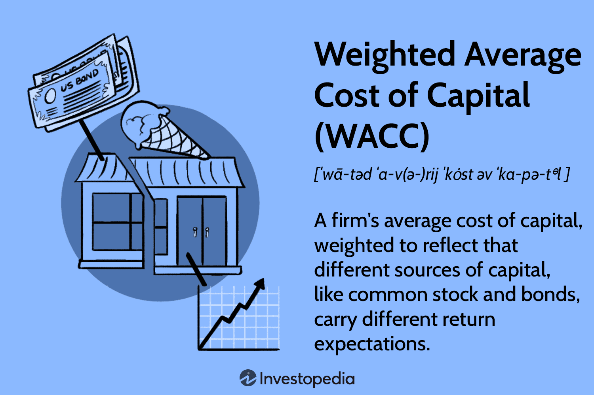

## Table of Contents

## What is the Weighted Average Cost of Capital (WACC)?

The Weighted Average Cost of Capital (WACC) is a financial metric that companies use to figure out how much it costs them to finance their operations and growth. It's like a big average that takes into account the costs of different types of money a company might use, such as loans (debt) and money from investors (equity). The "weighted" part means that the calculation gives more importance to the sources of money that the company uses more of. So, if a company uses a lot of loans, the cost of those loans will have a bigger impact on the WACC.

To calculate WACC, you need to know the cost of each type of financing and how much of each type the company uses. For example, if a company borrows money at a 5% interest rate and gets money from investors expecting a 10% return, those are the costs of debt and equity. The company also needs to know what percentage of its total financing comes from debt and what percentage comes from equity. By putting all this information together, the company can find out its WACC, which helps them make decisions about new projects or investments, making sure they earn more than it costs them to get the money.

## Why is WACC important for businesses?

WACC is super important for businesses because it tells them the average cost of the money they use to run and grow. Imagine you're borrowing money from different places, like a bank or investors. Each place charges you differently. WACC helps you figure out how much all that money is costing you altogether. This is really useful because it helps businesses decide if new projects or investments are worth it. If a project is going to make more money than what it costs to finance it, then it's probably a good idea to go ahead with it.

Also, WACC is used to see how well a company is doing. It's like a report card for how efficiently a business is using the money it gets from different sources. If a company's WACC is lower than the return it's getting from its projects, that's a good sign. It means the company is making more money than it's spending on financing, which is what every business wants. So, knowing their WACC helps companies make smart choices about where to put their money and how to grow in the future.

## How do you calculate WACC?

To calculate WACC, you need to know two main things: the cost of each type of financing (like debt and equity) and how much of each type the company uses. First, find out the cost of debt. This is usually the interest rate a company pays on its loans, but you need to adjust it for taxes because interest payments can be deducted from taxes, making it cheaper. So, the cost of debt is the interest rate times (1 minus the company's tax rate). Next, figure out the cost of equity, which is trickier because it's what investors expect to earn. A common way to estimate this is using the Capital Asset Pricing Model (CAPM), which looks at the risk-free rate, the market return, and how risky the company's stock is compared to the market.

After you know the costs of debt and equity, you need to find out what percentage of the company's total financing comes from debt and what percentage comes from equity. These are called the weights. If a company uses 40% debt and 60% equity, those are your weights. Now, you can put it all together. Multiply the cost of debt by the weight of debt, and multiply the cost of equity by the weight of equity. Add these two numbers together, and you get the WACC. It's a bit like making a recipe: you mix the right amounts of ingredients (costs and weights) to get the final dish (WACC).

## What are the components of WACC?

WACC is made up of two main parts: the cost of debt and the cost of equity. The cost of debt is how much it costs a company to borrow money, like paying interest on a loan. But because interest payments can be taken off the company's taxes, the real cost of debt is a bit less. You figure this out by taking the interest rate and multiplying it by one minus the tax rate. The cost of equity is trickier because it's what investors expect to earn for putting their money into the company. A common way to guess this is by using something called the Capital Asset Pricing Model, which looks at safe investments, the overall market's performance, and how risky the company's stock is.

The other part of WACC is figuring out how much of the company's money comes from debt and how much comes from equity. These are called weights. If a company uses 30% debt and 70% equity, those are the weights you use. To find WACC, you take the cost of debt, multiply it by the weight of debt, and then take the cost of equity and multiply it by the weight of equity. After that, you add these two numbers together. That's your WACC. It's like mixing ingredients to make a cake: you need the right amounts of flour (debt) and sugar (equity) to get the taste (WACC) just right.

## How does the cost of equity factor into WACC?

The cost of equity is a big part of figuring out a company's WACC. It's what investors expect to earn by putting their money into the company. Think of it like this: if you're going to invest in a company, you want to make some money back, right? The cost of equity is how much return investors want, and it's usually higher than the cost of debt because investing in a company is riskier than lending money to it. A common way to guess the cost of equity is by using something called the Capital Asset Pricing Model (CAPM). This model looks at safe investments, the overall market's performance, and how risky the company's stock is compared to the market.

When you're calculating WACC, you need to know how much of the company's money comes from equity. This is called the weight of equity. If a company uses a lot of equity to finance itself, the cost of equity will have a bigger effect on the WACC. To find the WACC, you take the cost of equity and multiply it by the weight of equity. Then, you add this to the cost of debt times the weight of debt. The result is the WACC, which tells the company how much it costs to use all its money sources together. So, the cost of equity is super important because it helps decide if new projects or investments are worth it for the company.

## What role does the cost of debt play in WACC?

The cost of debt is a key part of figuring out a company's WACC. It's how much it costs a company to borrow money, like paying interest on a loan. But here's a cool thing: because interest payments can be taken off the company's taxes, the real cost of debt is a bit less than the interest rate. You figure this out by taking the interest rate and multiplying it by one minus the tax rate. So, if a company can borrow money at a lower cost, it can make their WACC smaller, which is good because it means their overall financing costs are lower.

When you're calculating WACC, you also need to know how much of the company's money comes from debt. This is called the weight of debt. If a company uses a lot of debt to finance itself, the cost of debt will have a bigger impact on the WACC. To find the WACC, you take the cost of debt and multiply it by the weight of debt. Then, you add this to the cost of equity times the weight of equity. The result is the WACC, which helps the company see how much it costs to use all its money sources together. So, the cost of debt is super important because it helps decide if new projects or investments are worth it for the company.

## How can tax rates affect WACC?

Tax rates can change how much it costs a company to borrow money, which is called the cost of debt. When a company borrows money, it has to pay interest. But here's the cool part: the company can take the interest it pays off its taxes. So, if the tax rate is high, the company saves more money on taxes, which makes the cost of debt lower. This lower cost of debt can make the WACC smaller because WACC is like a big average of all the costs of money the company uses.

When the WACC goes down because of lower cost of debt, it means the company's overall cost of money is less. This can make new projects or investments look better because they might earn more than what it costs to finance them. So, if tax rates go up, it can actually help the company by making their borrowing cheaper, which can lead to a lower WACC and more chances to grow or invest.

## What is the significance of the capital structure in WACC?

The capital structure of a company is how it decides to use different kinds of money to run and grow its business. This includes debt, like loans from banks, and equity, which is money from investors. The way a company splits its money between debt and equity is super important for figuring out its WACC because WACC is a big average that takes into account the costs of all these different types of money. If a company uses a lot of debt, the cost of debt will have a bigger impact on the WACC. If it uses more equity, then the cost of equity will be more important.

Changing the capital structure can change the WACC. For example, if a company decides to borrow more money (use more debt), the cost of debt might go up because the company could be seen as riskier. But because interest on debt can be taken off taxes, the real cost might be lower, which could lower the WACC. On the other hand, using more equity means the cost of equity might go up because investors might want a higher return for their risk. So, the capital structure is a big deal because it helps companies find the right mix of debt and equity to keep their WACC as low as possible, which makes it easier to decide if new projects or investments are worth it.

## How does WACC influence investment decisions?

WACC is like a guide for companies when they're thinking about where to put their money. It tells them how much it costs to get the money they need for new projects or investments. If a project is going to make more money than the WACC, it's probably a good idea to go ahead with it. But if the project's expected return is less than the WACC, the company might lose money because it's costing more to finance the project than what the project will bring in. So, WACC helps companies decide if an investment is worth the cost.

Also, WACC can help companies see if they're using their money smartly. If a company's WACC is low, it means they're good at managing their money sources, like loans and investor funds. This can make them more confident in taking on new projects because their financing costs are lower. On the other hand, if the WACC is high, it might make them more careful about new investments because it's more expensive to get the money they need. So, knowing their WACC helps companies make better choices about where to invest their money for the future.

## Can WACC be used to assess project viability?

WACC is super helpful for figuring out if a new project is a good idea. It's like a benchmark that tells a company how much it costs to get the money needed for the project. If the project is expected to make more money than the WACC, it's probably a good investment. For example, if a company's WACC is 8% and a new project is expected to earn 10%, that project looks like a winner because it's going to make more money than it costs to finance it.

On the other hand, if the project's expected return is less than the WACC, it might not be worth doing. Let's say the WACC is 8% but the project is only expected to earn 6%. In that case, the company would be losing money because it's costing more to get the money for the project than what the project will bring in. So, by comparing the expected return of a project to the WACC, companies can decide if a project is viable or not.

## What are common pitfalls in WACC calculation?

One common mistake in calculating WACC is getting the cost of equity wrong. The cost of equity is what investors expect to earn, and it's tricky to figure out. A lot of people use the Capital Asset Pricing Model (CAPM) to guess it, but this model needs you to know things like the risk-free rate, the market return, and how risky the company's stock is. If you mess up any of these numbers, your cost of equity will be off, and so will your WACC. Another thing that can trip people up is not updating these numbers often enough. The market changes all the time, so the numbers you use for CAPM should change too.

Another pitfall is not adjusting the cost of debt for taxes. When a company borrows money, it pays interest, but it can take that interest off its taxes. This makes the real cost of debt lower than the interest rate. If you forget to do this, your WACC will be too high. Also, getting the weights of debt and equity wrong can mess things up. These weights are how much of the company's money comes from debt and how much comes from equity. If you use old numbers or guess wrong, your WACC won't be accurate.

Lastly, people sometimes forget about other types of financing. WACC isn't just about debt and equity; it can include things like preferred stock or leases. If you leave these out, your WACC won't show the full picture of what it costs to finance the company. So, it's important to think about all the ways a company gets money and make sure you're using the right numbers for each part of the calculation.

## How do changes in market conditions impact WACC?

Changes in market conditions can really shake things up for a company's WACC. One big way is through the cost of equity. When the stock market is doing well, investors might be happy with lower returns, which can make the cost of equity go down. But if the market is shaky or going down, investors might want a higher return for taking on more risk, which can push the cost of equity up. Also, changes in interest rates can affect the cost of debt. If interest rates go up, it costs more for a company to borrow money, making the cost of debt higher and pushing up the WACC.

Another way market conditions can change WACC is by affecting the company's capital structure. If the economy is doing great, companies might feel more confident about borrowing more money, which can change the mix of debt and equity they use. This can make the WACC go up or down depending on how much more debt or equity they use. Also, if tax laws change because of market conditions, that can change how much the cost of debt is affected by taxes, which can also change the WACC. So, keeping an eye on the market is super important for figuring out a company's WACC and making smart investment decisions.

## What is WACC and why is it important?

The Weighted Average Cost of Capital (WACC) is a critical financial metric that represents the average rate of return required by both equity investors and debt holders of a company. It is calculated by proportionately weighing each component of the company's capital. In essence, WACC serves as the minimum return threshold on any new project or investment, ensuring that returns exceed the cost of capital and contribute positively to the firm's value.

Mathematically, WACC is expressed as:

$$
\text{WACC} = \left(\frac{E}{V} \times \text{Re}\right) + \left(\frac{D}{V} \times \text{Rd} \times (1 - \text{Tc})\right)
$$

where:
- $E$ is the market value of equity,
- $V$ is the total market value of equity and debt,
- $\text{Re}$ is the cost of equity,
- $D$ is the market value of debt,
- $\text{Rd}$ is the cost of debt,
- $\text{Tc}$ is the corporate tax rate.

WACC is indispensable in corporate finance as it acts as a hurdle rate for evaluating whether new projects or investments should be pursued. By providing a benchmark, WACC enables companies to assess if the expected returns on investment will sufficiently cover the costs associated with financing. This comprehensive approach to capital cost evaluation ensures that decisions align with the objective of maximizing shareholder value.

Understanding and calculating WACC is crucial for optimizing financial performance. It not only informs the selection of viable projects but also influences strategic decisions about the firm's capital structure. A precise WACC computation aids in determining the balance between debt and equity which can affect overall financial risk and leverage. Enterprises are able to make informed decisions, ensuring their strategies are both fiscally sound and aligned with their growth objectives.

## How can WACC be integrated into corporate financial strategies?

Weighted Average Cost of Capital (WACC) is a fundamental element in crafting effective corporate financial strategies, especially when evaluating mergers, acquisitions, and expansion projects. By accurately computing WACC, companies can make informed decisions regarding their capital structure. This calculation is crucial because it reflects the average rate of return required by both equity investors and debt holders, thus serving as a benchmark for evaluating new ventures.

The determination of WACC involves balancing the cost of debt and equity, which are the primary sources of capital for any enterprise. The cost of debt is typically determined by the [interest rate](/wiki/interest-rate-trading-strategies) that the company pays on its borrowed funds, while the cost of equity is influenced by the expected return demanded by shareholders, often estimated using models such as the Capital Asset Pricing Model (CAPM). CAPM leverages the formula:

$$
\text{Cost of Equity} = R_f + \beta \times (R_m - R_f)
$$

where $R_f$ is the risk-free rate, $\beta$ represents the share's volatility relative to the market, and $R_m$ denotes the expected market return. Accurate determination of these components is critical, as it informs financial leverage and assesses the risk profile of the company.

Projects or investments with returns above the WACC yield a positive net present value (NPV), which is critical for creating firm value. The formula for NPV highlights how cash flows, when discounted at the WACC rate, must exceed the initial investment outlay to be deemed beneficial:

$$
\text{NPV} = \sum_{t=0}^{n} \frac{C_t}{(1 + \text{WACC})^t} - C_0
$$

where $C_t$ is the cash inflow during the period, $n$ is the total number of periods, and $C_0$ is the initial investment.

Moreover, market dynamics, such as fluctuations in interest rates, have a substantial impact on the components of WACC. For instance, rising interest rates can augment the cost of debt, consequently altering the overall WACC and, by extension, the attractiveness of potential projects. Therefore, sensitivity analysis is often utilized to evaluate how changes in market conditions and component estimations might affect the WACC and strategic financial decisions.

By embedding WACC evaluations into financial analysis, companies can align their strategic objectives with capital structure optimization, ensuring their investment decisions are robust and conducive to sustainable growth.

## How can Algorithmic Trading leverage Financial Metrics?

Algorithmic trading, a method of executing orders using automated and pre-programmed trading instructions, capitalizes on the power of financial metrics to improve trading efficiency and outcomes. Among these metrics, the Weighted Average Cost of Capital (WACC) plays a crucial role in determining the intrinsic value of a company, which is essential in identifying undervalued stocks. By evaluating WACC, traders and algorithms can discern the minimum return that investors expect for financing a company, helping to assess its true market value and potential.

Integrating WACC into trading algorithms provides a robust framework for identifying investment opportunities that promise optimal returns. The relationship between a company's return and its WACC directly influences investment viability; a project or venture exhibiting returns surpassing the WACC suggests a creation of value, thereby making it an attractive investment proposition. This assessment becomes pivotal when algorithms are tasked with executing trades that are both profitable and within acceptable risk parameters.

Python, a predominant language in data science and [algorithmic trading](/wiki/algorithmic-trading), offers a suite of libraries that facilitate the calculation of WACC, augmenting the precision of automated trading decisions. Libraries like NumPy, Pandas, and financial computation tools can be employed to compute components such as the cost of equity and debt precisely. For instance, the Capital Asset Pricing Model (CAPM) can be used to determine the cost of equity, represented as:

$$
\text{Cost of Equity} = R_f + \beta \times (R_m - R_f)
$$

where $R_f$ is the risk-free rate, $\beta$ is the beta of the stock, and $R_m$ represents the expected market return.

Once calculated, these components contribute to deriving the WACC, ensuring that trading strategies consider all financial landscape variables:

$$
\text{WACC} = \left( \frac{E}{V} \times Re \right) + \left( \frac{D}{V} \times Rd \times (1-T) \right)
$$

where $E$ is the market value of equity, $D$ is the market value of debt, $V$ is the total market value of the firm’s financing (equity and debt), $Re$ is the cost of equity, $Rd$ is the cost of debt, and $T$ is the corporate tax rate.

Through systematic integration of WACC into trading algorithms, strategies are tailored to adapt to financial environments. This integration not only harnesses the current financial metrics but also ensures the algorithms remain dynamic, capable of adjusting to shifts in market conditions. Hence, WACC stands as a vital tool in the algorithmic trader's toolkit, aligning trading strategies with overarching financial objectives and opportunities.

## How do you calculate WACC: What are its components and considerations?

The calculation of the Weighted Average Cost of Capital (WACC) involves a systematic approach to weighing both debt and equity in proportion to a company's total capital structure. The formula is represented as:

$$

\text{WACC} = \left( \frac{E}{V} \times Re \right) + \left( \frac{D}{V} \times Rd \times (1 - Tc) \right) 
$$

Where:
- $E$ is the market value of the equity
- $D$ is the market value of the debt
- $V = E + D$, the total market value of the company’s financing (equity and debt)
- $Re$ is the cost of equity
- $Rd$ is the cost of debt
- $Tc$ is the corporate tax rate

This formula highlights the essential components of market values, costs, and tax rate that are critical in calculating WACC. Each component's accurate estimation is indispensable for an authentic computation of WACC, which provides significant insight into financial strategy and performance evaluation.

**Market Values and Weighting**

Correct estimation of market values for both equity and debt is crucial in WACC calculations. The market value of equity usually reflects the current stock price multiplied by the total outstanding shares. On the other hand, obtaining the market value of debt can be more complex, depending on the company's debt structure and where the debt is publicly traded or not. Accurate measurements ensure that each category's proportion of the total capital, expressed as $\frac{E}{V}$ and $\frac{D}{V}$, reflects the true risk and return requirements of the company’s stakeholders.

**Cost of Equity and Debt**

The cost of equity ($Re$) often involves the Capital Asset Pricing Model (CAPM), which considers the risk-free rate, the equity beta, and the market risk premium:

$$

Re = Rf + \beta \times (Rm - Rf)
$$

Where:
- $Rf$ is the risk-free rate
- $\beta$ is the beta coefficient reflecting equity risk relative to the market
- $Rm$ is the expected market return

The cost of debt ($Rd$) typically uses the yield to maturity on existing debt or the interest rates on new debt issuances. Importantly, the tax shield effect ($1 - Tc$) adjusts the cost of debt to reflect interest tax deductibility.

**Impact of Interest Rates and Macroeconomic Shifts**

Interest rates and broader macroeconomic conditions can substantially influence both $Re$ and $Rd$. Rising interest rates usually increase the cost of debt, while economic conditions and market [volatility](/wiki/volatility-trading-strategies) can alter equity risk premiums and beta values. Companies must monitor these external factors and periodically recalibrate their WACC to maintain a realistic assessment.

**WACC as a Hurdle Rate**

Once calculated, WACC serves as a company's hurdle rate, providing a minimum threshold for evaluating investment decisions. Only projects with expected returns exceeding the WACC are typically considered viable, ensuring they generate value above their cost. Thus, WACC acts as a critical benchmark in strategic decision-making related to capital allocation and project selection. Regular updates and sensitivity analyses of WACC ensure alignment with current market realities, supporting effective financial and investment strategies.

## How can WACC be used for investment decisions?

Weighted Average Cost of Capital (WACC) is an essential metric in investment decision-making within the corporate finance domain. It serves as a threshold rate for evaluating the profitability of potential projects. The use of WACC in Discounted Cash Flow (DCF) analysis is particularly notable, as it helps calculate the Net Present Value (NPV) of a project. The NPV is determined by subtracting the present value of cash outflows from the present value of cash inflows. If a project's NPV is positive when discounted against the WACC, the project is deemed viable and value-adding, indicating that the anticipated returns exceed the cost of funding.

WACC's importance extends beyond mere viability assessment; it plays a pivotal role in weighing risks against potential profitability. Companies often face investment opportunities with varying risk profiles, and WACC provides a standardized measure to assess these opportunities uniformly. By setting a benchmark rate, WACC ensures that only projects promising returns above this critical threshold are pursued. This not only optimizes investment decisions but also aligns with the strategic goal of maximizing shareholder value.

One key characteristic of WACC is its sensitivity to market conditions. Interest rates, economic shifts, and changes in capital structure can all influence WACC values. Accordingly, it is critical for companies to regularly adjust WACC calculations to reflect current market realities. This dynamic approach ensures that project assessments remain relevant and accurate over time, safeguarding against outdated financial assumptions that could skew decision-making.

In a practical example, consider a company evaluating a project with an expected cash flow of $500,000 per year over five years and a WACC of 8%. Using the DCF method, the NPV can be calculated as follows:

$$
\text{NPV} = \sum_{t=1}^{n} \frac{\text{Cash Flow}_t}{(1 + \text{WACC})^t} - \text{Initial Investment}
$$

If the NPV is positive, the investment is generally considered favorable.

Incorporating such a detailed analysis ensures that every investment decision contributes effectively to the firm’s long-term financial health and strategic objectives.

## How can we address limitations and errors in WACC estimation?

Calculating the Weighted Average Cost of Capital (WACC) involves complexities due to potential inconsistencies in data, differences in corporate structures, and reliance on assumptions. One of the primary challenges is ensuring the accuracy of data input, as errors can significantly impact the outcome. The Capital Asset Pricing Model (CAPM) plays a crucial role in estimating the cost of equity, a vital component of WACC. CAPM, represented by the formula:

$$
\text{Cost of Equity} (r_e) = r_f + \beta \times (r_m - r_f)
$$

where $r_f$ is the risk-free rate, $\beta$ is the beta coefficient, and $r_m$ is the expected market return, requires precise input values to avoid discrepancies in WACC estimations.

Enterprises with diversified operations often find it challenging to calculate a uniform WACC due to varying risk profiles and capital costs across different business units. This complexity demands careful consideration of each segment's financial structure to accurately reflect the company's overall cost of capital.

Erroneous assumptions regarding future cash flows, interest rates, and market conditions can skew WACC calculation results. Regularly revisiting and adjusting these assumptions is necessary to maintain the accuracy and relevance of the assessment.

Mitigation strategies such as sensitivity analysis are effective in better understanding the uncertainties and risks associated with WACC. Sensitivity analysis involves altering one variable at a time to observe changes in WACC, thereby highlighting the impact of different assumptions and data inputs. This method helps in identifying the elements most sensitive to change and guiding strategic decisions to manage potential risks.

In practice, leveraging programming languages like Python for sensitivity analysis can streamline the process. For instance:

```python
import numpy as np

# Assumed variables
rf = 0.03  # risk-free rate
beta = np.linspace(0.8, 1.2, 5)  # range for beta
rm = 0.08  # expected market return

# Function to calculate cost of equity using CAPM
def calculate_cost_of_equity(rf, beta, rm):
    return rf + beta * (rm - rf)

# Sensitivity analysis for cost of equity with varying beta
cost_of_equity_values = calculate_cost_of_equity(rf, beta, rm)
print(cost_of_equity_values)
```

This code snippet calculates the cost of equity across a range of beta values, facilitating a quicker analysis of how changes in assumptions affect WACC components. Adopting such analytical techniques enhances the robustness of financial strategies aligned with WACC estimations.

## References & Further Reading

[1]: ["Corporate Finance"](https://www.investopedia.com/terms/c/corporatefinance.asp) by Jonathan Berk and Peter DeMarzo

[2]: Modigliani, F., & Miller, M. H. (1958). ["The cost of capital, corporation finance and the theory of investment."](https://www.jstor.org/stable/1812919) The American Economic Review, 48(3), 261-297.

[3]: Damodaran, A. (2012). ["Investment Valuation: Tools and Techniques for Determining the Value of Any Asset"](https://books.google.com/books/about/Investment_Valuation.html?id=5SRHAAAAQBAJ) (3rd ed.). Wiley.

[4]: ["Essentials of Financial Management"](https://www.cengageasia.com/title/default/detail?isbn=9789815077780) by Eugene F. Brigham and Joel F. Houston

[5]: Lopez de Prado, M. (2018). ["Advances in Financial Machine Learning"](https://www.amazon.com/Advances-Financial-Machine-Learning-Marcos/dp/1119482089) Wiley.

[6]: ["Quantitative Corporate Finance"](https://link.springer.com/book/10.1007/978-3-030-87269-4) by Kenneth Eades, Michael Roberts, and Clifford Smith

[7]: ["Machine Learning for Asset Managers"](https://www.cambridge.org/core/elements/machine-learning-for-asset-managers/6D9211305EA2E425D33A9F38D0AE3545) by Marcos Lopez de Prado