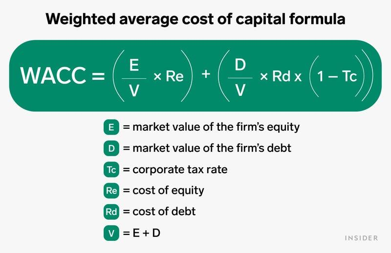

## Table of Contents

## What is the Weighted Average Cost of Capital (WACC)?

The Weighted Average Cost of Capital (WACC) is a financial measure that companies use to see how much it costs them to finance their operations. It takes into account the cost of different types of financing, like loans and stock, and weighs them according to how much the company uses each type. Think of it like a recipe where you mix different ingredients (debt and equity) in specific amounts to find the total cost of the mix.

To calculate WACC, you need to know the cost of each type of financing. For debt, this is the interest rate the company pays on its loans. For equity, it's trickier because it's the return that shareholders expect, often estimated using models like the Capital Asset Pricing Model. Once you have these costs, you multiply each by the proportion of the company's total financing that comes from that source, then add them together. This gives you the overall cost of capital, which is useful for making investment decisions and valuing the company.

## Why is WACC important for businesses?

WACC is important for businesses because it helps them figure out if they should go ahead with new projects or investments. If a project's expected return is higher than the WACC, it means the project can make more money than it costs to finance it. This is a good sign that the project is worth doing. On the other hand, if the expected return is lower than the WACC, the project might not be worth the cost, and the business might want to look for other opportunities.

Another reason WACC is important is that it helps businesses see how much it costs them to get the money they need to operate. This cost can change based on how much the business uses debt versus equity to finance itself. By understanding their WACC, businesses can make smarter choices about how to borrow money or issue stocks. This can help them save money and make their operations more efficient.

## How do you calculate WACC?

To calculate WACC, you need to know the cost of each type of financing a business uses. This means finding out the cost of debt, which is the [interest rate](/wiki/interest-rate-trading-strategies) the company pays on its loans, and the cost of equity, which is the return that shareholders expect. The cost of equity can be tricky to figure out, but it's often estimated using models like the Capital Asset Pricing Model (CAPM). Once you have these costs, you need to know how much of the company's total financing comes from debt and how much comes from equity. This is called the company's capital structure.

After you have all this information, you can calculate WACC by multiplying the cost of debt by the proportion of debt in the company's financing, then multiplying the cost of equity by the proportion of equity. But, there's one more step for debt: you need to adjust the cost of debt for taxes because interest payments are tax-deductible. This means you multiply the cost of debt by (1 - the company's tax rate). Finally, you add these two numbers together to get the WACC. This gives you the average cost of all the money the company uses to run its operations.

## What are the components of WACC?

The Weighted Average Cost of Capital (WACC) is made up of two main parts: the cost of debt and the cost of equity. The cost of debt is how much it costs the company to borrow money, usually shown as the interest rate on loans. The cost of equity is trickier to figure out. It's the return that shareholders expect to get from owning the company's stock. People often use models like the Capital Asset Pricing Model (CAPM) to estimate this.

The other important part of WACC is the company's capital structure, which shows how much of the company's money comes from debt and how much comes from equity. You need to know these proportions to calculate WACC. When you're working with the cost of debt, you also need to think about taxes because the interest paid on debt can be subtracted from the company's taxes. So, you adjust the cost of debt by multiplying it by (1 - the company's tax rate). After you have all these pieces, you can put them together to find the WACC, which tells you the average cost of all the money the company uses to run its business.

## How does the cost of equity affect WACC?

The cost of equity is a big part of the Weighted Average Cost of Capital (WACC). It's the return that shareholders expect to get from owning the company's stock. If the cost of equity goes up, it means shareholders want a bigger return, so the WACC will go up too. This happens because WACC is a mix of the cost of debt and the cost of equity, and when one part of the mix gets more expensive, the whole mix gets more expensive.

When the WACC goes up because of a higher cost of equity, it can change what projects or investments a company decides to do. If the WACC is higher, a project needs to make more money to be worth doing. So, a company might decide not to go ahead with some projects that it would have done before. This can affect how the company grows and makes money in the future.

## How does the cost of debt influence WACC?

The cost of debt is an important part of the Weighted Average Cost of Capital (WACC). It's the interest rate a company pays on its loans. When the cost of debt goes up, it means it's more expensive for the company to borrow money. This makes the WACC go up because WACC is a mix of the cost of debt and the cost of equity. When one part of the mix gets more expensive, the whole mix gets more expensive too.

When the WACC goes up because the cost of debt is higher, it can affect what projects a company decides to do. If the WACC is higher, a project needs to make more money to be worth doing. So, a company might decide not to go ahead with some projects that it would have done before. This can change how the company grows and makes money in the future.

## What role does the tax rate play in WACC calculations?

The tax rate is important when figuring out the Weighted Average Cost of Capital (WACC) because it affects the cost of debt. When a company borrows money, it has to pay interest on that debt. But, the good thing is that the company can subtract these interest payments from its taxes. This means the real cost of debt to the company is less than the interest rate it pays. To show this in the WACC calculation, you multiply the cost of debt by (1 - the company's tax rate). This makes the cost of debt smaller, which can make the WACC smaller too.

When the tax rate goes up, it makes the cost of debt go down even more because the company can save more on taxes. This can make the WACC go down, which is good for the company. It means the company can borrow money at a lower cost, and this can help them decide to go ahead with more projects or investments. But if the tax rate goes down, the cost of debt goes up a bit, and the WACC might go up too. So, the tax rate is a big part of figuring out how much it really costs a company to get the money it needs to run its business.

## How can changes in market conditions impact WACC?

Changes in market conditions can have a big effect on a company's Weighted Average Cost of Capital (WACC). One way this happens is through interest rates. If interest rates go up, it costs more for a company to borrow money, so the cost of debt goes up. This makes the WACC go up too. Also, if the economy is doing well, people might expect higher returns from their investments, which can make the cost of equity go up. When the cost of equity goes up, it also pushes the WACC higher.

Another way market conditions can change WACC is through the stock market. If the stock market is doing well, it might be easier for a company to raise money by selling stock, which can lower the cost of equity. But if the stock market is doing badly, it can be harder to sell stock, and the cost of equity might go up. This can make the WACC go up too. So, things like interest rates, how the economy is doing, and what's happening in the stock market can all change how much it costs a company to get the money it needs to run its business.

## What are common mistakes to avoid when calculating WACC?

When calculating WACC, one common mistake is using the wrong numbers for the cost of debt and the cost of equity. The cost of debt should be the interest rate the company pays on its loans, but you need to adjust it for taxes because interest payments can be subtracted from taxes. The cost of equity is trickier because it's what shareholders expect to earn, and you often need to use models like the Capital Asset Pricing Model (CAPM) to figure it out. If you use the wrong numbers, your WACC won't be right.

Another mistake is not getting the company's capital structure right. This means knowing how much of the company's money comes from debt and how much comes from equity. If you don't have the right proportions, your WACC calculation will be off. Also, sometimes people forget to update their numbers when market conditions change. Things like interest rates and stock market performance can change the cost of debt and equity, so you need to keep your numbers up to date to get an accurate WACC.

## How does WACC differ across industries?

WACC can be different for companies in different industries because each industry has its own way of doing things and its own risks. For example, companies in the utility industry, like those that provide electricity or water, often use a lot of debt to finance their operations. This is because they have stable income and can handle more debt. So, their WACC might be lower because the cost of debt is usually less than the cost of equity. On the other hand, tech companies might have a higher WACC because they rely more on equity financing and their business can be riskier, so shareholders expect a higher return.

Another reason WACC can differ across industries is because of how the economy affects each industry. For example, industries like oil and gas can be very sensitive to changes in oil prices, which can make their WACC go up and down a lot. If oil prices are high, these companies might have a lower WACC because they can borrow money more easily. But if oil prices drop, their WACC might go up because it becomes harder to borrow money and shareholders might want a higher return to make up for the risk. So, understanding how each industry works and what risks it faces is important for figuring out WACC.

## How can a company use WACC for investment decisions?

A company can use WACC to help decide if it should go ahead with a new project or investment. WACC tells the company how much it costs to get the money it needs to run its business. If a new project's expected return is higher than the WACC, it means the project can make more money than it costs to finance it. This is a good sign that the project is worth doing. But if the expected return is lower than the WACC, the project might not be worth the cost, and the company might want to look for other opportunities.

WACC also helps a company understand how changes in its financing can affect its costs. If a company can lower its WACC by changing how it borrows money or issues stocks, it can make its operations more efficient. For example, if a company finds a way to borrow money at a lower interest rate, its WACC might go down. This can make more projects look good because they need to make less money to be worth doing. So, by keeping an eye on WACC, a company can make smarter choices about how to grow and invest its money.

## What advanced techniques can be used to refine WACC calculations?

To make WACC calculations more accurate, companies can use advanced techniques like adjusting for different risks and using more detailed data. One way to do this is by using a multi-[factor](/wiki/factor-investing) model instead of just the Capital Asset Pricing Model (CAPM) for the cost of equity. This can help account for different kinds of risks that might affect the company, like industry-specific risks or economic cycles. Another technique is to use more detailed data on the company's debt, like looking at different interest rates for different types of loans instead of using just one average rate.

Another advanced technique is to use scenario analysis to see how WACC might change under different conditions. This means figuring out what would happen to WACC if interest rates go up or down, or if the economy gets better or worse. By doing this, a company can get a better idea of how sensitive its WACC is to changes in the market. This can help the company make smarter decisions about its investments and how it finances its operations.

## What is WACC and why is it important?

The Weighted Average Cost of Capital (WACC) is a fundamental financial metric used to measure a company's overall cost of capital, whereby each category of capital is weighted proportionately. This calculation provides insight into the average rate of return a company must achieve to meet the demands of its investors and debt holders, effectively acting as a benchmark for evaluating whether to pursue new projects or investments.

Mathematically, WACC is calculated using the formula:

$$

WACC = \left(\frac{E}{V} \times Re\right) + \left(\frac{D}{V} \times Rd \times (1 - Tc)\right) 
$$

where:
- $E$ is the market value of the equity,
- $V$ is the total market value of the firm’s equity and debt,
- $Re$ is the cost of equity,
- $D$ is the market value of the debt,
- $Rd$ is the cost of debt,
- $Tc$ is the corporate tax rate.

WACC is critical for capital budgeting as it sets the minimum return threshold required for a project to be considered viable. This ensures that the investment will generate value exceeding its cost, thereby justifying the allocation of resources. Companies use WACC to assess the potential profitability of projects and to gauge whether they can generate returns that meet or exceed this threshold. 

Investors, on the other hand, leverage WACC to appraise the risk and return profiles of their investments. A lower WACC indicates a potentially lower risk and higher efficiency in capital utilization, while a higher WACC could signal more expensive capital, implying greater risk or inefficiency.

In strategic financial planning and decision-making, WACC enables firms to make informed choices about mergers, acquisitions, and expansions by comparing expected project returns against this cost metric. A project is deemed feasible if its expected returns surpass the WACC, signifying it can generate added value for the firm. 

Consequently, understanding and accurately calculating WACC is imperative for businesses and investors alike, providing a critical tool for optimizing financial performance and ensuring that projects can satisfy stakeholder expectations regarding profitability.

## How can WACC be integrated into financial strategies in corporate finance?

In corporate finance, the Weighted Average Cost of Capital (WACC) is vital for strategic decision-making, particularly in evaluating the economic viability of mergers, acquisitions, and expansion projects. By using WACC, companies can assess whether potential projects will yield returns that exceed their cost of capital, thereby ensuring value addition to the firm.

The strategic integration of WACC into financial planning begins with the identification and accurate estimation of its components. WACC is calculated using the formula:

$$
\text{WACC} = \left(\frac{E}{V} \times \text{Re}\right) + \left(\frac{D}{V} \times \text{Rd} \times (1 - T)\right)
$$

where:
- $E$ is the market value of the equity,
- $D$ is the market value of the debt,
- $V = E + D$ is the total market value of the company’s financing (equity plus debt),
- $\text{Re}$ is the cost of equity,
- $\text{Rd}$ is the cost of debt,
- $T$ is the corporate tax rate.

By accurately computing WACC, a company can make informed decisions about its capital structure. The cost of debt and equity are pivotal in this context. For example, raising debt might be cheaper than equity due to tax shields, but it increases the company’s financial leverage and risk. Conversely, issuing more equity might dilute current ownership but avoids additional debt burden.

Exploiting WACC involves a thorough comparison of expected rates of return from investment opportunities against the calculated WACC. Projects with an anticipated rate of return exceeding the WACC promise positive net present value (NPV), which translates to incremental firm value. Conversely, if the projected returns are below the WACC, the project may not justify investment as it would effectively reduce shareholder value.

Furthermore, understanding how components of WACC are influenced by market dynamics is essential. Interest rate changes can significantly alter the cost of debt, while equity costs fluctuate with market [volatility](/wiki/volatility-trading-strategies) and investor expectations.

Effectively managing these components allows firms to construct an optimized capital structure, which aligns cost management with strategic growth objectives. Ultimately, WACC not only guides decisions on large corporate transactions but also facilitates day-to-day financial management by serving as a benchmark for judging investment performance. This makes it indispensable for the efficient allocation of resources in pursuit of long-term profitability and market competitiveness.

## How can WACC be used for making investment decisions?

Weighted Average Cost of Capital (WACC) is a fundamental metric in making informed investment decisions, serving as a critical threshold rate for evaluating the profitability of various projects. Particularly in corporate finance, WACC's application in Discounted Cash Flow (DCF) analysis is crucial to assess the Net Present Value (NPV) of a project. In DCF analyses, future cash flows are discounted back to their present value using the WACC, which represents the minimum acceptable return on investment given the company's capital structure. A positive NPV, calculated by subtracting initial investment costs from the present value of future cash flows, indicates that the project's returns exceed the WACC, suggesting it adds value to the firm.

Mathematically, the NPV can be expressed as:

$$
\text{NPV} = \sum_{t=1}^{n} \frac{C_t}{(1 + \text{WACC})^t} - C_0
$$

Where:
- $C_t$ represents the cash inflow during period $t$,
- $C_0$ is the initial investment cost,
- $n$ is the number of periods, and
- WACC is the Weighted Average Cost of Capital used as the discount rate.

Projects with projected returns above the WACC are typically considered value-adding, as they offer returns that surpass the company's average cost of capital. Conversely, projects with returns below the WACC may be deemed financially unattractive and are likely to be rejected as they imply a negative NPV, not adequately compensating for the cost of capital.

Investors leverage WACC to weigh the risk and potential profitability associated with investment opportunities. A lower WACC indicates cheaper capital costs, potentially making a company more competitive in pursuing growth through new projects or acquisitions. However, it is essential for investors to adjust the WACC to reflect changes in market conditions, interest rates, or the firm's financial strategy, ensuring that project assessments remain accurate over time. Consequently, firms and investors continuously monitor and adjust the WACC in decision-making processes to optimize their financial strategies and enhance value creation.

## What is the Comparative Analysis of WACC Across Different Sectors?

Different sectors exhibit varying Weighted Average Cost of Capital (WACC) levels due to differences in risk profiles, market conditions, and company capital structures. These variations are pivotal in understanding sector-specific financial dynamics, as they influence the cost of debt and equity that firms face.

Industry benchmarks for WACC are essential for comparing a company's performance against its peers. A lower WACC is typically indicative of a company's ability to borrow at more favorable rates or its equity being viewed as less risky by investors, which can lead to competitive advantages. Conversely, a higher WACC may suggest elevated risk factors or a less optimal capital structure.

Sector-specific factors significantly impact the cost of debt and equity, thereby leading to differences in WACC among industries. For instance, technology companies may experience a higher cost of equity due to volatile growth prospects and competitive pressures, while utilities might benefit from lower costs stemming from stable cash flows and regulated market environments. 

The formula for calculating WACC is:

$$

WACC = \left( \dfrac{E}{V} \times Re \right) + \left( \dfrac{D}{V} \times Rd \times (1 - Tc) \right) 
$$

Where:
- $E$ is the market value of equity,
- $V$ is the total market value of equity and debt,
- $Re$ is the cost of equity,
- $D$ is the market value of debt,
- $Rd$ is the cost of debt, and
- $Tc$ is the corporate tax rate.

By analyzing these variations, insights into the financial health and competitiveness of companies within specific sectors are gained. For example, the energy sector might exhibit a distinct WACC profile influenced by high capital-intensive projects and exposure to commodity price volatility, affecting both equity and debt costs.

Understanding these sectoral differences in WACC helps investors and analysts make informed decisions by evaluating how well a company is managing its capital structure and how its risk profile compares to industry norms. As such, WACC not only plays a crucial role in investment decisions but also serves as a measure of managerial efficiency and strategic capability in optimizing financial performance.

## How can we address limitations and errors in WACC estimation?

Weighted Average Cost of Capital (WACC) calculations, while essential for financial decision-making, are complex and prone to errors due to several factors inherent to their components. The primary challenges include inconsistent values, complex corporate structures, and erroneous assumptions.

### Inconsistent Values and Data Sources
WACC calculations depend heavily on accurate data input for both debt and equity components. Inaccurate estimations of components such as the cost of equity, which might involve models like the Capital Asset Pricing Model (CAPM), can lead to significant errors. CAPM is computed as:

$$

\text{Cost of Equity} = R_f + \beta \times (R_m - R_f)
$$

where $R_f$ is the risk-free rate, $\beta$ is the beta (a measure of a stock's volatility in relation to the market), and $R_m$ is the expected return of the market. Misestimations in any of these parameters directly affect the WACC accuracy. Hence, sourcing reliable data and ensuring consistency in the input values are crucial in mitigating errors.

### Complex Corporate Structures
Enterprises with diversified lines of business and international operations face the difficulty of accurately separating financial data specific to each division. The blended capital structure and associated costs across these divisions can be challenging to delineate, leading to discrepancies in calculating the WACC. Complex corporate structures necessitate detailed segmental financial reporting to isolate relevant data accurately.

### Erroneous Assumptions
Incorrect assumptions during WACC estimation—including growth rates, market conditions, and tax rates—can severely distort results. Companies often base these assumptions on historical data that may not reflect current or future realities. Therefore, incorporating up-to-date information and regularly revising assumptions is essential for maintaining accuracy.

### Mitigation Strategies
To address these limitations, sensitivity analysis is a powerful tool. By evaluating how changes in key assumptions affect the WACC outcome, companies can better understand potential risks and adjust their strategies accordingly. Additionally, employing alternative financial metrics like Internal Rate of Return (IRR) or Economic Value Added (EVA) can offer supplementary perspectives and validation for investment decisions.

### Conclusion
Accurate WACC determination is vital for financial health and investment analysis. By ensuring the use of consistent data, understanding complex structural implications, and revisiting assumptions regularly, financial accuracy can be significantly enhanced. Through these practices, businesses can leverage WACC effectively while recognizing and mitigating its limitations.

## References & Further Reading

[1]: ["The Theory and Practice of Investment Management: Asset Allocation, Valuation, Portfolio Construction, and Strategies"](https://onlinelibrary.wiley.com/doi/book/10.1002/9781118267028) by Frank J. Fabozzi and Harry M. Markowitz

[2]: ["Corporate Finance"](https://www.investopedia.com/terms/c/corporatefinance.asp) by Stephen A. Ross, Randolph W. Westerfield, and Jeffrey Jaffe

[3]: Damodaran, A. (2012). ["Investment Valuation: Tools and Techniques for Determining the Value of Any Asset."](https://books.google.com/books/about/Investment_Valuation.html?id=5SRHAAAAQBAJ) John Wiley & Sons.

[4]: ["Principles of Corporate Finance"](https://www.mheducation.com/highered/product/principles-corporate-finance-brealey-myers/M9781264080946.html) by Richard A. Brealey, Stewart C. Myers, and Franklin Allen

[5]: ["Machine Learning for Asset Managers"](https://www.cambridge.org/core/elements/machine-learning-for-asset-managers/6D9211305EA2E425D33A9F38D0AE3545) by Marcos Lopez de Prado