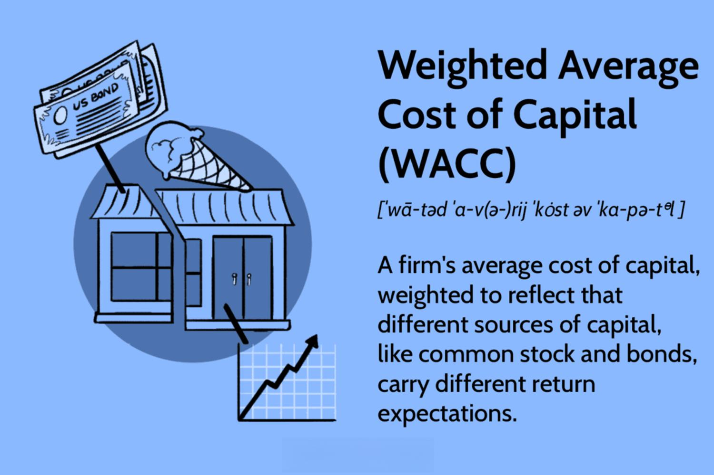

Understanding financial concepts and metrics is essential for anyone engaged in corporate finance or investment. Among these, the Weighted Average Cost of Capital (WACC) stands out as a fundamental metric. WACC represents the average rate of return required to satisfy both investors and debt holders of a company. The significance of WACC extends beyond a mere monetary figure; it serves as a compass for various financial strategies and investment decisions.

The interconnected nature of WACC with corporate finance is evident in its role as a benchmark for evaluating a company's investment opportunities. By determining the minimum acceptable return on investment, WACC aids businesses in selecting projects that are likely to enhance shareholder value. Moreover, understanding WACC allows for better management of a company's capital structure, ensuring that the blend of debt and equity financing is aligned with strategic goals.



Algorithmic trading also exhibits a significant connection with WACC. As trading strategies increasingly rely on data-driven decisions, WACC provides valuable insight into the cost of capital for different securities. Incorporating WACC into trading algorithms helps identify opportunities that promise optimal returns while managing associated risks.

This article aims to explore the multifaceted relationship between WACC, corporate finance, and algorithmic trading. By dissecting these concepts, we aim to provide a comprehensive understanding of their implications for businesses, spotlighting the essential role WACC plays in financial analysis and strategy.

## Table of Contents

## What is WACC and Why is it Important?

The Weighted Average Cost of Capital (WACC) is a fundamental financial metric used to measure a company's overall cost of capital, whereby each category of capital is weighted proportionately. This calculation provides insight into the average rate of return a company must achieve to meet the demands of its investors and debt holders, effectively acting as a benchmark for evaluating whether to pursue new projects or investments.

Mathematically, WACC is calculated using the formula:

$$

WACC = \left(\frac{E}{V} \times Re\right) + \left(\frac{D}{V} \times Rd \times (1 - Tc)\right) 
$$

where:
- $E$ is the market value of the equity,
- $V$ is the total market value of the firm’s equity and debt,
- $Re$ is the cost of equity,
- $D$ is the market value of the debt,
- $Rd$ is the cost of debt,
- $Tc$ is the corporate tax rate.

WACC is critical for capital budgeting as it sets the minimum return threshold required for a project to be considered viable. This ensures that the investment will generate value exceeding its cost, thereby justifying the allocation of resources. Companies use WACC to assess the potential profitability of projects and to gauge whether they can generate returns that meet or exceed this threshold. 

Investors, on the other hand, leverage WACC to appraise the risk and return profiles of their investments. A lower WACC indicates a potentially lower risk and higher efficiency in capital utilization, while a higher WACC could signal more expensive capital, implying greater risk or inefficiency.

In strategic financial planning and decision-making, WACC enables firms to make informed choices about mergers, acquisitions, and expansions by comparing expected project returns against this cost metric. A project is deemed feasible if its expected returns surpass the WACC, signifying it can generate added value for the firm. 

Consequently, understanding and accurately calculating WACC is imperative for businesses and investors alike, providing a critical tool for optimizing financial performance and ensuring that projects can satisfy stakeholder expectations regarding profitability.

## Corporate Finance: Integrating WACC into Financial Strategies

In corporate finance, the Weighted Average Cost of Capital (WACC) is vital for strategic decision-making, particularly in evaluating the economic viability of mergers, acquisitions, and expansion projects. By using WACC, companies can assess whether potential projects will yield returns that exceed their cost of capital, thereby ensuring value addition to the firm.

The strategic integration of WACC into financial planning begins with the identification and accurate estimation of its components. WACC is calculated using the formula:

$$
\text{WACC} = \left(\frac{E}{V} \times \text{Re}\right) + \left(\frac{D}{V} \times \text{Rd} \times (1 - T)\right)
$$

where:
- $E$ is the market value of the equity,
- $D$ is the market value of the debt,
- $V = E + D$ is the total market value of the company’s financing (equity plus debt),
- $\text{Re}$ is the cost of equity,
- $\text{Rd}$ is the cost of debt,
- $T$ is the corporate tax rate.

By accurately computing WACC, a company can make informed decisions about its capital structure. The cost of debt and equity are pivotal in this context. For example, raising debt might be cheaper than equity due to tax shields, but it increases the company’s financial leverage and risk. Conversely, issuing more equity might dilute current ownership but avoids additional debt burden.

Exploiting WACC involves a thorough comparison of expected rates of return from investment opportunities against the calculated WACC. Projects with an anticipated rate of return exceeding the WACC promise positive net present value (NPV), which translates to incremental firm value. Conversely, if the projected returns are below the WACC, the project may not justify investment as it would effectively reduce shareholder value.

Furthermore, understanding how components of WACC are influenced by market dynamics is essential. Interest rate changes can significantly alter the cost of debt, while equity costs fluctuate with market [volatility](/wiki/volatility-trading-strategies) and investor expectations.

Effectively managing these components allows firms to construct an optimized capital structure, which aligns cost management with strategic growth objectives. Ultimately, WACC not only guides decisions on large corporate transactions but also facilitates day-to-day financial management by serving as a benchmark for judging investment performance. This makes it indispensable for the efficient allocation of resources in pursuit of long-term profitability and market competitiveness.

## Algorithmic Trading: Leveraging Financial Metrics

Algorithmic trading refers to the use of computer algorithms to execute trades at optimal speeds and efficiencies. This approach leverages mathematical models, statistical analyses, and financial metrics to implement automated trading strategies. One of the financial metrics increasingly integrated into [algorithmic trading](/wiki/algorithmic-trading) is the Weighted Average Cost of Capital (WACC), which helps traders make more informed decisions about when to buy or sell securities.

WACC serves as a critical input for determining the intrinsic value of a company, which is fundamental to identifying undervalued stocks. By comparing the current market price of a security against its value as calculated using WACC, algorithmic systems can pinpoint investment opportunities that offer potential returns exceeding the cost of capital. This is essential for designing algorithms aimed at optimizing portfolio returns while managing associated risks.

The incorporation of WACC in trading algorithms involves a series of calculations. It combines the cost of equity and the after-tax cost of debt, weighted by their proportions in the company’s capital structure. This integrated metric provides a clearer picture of a company’s financial health, helping algorithms to discern whether to initiate or exclude certain trades. In Python, calculating WACC can be done using data analytics libraries such as NumPy or pandas, providing precise estimates crucial for automated decisions:

```python
def calculate_wacc(equity_value, debt_value, cost_of_equity, cost_of_debt, tax_rate):
    total_value = equity_value + debt_value
    equity_weight = equity_value / total_value
    debt_weight = debt_value / total_value
    wacc = (equity_weight * cost_of_equity) + (debt_weight * cost_of_debt * (1 - tax_rate))
    return wacc
```

Traders employ sophisticated data analytics and financial models to incorporate WACC into their systems. These models analyze historical data trends, adjust for market volatility, and simulate various market conditions to ensure the robustness of trading algorithms. By systematically integrating WACC, these systems can adapt to changing financial landscapes, continually optimizing strategies for enhanced returns.

Overall, as algorithmic trading evolves, the integration of comprehensive financial metrics like WACC becomes indispensable. It not only enhances the accuracy of trading decisions but also aligns trading activities with overarching investment objectives, ensuring that automated decisions are strategically sound and financially prudent.

## Calculating WACC: Components and Considerations

The Weighted Average Cost of Capital (WACC) is a calculation that represents a firm's overall cost of capital, integrating both debt and equity contributions. Calculating WACC accurately is vital for evaluating financial strategies and investment decisions. WACC is determined by weighing each component of capital according to its proportion in the total capital structure. 

### Formula for WACC:
$$
\text{WACC} = \left( \frac{E}{V} \times Re \right) + \left( \frac{D}{V} \times Rd \times (1 - Tc) \right)
$$

Where:  
- $E$ = Market value of equity  
- $V$ = Total market value of equity and debt (E + D)  
- $Re$ = Cost of equity  
- $D$ = Market value of debt  
- $Rd$ = Cost of debt  
- $Tc$ = Corporate tax rate  

### Components:

1. **Cost of Equity (Re):**  
   This represents the return required by equity investors, commonly estimated using the Capital Asset Pricing Model (CAPM):
   \[ Re = Rf + \beta \times (Rm - Rf)
$$
   Where:
   - $Rf$ = Risk-free rate
   - $\beta$ = Beta of the investment, representing its volatility compared to the market
   - $Rm$ = Expected market return

2. **Cost of Debt (Rd):**  
   The cost of debt encompasses the effective rate a company incurs on its borrowed funds. Interest rates, credit ratings, and current market conditions heavily influence this parameter. Importantly, the cost of debt is adjusted to reflect the tax shield benefit emanating from interest expenses, hence $Rd \times (1 - Tc)$.

### Considerations for Accurate Calculation:

- **Accurate Estimation of Market Values:**  
  Both debt and equity should be assessed based on market rather than book values to reflect the current economic reality accurately.

- **Weighting and Proportions:**  
  The proportions $\frac{E}{V}$ and $\frac{D}{V}$ are essential as they indicate the respective contributions of equity and debt to the company’s capital structure.

- **Incorporation of Tax Policies:**  
  Corporate tax rate ($Tc$) plays a crucial role in calculating the WACC, given the tax benefits of debt financing.

- **Market Conditions:**  
  Interest rate fluctuations and macroeconomic shifts can impact both the cost of equity and debt, thus altering WACC.

The algebraic combination and integration of these components form the foundation of the WACC, which serves not just as a firm's hurdle rate but as an integral marker for evaluating prospective financial undertakings. Accurately calculated, WACC helps ensure that investment decisions are sound relative to the expected costs of financing them.

## Using WACC for Investment Decisions

Weighted Average Cost of Capital (WACC) is a fundamental metric in making informed investment decisions, serving as a critical threshold rate for evaluating the profitability of various projects. Particularly in corporate finance, WACC's application in Discounted Cash Flow (DCF) analysis is crucial to assess the Net Present Value (NPV) of a project. In DCF analyses, future cash flows are discounted back to their present value using the WACC, which represents the minimum acceptable return on investment given the company's capital structure. A positive NPV, calculated by subtracting initial investment costs from the present value of future cash flows, indicates that the project's returns exceed the WACC, suggesting it adds value to the firm.

Mathematically, the NPV can be expressed as:

$$
\text{NPV} = \sum_{t=1}^{n} \frac{C_t}{(1 + \text{WACC})^t} - C_0
$$

Where:
- $C_t$ represents the cash inflow during period $t$,
- $C_0$ is the initial investment cost,
- $n$ is the number of periods, and
- WACC is the Weighted Average Cost of Capital used as the discount rate.

Projects with projected returns above the WACC are typically considered value-adding, as they offer returns that surpass the company's average cost of capital. Conversely, projects with returns below the WACC may be deemed financially unattractive and are likely to be rejected as they imply a negative NPV, not adequately compensating for the cost of capital.

Investors leverage WACC to weigh the risk and potential profitability associated with investment opportunities. A lower WACC indicates cheaper capital costs, potentially making a company more competitive in pursuing growth through new projects or acquisitions. However, it is essential for investors to adjust the WACC to reflect changes in market conditions, interest rates, or the firm's financial strategy, ensuring that project assessments remain accurate over time. Consequently, firms and investors continuously monitor and adjust the WACC in decision-making processes to optimize their financial strategies and enhance value creation.

## Comparative Analysis: WACC Across Different Sectors

Different sectors exhibit varying Weighted Average Cost of Capital (WACC) levels due to differences in risk profiles, market conditions, and company capital structures. These variations are pivotal in understanding sector-specific financial dynamics, as they influence the cost of debt and equity that firms face.

Industry benchmarks for WACC are essential for comparing a company's performance against its peers. A lower WACC is typically indicative of a company's ability to borrow at more favorable rates or its equity being viewed as less risky by investors, which can lead to competitive advantages. Conversely, a higher WACC may suggest elevated risk factors or a less optimal capital structure.

Sector-specific factors significantly impact the cost of debt and equity, thereby leading to differences in WACC among industries. For instance, technology companies may experience a higher cost of equity due to volatile growth prospects and competitive pressures, while utilities might benefit from lower costs stemming from stable cash flows and regulated market environments. 

The formula for calculating WACC is:

$$

WACC = \left( \dfrac{E}{V} \times Re \right) + \left( \dfrac{D}{V} \times Rd \times (1 - Tc) \right) 
$$

Where:
- $E$ is the market value of equity,
- $V$ is the total market value of equity and debt,
- $Re$ is the cost of equity,
- $D$ is the market value of debt,
- $Rd$ is the cost of debt, and
- $Tc$ is the corporate tax rate.

By analyzing these variations, insights into the financial health and competitiveness of companies within specific sectors are gained. For example, the energy sector might exhibit a distinct WACC profile influenced by high capital-intensive projects and exposure to commodity price volatility, affecting both equity and debt costs.

Understanding these sectoral differences in WACC helps investors and analysts make informed decisions by evaluating how well a company is managing its capital structure and how its risk profile compares to industry norms. As such, WACC not only plays a crucial role in investment decisions but also serves as a measure of managerial efficiency and strategic capability in optimizing financial performance.

## Addressing Limitations and Errors in WACC Estimation

Weighted Average Cost of Capital (WACC) calculations, while essential for financial decision-making, are complex and prone to errors due to several factors inherent to their components. The primary challenges include inconsistent values, complex corporate structures, and erroneous assumptions.

### Inconsistent Values and Data Sources
WACC calculations depend heavily on accurate data input for both debt and equity components. Inaccurate estimations of components such as the cost of equity, which might involve models like the Capital Asset Pricing Model (CAPM), can lead to significant errors. CAPM is computed as:

$$

\text{Cost of Equity} = R_f + \beta \times (R_m - R_f)
$$

where $R_f$ is the risk-free rate, $\beta$ is the beta (a measure of a stock's volatility in relation to the market), and $R_m$ is the expected return of the market. Misestimations in any of these parameters directly affect the WACC accuracy. Hence, sourcing reliable data and ensuring consistency in the input values are crucial in mitigating errors.

### Complex Corporate Structures
Enterprises with diversified lines of business and international operations face the difficulty of accurately separating financial data specific to each division. The blended capital structure and associated costs across these divisions can be challenging to delineate, leading to discrepancies in calculating the WACC. Complex corporate structures necessitate detailed segmental financial reporting to isolate relevant data accurately.

### Erroneous Assumptions
Incorrect assumptions during WACC estimation—including growth rates, market conditions, and tax rates—can severely distort results. Companies often base these assumptions on historical data that may not reflect current or future realities. Therefore, incorporating up-to-date information and regularly revising assumptions is essential for maintaining accuracy.

### Mitigation Strategies
To address these limitations, sensitivity analysis is a powerful tool. By evaluating how changes in key assumptions affect the WACC outcome, companies can better understand potential risks and adjust their strategies accordingly. Additionally, employing alternative financial metrics like Internal Rate of Return (IRR) or Economic Value Added (EVA) can offer supplementary perspectives and validation for investment decisions.

### Conclusion
Accurate WACC determination is vital for financial health and investment analysis. By ensuring the use of consistent data, understanding complex structural implications, and revisiting assumptions regularly, financial accuracy can be significantly enhanced. Through these practices, businesses can leverage WACC effectively while recognizing and mitigating its limitations.

## Conclusion

The Weighted Average Cost of Capital (WACC) is a critical financial metric in corporate finance, serving as a benchmark for evaluating investment opportunities and shaping company strategy. By representing the minimum required return needed to satisfy investors and debt holders, WACC ensures that firms cover operational costs while maintaining a competitive edge. This metric aids investors and companies in determining the feasibility of projects, providing a tangible threshold against which potential returns are measured.

Incorporating WACC into algorithmic trading strategies and financial decision-making can significantly improve investment outcomes. Knowledge of how WACC interrelates with trading algorithms allows for the identification of undervalued securities, thereby enabling the optimization of portfolio returns. Investors can leverage this understanding to better assess risk and anticipate profitability, guiding their choices in volatile markets.

A thorough grasp of the components and calculation of WACC, alongside an appreciation for sectoral variations, is essential for businesses and investors aspiring to enhance their financial performance. The calculation involves the cost of equity and the after-tax cost of debt, weighted by the firm's capital structure. Factors such as market conditions, tax policies, and interest rates tend to impact these calculations, underlining the importance of precise estimations.

Overall, WACC remains indispensable for ensuring that investment projects are value-adding and align with a company's strategic goals. Invested parties, armed with an in-depth understanding of WACC, can make informed decisions that bolster both short and long-term financial health.

## References & Further Reading

[1]: ["The Theory and Practice of Investment Management: Asset Allocation, Valuation, Portfolio Construction, and Strategies"](https://onlinelibrary.wiley.com/doi/book/10.1002/9781118267028) by Frank J. Fabozzi and Harry M. Markowitz

[2]: ["Corporate Finance"](https://www.investopedia.com/terms/c/corporatefinance.asp) by Stephen A. Ross, Randolph W. Westerfield, and Jeffrey Jaffe

[3]: Damodaran, A. (2012). ["Investment Valuation: Tools and Techniques for Determining the Value of Any Asset."](https://books.google.com/books/about/Investment_Valuation.html?id=5SRHAAAAQBAJ) John Wiley & Sons.

[4]: ["Principles of Corporate Finance"](https://www.mheducation.com/highered/product/principles-corporate-finance-brealey-myers/M9781264080946.html) by Richard A. Brealey, Stewart C. Myers, and Franklin Allen

[5]: ["Machine Learning for Asset Managers"](https://www.cambridge.org/core/elements/machine-learning-for-asset-managers/6D9211305EA2E425D33A9F38D0AE3545) by Marcos Lopez de Prado