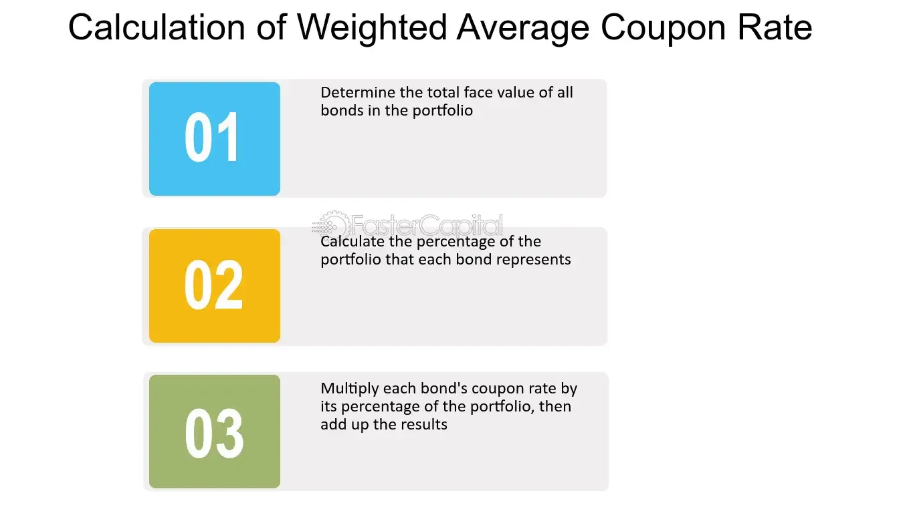

## Table of Contents

## What is a Weighted Average Coupon (WAC)?

A Weighted Average Coupon (WAC) is a way to figure out the average interest rate of a bunch of loans or securities that have been grouped together. Imagine you have a bunch of different loans, each with its own interest rate. The WAC helps you find out what the overall average interest rate is for all those loans put together. It does this by taking into account how much money each loan is worth compared to the others.

To calculate the WAC, you multiply the interest rate of each loan by the amount of money in that loan, add up all those numbers, and then divide by the total amount of money in all the loans. This gives you a single number that represents the average interest rate of the whole group. It's really useful for people who invest in things like mortgage-backed securities because it helps them understand the overall interest they can expect to earn from their investment.

## How is the Weighted Average Coupon calculated?

To calculate the Weighted Average Coupon (WAC), you start by looking at each loan in a group. Each loan has its own interest rate and a certain amount of money. You take the interest rate of the first loan and multiply it by the amount of money in that loan. You do the same thing for every other loan in the group. After you've done this for all the loans, you add up all these numbers.

Once you have the total of all those multiplied numbers, you divide it by the total amount of money in all the loans combined. This gives you the WAC, which is the average interest rate for the whole group of loans. It's a way to understand the overall interest rate you can expect from a bunch of different loans put together, and it's really helpful for people who invest in things like mortgage-backed securities.

## Why is the Weighted Average Coupon important in mortgage-backed securities?

The Weighted Average Coupon (WAC) is really important in mortgage-backed securities because it tells investors what the average interest rate is for all the mortgages in the security. When people invest in mortgage-backed securities, they want to know how much money they can expect to earn from the interest on those mortgages. The WAC gives them a clear number that helps them understand the overall interest rate they're dealing with, which is super helpful for making smart investment choices.

Also, the WAC helps investors compare different mortgage-backed securities to see which one might be a better investment. Since each security can have a bunch of different mortgages with different interest rates, the WAC makes it easier to see which security has a higher or lower average interest rate. This way, investors can pick the one that fits their goals and expectations better.

## Can you explain the difference between WAC and the Weighted Average Maturity (WAM)?

The Weighted Average Coupon (WAC) and the Weighted Average Maturity (WAM) are two important measures used in mortgage-backed securities, but they focus on different aspects. The WAC tells you about the average interest rate of all the mortgages in a security. It's calculated by multiplying each mortgage's interest rate by the amount of money in that mortgage, adding up all those numbers, and then dividing by the total amount of money in all the mortgages. This gives investors a clear idea of how much interest they can expect to earn from the security.

On the other hand, the Weighted Average Maturity (WAM) tells you about the average time it will take for all the mortgages in a security to be paid off. It's calculated by multiplying each mortgage's remaining time until it's paid off by the amount of money in that mortgage, adding up all those numbers, and then dividing by the total amount of money in all the mortgages. This helps investors understand how long their money will be tied up in the security, which is important for planning and managing their investments.

Both WAC and WAM are crucial for investors because they provide different pieces of information that help in making informed decisions. While WAC focuses on the interest income, WAM focuses on the duration of the investment. Together, they give a more complete picture of what to expect from a mortgage-backed security.

## How does the WAC affect the yield of a mortgage-backed security?

The Weighted Average Coupon (WAC) has a big effect on the yield of a mortgage-backed security. The yield is like the return you get from your investment, and it comes mostly from the interest payments on the mortgages in the security. When the WAC is high, it means the average interest rate of all the mortgages is high, so the yield of the security will be high too. This is because you'll be getting more money from the interest payments, which makes your investment more profitable.

On the other hand, if the WAC is low, the average interest rate of the mortgages is low, so the yield of the security will be low as well. This means you won't get as much money from the interest payments, and your investment won't be as profitable. Investors pay close attention to the WAC because it helps them figure out how much money they can expect to make from their investment in the mortgage-backed security.

## What impact does prepayment risk have on the WAC?

Prepayment risk can change the Weighted Average Coupon (WAC) of a mortgage-backed security. When people pay off their mortgages early, it means the security loses some of its high-interest loans. If a lot of high-interest mortgages get paid off early, the WAC can go down. This is because the average interest rate of the remaining mortgages might be lower than before.

This can be a problem for investors because a lower WAC means the yield, or the money they make from the security, can also go down. Investors need to think about prepayment risk when they decide to invest in mortgage-backed securities. If they expect a lot of early payoffs, they might choose a security with a higher WAC to start with, to help balance out the risk of the WAC going down later.

## How does the WAC change over the life of a mortgage-backed security?

The Weighted Average Coupon (WAC) of a mortgage-backed security can change over time because of things like prepayments and changes in the interest rates of the mortgages in the security. When people pay off their mortgages early, it's called prepayment. If a lot of people with high interest rates pay off their mortgages early, the WAC can go down. This is because the average interest rate of the remaining mortgages might be lower than before.

Also, if some of the mortgages in the security have adjustable interest rates, the WAC can change when those rates go up or down. For example, if interest rates go up and a lot of the mortgages in the security have adjustable rates, the WAC might go up too. But if interest rates go down, the WAC might go down as well. So, the WAC is not always the same and can change as the mortgages in the security change.

## What are the factors that can cause the WAC to fluctuate?

The Weighted Average Coupon (WAC) of a mortgage-backed security can change because of a few different things. One big reason is when people pay off their mortgages early, which is called prepayment. If a lot of people with high interest rates pay off their mortgages early, the WAC can go down. This happens because the average interest rate of the remaining mortgages might be lower than it was before. Prepayment is something investors need to think about because it can change how much money they make from the security.

Another reason the WAC can change is if some of the mortgages in the security have adjustable interest rates. When these rates go up or down, the WAC can change too. For example, if interest rates go up and a lot of the mortgages in the security have adjustable rates, the WAC might go up as well. But if interest rates go down, the WAC might go down. So, the WAC isn't always the same and can move around as the mortgages in the security change over time.

## How do investors use the WAC to assess the risk and return of mortgage-backed securities?

Investors use the Weighted Average Coupon (WAC) to figure out how much money they can make from a mortgage-backed security. The WAC tells them the average interest rate of all the mortgages in the security. If the WAC is high, it means the security has a high average interest rate, so investors can expect to earn more money from the interest payments. This makes the security more attractive because it could give them a higher return on their investment. On the other hand, if the WAC is low, the average interest rate is low, so the return might not be as good. Investors look at the WAC to see if the potential return matches what they're hoping to get from their investment.

The WAC also helps investors understand some of the risks involved with mortgage-backed securities. One big risk is prepayment, which happens when people pay off their mortgages early. If a lot of high-interest mortgages get paid off early, the WAC can go down, and that means the return on the security can go down too. Investors need to think about this risk when they look at the WAC. They might choose a security with a higher WAC to start with to help balance out the risk of it going down later. By looking at the WAC, investors can make smarter choices about which securities to invest in, based on both the potential return and the risks involved.

## What role does the WAC play in the pricing of mortgage-backed securities?

The Weighted Average Coupon (WAC) is really important when it comes to figuring out how much a mortgage-backed security should cost. The WAC tells you the average interest rate of all the mortgages in the security. When the WAC is high, it means the security will pay out more money in interest, so investors will be willing to pay more for it. If the WAC is low, the security won't pay out as much interest, so it won't be worth as much to investors. This is why the WAC is a big part of deciding the price of a mortgage-backed security.

Another thing to think about is how the WAC can change over time. If a lot of people with high interest rates pay off their mortgages early, the WAC can go down. This can make the security less valuable because the interest payments will be lower. Investors need to think about this risk when they decide how much they're willing to pay for the security. By looking at the WAC and understanding how it might change, investors can make smarter choices about what a mortgage-backed security is worth.

## How can changes in interest rates affect the WAC of a security?

Changes in interest rates can have a big effect on the Weighted Average Coupon (WAC) of a mortgage-backed security, especially if some of the mortgages in the security have adjustable interest rates. When interest rates go up, the interest rates on these adjustable mortgages can also go up. If a lot of the mortgages in the security have adjustable rates, this can make the WAC go up too. This means the security could start paying out more money in interest, which is good for investors because it can make their investment more valuable.

On the other hand, if interest rates go down, the interest rates on adjustable mortgages can go down as well. If many of the mortgages in the security have adjustable rates, this can make the WAC go down. A lower WAC means the security won't pay out as much money in interest, which can make it less valuable to investors. So, investors need to keep an eye on interest rate changes because they can change how much money they can expect to make from their investment in the security.

## Can you discuss advanced strategies for managing WAC in a portfolio of mortgage-backed securities?

When managing a portfolio of mortgage-backed securities, one advanced strategy is to keep an eye on the Weighted Average Coupon (WAC) and try to balance it out. This means looking at the WAC of the whole portfolio and making sure it doesn't go too high or too low. If the WAC is too high, there's a bigger risk that people will pay off their high-interest mortgages early, which can make the WAC go down and hurt the portfolio's value. To manage this, you might want to mix in some securities with lower WACs to balance things out. On the other hand, if the WAC is too low, the portfolio might not make as much money as you want. In this case, you could look for securities with higher WACs to boost the overall return.

Another strategy is to use interest rate swaps to manage the WAC. An interest rate swap is like a deal where you agree to exchange interest payments with someone else. If you think interest rates are going to go up and make the WAC of your securities go up too, you could do a swap to get a fixed interest rate instead. This can help keep your portfolio's WAC more stable and protect it from changes in interest rates. If you think interest rates are going to go down and make the WAC go down, you could do a swap to get a variable interest rate, which might help you earn more if rates do go down. By using these swaps, you can manage the WAC and make your portfolio more predictable and less risky.

Lastly, you can use prepayment models to predict how the WAC might change. These models help you guess how many people might pay off their mortgages early and how that could affect the WAC. By using these models, you can make smarter choices about which securities to buy or sell. For example, if the model shows a lot of high-interest mortgages might be paid off early, you might want to sell those securities before the WAC goes down. Or, if the model shows that not many people will pay off their mortgages early, you might want to buy more of those securities to keep the WAC high. By using prepayment models, you can manage the WAC and make your portfolio more stable and profitable.

## What is the Understanding of Weighted Average Coupon (WAC)?

Weighted Average Coupon (WAC) is a critical metric used in the evaluation and analysis of mortgage-backed securities (MBS). It represents the average [interest rate](/wiki/interest-rate-trading-strategies) of the mortgages contained within a particular pool, providing investors with a snapshot of the expected return on the security. WAC is calculated by taking the weighted average of the individual coupons of the underlying mortgages, with the weighting based on the outstanding principal balance of each loan. Mathematically, WAC can be expressed as:

$$
\text{WAC} = \frac{\sum (C_i \times P_i)}{\sum P_i}
$$

where $C_i$ is the coupon rate of each individual mortgage, and $P_i$ is the principal balance of each mortgage.

WAC plays a significant role in determining the pricing and performance of MBS. A higher WAC generally implies a more attractive yield for investors, thus affecting the pricing of the security. Investors assess the WAC to gauge the interest income from the pool, with the potential return being more favorable as the weighted average coupon increases. Conversely, securities with a lower WAC might demand a price discount due to their lower income potential.

Moreover, WAC is intrinsically linked to prepayment risks and yield in MBS. Prepayment risk arises when mortgage borrowers pay off their loans earlier than expected, typically during periods of declining interest rates. This risk can lead to reinvestment challenges for investors, as they may have to put their money back into the market at lower prevailing rates. The WAC, therefore, assists in predicting prepayment behavior; a higher WAC relative to the prevailing market rates may indicate a lower prepayment rate, as borrowers are less inclined to refinance at higher rates than their current load. In contrast, if market rates fall significantly below the WAC, prepayment rates may increase, impacting the yield of the securities negatively.

The yield on MBS, which represents the return considering both coupon payments and any price change in the security, is also influenced by WAC. A stable WAC, compared to fluctuating market interest rates, can signal a relatively stable yield environment for investors in the MBS sector. It acts as an anchor for forecasting cash flows and realized returns, making WAC indispensable for quantitative models and risk assessments employed in the evaluation of MBS portfolios. Understanding and analyzing WAC allows investors and traders to make informed decisions, anticipate changes in mortgage payment patterns, and ultimately align their strategies with their financial goals.

## How can WAC be integrated with algorithmic trading strategies?

Traders utilize the Weighted Average Coupon (WAC) as a critical parameter to inform and refine their [algorithmic trading](/wiki/algorithmic-trading) strategies for mortgage-backed securities (MBS). The integration of WAC into these strategies ensures a comprehensive understanding of interest rate distributions within a mortgage pool, facilitating more accurate pricing models and optimized trading decisions.

To predict market movements and optimize trades, models are developed that incorporate WAC data along with other financial indicators. The WAC serves as an average interest rate, calculated by taking the sum of the interest rates of all mortgages in a pool, each weighted by its outstanding balance. Mathematically, this is expressed as:

$$
\text{WAC} = \frac{\sum_{i=1}^n (\text{Rate}_i \times \text{Balance}_i)}{\sum_{i=1}^n \text{Balance}_i}
$$

where $n$ is the number of mortgages in the pool, $\text{Rate}_i$ is the interest rate of the $i^{th}$ mortgage, and $\text{Balance}_i$ is its outstanding balance. This provides a singular metric reflecting the interest payment environment for the securities, allowing algorithms to adjust positions based on anticipated yield changes due to variations in coupon rates.

Technology and data analytics significantly enhance the understanding of WAC effects on MBS pricing. Advanced [machine learning](/wiki/machine-learning) models analyze historical WAC data alongside macroeconomic factors, such as interest rate forecasts and economic indicators, to identify patterns and correlations. An example of this could be machine learning techniques like Random Forest or Gradient Boosting, which can manage large datasets and extract insights from complex interactions between variables. For instance, a Python-based implementation could look like:

```python
from sklearn.ensemble import RandomForestRegressor
import numpy as np

# Assuming X_train contains features including historical WAC values
# and y_train contains the target variable, i.e., price movements
model = RandomForestRegressor(n_estimators=100, random_state=42)
model.fit(X_train, y_train)

# Use the model to predict price movements
predictions = model.predict(X_test)
```

This approach helps in identifying trends that might indicate future movements in mortgage security prices.

Several case studies highlight the successful integration of WAC into trading algorithms. For instance, a major investment bank developed an algorithm that dynamically adjusted their MBS portfolio weights based on predicted WAC changes, which improved their yield optimization and reduced exposure to interest rate shifts. Similarly, another financial institution leveraged big data analytics to continuously update their WAC-based models, thus enhancing decision-making speed and accuracy in trading operations.

These examples underscore the pivotal role of WAC in refining algorithmic trading strategies. By efficiently processing WAC information and utilizing predictive models, traders gain a strategic edge in managing MBS portfolios. This integration not only improves trading precision but also helps in mitigating risks associated with interest rate [volatility](/wiki/volatility-trading-strategies), ultimately contributing to more robust and resilient trading systems.

## References & Further Reading

[1]: Fabozzi, F. J., Bhattacharya, A. K., & Berliner, W. S. (2010). ["Mortgage-Backed Securities: Products, Structuring, and Analytical Techniques"](https://www.semanticscholar.org/paper/Mortgage-Backed-Securities%3A-Products%2C-Structuring%2C-Fabozzi-Bhattacharya/079a00b3778cd64b681de9581e75890513f35f01). John Wiley & Sons.

[2]: ["Fixed Income Securities: Tools for Today's Markets"](https://www.amazon.com/Fixed-Income-Securities-Markets-Finance/dp/1119835550) by Bruce Tuckman and Angel Serrat

[3]: Gomber, P., Arndt, B., Lutat, M., & Uhle, T. (2011). ["High-Frequency Trading"](https://papers.ssrn.com/sol3/papers.cfm?abstract_id=1858626) in Algorithmic Trading and DMA: An Introduction to Direct Access Trading Strategies. Springer.

[4]: Gerig, A., & Michayluk, D. (2012). ["Algorithmic Trading and the Market for Liquidity"](https://www.jstor.org/stable/43303831). Journal of Trading, 7(3), 24-39.

[5]: ["The Handbook of Mortgage-Backed Securities, 7th Edition"](https://www.amazon.com/Handbook-Mortgage-Backed-Securities-7th/dp/0198785771) by Frank J. Fabozzi

[6]: Kissell, R. (2014). ["The Science of Algorithmic Trading and Portfolio Management"](https://www.sciencedirect.com/book/9780124016897/the-science-of-algorithmic-trading-and-portfolio-management). Academic Press.