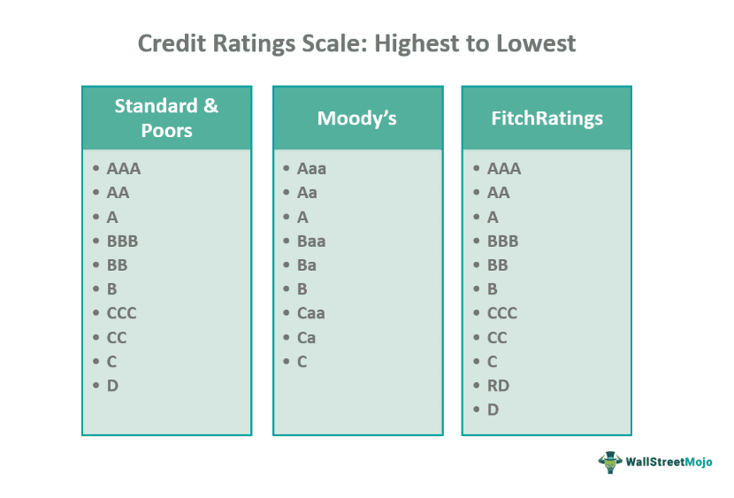

In finance, understanding credit ratings and leveraging algorithmic trading strategies are essential for maximizing investment returns. Credit ratings provide valuable information about the creditworthiness of borrowers, which is crucial for investors making decisions about bond investments. Weighted Average Credit Rating (WACR) and Weighted Average Rating Factor (WARF) are two significant metrics used to assess the overall credit quality of bond funds. WACR calculates the average credit ratings of all bonds within a fund, offering investors a clear picture of the fund’s credit quality and associated risk level. Meanwhile, WARF aggregates individual credit ratings into a single numerical representation, streamlining the analysis of credit risk.

Algorithmic trading, a predominant force in modern financial markets, employs these metrics to automate and improve decision-making processes. By integrating WACR and WARF, algorithmic models can dynamically adjust portfolio compositions and manage credit risk more efficiently. This adoption of weighted credit metrics in algorithmic trading not only enhances potential returns but also optimizes portfolio risk management.



Understanding these financial principles allows investors to make well-informed decisions and optimize their portfolios. By leveraging credit ratings and advanced trading strategies, investors and fund managers gain the capability to navigate complex financial environments effectively.

## Table of Contents

## Understanding Weighted Average Credit Rating (WACR)

The Weighted Average Credit Rating (WACR) is an essential metric for evaluating the credit quality of bonds within a bond fund. It provides investors with a consolidated view of the fund’s credit risk by summarizing individual bond credit ratings into a singular, comprehensive value. The calculation involves taking the credit ratings assigned to each bond by credit rating agencies, such as Moody's, Standard & Poor's, or Fitch, and determining a weighted average based on the bond's proportion within the fund.

To calculate the WACR, one must assign numerical values to the letter grades of credit ratings. While each credit rating agency has its scale, common practice involves assigning descending order numbers to these ratings—higher numbers often indicate better credit quality. The WACR can then be mathematically expressed as:

$$
\text{WACR} = \sum_{i=1}^{n} \left( \frac{V_i}{V_{\text{total}}} \times R_i \right)
$$

Where:
- $V_i$ is the market value of bond $i$,
- $V_{\text{total}}$ is the total market value of all bonds in the portfolio,
- $R_i$ is the numerical credit rating of bond $i$.

This computation results in a singular numerical value that reflects the overall credit risk of the fund, thereby giving investors a clear and simplified measure of the fund's credit quality.

WACR aids investors in comprehending the potential risk associated with bond investments. By distilling complex rating systems into a digestible numeric form, it enables both novice and experienced investors to make more informed decisions about bond funds. One key benefit is that it allows investors to compare the credit risk across different bond funds quickly and efficiently, facilitating better investment choices aligned with their risk tolerance and financial goals.

## Exploring Weighted Average Rating Factor (WARF)

The Weighted Average Rating Factor (WARF) plays a pivotal role in credit risk analysis, offering a quantifiable measure of the overall credit quality within a given portfolio. WARF effectively consolidates individual credit ratings into a unified metric, facilitating a clearer understanding of credit risk exposure. This comprehensive metric is essential for investors and financial institutions as it provides a quantitative foundation for evaluating credit risk, ensuring informed decision-making and strategic planning.

In financial analysis, WARF is crucial as it helps investors gauge the risk profile of their investments, thereby aiding in risk management and performance assessment. For compliance purposes, regulators and governing bodies utilize WARF to ensure that institutions maintain portfolios within acceptable risk thresholds. Additionally, WARF serves as a benchmark for performance evaluation, allowing investors to compare the credit quality of different portfolios or funds to identify the most suitable investment opportunities.

Calculating the WARF involves a systematic process of assigning numerical values to each credit rating, which are then weighted according to the principal amount of each security within the portfolio. The formulation of WARF is typically expressed as:

$$

\text{WARF} = \frac{\sum (\text{Credit Rating Value} \times \text{Principal Amount})}{\sum (\text{Principal Amount})}
$$

Where $\text{Credit Rating Value}$ represents the numeric equivalent of the credit rating assigned to each security, often on a scale such as 1 (AAA) to 10 (D), depending on the rating agency's system. The $\text{Principal Amount}$ indicates the total value of the security held in the portfolio.

This calculation ensures that each security's impact on the overall WARF is proportional to its significance in the portfolio, thus providing an accurate reflection of the portfolio's aggregated credit quality. For implementation, Python can be employed to compute WARF efficiently, as shown in the sample code snippet:

```python
def calculate_warf(credits, principals):
    weighted_values = [c * p for c, p in zip(credits, principals)]
    total_principal = sum(principals)
    warf = sum(weighted_values) / total_principal
    return warf

credit_ratings = [1, 5, 3, 7]  # Example credit ratings
principal_amounts = [100000, 200000, 150000, 250000]  # Corresponding principal amounts

warf_result = calculate_warf(credit_ratings, principal_amounts)
print("The WARF is:", warf_result)
```

By condensing diverse credit ratings into a singular value, WARF enables financial analysts and portfolio managers to make robust comparisons, optimize credit portfolios, and develop strategies aligned with their risk tolerance and investment objectives. Despite its utility, the effectiveness of WARF hinges on the accuracy and consistency of the underlying credit ratings, underscoring the importance of using reliable and up-to-date rating information.

## Algorithmic Trading and Credit Rating Metrics

Algorithmic trading utilizes sophisticated computational methods to process financial metrics and automate investment decisions within trading markets. Among the metrics harnessed are the Weighted Average Credit Rating (WACR) and the Weighted Average Rating Factor (WARF), which are instrumental in assessing credit quality and managing associated risks in bond portfolios.

By incorporating metrics like WACR and WARF, [algorithmic trading](/wiki/algorithmic-trading) platforms are capable of dynamically adjusting portfolio compositions in response to real-time market data. This capability is crucial for managing credit risk effectively and optimizing investment returns. For instance, when a drop in the average credit rating of portfolio holdings is detected, trading algorithms can automatically re-balance the portfolio to mitigate potential losses by either hedging risk or reallocating assets.

Advanced applications extend beyond mere adjustments, as algorithmic trading increasingly intersects with [machine learning](/wiki/machine-learning) and [artificial intelligence](/wiki/ai-artificial-intelligence) to enhance predictive analytics and risk optimization. Machine learning models can be trained on historical credit rating data, market trends, and economic indicators to forecast potential credit downgrades or improvements, allowing traders to anticipate market movements and adjust strategies preemptively. Consider a Python example where a machine learning model is developed to predict credit rating changes:

```python
from sklearn.model_selection import train_test_split
from sklearn.ensemble import RandomForestClassifier
from sklearn.metrics import accuracy_score

# Load dataset (hypothetical dataset for demonstration)
data = load_credit_data()
features = data.drop('credit_rating_change', axis=1)
labels = data['credit_rating_change']

# Split dataset into training and testing sets
X_train, X_test, y_train, y_test = train_test_split(features, labels, test_size=0.2, random_state=42)

# Train Random Forest Classifier
model = RandomForestClassifier(n_estimators=100, random_state=42)
model.fit(X_train, y_train)

# Predict and evaluate the model
predictions = model.predict(X_test)
accuracy = accuracy_score(y_test, predictions)
print(f"Model accuracy: {accuracy * 100:.2f}%")
```

This Python snippet demonstrates a basic framework for developing a model to anticipate rating changes, forming a data-driven strategy for portfolio management.

Furthermore, algorithmic platforms can optimize credit risk management by using these metrics to calibrate risk thresholds, set stop-loss limits, or trigger automated alerts. As a result, the integration of credit rating metrics within algorithmic systems provides traders with enhanced tools to navigate the complexities of credit risk, ultimately leading to more robust and informed trading strategies.

## Criticisms and Limitations

Weighted credit metrics such as Weighted Average Credit Rating (WACR) and Weighted Average Rating Factor (WARF) are essential for evaluating credit risk in investment portfolios. However, their complexity can lead to potential investor confusion and misinterpretation. These metrics involve aggregating various credit ratings into a single numerical value, which requires a thorough understanding of the underlying calculations and assumptions. As such, investors may misconstrue these figures if they lack sufficient financial literacy or access to comprehensive explanations.

One major limitation is the reliance on rating agencies, whose assessments are pivotal in computing WACR and WARF. These agencies, including Moody's, Standard & Poor's, and Fitch, assign ratings that serve as the basis for these metrics. However, the methodologies and criteria they use may differ, leading to inconsistencies. Moreover, historical events, such as the global financial crisis, have exposed the failures of these agencies in accurately assessing credit risks, thereby questioning the reliability of their ratings.

Another limitation is the static nature of these metrics. WACR and WARF often represent a snapshot in time and may not adequately reflect the dynamic aspects of credit risk, such as sudden changes in economic conditions or market sentiment. This static representation can mislead investors if they rely solely on these metrics without considering other market indicators or qualitative assessments.

Furthermore, these metrics involve simplification, reducing the multifaceted aspects of credit quality into a single figure. While this simplification aids in comparison and decision-making, it might overlook nuanced factors such as the issuer's industry-specific risks or geopolitical influences.

Despite these criticisms and limitations, WACR and WARF remain vital in financial analysis and fund management. They offer a standardized approach to assess credit risk and compare different portfolios' credit qualities. Investors and fund managers must apply these tools judiciously, supplementing them with qualitative analysis and other financial metrics to craft a comprehensive understanding of credit risk.

## Conclusion

Weighted credit metrics, including Weighted Average Credit Rating (WACR) and Weighted Average Rating Factor (WARF), play a fundamental role in assessing credit risk within investment portfolios. These metrics serve as valuable tools for translating complex credit ratings into accessible numerical values, enabling investors to evaluate the risk profile of their investments more effectively.

As algorithmic trading continues to evolve, the utilization of metrics such as WACR and WARF becomes increasingly vital. These tools facilitate the development of sophisticated trading strategies that dynamically adjust to changing market conditions, optimizing both portfolio structure and risk management. Advanced trading systems leverage WACR and WARF for real-time analysis and decision-making, improving the potential for enhanced investment returns while mitigating credit risk.

The continued integration of these metrics into algorithmic trading underscores their significance in modern finance. Investors, financial analysts, and fund managers systematically employ these metrics to navigate the complexities of financial markets with greater precision and insight. Through the systematic application of WACR and WARF, investment decisions can be better informed, leading to improved performance and strategic risk management in an increasingly dynamic financial landscape.

## References & Further Reading

[1]: Fabozzi, F. J. (2007). ["Bond Markets, Analysis, and Strategies"](https://books.google.com/books/about/Bond_Markets_Analysis_and_Strategies_ten.html?id=bQpNEAAAQBAJ). Prentice Hall.

[2]: Hull, J. C. (2009). ["Options, Futures, and Other Derivatives"](https://www.amazon.com/Options-Futures-Other-Derivatives-9th/dp/0133456315). Prentice Hall.

[3]: Darbyshire, J. (2021). ["Mastering Predictive Analytics with R"](https://www.oreilly.com/library/view/mastering-predictive-analytics/9781787121393/). Packt Publishing.

[4]: Aarvik, L. (2018). ["The Unintended Consequences of Credit Ratings for Sovereign Borrowers"](https://www.researchgate.net/publication/357887058_Unintended_Consequences_of_the_Dodd-Frank_Act_on_Credit_Rating_Risk_and_Corporate_Finance). Journal of Conflict Resolution.

[5]: Campani, C. H., & Céspedes, J. (2020). ["Differential Predictive Ability of Credit Ratings"](https://www.semanticscholar.org/paper/Re-assessing-the-Foundations%3A-Worldwide-Smallpox-Bhattacharya-Campani/55f788ae108592f9a98276545d778debafa21e8c). Journal of Applied Corporate Finance.