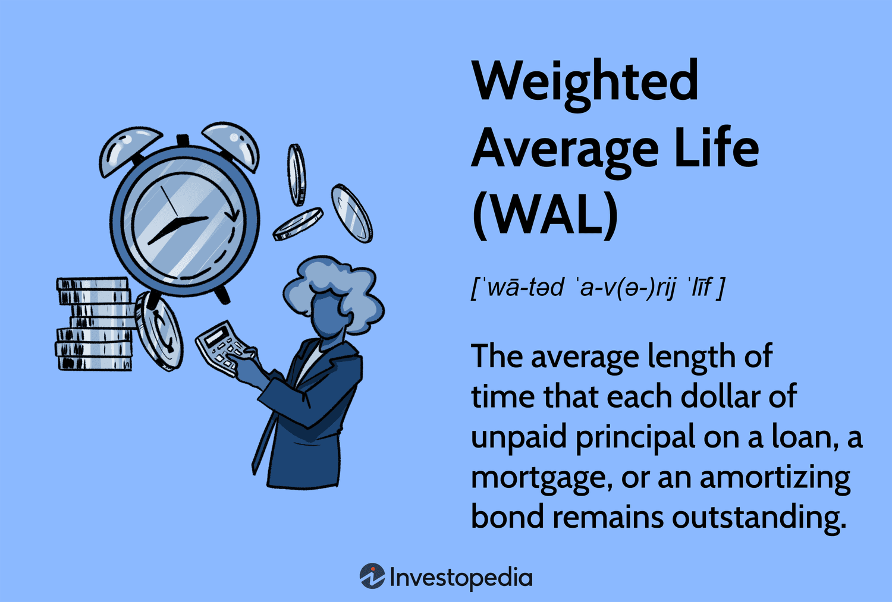

## Table of Contents

## What is a weighted average loan age?

A weighted average loan age is a way to figure out the average age of a bunch of loans, but it gives more importance to loans that are bigger. Imagine you have a few loans, some small and some large. Instead of just adding up all the ages and dividing by the number of loans, you pay more attention to the bigger loans because they have a bigger impact.

To calculate it, you multiply the age of each loan by its size, add all those numbers together, and then divide by the total size of all the loans. This method helps to understand the overall age of a loan portfolio more accurately, especially when some loans are much larger than others. It's like taking a weighted vote, where bigger loans have a louder voice in determining the average age.

## How is the weighted average loan age calculated?

To find the weighted average loan age, you start by looking at each loan in your group. You take the age of each loan and multiply it by how big the loan is. This gives more importance to bigger loans. After you do this for all the loans, you add up all these numbers. 

Then, you add up the sizes of all the loans to get a total size. You take the big number you got from adding up all the multiplied ages and divide it by this total size of all the loans. This gives you the weighted average loan age, which shows the average age of the loans but considers that bigger loans matter more.

## Why is the weighted average loan age important in financial analysis?

The weighted average loan age is important in financial analysis because it helps to understand how old the loans in a group are, but it pays more attention to bigger loans. This is useful because bigger loans can affect the whole group more than smaller ones. If you just used the regular average, it might not show the true picture of how old the loans are, especially if there are a few very big loans that are much older or newer than the others.

Knowing the weighted average loan age can help people make better decisions about the loans. For example, if the loans are getting old, it might mean they need to be paid off soon, which could affect how risky the group of loans is. On the other hand, if the loans are mostly new, it might mean the group is less risky because the loans have more time before they need to be paid back. This information helps banks and investors understand and manage their loan portfolios better.

## Can you provide an example of how to calculate the weighted average loan age?

Imagine you have three loans. Loan A is $100,000 and is 2 years old. Loan B is $50,000 and is 4 years old. Loan C is $200,000 and is 1 year old. To find the weighted average loan age, you first multiply the age of each loan by its size. So, for Loan A, you multiply 2 years by $100,000 to get $200,000. For Loan B, you multiply 4 years by $50,000 to get $200,000. For Loan C, you multiply 1 year by $200,000 to get $200,000. Now, you add these numbers together: $200,000 + $200,000 + $200,000 = $600,000.

Next, you add up the sizes of all the loans to get the total size. The total size is $100,000 + $50,000 + $200,000 = $350,000. To find the weighted average loan age, you divide the total of the multiplied ages ($600,000) by the total size of the loans ($350,000). So, $600,000 divided by $350,000 equals about 1.71 years. This means the weighted average age of these loans is about 1.71 years, which gives more importance to the bigger loans in the group.

## How does the weighted average loan age affect the risk assessment of a loan portfolio?

The weighted average loan age helps people understand how risky a group of loans is. If the weighted average age is high, it means the loans are older. Older loans might be closer to when they need to be paid back, which can be riskier. If people can't pay back their loans on time, it could cause problems for the bank or investor who owns the loans. So, a higher weighted average loan age can mean more risk because there's less time left for the loans to be paid back.

On the other hand, if the weighted average loan age is low, it means the loans are newer. Newer loans usually have more time before they need to be paid back, which can be less risky. This gives the people who borrowed the money more time to pay it back, and it gives the bank or investor more time to manage the loans. So, a lower weighted average loan age can mean less risk because there's more time for the loans to be paid back.

## What are the differences between weighted average loan age and simple average loan age?

The weighted average loan age and the simple average loan age are two ways to figure out how old the loans in a group are, but they do it differently. The simple average loan age is found by adding up the ages of all the loans and then dividing by how many loans there are. It treats every loan the same, no matter how big or small it is. So, if you have a small loan that's 10 years old and a big loan that's 1 year old, the simple average would count them equally.

On the other hand, the weighted average loan age gives more importance to bigger loans. To find it, you multiply the age of each loan by its size, add up all these numbers, and then divide by the total size of all the loans. This way, a big loan that's 1 year old would have a bigger impact on the average than a small loan that's 10 years old. The weighted average is better when you want to understand how the size of loans affects the overall age of the group, which can be important for managing the loans and understanding the risk.

## How does the weighted average loan age impact the pricing of mortgage-backed securities?

The weighted average loan age can affect how much people are willing to pay for mortgage-backed securities. These securities are bundles of home loans that investors can buy. If the weighted average loan age of the loans in the bundle is high, it means the loans are older. Older loans are closer to being paid off, which can be riskier because there's less time for the homeowners to make their payments. If people think the loans are riskier, they might not want to pay as much for the securities, so the price might go down.

On the other hand, if the weighted average loan age is low, it means the loans are newer. Newer loans have more time before they need to be paid back, which can be less risky. Investors might be willing to pay more for these securities because they think there's a better chance the homeowners will keep paying their loans on time. So, the weighted average loan age helps investors decide how much they're willing to pay for mortgage-backed securities based on how old and risky the loans are.

## What are the common industry standards for reporting weighted average loan age?

In the finance world, the weighted average loan age is often reported in documents like loan performance reports or mortgage-backed securities prospectuses. These reports help investors and analysts understand how old the loans in a group are, taking into account that bigger loans matter more. Usually, the weighted average loan age is given in years and is rounded to two decimal places to make it easier to read and compare. 

When reporting the weighted average loan age, it's common to include it alongside other important numbers like the weighted average coupon and the weighted average maturity. This gives a full picture of the loan portfolio's age, interest rates, and how long the loans will last. By looking at these numbers together, people can make better guesses about how risky the loans are and how they might affect the value of mortgage-backed securities.

## How does the weighted average loan age relate to the seasoning of loans?

The weighted average loan age is closely related to the seasoning of loans. Seasoning refers to how long a loan has been around. When a loan is new, it's called unseasoned, and as time goes by, it becomes seasoned. The weighted average loan age tells us how seasoned the loans in a group are, but it gives more importance to bigger loans. So, if a group of loans has a high weighted average loan age, it means the loans are more seasoned. This can be useful because seasoned loans have a history of payments, which can help people guess if the loans are likely to be paid back on time.

Knowing the seasoning of loans through the weighted average loan age is important for figuring out how risky the loans are. If the loans are more seasoned, they might be closer to being paid off, which can be riskier because there's less time left for the homeowners to make their payments. On the other hand, if the loans are less seasoned, they have more time before they need to be paid back, which might make them less risky. By looking at the weighted average loan age, banks and investors can understand how seasoned the loans are and make better decisions about the loans they own or want to buy.

## What are the potential pitfalls in using weighted average loan age for decision-making?

One pitfall of using weighted average loan age for decision-making is that it might not give a complete picture of the loan portfolio's risk. It focuses on how old the loans are, but it doesn't tell you about other important things like how much people are paying back, if they're late on payments, or if the value of the homes backing the loans is going up or down. If you only look at the weighted average loan age, you might think the loans are less risky than they really are, especially if there are problems with payments or home values.

Another problem is that the weighted average loan age can be affected a lot by just a few big loans. If there are a few very large loans that are much older or newer than the rest, they can change the weighted average a lot. This might make it hard to see what's going on with the smaller loans, which could also be important for understanding the risk of the whole group. So, it's important to look at other numbers and details along with the weighted average loan age to make the best decisions about the loans.

## How can changes in the weighted average loan age over time be used to predict future loan performance?

Changes in the weighted average loan age over time can help predict how well loans might do in the future. If the weighted average loan age keeps getting bigger, it means the loans are getting older. Older loans are closer to when they need to be paid back, so they might be riskier. If a lot of loans are getting close to the end, there's a chance more people might have trouble paying them back. By watching how the weighted average loan age changes, banks and investors can guess if there might be more problems with payments in the future.

On the other hand, if the weighted average loan age is getting smaller, it means the loans are getting newer. Newer loans have more time before they need to be paid back, so they might be less risky. If the loans are getting younger, it could mean there will be fewer problems with payments in the future. By looking at how the weighted average loan age changes over time, people can make better guesses about how the loans will do and plan for what might happen next.

## What advanced statistical methods can be applied to enhance the analysis of weighted average loan age?

To make the analysis of weighted average loan age better, people can use a method called regression analysis. This method helps find how the age of loans affects other important things, like how much people pay back or if they're late on payments. By using regression analysis, you can see how changes in the weighted average loan age might change how well the loans do in the future. This can help banks and investors make smarter guesses about how risky their loans are and plan for what might happen next.

Another useful method is time series analysis. This helps look at how the weighted average loan age changes over time and see if there are any patterns. By using time series analysis, you can find out if the age of loans goes up or down in a certain way, which can help predict what might happen to the loans in the future. This method is good for understanding how the age of loans might affect how well they do and how risky they are, so banks and investors can make better decisions about their loan portfolios.

## What is Weighted Average Loan Age (WALA)?

The Weighted Average Loan Age (WALA) is an integral metric for assessing the average age of loans within a pool of mortgage-backed securities (MBS). This measure is particularly significant as it helps investors evaluate both maturity and prepayment risks, which are crucial for understanding the overall profile of MBS investments.

WALA is calculated by taking the age of each loan in the pool and weighting it by the loan's outstanding balance relative to the entire pool. Formally, WALA can be expressed using the formula:

$$
\text{WALA} = \frac{\sum_{i=1}^{n} (\text{Loan Age}_i \times \text{Outstanding Balance}_i)}{\sum_{i=1}^{n} \text{Outstanding Balance}_i}
$$

In this equation, $\text{Loan Age}_i$ refers to the age of the ith loan in months, and $\text{Outstanding Balance}_i$ is the balance remaining on that loan. The summation is carried over all loans $n$ in the pool.

The significance of WALA arises from its ability to provide a comprehensive view of the distribution of loan ages within a given pool. Since each loan may be subject to different interest rates, terms, and borrower behaviors, WALA, through its weighted approach, allows larger or more impactful loans to have a proportionally greater influence on the metric's final value. This in turn offers investors insights into potential prepayment activities, which could affect the cash flows and expected returns of the securities.

By capturing the average age of loans weighted by their financial significance, WALA assists market participants in gauging the maturity characteristics of a mortgage-backed security. This information is critical when estimating future cash flows and assessing the investment risks associated with premature loan repayments.

## How is Weighted Average Loan Age Calculated?

The calculation of the Weighted Average Loan Age (WALA) begins with considering the age of each individual loan within a pool of mortgage-backed securities, but it crucially integrates the outstanding balance of each loan to derive a weighted measure. Essentially, each loan’s age is multiplied by its respective outstanding balance, and the results are summed across all loans within the pool. This sum is then divided by the total outstanding balance of all loans in the pool.

The formula for calculating WALA is expressed as follows:

$$

\text{WALA} = \frac{\sum_{i=1}^{n} (\text{Age}_i \times \text{Outstanding Balance}_i)}{\sum_{i=1}^{n} \text{Outstanding Balance}_i} 
$$

Where:
- $\text{Age}_i$ is the age of loan $i$ in months,
- $\text{Outstanding Balance}_i$ is the current outstanding balance of loan $i$,
- $n$ is the total number of loans in the pool.

In practice, this calculation places greater emphasis on loans with substantial outstanding balances, as they have a more significant impact on the overall performance of the security pool. Larger loans will naturally affect the weighted average more than smaller ones, thus reflecting their proportional influence on potential future cash flows and associated risks. This weighted approach allows investors to obtain a more accurate picture of the pool's maturity and ensures that the most financially significant loans are represented accordingly in the measure of average loan age.

## How does WALA compare with Weighted Average Maturity (WAM)?

Weighted Average Loan Age (WALA) and Weighted Average Maturity (WAM) represent two distinct metrics used in the analysis of mortgage-backed securities, each serving a specific function in understanding different risk factors associated with these financial instruments.

WAM is primarily focused on the time dimension of a security's cash flows. It calculates the average time until the loans in a mortgage-backed security pool are expected to be fully repaid. This metric incorporates the weighted time to maturity of each loan, considering the principal amount to reflect the dollar amount invested. The formula for WAM is expressed as follows:

$$
\text{WAM} = \frac{\sum (T_i \times P_i)}{\sum P_i}
$$

where $T_i$ is the time to maturity for loan $i$, and $P_i$ is the principal amount of loan $i$.

In contrast, WALA provides an understanding of the average age of the loans within the mortgage-backed securities pool. It essentially gives a retrospective view, indicating how long the loans have been active. This insight into loan age is crucial for assessing prepayment risk. Prepayment risk refers to the likelihood that borrowers will pay off their loans earlier than expected, affecting the timing and the amount of cash flows. While WAM looks forward to when loans might end, WALA assesses how long they have been active.

The formula for WALA is:

$$
\text{WALA} = \frac{\sum (A_i \times P_i)}{\sum P_i}
$$

where $A_i$ is the age of loan $i$, and $P_i$ is the principal amount of loan $i$.

Hence, while WAM provides insights into the expected future cash flow timings, taking into account the duration until loans mature, WALA gives context to the current status of loans, focusing on the historical aspect which is critical for predicting prepayment speeds. Together, both metrics offer a comprehensive view of the temporal risk and opportunity landscape associated with mortgage-backed securities, facilitating better alignment with investors' risk profiles and investment strategies.

## References & Further Reading

[1]: Gorton, G. B., & Metrick, A. (2012). ["Getting Up to Speed on the Financial Crisis: A One-Weekend-Reader's Guide."](https://www.nber.org/system/files/working_papers/w17778/w17778.pdf) Journal of Economic Perspectives, 25(4), 161-180.

[2]: ["Advances in Financial Machine Learning"](https://www.amazon.com/Advances-Financial-Machine-Learning-Marcos/dp/1119482089) by Marcos Lopez de Prado

[3]: Hayre, L. (Ed.). (2001). ["Salomon Smith Barney Guide to Mortgage-Backed and Asset-Backed Securities."](https://archive.org/details/isbn_0471385875) Wiley.

[4]: Fabozzi, F. J., Bhattacharya, A. K., & Berliner, W. S. (2011). ["Mortgage-Backed Securities: Products, Structuring, and Analytical Techniques."](https://archive.org/details/mortgagebackedse0000fabo) Wiley.

[5]: ["Machine Learning for Algorithmic Trading"](https://github.com/stefan-jansen/machine-learning-for-trading) by Stefan Jansen