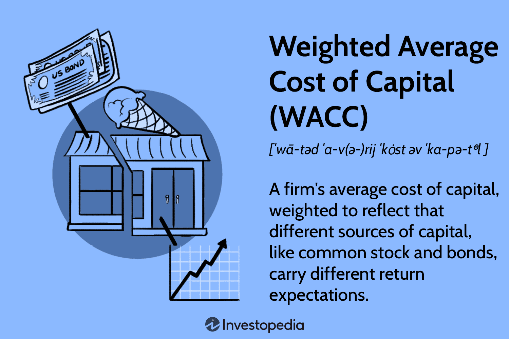

Algorithmic trading has transformed the way financial markets operate, offering a robust mechanism for executing investment strategies with precision and speed. Among the various strategies that leverage this technological advancement is the Weighted Average Market Capitalization (WAMC). This technique prioritizes investment in larger market entities based on their market capitalization, providing a balanced approach that mirrors economic reality.

The primary objective of this article is to examine WAMC investment strategies within the context of algorithmic trading. This exploration aims to illustrate how these strategies can improve trading performance, risk management, and decision-making processes. By focusing on both the calculation and importance of WAMC, the article will highlight its role in constructing index funds and shaping portfolio management practices. For instance, indices like the S&P 500 are built using WAMC, where significant weight is given to more substantial companies, thereby affecting the index's overall movement and performance.



Furthermore, the versatility of WAMC in algorithmic trading is showcased through various strategies that optimize investment outcomes. These strategies typically involve automatic allocation and rebalancing, ensuring that portfolios remain aligned with market movements and investor goals.

This exploration of WAMC's fundamental concepts and its practical applications is essential for traders looking to navigate the complexities of financial markets. By integrating WAMC into their strategies, traders can effectively align their investment approaches with prevailing market trends, securing a more predictive and responsive trading experience.

## Table of Contents

## Understanding Weighted Average Market Capitalization

Weighted Average Market Capitalization (WAMC) is a methodology for constructing indices that emphasizes the market capitalization of constituent stocks. This approach accords greater weight to companies with larger market capitalization, thereby reflecting their significant impact on the index's movement and overall market trends.

### Calculation Methodology

The calculation of WAMC involves determining the proportionate market capitalization of each stock relative to the total market capitalization of all the stocks in the index. For a given stock $i$, the weight $w_i$ in the index is calculated using the formula:

$$

w_i = \frac{\text{Market Capitalization of Stock } i}{\sum_{j=1}^{n} \text{Market Capitalization of Stock } j} 
$$

Where:
- $n$ is the total number of stocks in the index.
- The market capitalization of a stock is generally calculated as the stock price multiplied by the total number of outstanding shares.

This method ensures that stocks with larger market capitalization, such as blue-chip companies, have a more pronounced influence on the index performance. 

### Implications for Financial Markets

The S&P 500 is a prominent example of a WAMC-based index. Within this index, companies such as Apple and Microsoft, due to their extensive market capitalization, heavily influence its movement. The reliance on WAMC allows the S&P 500 to provide a stable and representative metric for analyzing broader market performance.

Investors appreciate WAMC-based indices for their stability and representation. Because these indices emphasize well-established companies, they are generally less volatile, making them attractive to long-term investors seeking steady growth. However, by concentrating on large-cap companies, such indices might underrepresent the performance of smaller, high-[growth stocks](/wiki/growth-stocks) which are abundant in a different category of indices.

### Broader Market Dynamics

The WAMC methodology implies a natural bias towards larger players in the market. Consequently, these indices typically align well with economic growth and market trends. This mirroring of market dynamics makes WAMC-based indices valuable for portfolio benchmarking and asset allocation.

WAMC indices also inherently accommodate changes in market capitalization, allowing for automatic adjustments in index composition and weightings. This feature facilitates a responsive mechanism to reflect mergers, acquisitions, and other corporate actions impacting market capitalizations.

### Example Implementation in Python

To demonstrate the WAMC calculation, consider a simple Python function:

```python
def calculate_wamc(market_caps):
    total_market_cap = sum(market_caps.values())
    weights = {stock: market_cap / total_market_cap for stock, market_cap in market_caps.items()}
    return weights

# Example market caps in billions
market_caps = {
    'Company A': 500,
    'Company B': 300,
    'Company C': 200
}

weights = calculate_wamc(market_caps)
print(weights)
```

This function takes a dictionary of stock market capitalizations, computes the total market capitalization, and then calculates each stock's weight within the index.

The Weighted Average Market Capitalization methodology is thus a cornerstone of index construction, offering insights into market trends by emphasizing established market leaders. Its application not only aids in evaluating market performance but also contributes to informed investment decisions, reflecting both stability and representativeness.

## Investment Strategies Using Weighted Average Market Capitalization

Weighted Average Market Capitalization (WAMC) investment strategies focus on allocating a larger proportion of investment to companies with higher market capitalizations. This approach is fundamentally straightforward: the weight $W_i$ of each stock $i$ in the portfolio is determined by its market capitalization compared to the total market capitalization of all the stocks in the index.

$$
W_i = \frac{\text{Market Cap}_i}{\sum_{j=1}^{N} \text{Market Cap}_j}
$$

where $\text{Market Cap}_i$ is the market capitalization of stock $i$, and $N$ is the total number of stocks in the portfolio.

**Advantages of WAMC Strategies**

1. **Stability and Risk Reduction**: WAMC strategies often prioritize blue-chip stocks—large, established companies known for stability and dependable performance. These companies typically exhibit less volatility, providing a cushioning effect against market fluctuations. The preference for larger market capitalization stocks is perceived as a less risky investment approach, aligning with conservative investment strategies focused on preserving capital and sustaining growth.

2. **Natural Portfolio Rebalancing**: One inherent advantage is the built-in mechanism for rebalancing. As market capitalizations shift with market movements, WAMC strategies automatically adjust the weight of the stocks within the portfolio. This process ensures continuous alignment with market trends without the need for frequent manual interventions, reducing transaction costs and streamlining the management process.

**Drawbacks of WAMC Strategies**

1. **Underperformance During Small-Cap Rallies**: Despite their stability, WAMC strategies may lag during market conditions where smaller-cap stocks outperform. Small-cap stocks can exhibit rapid growth and significant returns, primarily during economic expansions or in speculative markets. Since these stocks have lesser weights in a WAMC index, the portfolio might miss capturing the high growth phase of such stocks, leading to potential underperformance in such cycles.

2. **High Dependency on Large Corporations**: While large-cap companies can serve as stabilizers during economic downturns, excessive reliance can become a double-edged sword. Negative news or performance issues within these large entities can have outsized impacts on portfolio value, potentially amplifying risks rather than mitigating them.

**Portfolio Rebalancing Mechanism**

The dynamic nature of WAMC strategies can be illustrated through an example of a simple Python script to automate the updating of weights based on changing market capitalizations:

```python
import pandas as pd

# Sample data of company market capitalizations
data = {
    'Company': ['A', 'B', 'C'],
    'Market_Cap': [100e9, 200e9, 50e9]  # Example data in billions
}

df = pd.DataFrame(data)

# Calculate total market capitalization
total_market_cap = df['Market_Cap'].sum()

# Calculate weights
df['Weight'] = df['Market_Cap'] / total_market_cap

print(df)
```

This script provides a framework to dynamically adjust investment proportions based on market capitalization changes. Such adaptability is crucial for maintaining optimal asset alignment with market movements, showcasing the advantages of incorporating automated decision-making within WAMC strategies.

In conclusion, while WAMC-based strategies offer a balanced and stable investment approach by highlighting larger, established companies, investors need to be aware of the inherent limitations during periods favoring small-cap growth. These strategies are a testament to efficient portfolio management, blending risk aversion with automated portfolio rebalancing, although they must be cautiously managed to mitigate potential drawbacks in divergent market scenarios.

## Algorithmic Trading and WAMC

Algorithmic trading uses mathematical models and statistical techniques to execute trades based on pre-defined criteria. Within this domain, the Weighted Average Market Capitalization (WAMC) strategy is particularly significant as it automates the allocation and rebalancing process in a way that emphasizes larger market players. By systematically adjusting asset weights based on their market capitalizations, algorithms can enhance trading efficiency and manage portfolio [volatility](/wiki/volatility-trading-strategies) more effectively.

### Automated Allocation and Rebalancing

WAMC-based algorithms prioritize larger companies due to their substantial impact on market indices. This prioritization is achieved through the weighted average formula, where each asset's weight is proportional to its market capitalization. The mathematical representation for determining the weight $w_i$ of a company $i$ in an index is:

$$

w_i = \frac{MC_i}{\sum_{j=1}^{n} MC_j}
$$

where $MC_i$ is the market capitalization of company $i$, and $n$ is the total number of companies in the index. This formula ensures that changes in the market capitalization of any constituent trigger automatic rebalancing, aligning the index's composition with current market dynamics.

### Optimizing Trading Strategies

In [algorithmic trading](/wiki/algorithmic-trading), WAMC can be integrated into various algorithmic frameworks to optimize investment outcomes. Algorithms employing WAMC can swiftly react to market shifts by adjusting portfolio allocations to maintain a balance reflective of the broader market. For instance, by favoring large-cap stocks during stable or bullish markets, these algorithms can minimize risk and enhance returns.

Python is commonly used to develop such algorithms. A simple Python code snippet for calculating WAMC-based weights might look like this:

```python
def calculate_weights(market_caps):
    total_market_cap = sum(market_caps)
    return [mc / total_market_cap for mc in market_caps]

# Example market capitalizations
market_caps = [500e9, 300e9, 200e9]  # in billions
weights = calculate_weights(market_caps)
print("Weights:", weights)
```

This code calculates the weights for a portfolio of companies based on their market capitalizations, facilitating automated rebalancing as market conditions change.

### Case Studies and Practical Examples

Real-world applications of WAMC-focused algorithms demonstrate their efficacy in maintaining a portfolio aligned with market trends. For example, an asset management firm using a WAMC algorithm may rebalance its holdings quarterly to mirror changes in a benchmark index such as the S&P 500. By doing so, it ensures that the portfolio remains representative of the index's largest constituents, which often influence overall return profiles.

In another case, a [hedge fund](/wiki/hedge-fund-trading-strategies) could utilize WAMC to dynamically adjust its exposure to various sectors within the index, leveraging the reranking of industry leaders to optimize sectoral weightings. This dynamic approach mitigates risk by differentiating sector performance and capitalizes on emerging growth trends.

Through the strategic use of algorithms built around WAMC principles, traders and investment managers can execute more informed and timely trades, thereby achieving superior investment performance while efficiently managing risk. The integration of these strategies into algorithmic trading platforms is essential for those aiming to leverage market dynamics to their fullest potential.

## Challenges and Considerations

Implementing Weighted Average Market Capitalization (WAMC) strategies in algorithmic trading presents several challenges that must be navigated to ensure successful execution and performance optimization. One of the primary challenges is the determination of appropriate weighting parameters. In WAMC, larger companies are assigned greater weights within a portfolio, reflecting their market dominance. However, the dynamic nature of financial markets may necessitate continuous adjustments to these weights to capture evolving market trends accurately. Traders must develop mechanisms to recalibrate these weights periodically to maintain alignment with market conditions.

Market volatility further complicates the deployment of WAMC strategies. Volatile markets can introduce discrepancies in price data, affecting the precision of market capitalization calculations and, consequently, portfolio weightings. Algorithms must be resilient to abrupt market shifts, with capabilities to adapt to new conditions while minimizing excessive trading costs or portfolio churn.

Data quality is another critical concern. Accurate and timely data is foundational to calculating market capitalizations and thus directly impacts the efficacy of WAMC strategies. Inaccurate data can lead to miscalculations and suboptimal trading decisions. Traders must implement robust data preprocessing techniques, such as data cleansing and validation processes, to ensure integrity and reliability. Additionally, overfitting poses a substantial risk whereby models become too tailored to historical data, reducing their ability to perform well on unseen data. Regular validation with out-of-sample tests is essential to mitigate this risk.

The implementation of WAMC in algorithmic trading also involves navigating regulatory and ethical constraints. Regulatory environments are increasingly tightening around algorithmic trading practices to protect market integrity and prevent manipulation. Compliance with these regulations is imperative, requiring traders to stay informed about relevant legal frameworks. Ethical considerations, such as ensuring that algorithmic models do not inadvertently exacerbate market inequalities or contribute to unethical trading practices, are also significant. Traders should adopt a responsible investing approach, underpinned by transparency and accountability, to address these concerns effectively.

In summary, successful implementation of WAMC strategies in algorithmic trading requires a comprehensive approach characterized by adaptive weight adjustment, rigorous data handling, and adherence to regulatory and ethical standards. These considerations are vital in navigating the complexities of modern financial markets and leveraging WAMC strategies to achieve optimal trading outcomes.

## Future Directions and Innovations

The advancement of algorithmic trading strategies, particularly those employing Weighted Average Market Capitalization (WAMC), is increasingly linked to developments in [machine learning](/wiki/machine-learning) and [artificial intelligence](/wiki/ai-artificial-intelligence). These technologies facilitate dynamic weight allocation by analyzing real-time data, allowing traders to refine their strategies according to current market conditions more precisely.

For WAMC-based strategies, machine learning models can optimize portfolio distribution by continuously learning from historical and incoming market data. Algorithms can adjust the weight of assets in real-time, ensuring that the portfolio remains aligned with the investor's objectives under varying market scenarios. Python frameworks like TensorFlow and PyTorch provide the tools necessary for incorporating machine learning models to enhance portfolio management through predictive analytics and anomaly detection. 

Consider a simple example where a machine learning model predicts the future movement of market prices to adjust portfolio weights dynamically:

```python
import numpy as np
import tensorflow as tf
from sklearn.preprocessing import StandardScaler
from sklearn.model_selection import train_test_split

# Sample data preparation
X, y = np.random.random((1000, 10)), np.random.random(1000)  # Features and labels
X_train, X_test, y_train, y_test = train_test_split(X, y, test_size=0.2)

# Standardize data
scaler = StandardScaler()
X_train = scaler.fit_transform(X_train)
X_test = scaler.transform(X_test)

# Build simple neural network model
model = tf.keras.models.Sequential([
    tf.keras.layers.Dense(64, activation='relu', input_shape=(X_train.shape[1],)),
    tf.keras.layers.Dense(32, activation='relu'),
    tf.keras.layers.Dense(1)
])

model.compile(optimizer='adam', loss='mean_squared_error')
model.fit(X_train, y_train, epochs=10, validation_data=(X_test, y_test))

# Predict future movements
predictions = model.predict(X_test)
```

In tandem with machine learning advancements, integrating blockchain technology offers significant potential for improving WAMC's reliability. Blockchain can provide a secure, immutable ledger for transaction and portfolio data, enhancing transparency and preventing fraudulent activity. Its decentralized nature ensures that all participants have access to the same verified data, crucial for maintaining trust in the calculations and decisions made under WAMC strategies.

Furthermore, the collaboration between data scientists and financial experts is crucial in creating sophisticated WAMC strategies capable of adapting to rapidly changing markets. By combining domain expertise with data-driven insights, experts can develop algorithms that not only respond to market trends but also provide innovative solutions to traditional investment challenges.

Looking ahead, continued research and development at the intersection of machine learning, blockchain, and finance will likely yield more robust WAMC strategies. These strategies could optimize investment outcomes by autonomously adjusting portfolio compositions in response to real-time market developments, reducing both systematic risks and transaction costs.

As these innovations unfold, WAMC strategies and algorithmic trading will become increasingly effective in addressing the complexities of modern financial markets, leveraging technology to achieve greater precision and adaptability in investment management.

## Conclusion

Weighted Average Market Capitalization (WAMC) serves as an essential tool for building indices and managing investment portfolios. By focusing on larger market participants, WAMC offers a balanced approach that mirrors the economic realities of the market landscape. This strategy allocates higher weights to companies with substantial market capitalizations, thus providing stability and reducing volatility in investment portfolios.

The implementation of WAMC in algorithmic trading is not without its challenges. Traders must navigate complexities such as determining appropriate weighting parameters and dealing with market volatility. However, the benefits of employing WAMC in this context are significant. The strategy's emphasis on true economic representation allows traders to maintain a comprehensive understanding of market dynamics, minimizing risks typically associated with smaller-cap stocks.

When integrated effectively, WAMC strategies can give traders a competitive edge, particularly when combined with modern technological advancements. Machine learning and artificial intelligence, for example, can enhance the adaptability and efficiency of WAMC-based strategies through dynamic weight allocations that are responsive to real-time data trends. This integration facilitates more sophisticated decision-making processes and optimizes portfolio outcomes.

As financial markets continue to evolve, the relationship between WAMC strategies and algorithmic trading is poised for significant growth. This evolution underscores the necessity for traders and investors to engage in continuous learning and innovation. By staying informed about the latest technological developments and market trends, traders can refine their strategies, ensuring they remain at the forefront of the industry.

In conclusion, WAMC provides a robust framework for index construction and portfolio management, emphasizing the importance of larger market players. While challenges exist in its application within algorithmic trading, the potential benefits of reduced volatility and enhanced economic representation make it a valuable strategy. As technological advancements continue to shape the trading landscape, the integration of WAMC with cutting-edge tools will be vital for maintaining a competitive advantage.

## References & Further Reading

[1]: ["Advances in Financial Machine Learning"](https://www.amazon.com/Advances-Financial-Machine-Learning-Marcos/dp/1119482089) by Marcos Lopez de Prado

[2]: ["Machine Learning for Algorithmic Trading - Second Edition"](https://github.com/PacktPublishing/Machine-Learning-for-Algorithmic-Trading-Second-Edition) by Stefan Jansen

[3]: ["Quantitative Trading: How to Build Your Own Algorithmic Trading Business"](https://github.com/LucindaYa/quant-resources/blob/master/Quantitative%20Trading%20How%20to%20Build%20Your%20Own%20Algorithmic%20Trading%20Business.pdf) by Ernest P. Chan

[4]: S&P Dow Jones Indices. ["S&P 500 Factsheet."](https://www.spglobal.com/spdji/en/indices/equity/sp-500/)

[5]: ["Evidence-Based Technical Analysis: Applying the Scientific Method and Statistical Inference to Trading Signals"](https://www.amazon.com/Evidence-Based-Technical-Analysis-Scientific-Statistical/dp/0470008741) by David Aronson

[6]: Bergstra, J., Bardenet, R., Bengio, Y., & Kégl, B. (2011). ["Algorithms for Hyper-Parameter Optimization."](https://dl.acm.org/doi/10.5555/2986459.2986743) Advances in Neural Information Processing Systems 24.