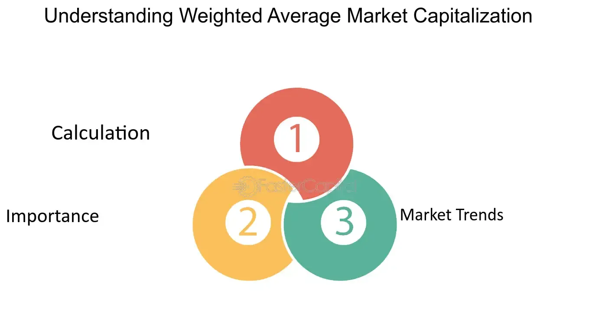

## Table of Contents

## What is market capitalization and why is it important?

Market capitalization, or market cap, is the total value of all the shares of a company. You can find it by multiplying the number of shares by the current price of one share. It's like a quick way to see how big a company is in terms of money. Imagine a company as a big pie, and each slice of the pie is a share. The market cap is the value of the whole pie.

Market cap is important because it gives investors a simple way to compare companies. A bigger market cap usually means a company is more stable and less risky. But, it's not the only thing to look at. Sometimes, smaller companies can grow faster. Investors use market cap along with other information to decide which companies to invest in. It helps them understand the size and potential of a company in the market.

## How is the weighted average market capitalization calculated?

The weighted average market capitalization is a way to figure out the overall market cap of a group of companies, but it gives more importance to the bigger companies. Imagine you have a bunch of different sized apples, and you want to find out the average size of the apples, but you want the bigger apples to count more. You would do this by multiplying the size of each apple by how much it should count, then adding all those numbers up, and finally dividing by the total number of apples. For market cap, you do something similar. You take each company's market cap and multiply it by a weight, which is often based on how big the company is compared to others in the group. Then you add all those numbers together and divide by the total of all the weights.

This method is useful because it shows a more accurate picture of the market. If you just added up all the market caps and divided by the number of companies, smaller companies would have the same impact as bigger ones, which wouldn't be fair. By using weights, the bigger companies have a bigger say in the final number, which makes sense because they have a bigger impact on the market. This weighted average helps investors and analysts understand the overall health and size of a market or an index, like the S&P 500, more accurately.

## What are the main uses of weighted average market capitalization in finance?

Weighted average market capitalization is often used in finance to create stock market indexes like the S&P 500. These indexes are like big lists of companies that help investors see how the market is doing. By using weighted averages, bigger companies have a bigger impact on the index. This makes sense because if a big company does well or badly, it affects the whole market more than a small company would. So, the weighted average helps the index show a true picture of the market.

Another use is in investment funds, like mutual funds or exchange-traded funds (ETFs). These funds might want to copy the performance of a market index. They do this by buying shares in the same companies that are in the index, and in the same amounts. To figure out how much of each company's shares to buy, they use the weighted average market capitalization. This way, the fund's performance will be close to the index's performance. It helps investors get a piece of the market without having to buy shares in every company themselves.

## Can you explain the difference between simple average and weighted average market capitalization?

A simple average market capitalization is like adding up the market caps of all the companies in a group and then dividing by the number of companies. It treats every company the same, no matter how big or small it is. Imagine you have a group of friends with different amounts of money. If you want to find out the average amount of money your friends have, you add up all their money and divide by the number of friends. That's a simple average.

A weighted average market capitalization, on the other hand, gives more importance to the bigger companies. It's like if you wanted to find out the average amount of money your friends have, but you want the friends with more money to count more in your calculation. You would multiply each friend's money by a special number (a weight) that shows how important they are, add those numbers up, and then divide by the total of all the special numbers. In the stock market, this means that big companies like Apple or Microsoft have a bigger say in the final number than smaller companies. This helps show a more accurate picture of the market because big companies have a bigger impact on it.

## What are the limitations of using weighted average market capitalization as a metric?

Using weighted average market capitalization has some problems. One big issue is that it can make the market look too focused on a few big companies. If a few giant companies like Apple or Microsoft do well, the whole market might seem like it's doing great, even if many smaller companies are struggling. This can give investors a wrong idea about how the market is really doing. It's like if you're looking at a group of friends and only counting the money of the richest ones - you might think everyone is rich when that's not true.

Another problem is that market capitalization is based on stock prices, which can change a lot from day to day. This means the weighted average can change quickly too, which might not show the true value of the companies. For example, if people suddenly start buying a lot of a company's stock, its market cap goes up, even if nothing has changed about the company itself. This can make the weighted average market capitalization a bit misleading because it might not reflect the real, long-term value of the companies in the market.

## How does weighted average market capitalization affect investment decisions?

Weighted average market capitalization helps investors make choices by showing them how big companies affect the market. When investors look at a market index like the S&P 500, the weighted average tells them that big companies like Apple or Microsoft have a bigger impact on the index's performance. This means if these big companies are doing well, the whole market might seem like it's doing well too. Investors might decide to put their money in funds that copy the index, thinking they'll get good returns because the big companies are doing well.

But, weighted average market capitalization can also trick investors. If they only look at the index and see it going up, they might think all companies are doing well. But really, it could just be the big companies that are doing well, while smaller ones are struggling. This might make investors miss out on good chances to invest in smaller companies that could grow a lot in the future. So, while weighted average market capitalization is a helpful tool, investors need to look at other things too, to get the full picture of the market.

## What are some common indices that use weighted average market capitalization?

One common index that uses weighted average market capitalization is the S&P 500. This index includes 500 of the biggest companies in the United States. The bigger the company, the more it affects the S&P 500's performance. So, if Apple or Microsoft do well, they can pull the whole index up. Investors often use the S&P 500 to see how the U.S. stock market is doing overall.

Another index that uses weighted average market capitalization is the NASDAQ Composite. This index includes all the companies listed on the NASDAQ stock exchange, which is known for having a lot of tech companies. Like the S&P 500, bigger companies in the NASDAQ Composite have a bigger impact on the index. This means tech giants like Amazon and Google can really move the needle for the whole index.

## How can weighted average market capitalization be used to assess market trends?

Weighted average market capitalization can help you see what's happening in the market by showing which big companies are doing well or badly. Imagine you're looking at a big group of friends, and you want to know if they're doing okay. If the richest friends are doing great, it might look like everyone is doing fine, even if some of the others are struggling. In the same way, if big companies like Apple or Microsoft are doing well, it can make the whole market look good, even if smaller companies aren't doing as well. By looking at the weighted average, you can see if the market is being pulled up or down by these big players.

This way of looking at things can help you spot trends. If the weighted average market capitalization is going up, it might mean that big companies are getting even bigger, or that investors are really excited about them. On the other hand, if it's going down, it could mean that big companies are struggling, or that people are losing interest in them. By keeping an eye on these changes, you can get a sense of where the market might be headed next. It's like watching the weather to see if it's going to rain or be sunny - it helps you plan what to do with your money.

## What alternative methods exist for calculating market capitalization?

One alternative way to calculate market capitalization is to use the "enterprise value" method. This method looks at the total value of a company, including its debt and cash. Imagine you're buying a house. The price you pay isn't just for the house itself, but also for any loans you take out to buy it. Similarly, enterprise value adds up the market cap, plus any debt the company has, and then subtracts any cash it has on hand. This gives a fuller picture of what it would cost to buy the whole company, not just its stock.

Another way is to use "float-adjusted market capitalization." This method focuses only on the shares that are available for the public to buy and sell, called the "float." Imagine you're at a party, and some of your friends can't come. If you're counting how many people are at the party, you only count the ones who are there. Float-adjusted market cap does the same thing with stocks. It only counts the shares that are out there in the market, not the ones owned by insiders or the company itself. This can be useful for understanding how much of a company's stock is really moving around in the market.

## How do these alternative methods compare to weighted average market capitalization in terms of accuracy and application?

The enterprise value method gives a different picture of a company's value compared to weighted average market capitalization. While weighted average market cap focuses on the total value of a company's shares, enterprise value includes debt and subtracts cash. This makes it a more complete measure of what it would cost to buy the whole company. It's like looking at the full price of a house, including the mortgage, rather than just the listed price. Enterprise value can be more accurate for understanding the true cost of acquiring a company, but it's not as commonly used for broad market indices because it's more complex and less focused on stock prices alone.

Float-adjusted market capitalization is another alternative that zeroes in on the shares available to the public. Unlike weighted average market cap, which considers all shares, float-adjusted market cap only counts the shares that are actively traded. This can give a clearer idea of the market's [liquidity](/wiki/liquidity-risk-premium) and how much of a company's stock is really moving around. It's useful for investors who want to understand the real impact of a company's stock on the market. However, it might not capture the full size of a company if a lot of shares are held by insiders or the company itself. Both alternatives offer different insights, but weighted average market capitalization remains popular for its simplicity and broad application in market indices.

## What advanced statistical techniques can enhance the analysis of weighted average market capitalization?

One way to make the analysis of weighted average market capitalization better is by using something called regression analysis. This is a fancy way of seeing how different things affect the market cap. Imagine you're trying to guess how much ice cream people will buy. You might look at the weather, the price of ice cream, and how much money people have. Regression analysis helps you figure out which of these things matters the most. In the same way, you can use it to see how things like a company's earnings, how much it's growing, or even what's happening in the world affect its market cap. This can give investors a better idea of what might happen next.

Another useful technique is time series analysis. This looks at how market caps change over time, like watching a movie instead of just a single picture. It can help you spot patterns or trends, like if a company's market cap goes up every summer or falls every time there's a big news event. By understanding these patterns, investors can make smarter guesses about where the market might be headed. Both regression analysis and time series analysis can make the simple idea of weighted average market capitalization much more powerful, giving investors deeper insights into the market.

## How might future market conditions impact the relevance of weighted average market capitalization?

Future market conditions might change how important weighted average market capitalization is. If more people start investing in smaller companies instead of big ones, the weighted average might not show the whole picture of the market. It's like if everyone at a party starts talking to the quiet people instead of the loud ones - the loud ones won't seem as important anymore. Also, if new types of investments, like cryptocurrencies, become more popular, people might care less about traditional stock market caps. They might look at other ways to measure value, like how much a company is using new technology or how it's helping the environment.

On the other hand, if big companies keep getting bigger and more important, weighted average market capitalization could stay very relevant. Big companies like tech giants might keep driving the market, making the weighted average a good way to see how the market is doing. But even then, investors will need to be careful. They'll need to look at other things too, like how the economy is doing overall or what's happening in the world, to get the full picture. So, while weighted average market capitalization will always be a useful tool, how much people use it might change based on what's happening in the market and the world.

## What is Understanding Weighted Average Market Capitalization?

Weighted Average Market Capitalization (WAMC) is a methodology for constructing indices that emphasizes the market capitalization of constituent stocks. This approach accords greater weight to companies with larger market capitalization, thereby reflecting their significant impact on the index's movement and overall market trends.

### Calculation Methodology

The calculation of WAMC involves determining the proportionate market capitalization of each stock relative to the total market capitalization of all the stocks in the index. For a given stock $i$, the weight $w_i$ in the index is calculated using the formula:

$$

w_i = \frac{\text{Market Capitalization of Stock } i}{\sum_{j=1}^{n} \text{Market Capitalization of Stock } j} 
$$

Where:
- $n$ is the total number of stocks in the index.
- The market capitalization of a stock is generally calculated as the stock price multiplied by the total number of outstanding shares.

This method ensures that stocks with larger market capitalization, such as blue-chip companies, have a more pronounced influence on the index performance. 

### Implications for Financial Markets

The S&P 500 is a prominent example of a WAMC-based index. Within this index, companies such as Apple and Microsoft, due to their extensive market capitalization, heavily influence its movement. The reliance on WAMC allows the S&P 500 to provide a stable and representative metric for analyzing broader market performance.

Investors appreciate WAMC-based indices for their stability and representation. Because these indices emphasize well-established companies, they are generally less volatile, making them attractive to long-term investors seeking steady growth. However, by concentrating on large-cap companies, such indices might underrepresent the performance of smaller, high-[growth stocks](/wiki/growth-stocks) which are abundant in a different category of indices.

### Broader Market Dynamics

The WAMC methodology implies a natural bias towards larger players in the market. Consequently, these indices typically align well with economic growth and market trends. This mirroring of market dynamics makes WAMC-based indices valuable for portfolio benchmarking and asset allocation.

WAMC indices also inherently accommodate changes in market capitalization, allowing for automatic adjustments in index composition and weightings. This feature facilitates a responsive mechanism to reflect mergers, acquisitions, and other corporate actions impacting market capitalizations.

### Example Implementation in Python

To demonstrate the WAMC calculation, consider a simple Python function:

```python
def calculate_wamc(market_caps):
    total_market_cap = sum(market_caps.values())
    weights = {stock: market_cap / total_market_cap for stock, market_cap in market_caps.items()}
    return weights

# Example market caps in billions
market_caps = {
    'Company A': 500,
    'Company B': 300,
    'Company C': 200
}

weights = calculate_wamc(market_caps)
print(weights)
```

This function takes a dictionary of stock market capitalizations, computes the total market capitalization, and then calculates each stock's weight within the index.

The Weighted Average Market Capitalization methodology is thus a cornerstone of index construction, offering insights into market trends by emphasizing established market leaders. Its application not only aids in evaluating market performance but also contributes to informed investment decisions, reflecting both stability and representativeness.

## What are Investment Strategies Using Weighted Average Market Capitalization?

Weighted Average Market Capitalization (WAMC) investment strategies focus on allocating a larger proportion of investment to companies with higher market capitalizations. This approach is fundamentally straightforward: the weight $W_i$ of each stock $i$ in the portfolio is determined by its market capitalization compared to the total market capitalization of all the stocks in the index.

$$
W_i = \frac{\text{Market Cap}_i}{\sum_{j=1}^{N} \text{Market Cap}_j}
$$

where $\text{Market Cap}_i$ is the market capitalization of stock $i$, and $N$ is the total number of stocks in the portfolio.

**Advantages of WAMC Strategies**

1. **Stability and Risk Reduction**: WAMC strategies often prioritize blue-chip stocks—large, established companies known for stability and dependable performance. These companies typically exhibit less volatility, providing a cushioning effect against market fluctuations. The preference for larger market capitalization stocks is perceived as a less risky investment approach, aligning with conservative investment strategies focused on preserving capital and sustaining growth.

2. **Natural Portfolio Rebalancing**: One inherent advantage is the built-in mechanism for rebalancing. As market capitalizations shift with market movements, WAMC strategies automatically adjust the weight of the stocks within the portfolio. This process ensures continuous alignment with market trends without the need for frequent manual interventions, reducing transaction costs and streamlining the management process.

**Drawbacks of WAMC Strategies**

1. **Underperformance During Small-Cap Rallies**: Despite their stability, WAMC strategies may lag during market conditions where smaller-cap stocks outperform. Small-cap stocks can exhibit rapid growth and significant returns, primarily during economic expansions or in speculative markets. Since these stocks have lesser weights in a WAMC index, the portfolio might miss capturing the high growth phase of such stocks, leading to potential underperformance in such cycles.

2. **High Dependency on Large Corporations**: While large-cap companies can serve as stabilizers during economic downturns, excessive reliance can become a double-edged sword. Negative news or performance issues within these large entities can have outsized impacts on portfolio value, potentially amplifying risks rather than mitigating them.

**Portfolio Rebalancing Mechanism**

The dynamic nature of WAMC strategies can be illustrated through an example of a simple Python script to automate the updating of weights based on changing market capitalizations:

```python
import pandas as pd

# Sample data of company market capitalizations
data = {
    'Company': ['A', 'B', 'C'],
    'Market_Cap': [100e9, 200e9, 50e9]  # Example data in billions
}

df = pd.DataFrame(data)

# Calculate total market capitalization
total_market_cap = df['Market_Cap'].sum()

# Calculate weights
df['Weight'] = df['Market_Cap'] / total_market_cap

print(df)
```

This script provides a framework to dynamically adjust investment proportions based on market capitalization changes. Such adaptability is crucial for maintaining optimal asset alignment with market movements, showcasing the advantages of incorporating automated decision-making within WAMC strategies.

In conclusion, while WAMC-based strategies offer a balanced and stable investment approach by highlighting larger, established companies, investors need to be aware of the inherent limitations during periods favoring small-cap growth. These strategies are a testament to efficient portfolio management, blending risk aversion with automated portfolio rebalancing, although they must be cautiously managed to mitigate potential drawbacks in divergent market scenarios.

## What is Algorithmic Trading and WAMC?

Algorithmic trading uses mathematical models and statistical techniques to execute trades based on pre-defined criteria. Within this domain, the Weighted Average Market Capitalization (WAMC) strategy is particularly significant as it automates the allocation and rebalancing process in a way that emphasizes larger market players. By systematically adjusting asset weights based on their market capitalizations, algorithms can enhance trading efficiency and manage portfolio [volatility](/wiki/volatility-trading-strategies) more effectively.

### Automated Allocation and Rebalancing

WAMC-based algorithms prioritize larger companies due to their substantial impact on market indices. This prioritization is achieved through the weighted average formula, where each asset's weight is proportional to its market capitalization. The mathematical representation for determining the weight $w_i$ of a company $i$ in an index is:

$$

w_i = \frac{MC_i}{\sum_{j=1}^{n} MC_j}
$$

where $MC_i$ is the market capitalization of company $i$, and $n$ is the total number of companies in the index. This formula ensures that changes in the market capitalization of any constituent trigger automatic rebalancing, aligning the index's composition with current market dynamics.

### Optimizing Trading Strategies

In [algorithmic trading](/wiki/algorithmic-trading), WAMC can be integrated into various algorithmic frameworks to optimize investment outcomes. Algorithms employing WAMC can swiftly react to market shifts by adjusting portfolio allocations to maintain a balance reflective of the broader market. For instance, by favoring large-cap stocks during stable or bullish markets, these algorithms can minimize risk and enhance returns.

Python is commonly used to develop such algorithms. A simple Python code snippet for calculating WAMC-based weights might look like this:

```python
def calculate_weights(market_caps):
    total_market_cap = sum(market_caps)
    return [mc / total_market_cap for mc in market_caps]

# Example market capitalizations
market_caps = [500e9, 300e9, 200e9]  # in billions
weights = calculate_weights(market_caps)
print("Weights:", weights)
```

This code calculates the weights for a portfolio of companies based on their market capitalizations, facilitating automated rebalancing as market conditions change.

### Case Studies and Practical Examples

Real-world applications of WAMC-focused algorithms demonstrate their efficacy in maintaining a portfolio aligned with market trends. For example, an asset management firm using a WAMC algorithm may rebalance its holdings quarterly to mirror changes in a benchmark index such as the S&P 500. By doing so, it ensures that the portfolio remains representative of the index's largest constituents, which often influence overall return profiles.

In another case, a [hedge fund](/wiki/hedge-fund-trading-strategies) could utilize WAMC to dynamically adjust its exposure to various sectors within the index, leveraging the reranking of industry leaders to optimize sectoral weightings. This dynamic approach mitigates risk by differentiating sector performance and capitalizes on emerging growth trends.

Through the strategic use of algorithms built around WAMC principles, traders and investment managers can execute more informed and timely trades, thereby achieving superior investment performance while efficiently managing risk. The integration of these strategies into algorithmic trading platforms is essential for those aiming to leverage market dynamics to their fullest potential.

## References & Further Reading

[1]: ["Advances in Financial Machine Learning"](https://www.amazon.com/Advances-Financial-Machine-Learning-Marcos/dp/1119482089) by Marcos Lopez de Prado

[2]: ["Machine Learning for Algorithmic Trading - Second Edition"](https://github.com/PacktPublishing/Machine-Learning-for-Algorithmic-Trading-Second-Edition) by Stefan Jansen

[3]: ["Quantitative Trading: How to Build Your Own Algorithmic Trading Business"](https://github.com/LucindaYa/quant-resources/blob/master/Quantitative%20Trading%20How%20to%20Build%20Your%20Own%20Algorithmic%20Trading%20Business.pdf) by Ernest P. Chan

[4]: S&P Dow Jones Indices. ["S&P 500 Factsheet."](https://www.spglobal.com/spdji/en/indices/equity/sp-500/)

[5]: ["Evidence-Based Technical Analysis: Applying the Scientific Method and Statistical Inference to Trading Signals"](https://www.amazon.com/Evidence-Based-Technical-Analysis-Scientific-Statistical/dp/0470008741) by David Aronson

[6]: Bergstra, J., Bardenet, R., Bengio, Y., & Kégl, B. (2011). ["Algorithms for Hyper-Parameter Optimization."](https://dl.acm.org/doi/10.5555/2986459.2986743) Advances in Neural Information Processing Systems 24.