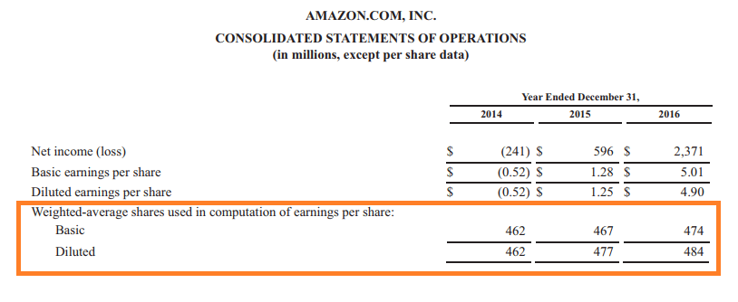

## Table of Contents

## What is a weighted average of outstanding shares?

A weighted average of outstanding shares is a way to figure out the average number of shares a company has over a certain time, like a year. It's important because it helps in calculating things like earnings per share, which investors use to see how well a company is doing. Instead of just taking the number of shares at the end of the period, this method considers changes in the number of shares throughout the period.

To find the weighted average, you look at how many shares were outstanding at different times and give more importance, or "weight," to the times when there were more shares. For example, if a company had 100 shares for the first half of the year and then added 50 more shares for the second half, the weighted average would be more than just the simple average of 150 shares. This approach gives a fairer picture of the company's share count over time.

## Why is the weighted average of outstanding shares important for investors?

The weighted average of outstanding shares is important for investors because it helps them understand how many shares a company really had over a period of time, like a year. This number is used to calculate important things like earnings per share (EPS). EPS tells investors how much money the company made for each share of stock. If the number of shares changes a lot during the year, using a weighted average gives a more accurate picture of EPS than just using the number of shares at the end of the year.

Knowing the weighted average of outstanding shares also helps investors compare companies fairly. If one company issues more shares halfway through the year and another doesn't, their EPS numbers could look very different at the end of the year. By using the weighted average, investors can see past these changes and make better decisions about which companies are performing well. This makes it easier to compare apples to apples when looking at different investments.

## How is the weighted average of outstanding shares calculated?

To calculate the weighted average of outstanding shares, you need to look at how many shares the company had at different times during the period you're interested in, like a year. Let's say you're looking at a year. You would break the year into smaller parts, like months or quarters, and see how many shares were outstanding at the start of each part. If the number of shares changes during a part, you would use the average number of shares for that part.

Next, you multiply the number of shares for each part by the length of that part. For example, if a company had 100 shares for the first six months and then 150 shares for the next six months, you would multiply 100 by 6 months and 150 by 6 months. Then, you add up these totals and divide by the total length of the period you're looking at. In this case, you would add 600 (100 shares x 6 months) and 900 (150 shares x 6 months) to get 1500, and then divide by 12 months to get a weighted average of 125 shares. This gives you a more accurate picture of the average number of shares over the whole year.

## What is the difference between basic and diluted weighted average shares?

Basic weighted average shares count only the actual shares that are out there and owned by people. It's a simple count of all the shares a company has given out and are in the hands of shareholders. When you calculate earnings per share using basic weighted average shares, you're looking at how much money the company made for each of these shares.

Diluted weighted average shares, on the other hand, include not just the shares that are already out there, but also any other things that could turn into shares in the future. This includes things like stock options, warrants, or convertible bonds that people could use to get more shares. When you use diluted weighted average shares to calculate earnings per share, you're looking at what would happen if all these potential shares actually became real shares. It gives you a lower earnings per share number because there would be more shares to divide the company's earnings among.

## Can you explain how stock splits and dividends affect the weighted average of outstanding shares?

Stock splits and dividends can change the number of shares a company has, which affects the weighted average of outstanding shares. A stock split happens when a company decides to split its shares into more pieces. For example, in a 2-for-1 split, each share turns into two shares. This means the total number of shares doubles, but the value of each share is cut in half. When calculating the weighted average, you need to account for this change from the date the split happens. If a split happens halfway through the year, you would use the new number of shares for the second half of the year in your calculation.

Dividends, especially stock dividends, also affect the weighted average of outstanding shares. A stock dividend is when a company gives shareholders more shares instead of cash. For example, a 10% stock dividend means shareholders get an extra share for every 10 shares they own. This increases the total number of shares. Like with stock splits, you need to adjust your calculation of the weighted average starting from the date the dividend is issued. If a company issues a stock dividend partway through the year, you would use the new, higher number of shares for the rest of the year in your weighted average calculation.

## How does the issuance of new shares impact the weighted average of outstanding shares?

When a company issues new shares, it increases the total number of shares that are out there. This change affects the weighted average of outstanding shares because you need to count these new shares from the moment they are issued. For example, if a company starts the year with 100 shares and then issues 50 more shares halfway through the year, you would use 100 shares for the first half of the year and 150 shares for the second half when calculating the weighted average.

This means the weighted average will be higher than if no new shares were issued. To figure out the new weighted average, you would multiply the number of shares by the length of time they were outstanding and then divide by the total time period. In our example, you would multiply 100 shares by 6 months and 150 shares by 6 months, add those together, and then divide by 12 months to get the new weighted average. This gives investors a more accurate picture of how many shares were really out there over the whole year.

## What role does the weighted average of outstanding shares play in earnings per share (EPS) calculations?

The weighted average of outstanding shares is really important when figuring out earnings per share (EPS). EPS tells investors how much money a company made for each share of stock. To find EPS, you take the company's total earnings and divide it by the number of shares. But since the number of shares can change over time, using the weighted average gives a better, more accurate number. It makes sure that times when there were more shares count more in the calculation, and times with fewer shares count less.

This matters a lot because investors use EPS to see how well a company is doing. If you just used the number of shares at the end of the year, you might get the wrong idea about the company's performance. For example, if a company issued a lot of new shares halfway through the year, using the weighted average would show that there were more shares for part of the year, which would give a more honest EPS number. This helps investors make smarter choices about where to put their money.

## How can changes in the weighted average of outstanding shares influence a company's market valuation?

Changes in the weighted average of outstanding shares can have a big impact on a company's market valuation. Market valuation is how much the whole company is worth, and it's often figured out by looking at the price of one share and then multiplying it by the total number of shares. If the weighted average of outstanding shares goes up because the company issues more shares, the market valuation can go up too, as long as the share price stays the same or goes up. But if the share price goes down because more shares are out there, the market valuation might not change much or could even go down.

This is important for investors because they want to know how much their piece of the company is worth. If the weighted average of outstanding shares changes a lot, it can make the company look more or less valuable. For example, if a company issues a lot of new shares to raise money, the weighted average goes up. This could make the market valuation higher if the money is used to grow the company and make it more profitable. But if investors think the new shares dilute their ownership too much, the share price might drop, and the market valuation could stay the same or fall.

## What are some common mistakes companies make when calculating the weighted average of outstanding shares?

One common mistake companies make when calculating the weighted average of outstanding shares is not accounting for changes in the number of shares throughout the period. For example, if a company issues new shares or has a stock split during the year, they need to use the new number of shares from the date of the change. If they just use the number of shares at the end of the year, their calculation will be wrong and might make their earnings per share look different than it really is.

Another mistake is not using the right time periods when figuring out the weighted average. Companies need to break the year into smaller parts, like months or quarters, and use the number of shares that were out there during each part. If they don't do this correctly, they might give too much or too little weight to certain times, which can mess up the whole calculation. Getting this right is important because investors use this number to understand how well the company is doing.

## How do treasury stock transactions affect the weighted average of outstanding shares?

When a company buys back its own shares, those shares become treasury stock. This means they are no longer considered outstanding, so they don't count when figuring out the weighted average of outstanding shares. If a company buys back shares during the year, you need to use the new, lower number of shares from the date of the buyback. For example, if a company starts the year with 100 shares and buys back 20 shares halfway through the year, you would use 100 shares for the first half and 80 shares for the second half when calculating the weighted average.

If a company decides to sell treasury stock back into the market, those shares become outstanding again. This means you need to count them in the weighted average from the date they are sold. So, if the same company that bought back 20 shares decides to sell 10 of them back later in the year, you would use 80 shares for the time before the sale and 90 shares for the time after. Keeping track of these changes is important to make sure the weighted average is accurate and reflects the real number of shares out there over the whole period.

## Can you discuss the impact of convertible securities on the weighted average of outstanding shares?

Convertible securities, like convertible bonds or stock options, can turn into regular shares if people decide to use them. This means they can change the number of shares a company has. When figuring out the weighted average of outstanding shares, companies have to think about these convertible securities. They need to guess if people will actually use them to get more shares. If a lot of people do use them, the weighted average will go up because there will be more shares out there. This is important because it changes how much money the company made for each share, which investors look at to see how well the company is doing.

For example, if a company has a bunch of convertible bonds that could turn into shares, they need to figure out how many of those bonds people might convert during the year. If they think a lot of people will convert their bonds, they'll use a higher number of shares for the time after the conversion happens when calculating the weighted average. This makes the weighted average go up, which can make the company's earnings per share look lower. It's important for companies to get this right because it helps investors understand the true value of their shares.

## How do advanced financial models incorporate the weighted average of outstanding shares for forecasting purposes?

Advanced financial models use the weighted average of outstanding shares to make better guesses about a company's future earnings per share (EPS). These models look at how the number of shares might change over time because of things like stock splits, new shares being issued, or people using convertible securities. By using the weighted average, the models can give a more accurate picture of what the company's EPS might be in the future. This helps investors make smarter choices about buying or selling the company's stock.

For example, if a model thinks a company will issue more shares next year, it will use a higher weighted average of outstanding shares for that year. This means the forecasted EPS will be lower because there will be more shares to divide the company's earnings among. By taking into account these changes, the model can help investors see how different decisions by the company might affect its stock price and overall value in the future.

## How do you calculate the weighted average of outstanding shares?

The weighted average of outstanding shares is a critical component in calculating metrics such as earnings per share (EPS), reflecting a company's performance accurately over a given reporting period. This method accounts for the fluctuations in the number of shares over time, which may occur due to various corporate actions such as issuing new shares or repurchasing existing ones.

To calculate the weighted average of outstanding shares, consider each portion of outstanding shares over the reporting period, multiplying each by the duration they were outstanding. The fundamental formula to use in this calculation is:

$$
\text{Weighted Average Shares} = \sum \left( \text{Shares}_i \times \frac{\text{Days Outstanding}_i}{\text{Total Days in Period}} \right)
$$

where $\text{Shares}_i$ represents the number of shares outstanding at a given time, $\text{Days Outstanding}_i$ is the number of days those shares were outstanding, and $\text{Total Days in Period}$ is the total number of days in the reporting period.

Here's a simplified Python example to illustrate the calculation:

```python
# List of tuples with (number_of_shares, days_outstanding)
share_data = [
    (5000, 120),  # 5000 shares outstanding for 120 days
    (7000, 80),   # 7000 shares outstanding for 80 days
    (6000, 165)   # 6000 shares outstanding for 165 days
]

total_days = 365  # Total days in the reporting period
weighted_sum = sum(shares * (days / total_days) for shares, days in share_data)
print(f"Weighted Average Shares Outstanding: {weighted_sum}")
```

In practice, the weighted average calculation ensures the EPS metric is unaffected by short-term variations in the share count. This offers a more stable view of the company's financial health, an essential requirement for accurate financial analysis and comparison across economic periods.

## What are the applications of weighted average shares in financial analysis?

Weighted average shares are a fundamental component in financial analysis for evaluating a company’s profitability and comparing it to its peers. Accurate calculation of earnings per share (EPS) is pivotal for investors and financial analysts, and the weighted average shares metric ensures that the EPS is not misrepresented due to temporary fluctuations in share count. 

EPS is calculated using the formula:

$$
\text{EPS} = \frac{\text{Net Income} - \text{Preferred Dividends}}{\text{Weighted Average Shares Outstanding}}
$$

This formula highlights the importance of using the weighted average shares outstanding, as it provides a realistic depiction of a company’s earnings over a specified period. If the share count changes significantly throughout the reporting period due to stock issuance, buybacks, or other corporate actions, failing to account for these changes can lead to skewed EPS figures. 

For example, if a company issues a large number of shares partway through the year, simply taking the number of shares at year-end would underestimate the EPS, as it would not reflect the lower number of shares that were outstanding during the earlier part of the period when some income was earned. By weighting the shares by the time they were outstanding, analysts can achieve a more accurate calculation:

```python
def calculate_weighted_average_shares(shares_periods):
    total_shares = 0
    total_time = 0
    for shares, time in shares_periods:
        total_shares += shares * time
        total_time += time
    return total_shares / total_time

shares_periods = [(1000, 6), (1200, 6)]  # example with shares and months outstanding
weighted_avg = calculate_weighted_average_shares(shares_periods)
print(f"Weighted Average Shares Outstanding: {weighted_avg}")
```

This code snippet demonstrates how to compute the weighted average shares outstanding when given different share periods, ensuring a precise EPS calculation. Such precision is invaluable as it aids investors in making informed decisions, especially when comparing a company’s financial performance with its competitors. 

By relying on the weighted average, analysts can strip away the noise of short-term share count changes and gain a clearer view of a company’s financial health. Consequently, this approach plays a crucial role in investment valuations, helping in forming a rational basis for buying, holding, or selling a stock, thereby enhancing strategic investment decisions.

## What are the special considerations and frequently asked questions?

Special situations such as stock splits, dividend payments, and stock buybacks necessitate adjustments in the calculation of weighted average shares. These adjustments are crucial for maintaining the accuracy of financial metrics like earnings per share (EPS).

**Stock Splits and Dividend Payments**: In the event of a stock split or a dividend payment that is distributed in the form of additional shares (stock dividends), the number of shares is adjusted to reflect these changes. For example, in a 2-for-1 stock split, the number of outstanding shares is doubled, and the value of each share is halved. To adjust the weighted average number of shares, one must multiply the shares by the split factor for periods prior to the split. This ensures that comparisons of EPS or other share-related metrics remain consistent over time.

**Stock Buybacks**: When a company repurchases its shares, the total number of outstanding shares decreases. This action requires the removal of these shares from the average calculation starting from the buyback date. For instance, if a company had 1 million shares outstanding and repurchased 100,000 on July 1, the average should be adjusted for the reduction in share count from that date forward.

**Basic vs. Diluted Shares**: Basic shares only account for the outstanding shares at a given time, whereas diluted shares include potential shares that could be created through options, convertible securities, and other financial instruments. When calculating the diluted EPS, it is important to consider the impact of these potential shares to provide a realistic picture of shareholder value. The formula for diluted EPS is:

$$
\text{Diluted EPS} = \frac{\text{Net Income} - \text{Preferred Dividends}}{\text{Weighted Average Shares + Convertible Securities, Options, and Warrants}}
$$

Understanding the differences between these calculations helps to provide a comprehensive view of a company’s financial standing by ensuring that all assets and liabilities are appropriately accounted for. Accurate adjustments for these events are essential for making well-informed investment decisions, reflecting the true performance of the company over time.

## References & Further Reading

[1]: ["Financial Modeling and Valuation: A Practical Guide to Investment Banking and Private Equity"](https://onlinelibrary.wiley.com/doi/book/10.1002/9781119808923) by Paul Pignataro

[2]: ["Valuation: Measuring and Managing the Value of Companies"](https://www.amazon.com/Valuation-Measuring-Managing-Companies-Finance/dp/1119610885) by McKinsey & Company Inc.

[3]: Poterba, J.M., & Summers, L.H. (1984). ["The Economic Effects of Dividend Taxation."](https://www.nber.org/papers/w1353) AER: American Economic Review.

[4]: ["Algorithmic Trading: Winning Strategies and Their Rationale"](https://www.wiley.com/en-us/Algorithmic+Trading%3A+Winning+Strategies+and+Their+Rationale-p-9781118460146) by Ernest P. Chan

[5]: Higgins, R.C. (1998). ["Analysis for Financial Management."](https://openlibrary.org/books/OL671289M/Analysis_for_financial_management) McGraw-Hill/Irwin.