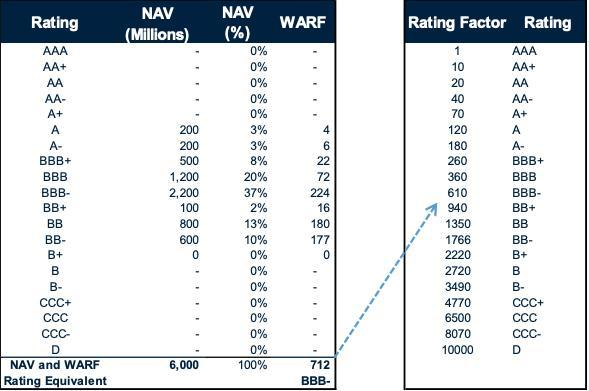

In today's rapidly evolving financial landscape, understanding the nuances of credit risk management is essential for investors and financial analysts alike. The Weighted Average Rating Factor (WARF) has emerged as a pivotal metric in evaluating the credit quality of investment portfolios. By consolidating individual credit ratings into a singular measure, WARF provides a clear view of the portfolio's overall credit risk, which is crucial in navigating the complexities of modern financial markets.

WARF comprises an aggregation of numerical rating factors assigned to the credit ratings of individual assets within a portfolio. This aggregation yields a single, comprehensive metric that reflects the credit quality of the entire portfolio, simplifying the risk assessment process. Investors and analysts employ this tool extensively, as it plays a critical role in gauging the risk associated with complex financial instruments, such as collateralized debt obligations (CDOs) and other structured finance products.



In tandem with the advancement of fintech, algorithmic trading has surfaced as a formidable force in financial markets. The intersection of algorithmic trading and credit risk metrics, like WARF, represents a significant advancement. Integrating WARF into trading algorithms enhances automated decision-making, allowing algorithms to dynamically adjust portfolio compositions, aligning with specified risk and return objectives.

This article explores the applications, benefits, and implications of incorporating WARF within algorithmic trading systems, underscoring its importance in modern finance. As financial markets continue to advance, the fusion of traditional financial metrics, such as WARF, with cutting-edge trading technology is poised to shape the future of investment risk management profoundly.

## Table of Contents

## Understanding Weighted Average Rating Factor (WARF)

The Weighted Average Rating Factor (WARF) is a crucial metric utilized primarily by credit rating agencies to evaluate the credit quality of a portfolio. It simplifies the complex task of assessing credit risk across diverse financial instruments by consolidating various credit ratings into a single measure. This measure is particularly valuable for evaluating portfolios containing a wide array of assets, including complex financial instruments like collateralized debt obligations (CDOs).

To comprehend how WARF functions, it is essential to understand how numerical rating factors are assigned to the credit ratings of individual assets within a portfolio. Credit rating agencies such as Moody’s, Fitch, and Standard & Poor’s assign a numerical score to different credit ratings. These scores reflect the perceived risk associated with each rating category, with higher scores typically indicating greater risk.

The process of calculating the WARF involves a weighted average calculation, where the individual rating factors are weighted by the notional balance of each asset. The formula for WARF is as follows:

$$
\text{WARF} = \frac{\sum (\text{Rating Factor}_i \times \text{Notional Balance}_i)}{\sum \text{Notional Balance}_i}
$$

In this formula:
- $\text{Rating Factor}_i$ represents the numerical rating factor assigned to the $i$th asset.
- $\text{Notional Balance}_i$ is the notional balance of the $i$th asset.

The WARF offers a streamlined method for financial analysts and investors to gauge the overall credit risk of a portfolio. By aggregating individual ratings into a unified metric, WARF facilitates clearer risk assessments, aiding risk management and compliance activities. For financial professionals involved in designing investment strategies, understanding and applying WARF can enhance both the evaluation of potential investments and the ongoing management of existing portfolios.

In summary, WARF serves as an indispensable tool for financial professionals, simplifying the evaluation of credit risk in portfolios with multiple assets. Its ability to integrate diverse credit ratings into a cohesive metric makes it a valuable asset for managing credit risks, particularly in portfolios laden with complex financial instruments.

## Calculation of WARF

The calculation of the Weighted Average Rating Factor (WARF) is a structured process that relies on credit ratings assigned by leading agencies such as Fitch, Moody’s, and Standard & Poor’s. The following steps outline this process:

1. **Assign Numerical Rating Factors**: Each credit rating assigned to the portfolio's assets by agencies is first translated into a numerical rating factor. This conversion is necessary because credit ratings, often expressed as letters (e.g., AAA, BBB, etc.), need to be quantified into a consistent numerical scale for computational purposes. Different rating agencies use their scales, so ensuring standardization within the portfolio context is crucial.

2. **Multiply Notional Balance by Rating Factor**: For each asset, the notional balance—a representation of its face or par value—is multiplied by its corresponding numerical rating factor. This step weights the impact of each asset's credit quality by its size within the portfolio, effectively integrating both the magnitude and the perceived risk of the asset.

3. **Sum and Calculate the WARF**: The products from the previous step are summed over the entire portfolio. The resulting total is then divided by the total notional balance of the portfolio, ensuring that the final figure reflects an average that accounts for the entire asset base. Mathematically, the WARF can be represented as:
$$
   \text{WARF} = \frac{\sum_{i=1}^{n} (\text{Notional Balance}_i \times \text{Rating Factor}_i)}{\sum_{i=1}^{n} \text{Notional Balance}_i}

$$

   where $n$ is the number of assets in the portfolio.

4. **Interpret the WARF**: The resulting WARF provides a summary measure of the portfolio's credit quality, with a lower WARF indicating higher credit quality and reduced credit risk, while a higher WARF suggests increased credit risk. 

This quantitative metric serves as a crucial element for investors and financial analysts, allowing them to gauge the risk level inherent in complex investment portfolios efficiently.

## Applications of WARF in Structured Finance

Weighted Average Rating Factor (WARF) plays a critical role in structured finance, particularly in the management and evaluation of Collateralized Loan Obligations (CLOs). These financial instruments involve pooling various loans and slicing them into tranches with distinct risk and return profiles. The WARF metric assists in understanding the creditworthiness of these tranches by providing a single, aggregated measure of credit quality.

WARF is instrumental in tranche structuring, which is the process of dividing the cash flows of the underlying loan pool into various segments. Each tranche is designed to cater to different investor risk appetites and return expectations. By using WARF, financial professionals can evaluate which specific loans contribute most to the overall credit risk and make informed decisions in structuring the tranches. For instance, lower tranches, which are typically riskier, might see an aggregation of assets with higher individual risk factors, indicated by a higher WARF value.

Credit enhancement, a mechanism used to improve the credit profile of a security, is another area where WARF is applied. This enhancement can occur through subordination (using lower-quality tranches to absorb initial losses) or through over-collateralization (where the value of the collateral exceeds the value of the issued securities). By maintaining a portfolio's WARF below a certain threshold, managers can ensure that the required credit enhancement levels are met, thus safeguarding the security's credit rating.

In risk assessment, WARF serves as a key tool employed by credit rating agencies. These agencies rely on WARF to determine the credit risk associated with structured finance portfolios and to report on their credit quality. A lower WARF reflects a portfolio with high credit quality and lower perceived risk, which can positively influence a product's credit rating. This rating is pivotal not only for maintaining investor confidence but also for regulatory compliance, as many financial regulations incorporate credit ratings into their frameworks.

The significance of WARF in structured finance underscores its influence on investment decisions. Investors use WARF metrics to gauge the credit quality and risk levels of potential investments within structured finance products, aiding in the identification of opportunities that align with their risk-return objectives. Thus, WARF serves as a foundational metric in structured finance, facilitating enhanced risk management, regulatory compliance, and informed investment decisions.

## Integrating WARF in Algorithmic Trading

Integrating WARF into [algorithmic trading](/wiki/algorithmic-trading) systems signifies a notable advancement in the automation of financial decision-making. As the financial technology sector grows, the ability of algorithms to interact with complex credit risk metrics like WARF improves the precision and efficiency of investment strategies. These algorithms can systematically adjust the composition of portfolios to maintain a specific WARF, aligning these adjustments with predefined risk and return objectives. 

For instance, an algorithm can be designed to continuously monitor the WARF of a portfolio and make real-time decisions about buying or selling assets to ensure the portfolio remains within target risk parameters. This dynamic adjustment is crucial as market conditions and asset ratings fluctuate. By doing so, the algorithm helps minimize exposure to credit risk while potentially maximizing returns. 

Machine learning models play a significant role in this integration by employing WARF for predictive analytics. These models analyze vast amounts of historical data, identify patterns, and make informed predictions about future asset behaviors. By incorporating WARF into these models, algorithms gain the capability to optimize portfolios not only based on expected returns but also by assessing the underlying credit quality of assets. This dual focus ensures a balance between achieving high returns and maintaining a robust risk management posture. 

In Python, this can be achieved through libraries such as NumPy and Pandas for data manipulation, combined with [machine learning](/wiki/machine-learning) frameworks like scikit-learn or TensorFlow. For example, using Pandas, one can calculate WARF dynamically by assigning numerical values to credit ratings and adjusting portfolio holdings accordingly:

```python
import pandas as pd

# Sample data where 'asset' is the portfolio asset, 'credit_rating' is its rating, 
# 'notional_balance' is its current balance, and 'rating_factor' is predefined factor for the rating
data = {
    'asset': ['Asset1', 'Asset2', 'Asset3'],
    'credit_rating': ['AAA', 'BB', 'BBB'],
    'notional_balance': [100, 200, 150],
    'rating_factor': [1, 5, 3],
}

# Create a DataFrame
df = pd.DataFrame(data)

# Calculate WARF
df['weighted_factor'] = df['notional_balance'] * df['rating_factor']
warf = df['weighted_factor'].sum() / df['notional_balance'].sum()

# Adjust portfolio if necessary based on WARF target
WARF_target = 2.5

if warf > WARF_target:
    print("Consider adjusting portfolio to lower WARF.")
else:
    print("WARF within acceptable range.")
```

This code snippet demonstrates a basic framework where a portfolio's WARF is calculated and decisions are flagged for potential rebalancing based on a target WARF. As fintech continues to evolve, the adoption of such techniques will be integral in advancing risk-adjusted investment strategies.

## Challenges and Limitations

The Weighted Average Rating Factor (WARF) is an invaluable tool in assessing the credit risk of investment portfolios. However, its efficacy is inherently tied to the precision of the credit ratings provided by agencies such as Moody's, Fitch, and Standard & Poor's. A fundamental challenge with WARF is its dependence on these ratings, which may not always reflect the most current or accurate financial conditions of the assets in question. This scenario poses a risk of misrepresenting the actual credit quality due to potential delays or errors in the ratings.

Additionally, WARF presents a static snapshot of a portfolio's credit risk profile, which might not account for dynamic changes in market conditions or shifts in the credit quality of individual assets. Market [volatility](/wiki/volatility-trading-strategies) can rapidly alter asset values and associated risks, making it crucial for financial analysts to complement WARF with more dynamic assessments. 

Moreover, while WARF offers simplicity by providing a consolidated metric for credit risk analysis, it may lack granularity, potentially overlooking specific details at the asset level. This can obscure nuances in credit risk that are relevant for accurate appraisals. For instance, the impact of sector-specific risks or geographic factors might not be captured fully in the aggregated WARF score.

These limitations necessitate a careful consideration of WARF within a broader risk management framework. Financial professionals may integrate other risk metrics or conduct further qualitative assessments to enhance the robustness of their credit analysis and make more informed investment decisions.

## Conclusion

Weighted Average Rating Factor (WARF) remains a crucial metric for assessing and managing credit risk within investment portfolios. By distilling the complexities of numerous individual credit ratings into a singular, comprehensive measure, WARF allows investors and analysts to evaluate the credit quality of an entire portfolio with relative ease. This simplification is instrumental in guiding investment strategies and ensuring that risk management protocols are effectively implemented.

As the financial landscape continues to embrace technological advancements, particularly in algorithmic trading, the integration of traditional financial metrics like WARF has become increasingly significant. Incorporating WARF into algorithmic trading strategies optimizes risk assessments. Algorithms leveraging WARF can automatically adjust portfolios to meet specified risk levels, maintaining a delicate balance between risk appetite and potential returns. This dynamic adjustment is facilitated by machine learning models which incorporate WARF data for predictive analytics, further refining portfolio management by forecasting likely credit risk scenarios.

Moreover, as markets evolve, the fusion of WARF with advanced trading technologies is set to become even more pronounced. This integration heralds a new era where traditional analytical tools are enhanced by cutting-edge technology, shaping the future of investment risk management. It enables a more nuanced understanding of risk, helping financial professionals respond swiftly and more accurately to market changes. As such, WARF not only remains relevant but is likely to assume an increasingly pivotal role in the ongoing evolution of financial risk management strategies.

## References & Further Reading

[1]: Moody's Investors Service. (n.d.). ["Moody's Structured Finance Rating Methodology."](https://ratings.moodys.com/api/rmc-documents/385908)

[2]: Fitch Ratings. (n.d.). ["Fitch's Credit Ratings and WARF Calculation."](https://hindenburgresearch.com/carvana/)

[3]: Standard & Poor's. (2008). ["Understanding Standard & Poor's Rating Definitions."](https://www.kingstonmass.org/vertical/sites/%7B14403534-636B-4C7F-A416-D66D8321CF44%7D/uploads/Credit_Ratings_Explained_SP.pdf)

[4]: Goodman, L., Fabozzi, F.J., Lucas, D., & Zimmerman, T. (2008). ["Collateralized Debt Obligations: Structures and Analysis."](https://onlinelibrary.wiley.com/doi/book/10.1002/9781119201311) Wiley Finance.

[5]: Marcos, R. (2015). ["Structured Finance & Collateralized Debt Obligations."](https://onlinelibrary.wiley.com/doi/book/10.1002/9781118268230) Wiley Finance.

[6]: Chan, E.P. (2009). ["Quantitative Trading: How to Build Your Own Algorithmic Trading Business."](https://github.com/ftvision/quant_trading_echan_book) Wiley Trading.

[7]: Lopez de Prado, M. (2018). ["Advances in Financial Machine Learning."](https://www.amazon.com/Advances-Financial-Machine-Learning-Marcos/dp/1119482089) Wiley.

[8]: Jansen, S. (2020). ["Machine Learning for Algorithmic Trading."](https://github.com/stefan-jansen/machine-learning-for-trading) Packt Publishing.