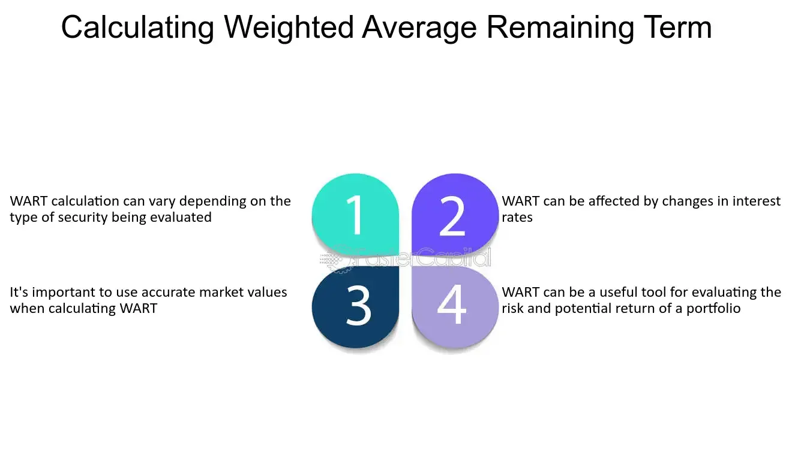

## Table of Contents

## What is the Weighted Average Remaining Term (WART)?

The Weighted Average Remaining Term (WART) is a financial measure used to understand how long, on average, it will take for the remaining principal of a loan or a portfolio of loans to be paid off. It takes into account the different sizes of loans and their remaining terms, giving more weight to larger loans. This helps in assessing the risk and planning the cash flow for investors or financial institutions.

For example, if a portfolio has some big loans that will be paid off soon and some smaller loans that will take longer, the WART will show a shorter average term because the big loans have more influence. This is useful for banks and investors because it helps them know when they can expect to get their money back and how to manage their investments better.

## How is the Weighted Average Remaining Term calculated?

To calculate the Weighted Average Remaining Term (WART), you need to know the remaining principal balance and the remaining term for each loan in a portfolio. First, you multiply the remaining principal balance of each loan by its remaining term. This gives you the weighted term for each loan. Then, you add up all these weighted terms to get a total.

Next, you add up the remaining principal balances of all the loans to get the total principal. Finally, you divide the total of the weighted terms by the total principal. This gives you the WART, which tells you the average time left for the loans to be paid off, considering the size of each loan. It's like finding a special average that pays more attention to bigger loans.

## Why is the Weighted Average Remaining Term important in finance?

The Weighted Average Remaining Term (WART) is really important in finance because it helps people who lend money, like banks and investors, figure out when they will get their money back. It's like a special average that looks at all the loans they have given out. Some loans might be big and due to be paid back soon, while others might be smaller but take longer to pay back. By using WART, lenders can see the overall picture of when they can expect their money to come back, which helps them plan better.

This measure is also useful for managing risk. If the WART is short, it means most of the money will come back soon, which might be good for some investors who want quick returns. But if the WART is long, it means they have to wait longer for their money, which might be riskier if things change in the future. Knowing the WART helps lenders and investors make smart choices about which loans to give out and how to balance their money to keep things safe and profitable.

## Can you provide an example of how WART is used in a mortgage-backed security?

Imagine a bank that has a bunch of home loans, and it wants to sell these loans to investors by putting them into something called a mortgage-backed security (MBS). The bank uses the Weighted Average Remaining Term (WART) to tell investors how long, on average, it will take for all these home loans to be paid off. If the WART is short, it means the homeowners will pay back their loans pretty soon, which might be good for investors who want their money back quickly. But if the WART is long, it means the homeowners will take longer to pay back, and investors will have to wait longer for their money.

Let's say there are 100 home loans in this MBS. Some of these loans are big and will be paid off in 5 years, while others are smaller and will take 30 years to pay off. The bank calculates the WART by giving more importance to the bigger loans. If the WART comes out to be 15 years, it tells the investors that, on average, they can expect to get their money back in about 15 years. This helps the investors decide if this MBS is a good fit for their investment plans, considering how long they are willing to wait for their returns.

## What are the key components needed to calculate WART?

To calculate the Weighted Average Remaining Term (WART), you need to know two main things about each loan in a group: the remaining principal balance and the remaining term. The remaining principal balance is how much money is still owed on the loan. The remaining term is how many more months or years it will take to pay off the loan completely.

First, you multiply the remaining principal balance of each loan by its remaining term. This gives you a number that shows how much each loan affects the overall average, with bigger loans having a bigger impact. Then, you add up all these numbers to get a total. After that, you add up all the remaining principal balances to find the total amount of money in the group of loans. Finally, you divide the total of the weighted terms by the total principal balance. This gives you the WART, which tells you the average time left for all the loans to be paid off, considering the size of each loan.

## How does WART differ from the Weighted Average Life (WAL)?

The Weighted Average Remaining Term (WART) and the Weighted Average Life (WAL) are both ways to figure out how long it will take for loans or bonds to be paid off, but they look at things a bit differently. WART focuses on the time left until the loans are fully paid back. It uses the remaining principal balance and the remaining term of each loan to find out when, on average, all the money will be returned. This helps banks and investors know when they can expect their money back from the loans they have given out.

On the other hand, Weighted Average Life (WAL) looks at the whole life of the loans or bonds, not just what's left. It takes into account the time from when the loan was first given out until it's fully paid off. WAL includes all the payments made over time, so it gives a bigger picture of the loan's life. This can be useful for understanding the overall duration of an investment, which is important for planning and managing long-term financial strategies.

## What impact does prepayment have on the Weighted Average Remaining Term?

Prepayment means paying off a loan earlier than planned. When people pay off their loans early, it changes the Weighted Average Remaining Term (WART). If lots of people prepay their loans, the WART will get shorter because the money comes back to the bank or investor sooner. This is good for them because they get their money back faster, but it can make it harder to predict when the money will come back.

Prepayments can happen for many reasons, like selling a house or getting a better loan deal. When calculating WART, banks and investors have to guess how many people might prepay their loans. If they guess wrong, the WART they calculated might not be right. This can affect how they plan their money and investments. So, prepayments add a bit of uncertainty to the WART, making it important for banks and investors to keep an eye on prepayment rates.

## How does WART affect the pricing of securities?

The Weighted Average Remaining Term (WART) can change how much investors are willing to pay for securities like mortgage-backed securities (MBS). If the WART is short, it means the money will come back to the investors soon. This can make the security more attractive to people who want their money back quickly, so they might be willing to pay more for it. But if the WART is long, it means investors have to wait longer to get their money back, which might make the security less attractive to them. They might not want to pay as much because they have to wait longer.

Because WART affects how quickly investors get their money back, it also changes how much risk they see in the security. If the WART is short, it might seem less risky because the money is coming back soon. But a long WART can seem riskier because a lot can change over a long time, like interest rates or the economy. So, when figuring out the price of a security, investors look at the WART to decide if it's worth the wait and the risk.

## What are common misconceptions about the Weighted Average Remaining Term?

One common misconception about the Weighted Average Remaining Term (WART) is that it's the same as the average term of all loans in a portfolio. But WART is different because it gives more importance to bigger loans. This means if there's one huge loan that will be paid off soon, it can make the WART shorter even if most other loans will take longer to pay off. So, WART isn't just a simple average; it's a special average that pays more attention to bigger loans.

Another misconception is that WART can predict exactly when all the money will come back. WART is more like a guess based on what's known now. Things like people paying off their loans early or changes in the economy can change how long it takes for the money to come back. So, WART helps give a good idea, but it's not a perfect prediction. It's important for banks and investors to remember that and keep an eye on other factors too.

## How can changes in interest rates influence WART?

Changes in interest rates can affect the Weighted Average Remaining Term (WART) because they can change how quickly people pay off their loans. If interest rates go down, people might decide to pay off their current loans early and get new loans with the lower rates. This is called refinancing. When lots of people do this, it can make the WART shorter because the money comes back to the bank or investor sooner than expected.

On the other hand, if interest rates go up, people might not want to pay off their loans early because they won't be able to get a better deal. This means they'll keep their current loans longer, making the WART longer. So, banks and investors have to keep an eye on interest rates because they can change how long it takes for the loans to be paid off, which affects the WART.

## What advanced techniques can be used to model WART in complex financial instruments?

To model the Weighted Average Remaining Term (WART) in complex financial instruments, one advanced technique is to use Monte Carlo simulations. This method involves running lots of different scenarios to see how things might turn out. For example, it can look at what happens if lots of people pay off their loans early, or if interest rates change a lot. By running these simulations, banks and investors can get a better idea of how the WART might change over time, which helps them make smarter decisions about their investments.

Another technique is to use prepayment models that take into account many different factors that can affect when people pay off their loans. These models can look at things like how much people's incomes change, how house prices go up or down, and even how the economy is doing. By using these detailed models, banks and investors can make better guesses about the WART, which helps them plan for the future and manage their risks better.

## How do regulatory changes impact the calculation and reporting of WART?

Regulatory changes can have a big impact on how banks and investors calculate and report the Weighted Average Remaining Term (WART). When new rules come out, they might say that banks have to be more careful about how they guess when people will pay back their loans. This means they might have to use more detailed ways to figure out the WART, like using special models that look at a lot of different things. If the rules change, banks might have to change how they do their calculations to make sure they are following the new rules correctly.

These changes can also affect how banks and investors tell people about the WART. New rules might say that they have to show the WART in a certain way or give more information about how they calculated it. This is to make sure that everyone understands how long it might take to get their money back. So, when the rules change, banks and investors have to keep up with the new ways of doing things to stay in line with the law and help people understand their investments better.

## What is Understanding Weighted Average Term Finance?

Weighted Average Remaining Term (WART) is a critical financial metric in assessing the maturity profile of a portfolio's assets. WART is often employed by investors and financial analysts to understand the average time remaining until the maturity of a set of financial instruments within a portfolio. This metric plays a vital role in determining the portfolio's exposure to interest rate risks, particularly in fixed-income securities.

The calculation of WART involves weighting each asset in the portfolio by its remaining term and outstanding principal. Mathematically, WART can be expressed as:

$$

\text{WART} = \frac{\sum_{i=1}^{n} \left( \text{Term}_i \times \text{Outstanding Principal}_i \right)}{\sum_{i=1}^{n} \text{Outstanding Principal}_i}
$$

Where:
- $\text{Term}_i$ is the remaining time to maturity for asset $i$.
- $\text{Outstanding Principal}_i$ is the remaining principal balance of asset $i$.
- $n$ is the total number of assets in the portfolio.

Understanding the average time to maturity is crucial for managing [interest rate](/wiki/interest-rate-trading-strategies) risks. Fixed-income securities, such as bonds or mortgage-backed securities, are sensitive to changes in interest rates. A higher WART indicates a longer duration of exposure to potential interest rate fluctuations, thereby increasing the interest rate risk. Conversely, a lower WART suggests a shorter duration and potentially lower risk, making WART a valuable tool in risk management strategies.

WART is often compared with other metrics like the Weighted Average Loan Age (WALA), which measures the average age of loans within a portfolio. While WALA provides insights into the amortization progress of loans, WART focuses on the time dimension of remaining financial obligations, offering complementary perspectives in portfolio assessment.

In the context of asset-backed securities, WART is particularly significant. These securities are composed of pools of loans, and understanding their maturity profile helps investors gauge the timing of cash flows and potential returns. Investors rely on WART to make informed decisions about holding, buying, or selling these securities, aligning their investment strategies with their risk appetite and market expectations.

WART, therefore, serves as a foundational metric in financial analysis, enabling market participants to better navigate the complexities of interest rate dynamics and enhance their asset allocation decisions.

## How does the Weighted Average Remaining Term work?

The Weighted Average Remaining Term (WART) is a crucial metric in finance, particularly for understanding the maturity profile of a portfolio's assets. This metric helps investors and traders gauge the average time until the maturities of assets weighted by their respective proportions in the portfolio. Understanding how WART is calculated, utilized, and influenced by various portfolio characteristics is essential for effective financial decision-making and risk management.

### Calculating WART

The WART of a portfolio can be calculated using the formula:

$$

\text{WART} = \frac{\sum_{i=1}^{n} (w_i \times t_i)}{\sum_{i=1}^{n} w_i} 
$$

where $w_i$ represents the market value or principal amount of asset $i$, $t_i$ is the time remaining to maturity (in years) for asset $i$, and $n$ is the total number of assets in the portfolio.

### Steps to Determine the Weighted Average of Asset Maturities

1. **Identify Each Asset's Maturity**: Determine the time remaining to maturity for each asset within the portfolio.
2. **Calculate the Weight of Each Asset**: Ascertain the weighting of each asset, usually based on its value in proportion to the total portfolio value.
3. **Compute Each Asset's Contribution to WART**: Multiply the weight of each asset by its remaining term to maturity.
4. **Aggregate Asset Contributions**: Sum these weighted maturities to calculate the WART for the portfolio.

### Impact of Portfolio Composition and Weighting

The outcomes of WART calculations are affected significantly by the composition and weighting of assets in a portfolio. High-value or long-term assets will disproportionately influence the WART, hence understanding the distribution of asset values and their maturities is critical for accurate risk assessment and strategy formulation.

### Practical Applications in Trading and Risk Assessment

WART is a valuable tool for assessing interest rate risk, as portfolios with longer weighted maturities are generally more sensitive to interest rate changes. Traders can adjust portfolios to manage risk by targeting specific WART values that align with their risk tolerance and market expectations. Additionally, WART allows for efficient allocation of assets, thereby optimizing the timing of cash flows and reinvestment strategies.

### WART in Securities Analysis: Example of MBS

In Mortgage-Backed Securities (MBS), WART helps investors understand the remaining term of the underlying mortgages in the securities pool. This is particularly important given MBS are subject to prepayment risks, where homeowners refinance or pay off their loans early. By using WART, traders can gauge the average time before these payments are expected, thus better managing the timing and predictability of cash flows.

In summary, WART is a fundamental metric for portfolio analysis, enabling traders to make informed decisions by understanding the time dynamics of asset maturities. Using WART calculations, traders can evaluate risk, enhance decision-making frameworks, and strategically maneuver portfolios to optimize returns.

## What are the challenges and considerations?

Implementing the Weighted Average Remaining Term (WART) in trading algorithms presents various challenges that require careful attention to ensure accuracy and efficiency.

One of the primary challenges is the impact of data quality and noise on WART accuracy. Inaccurate or incomplete data can significantly skew the calculations, leading to faulty assessments of the average time to maturity of portfolio assets. To mitigate this risk, traders must ensure that they are sourcing high-quality, accurate, and comprehensive data. Noise reduction techniques, such as data smoothing or filtering, can be employed to enhance data reliability.

Determining appropriate weights for calculating WART is another challenge. The formula for WART is expressed as:

$$
\text{WART} = \frac{\sum (w_i \times t_i)}{\sum w_i}
$$

where $w_i$ is the weight of each asset, and $t_i$ is the remaining term of each asset. Assigning weights involves determining the relative importance of various factors, which can be complex, depending on the portfolio composition. Techniques such as optimization algorithms or machine learning models can aid in dynamically adjusting these weights to better reflect market conditions and investment goals.

Balancing the need for real-time data with computational efficiency is crucial in [algorithmic trading](/wiki/algorithmic-trading). Rapid calculation and integration of WART into trading strategies are essential to capitalize on fleeting market opportunities. However, real-time processing can be computationally intensive, potentially leading to delays. Efficient coding practices, parallel processing, and the use of cloud-based computing infrastructure can enhance the speed and efficiency of calculations.

Regulatory and ethical considerations must also be taken into account when implementing WART in trading algorithms. Compliance with financial regulations, such as the European Union's MiFID II or the U.S. Securities and Exchange Commission rules, is mandatory. Algorithms must be transparent and auditable to meet legal standards. Ethical considerations, such as ensuring fair trading practices and avoiding market manipulation, must guide the implementation of WART-based strategies. This may involve setting up oversight mechanisms and conducting regular reviews of algorithmic operations.

Overall, while WART is a powerful tool for assessing portfolio maturity and interest rate risk, its successful application in algorithmic trading requires overcoming these challenges through robust data handling, dynamic weight determination, efficient computation, and adherence to regulatory and ethical standards.

## References & Further Reading

1. **Books and Academic Texts:**
   - *Algorithmic Trading and DMA: An Introduction to Direct Access Trading Strategies* by Barry Johnson is a fundamental book that provides a deep dive into algorithmic trading strategies, including the technical aspects that may aid in understanding concepts like WART.
   - *The Handbook of Fixed Income Securities* by Frank J. Fabozzi offers comprehensive coverage of fixed-income markets, including topics on maturity and average term calculations, which are essential for understanding WART.
   - *Understanding Machine Learning: From Theory to Algorithms* by Shai Shalev-Shwartz and Shai Ben-David provides insights into how machine learning can be integrated with financial strategies and possibly with metrics like WART for enhanced decision-making.

2. **Scholarly Articles and Journals:**
   - Articles from journals such as the *Journal of Finance* and *Journal of Financial Economics* often contain research on the application of weighted average metrics in finance and trading algorithms.
   - "Interest Rate Models: An Infinite Dimensional Stochastic Analysis Perspective" by René Carmona and Michael Ludkovski discusses interest rate models which are crucial in understanding the implications of WART in financial instruments.

3. **Online Resources and Publications:**
   - Websites like Investopedia and Financial Times offer articles explaining the concepts of weighted averages and their application in trading and risk assessment.
   - The CFA Institute provides resources and publications that cover the technical aspects of portfolio management, including metrics like WART.

4. **Conferences and Workshops:**
   - Attending industry conferences such as the Quantitative Finance Conference or the Algorithmic Trading Conference can provide practical insights and networking opportunities with professionals using WART in real-world trading scenarios.

5. **Technical and Open Source Code Repositories:**
   - Platforms like GitHub have repositories and projects related to algorithmic trading that may include scripts or tools for calculating WART. Exploring these can provide practical examples and applications.
   - A Python snippet for calculating a simple weighted average might look like this:

     ```python
     def calculate_wart(maturities, weights):
         if len(maturities) != len(weights):
             raise ValueError("Maturities and weights must be the same length")
         return sum(m * w for m, w in zip(maturities, weights)) / sum(weights)

     maturities = [5, 10, 15]  # Example maturities in years
     weights = [0.2, 0.3, 0.5]  # Respective weights
     wart = calculate_wart(maturities, weights)
     print(f"The Weighted Average Remaining Term is: {wart}")
     ```

6. **Exploration of AI and Machine Learning:**
   - *Deep Learning for Finance: A Guide to Modern Data-Driven Strategies* by Antoniya Georgieva and Jakob G. Andersen discusses how AI and machine learning technologies can impact financial strategies involving metrics like WART.
   - Online courses from platforms like Coursera or edX often include modules that discuss AI in finance, potentially covering advanced applications linked to WART.

