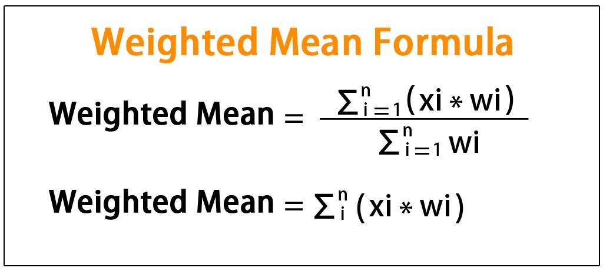

Algorithmic trading, commonly known as algo trading, is an essential technique in modern financial markets, leveraging computer algorithms to execute the buying and selling of financial instruments. By automating trading processes, algorithmic trading enhances efficiency through the application of predefined rules. A critical component of this method is the utilization of weighted mechanisms, which prioritize certain inputs in the trading model over others. These weights influence trading decisions by assessing the importance and relevance of various market indicators and datasets.

In algorithmic trading, weights can be assigned to inputs such as market indicators, historical price data, or economic events. By adjusting these weights, traders can emphasize certain factors they believe to be more critical to their strategy, aiming to optimize trading outcomes. For example, a trader may assign higher weights to longer-term trends in trend-following strategies or emphasize trade volume in volume-weighted average price (VWAP) strategies.



Understanding and appropriately implementing weight in algorithmic trading can significantly enhance the precision and efficiency of trading strategies. When applied effectively, weights allow trading algorithms to adapt to evolving market conditions, ensuring that strategies remain robust and effective. Proper weight application involves rigorous statistical analysis and backtesting to align with trading objectives and can include dynamic adjustment for responsiveness to market changes.

This article examines the definition and mechanisms of weighted algorithmic trading to provide a focused view on the impact of weights on trading strategies. A thorough understanding of the importance of weights allows traders to refine their strategies, offering a competitive edge in dynamic trading environments.

## Table of Contents

## Understanding Weights in Algorithmic Trading

Weights in algorithmic trading are essential components that significantly influence the decision-making process of trading models. These values are assigned to various variables within a trading model and directly affect buy or sell decisions. In practice, weights are used to prioritize certain factors over others based on their perceived importance. For instance, a model may place higher weights on market indicators that have historically provided accurate predictions of price movements or on historical performance data that align with the trading strategy's objectives.

A correct application of weights necessitates comprehensive statistical analysis and rigorous backtesting. Statistical analysis helps determine the influence and significance of various indicators, enabling traders to assign appropriate weights based on empirical data. Backtesting, on the other hand, involves testing the trading model against historical data to validate its performance. This process ensures that the trading model aligns with the intended trading goals and performs well under various market conditions.

Dynamic weight adjustment is another critical aspect. Markets are inherently volatile and can be influenced by numerous unpredictable factors. Therefore, having a mechanism that allows for the weights to be adjusted dynamically helps the trading model to adapt to changing market conditions. This adaptability enhances the model's responsiveness and reliability, ensuring it remains effective even as market dynamics evolve.

Mathematically, weights can be represented in a formulaic model. For example, in a linear model where multiple variables $x_1, x_2, \ldots, x_n$ influence a decision function $f(x)$, weights $w_1, w_2, \ldots, w_n$ can be assigned such that the decision function is represented as:

$$
f(x) = w_1x_1 + w_2x_2 + \ldots + w_nx_n
$$

Here, the values of $w_i$ determine the influence of each corresponding variable $x_i$ on the decision function. The sum of these weighted variables provides the basis on which buy or sell decisions are made.

In programming, particularly using Python, weights can be efficiently managed and adjusted using libraries such as NumPy or pandas. A simple implementation of a weighted decision function might look like this:

```python
import numpy as np

# Example data for market indicators
indicators = np.array([indicator_1, indicator_2, indicator_3])
weights = np.array([w1, w2, w3])

def weighted_decision(indicators, weights):
    decision_value = np.dot(indicators, weights)
    return "Buy" if decision_value > threshold else "Sell"

# Adjust weights dynamically based on market analysis
weights = adjust_weights_based_on_market_conditions(weights)
decision = weighted_decision(indicators, weights)
```

In such a code snippet, the `adjust_weights_based_on_market_conditions` function would incorporate market analysis to fine-tune the weights. This level of sophistication is necessary for modern [algorithmic trading](/wiki/algorithmic-trading), allowing strategies to be both precise and adaptive in response to evolving market conditions.

## Types of Weighted Strategies

Weighted strategies in algorithmic trading assign varying levels of importance to different market inputs to achieve specific trading objectives. These strategies can be categorized into several types, each leveraging weights in distinct ways to optimize trading outcomes.

Trend-following strategies are designed to capture the direction of market movements over extended periods. By assigning larger weights to longer-term indicators, such as a 200-day moving average, these strategies aim to identify and follow prevailing market trends. The underlying assumption is that once a trend is established, it is more likely to continue in the same direction than to reverse. A typical implementation involves using exponential moving averages (EMAs) where recent data points are given greater weight compared to older ones. The formula for an EMA can be expressed as:

$$
\text{EMA}_t = \alpha \times \text{Price}_t + (1 - \alpha) \times \text{EMA}_{t-1}
$$

where $\alpha$ is the smoothing factor.

Volume Weighted Average Price (VWAP) strategies aim to trade near the average price an asset has traded throughout the day, based on both [volume](/wiki/volume-trading-strategy) and price. VWAP is a crucial benchmark among institutional traders to minimize market impact costs and execute large orders more effectively. VWAP is calculated as follows:

$$
\text{VWAP} = \frac{\sum ( \text{Price}_i \times \text{Volume}_i )}{\sum \text{Volume}_i}
$$

where $\text{Price}_i$ and $\text{Volume}_i$ represent the price and volume of each transaction, respectively. By weighting prices with trade volume, traders aim to execute orders at more favorable prices, minimizing slippage and the market impact of large trades.

Mean reversion strategies operate under the hypothesis that prices fluctuate around, and eventually return to, their historical averages. These strategies employ weights to evaluate price deviations from average levels, capturing opportunities in overbought or oversold conditions. A common approach utilizes Bollinger Bands, where prices are expected to revert to the mean over time. Calculating Bollinger Bands involves:

$$
\text{Middle Band} = \text{SMA}_n
$$
$$
\text{Upper Band} = \text{SMA}_n + (K \times \text{SD}_n)
$$
$$
\text{Lower Band} = \text{SMA}_n - (K \times \text{SD}_n)
$$

Here, $\text{SMA}_n$ is the simple moving average over $n$ periods, $\text{SD}_n$ is the standard deviation, and $K$ is a constant, typically set at 2. This method allows traders to assess when prices deviate significantly from their average, signaling potential entry or [exit](/wiki/exit-strategy) points.

In conclusion, weighted strategies in algorithmic trading utilize differentiated levels of importance to achieve diverse trading objectives. By effectively implementing these strategies, traders can enhance their decision-making processes and performance in various market conditions.

## Implementing Weights in Trading Algorithms

Implementing weights in trading algorithms involves integrating mathematical precision and computational flexibility to enhance decision-making processes. A common choice for coding these algorithms is Python, appreciated for its extensive libraries and ease of use in data manipulation and analysis.

To effectively implement weighted strategies in trading algorithms, one must prioritize critical steps, starting with the coding of weight parameters. In Python, these can be represented through arrays or dictionaries. Here, the NumPy library is particularly beneficial, providing efficient data structures to handle large datasets and perform complex calculations rapidly. An example of setting weights could be:

```python
import numpy as np

# Example weights for a trading algorithm
weights = np.array([0.2, 0.3, 0.5])
market_indicators = np.array([100, 150, 200])

# Calculating weighted value
weighted_value = np.dot(weights, market_indicators)
```

Backtesting on historical data forms the cornerstone of validating weight configurations within a trading model. By simulating how an algorithm would have performed in the past, traders can identify the effectiveness of weight assignments and refine them accordingly. Libraries such as Pandas and [backtrader](/wiki/backtrader) in Python provide robust frameworks for conducting these analyses, allowing for the iterative adjustment of weights based on performance metrics such as return and risk.

Real-time monitoring is imperative for adapting algorithms to current market conditions, ensuring the weights continue to reflect live market dynamics. This involves setting up data pipelines that update the trading models with streaming data, potentially using APIs provided by financial data services like Alpha Vantage or QuantConnect. Here’s a simple structure to handle real-time data updates:

```python
import requests

# Fetching real-time data
api_url = 'https://www.alphavantage.co/query'
params = {
    'function': 'TIME_SERIES_INTRADAY',
    'symbol': 'AAPL',
    'interval': '1min',
    'apikey': 'your_api_key'
}
response = requests.get(api_url, params=params)
data = response.json()

# Updating the algorithm with new data
new_market_indicators = np.array([data['timeseries']['value1'],
                                  data['timeseries']['value2'],
                                  data['timeseries']['value3']])
```

Continuous optimization involves recalibrating these weights to ensure that the trading algorithm retains its competitive edge. This process can be automated through [machine learning](/wiki/machine-learning) techniques, where models are trained to optimize the weight configuration dynamically in response to the incoming data and their performance feedback. TensorFlow and PyTorch are prominent tools supporting such machine learning workflows, enabling traders to integrate neural networks that adjust weights with little manual intervention.

In conclusion, implementing weights in trading algorithms demands a balance of statistical rigor and programming finesse. The process of coding weights, coupled with [backtesting](/wiki/backtesting), real-time data integration, and continuous optimization, forms the backbone of robust algorithmic trading systems, positioning traders to effectively navigate dynamic financial markets.

## Advantages and Challenges of Using Weights

Advantages of using weights in algorithmic trading include improved precision in trade execution, the development of customized strategies that align with specific trading goals, and the removal of emotional biases that often affect human decision-making. By assigning specific weights to various inputs such as indicators, historical prices, or trading signals, traders can optimize the importance of these factors in their automated strategies, resulting in more calculated and reliable trade execution.

A significant advantage of weighted algorithms is their ability to form strategies tailored to the trader's specific objectives. For instance, by assigning higher weights to certain market indicators, a trading strategy can be crafted to emphasize those factors deemed critical for achieving desired outcomes. Moreover, utilizing an algorithmic framework minimizes the emotional component in trading, such as panic buying or selling, ensuring decisions are made based on predefined criteria.

However, challenges persist in the use of weights within algorithmic trading. One primary challenge is determining the optimal configuration of weights to suit different market conditions. This requires extensive backtesting and statistical analysis to ensure that the chosen weights lead to desired outcomes. Market [volatility](/wiki/volatility-trading-strategies) adds another layer of complexity, as algorithms must be adaptable to rapidly changing environments to remain effective.

Implementing and maintaining weighted algorithms involves substantial technical complexity and demands advanced computational infrastructure. Developing algorithms that incorporate weights necessitates proficiency in programming languages like Python or C++, alongside robust systems to handle vast amounts of data efficiently.

Continuous monitoring and re-optimization of weights are essential to maintain the competitiveness of trading algorithms. As market conditions evolve and new data becomes available, algorithms must be periodically assessed and adjusted. This ongoing process requires real-time data access, advanced analytical tools, and a framework to effectively integrate iterative improvements.

In conclusion, while the use of weights in algorithmic trading offers numerous advantages, significant challenges must be addressed. This includes the determination of optimal weight configurations and the need for robust technical systems capable of adapting to market volatility. Continuous refinement and monitoring are essential to leverage the full potential of weighted trading strategies.

## Conclusion

Weights are fundamental in refining the precision and adaptability of algorithmic trading strategies. By integrating weights effectively, traders can prioritize particular market variables that are crucial for decision-making in fast-paced financial environments. This prioritization enables more informed and efficient trading, providing traders with a significant competitive edge. 

Looking ahead, the landscape of algorithmic trading is expected to incorporate more advanced technologies such as Artificial Intelligence (AI) and machine learning. These technologies are poised to optimize weight configurations in real-time, thereby refining the decision-making processes. AI-driven systems can analyze complex datasets to provide insights and adjustments instantaneously, enhancing trading accuracy and responsiveness.

To remain competitive, traders must emphasize the continuous adjustment of their strategies. This involves not only refining weights based on historical data and market analysis but also employing technological advancements to adapt to evolving conditions. With fluctuating market dynamics, those who leverage robust technical tools and maintain an openness to technological innovation will stand the best chance of succeeding. These elements ensure that trading algorithms remain effective and relevant, ultimately contributing to sustained competitive advantages in the market.

## References & Further Reading

[1]: Bergstra, J., Bardenet, R., Bengio, Y., & Kégl, B. (2011). ["Algorithms for Hyper-Parameter Optimization."](https://dl.acm.org/doi/10.5555/2986459.2986743) Advances in Neural Information Processing Systems 24.

[2]: ["Advances in Financial Machine Learning"](https://www.amazon.com/Advances-Financial-Machine-Learning-Marcos/dp/1119482089) by Marcos Lopez de Prado

[3]: ["Evidence-Based Technical Analysis: Applying the Scientific Method and Statistical Inference to Trading Signals"](https://www.amazon.com/Evidence-Based-Technical-Analysis-Scientific-Statistical/dp/0470008741) by David Aronson

[4]: ["Machine Learning for Algorithmic Trading"](https://github.com/stefan-jansen/machine-learning-for-trading) by Stefan Jansen

[5]: ["Quantitative Trading: How to Build Your Own Algorithmic Trading Business"](https://www.amazon.com/Quantitative-Trading-Build-Algorithmic-Business/dp/1119800064) by Ernest P. Chan