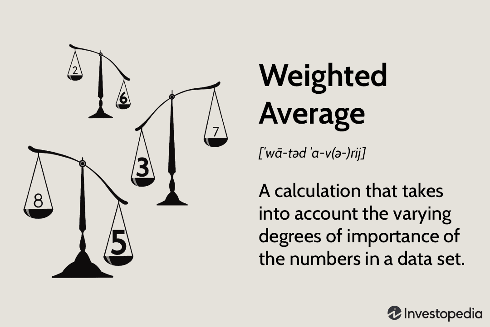

## Table of Contents

## What is the basic definition of 'weighted' in general terms?

The term 'weighted' means giving more importance to some things than others. Imagine you have a bunch of items, and you want to show that some of them are more important. You do this by giving them a bigger number or a heavier value. This is what we mean by 'weighted'.

In everyday life, you might see 'weighted' used in different ways. For example, in school, teachers might give more points to harder questions on a test. This makes the test 'weighted' because the harder questions have a bigger impact on your final score. Another example is in sports, where some games might be worth more points than others in a tournament. This makes the tournament 'weighted' because winning those games is more important.

## How does the concept of 'weighted' apply to different fields such as statistics, finance, and machine learning?

In statistics, 'weighted' means giving more importance to some data points than others. Imagine you are calculating the average score of a class, but some students took a harder test. You might give those scores more weight to make the average more fair. This is called a weighted average. It helps to make sure that important data has a bigger say in the final result.

In finance, 'weighted' often comes up when talking about investments. For example, in a stock market index, some companies might be more important than others. So, their stock prices are given more weight in the index. This makes the index a better reflection of the market. Another example is a weighted average cost of capital (WACC), where different types of financing like debt and equity are given different weights based on their importance to the company.

In [machine learning](/wiki/machine-learning), 'weighted' is used to improve how models learn from data. Sometimes, some examples in the data are more important or harder to get right. By giving these examples more weight, the model can focus on learning from them better. This can make the model more accurate. For instance, in a classification problem, if misclassifying one type of data is more costly, those data points can be weighted more heavily to reduce errors.

## Can you explain the mechanism behind a weighted average and how it differs from a simple average?

A weighted average is a way to find an average where some numbers count more than others. Imagine you have different scores, and some scores are more important. You give these important scores bigger numbers called weights. To find the weighted average, you multiply each score by its weight, add up all these products, and then divide by the total of all the weights. This makes sure that the important scores have a bigger effect on the final average.

A simple average, on the other hand, treats all numbers the same. You just add up all the numbers and divide by how many there are. It's like saying every score is equally important. The difference between a weighted average and a simple average is that a weighted average lets you show that some numbers matter more. This can be really helpful when you want to make sure that important data has a bigger impact on your results.

## What are some common examples of weighted systems in everyday life?

In schools, teachers often use weighted systems to grade students. Imagine a class where some tests are harder than others. The teacher might decide that the harder tests are more important. So, they give these tests more points, or weight, when calculating the final grade. This means that doing well on the harder tests can have a bigger effect on your final grade than doing well on the easier ones. It's a way to make sure that the most important parts of the class count more.

Another example is in sports, like a soccer league. Sometimes, certain games are more important than others. For instance, a game against a big rival might be worth more points than a regular game. This makes the league standings more exciting because winning those big games can really help a team move up in the rankings. By giving more weight to these important games, the league makes sure that they have a bigger impact on the final results.

In shopping, you might see weighted systems at work too. Think about a customer satisfaction survey at a store. The store might ask you to rate different things, like the friendliness of the staff, the cleanliness of the store, and the quality of the products. But the store might care more about some of these things than others. They might give more weight to the friendliness of the staff because they think it's really important for their business. So, when they calculate the overall satisfaction score, the friendliness rating counts more than the others.

## How do you calculate a weighted score and what are its practical applications?

To calculate a weighted score, you start by giving each part of your data a weight, which is just a number that shows how important it is. Then, you multiply each part of your data by its weight. After that, you add up all these multiplied numbers. Finally, you divide this total by the sum of all the weights. This gives you a weighted score that takes into account how important each part of your data is. For example, if you have three test scores—80, 90, and 70—and you want to weight them as 1, 2, and 1 respectively, you would multiply 80 by 1, 90 by 2, and 70 by 1. That gives you 80, 180, and 70. Add them up to get 330, then divide by the total weight of 1+2+1=4. So, your weighted score would be 330 divided by 4, which equals 82.5.

Weighted scores are used in many practical ways. In schools, teachers use them to calculate final grades. They might give more weight to final exams or projects because they think these are more important than regular homework. This makes sure that the most important parts of the class have a bigger effect on the final grade. In business, companies might use weighted scores to rate customer satisfaction. They might care more about some parts of their service, like how friendly their staff is, so they give more weight to those parts when calculating the overall score. This helps them focus on what's most important to their customers. In sports, leagues might use weighted scores to rank teams. Some games might be more important, like playoff games, so they get more weight in the final standings. This makes the competition more exciting and fair.

## What are the advantages of using weighted methods over non-weighted methods in data analysis?

Using weighted methods in data analysis can make your results more accurate and fair. When some data points are more important than others, weighted methods let you give them more say in the final result. Imagine you're calculating the average score of a class, but some students took a harder test. By giving those scores more weight, you make sure that the average score shows how well everyone did, not just the easier tests. This can be really helpful in many situations, like when you want to focus on the most important parts of your data.

Weighted methods also help you to handle different kinds of data better. Sometimes, data can be uneven or have different levels of importance. For example, in a customer satisfaction survey, you might care more about how friendly your staff is than how clean your store is. By giving more weight to the friendliness scores, you can make sure that your overall satisfaction score really shows what's most important to your customers. This way, you can make better decisions based on what matters most.

## How can weighting be used to adjust for bias in survey data?

Weighting can help fix bias in survey data by making sure that every group of people is represented fairly. Imagine you did a survey, but not enough people from one group answered. This can make your results wrong because they don't show what everyone thinks. By giving more weight to the answers from the group that didn't answer enough, you can make your results more accurate. It's like saying, "These answers are more important because we didn't hear from enough people in this group."

For example, if you surveyed people about their favorite ice cream, but fewer kids answered than adults, your results might show that adults' favorite ice cream is the most popular. But if you give more weight to the kids' answers, you can balance out the results to show what everyone really likes. This way, weighting helps make sure that your survey results are a better reflection of what all different kinds of people think, not just the ones who answered a lot.

## What are the potential pitfalls or challenges in implementing a weighted system?

Using a weighted system can be tricky. One big problem is deciding how much weight to give to each part of your data. If you get it wrong, your results might not be fair or accurate. It's like trying to balance a scale; if you put too much weight on one side, it tips over. You need to think carefully about what's important and why, and sometimes it's hard to know for sure. Another challenge is that weighted systems can be harder to explain to people. When everyone's vote or score counts the same, it's easy to understand. But when some things count more than others, people might get confused or think it's not fair.

Another issue with weighted systems is that they can make things more complicated. When you start giving different weights to different parts of your data, you have to do more math and keep track of more numbers. This can lead to mistakes if you're not careful. Also, if you don't have enough data from the groups you want to give more weight to, your results might still be off. It's like trying to make a cake with not enough of the main ingredient; it won't turn out right. So, while weighting can help make your results more accurate, it also needs careful planning and attention to detail.

## How does weighting affect the outcome of machine learning models, particularly in terms of feature importance?

In machine learning, weighting can change how a model learns from data, especially when it comes to figuring out which features are most important. Imagine you're trying to teach a computer to tell the difference between apples and oranges. If you think the color of the fruit is really important, you might give it more weight. This tells the computer to pay more attention to the color when it's learning. By doing this, the model can become better at telling apples and oranges apart because it knows what to focus on.

But, using weights in machine learning can also make things trickier. If you give too much weight to one feature, the model might ignore other important information. It's like trying to solve a puzzle but only looking at one piece. You might miss out on other pieces that are just as important. So, when you use weights, you need to be careful and make sure you're not making the model too focused on just one thing. This way, the model can learn from all the data and make better predictions.

## Can you describe advanced weighting techniques used in econometrics and their impact on regression analysis?

In econometrics, advanced weighting techniques like heteroskedasticity-robust standard errors and instrumental variables are used to make regression analysis more accurate. Imagine you're trying to understand how much money people spend on ice cream based on the temperature outside. But, some people might spend a lot more or a lot less than others, making the data uneven. By using heteroskedasticity-robust standard errors, you can give more weight to the data points that are more spread out. This helps to make sure that your results are not thrown off by these big differences. It's like adjusting the scale to make sure everyone's ice cream spending is counted fairly.

Another technique is using instrumental variables, which helps deal with situations where the data might be influenced by things you can't see directly. For example, if you want to know how education affects income, but you think that people who are naturally smarter might both get more education and earn more money, you need a way to separate these effects. An instrumental variable, like the distance to the nearest college, can help. By giving more weight to the data based on this instrument, you can get a clearer picture of how education really impacts income. These advanced weighting techniques help make sure that the regression analysis gives you a true and fair understanding of the relationships in your data.

## How do weighted voting systems work and what are their implications in decision-making processes?

In a weighted voting system, not everyone's vote counts the same. Some people or groups get more votes because they are thought to be more important. Imagine a family deciding where to go on vacation. The parents might get more votes than the kids because they are paying for the trip. So, if the parents want to go to the beach and the kids want to go to the mountains, the beach might win because the parents' votes count more. This way, the decision takes into account that some people's opinions matter more based on certain reasons.

Using a weighted voting system can change how decisions are made. It can make the process fairer if the weights are set right, because it makes sure that the most important voices are heard louder. But it can also cause problems if people feel like their votes don't matter as much. For example, in a company, if the CEO's vote counts more than everyone else's, the employees might feel left out of the decision-making. So, while weighted voting can help focus on what's most important, it needs to be used carefully to make sure everyone still feels included and respected.

## What are the latest research developments in the field of weighted algorithms and their applications?

Recent research in weighted algorithms has focused on improving how they handle big data and machine learning tasks. Scientists are working on new ways to give different weights to data points to make sure the most important information is used correctly. For example, in machine learning, researchers are developing algorithms that can automatically figure out the best weights for different features. This helps the computer learn faster and make better predictions. They are also looking at how to use weighted algorithms to deal with data that is not evenly spread out, like in medical research where some patients might have more important data than others.

These new developments are being used in many fields. In finance, weighted algorithms help to predict stock prices more accurately by giving more weight to recent data or important economic indicators. In healthcare, they are used to analyze patient data, giving more weight to critical factors like age or pre-existing conditions to improve diagnosis and treatment plans. These advancements make weighted algorithms more powerful and useful, helping people make better decisions based on complex and varied data.

## What is the role of weights in algorithmic trading?

Weights in algorithmic trading are essential components that significantly influence the decision-making process of trading models. These values are assigned to various variables within a trading model and directly affect buy or sell decisions. In practice, weights are used to prioritize certain factors over others based on their perceived importance. For instance, a model may place higher weights on market indicators that have historically provided accurate predictions of price movements or on historical performance data that align with the trading strategy's objectives.

A correct application of weights necessitates comprehensive statistical analysis and rigorous [backtesting](/wiki/backtesting). Statistical analysis helps determine the influence and significance of various indicators, enabling traders to assign appropriate weights based on empirical data. Backtesting, on the other hand, involves testing the trading model against historical data to validate its performance. This process ensures that the trading model aligns with the intended trading goals and performs well under various market conditions.

Dynamic weight adjustment is another critical aspect. Markets are inherently volatile and can be influenced by numerous unpredictable factors. Therefore, having a mechanism that allows for the weights to be adjusted dynamically helps the trading model to adapt to changing market conditions. This adaptability enhances the model's responsiveness and reliability, ensuring it remains effective even as market dynamics evolve.

Mathematically, weights can be represented in a formulaic model. For example, in a linear model where multiple variables $x_1, x_2, \ldots, x_n$ influence a decision function $f(x)$, weights $w_1, w_2, \ldots, w_n$ can be assigned such that the decision function is represented as:

$$
f(x) = w_1x_1 + w_2x_2 + \ldots + w_nx_n
$$

Here, the values of $w_i$ determine the influence of each corresponding variable $x_i$ on the decision function. The sum of these weighted variables provides the basis on which buy or sell decisions are made.

In programming, particularly using Python, weights can be efficiently managed and adjusted using libraries such as NumPy or pandas. A simple implementation of a weighted decision function might look like this:

```python
import numpy as np

# Example data for market indicators
indicators = np.array([indicator_1, indicator_2, indicator_3])
weights = np.array([w1, w2, w3])

def weighted_decision(indicators, weights):
    decision_value = np.dot(indicators, weights)
    return "Buy" if decision_value > threshold else "Sell"

# Adjust weights dynamically based on market analysis
weights = adjust_weights_based_on_market_conditions(weights)
decision = weighted_decision(indicators, weights)
```

In such a code snippet, the `adjust_weights_based_on_market_conditions` function would incorporate market analysis to fine-tune the weights. This level of sophistication is necessary for modern [algorithmic trading](/wiki/algorithmic-trading), allowing strategies to be both precise and adaptive in response to evolving market conditions.

## What are the types of weighted strategies?

Weighted strategies in algorithmic trading assign varying levels of importance to different market inputs to achieve specific trading objectives. These strategies can be categorized into several types, each leveraging weights in distinct ways to optimize trading outcomes.

Trend-following strategies are designed to capture the direction of market movements over extended periods. By assigning larger weights to longer-term indicators, such as a 200-day moving average, these strategies aim to identify and follow prevailing market trends. The underlying assumption is that once a trend is established, it is more likely to continue in the same direction than to reverse. A typical implementation involves using exponential moving averages (EMAs) where recent data points are given greater weight compared to older ones. The formula for an EMA can be expressed as:

$$
\text{EMA}_t = \alpha \times \text{Price}_t + (1 - \alpha) \times \text{EMA}_{t-1}
$$

where $\alpha$ is the smoothing factor.

Volume Weighted Average Price (VWAP) strategies aim to trade near the average price an asset has traded throughout the day, based on both [volume](/wiki/volume-trading-strategy) and price. VWAP is a crucial benchmark among institutional traders to minimize market impact costs and execute large orders more effectively. VWAP is calculated as follows:

$$
\text{VWAP} = \frac{\sum ( \text{Price}_i \times \text{Volume}_i )}{\sum \text{Volume}_i}
$$

where $\text{Price}_i$ and $\text{Volume}_i$ represent the price and volume of each transaction, respectively. By weighting prices with trade volume, traders aim to execute orders at more favorable prices, minimizing slippage and the market impact of large trades.

Mean reversion strategies operate under the hypothesis that prices fluctuate around, and eventually return to, their historical averages. These strategies employ weights to evaluate price deviations from average levels, capturing opportunities in overbought or oversold conditions. A common approach utilizes Bollinger Bands, where prices are expected to revert to the mean over time. Calculating Bollinger Bands involves:

$$
\text{Middle Band} = \text{SMA}_n
$$
$$
\text{Upper Band} = \text{SMA}_n + (K \times \text{SD}_n)
$$
$$
\text{Lower Band} = \text{SMA}_n - (K \times \text{SD}_n)
$$

Here, $\text{SMA}_n$ is the simple moving average over $n$ periods, $\text{SD}_n$ is the standard deviation, and $K$ is a constant, typically set at 2. This method allows traders to assess when prices deviate significantly from their average, signaling potential entry or [exit](/wiki/exit-strategy) points.

In conclusion, weighted strategies in algorithmic trading utilize differentiated levels of importance to achieve diverse trading objectives. By effectively implementing these strategies, traders can enhance their decision-making processes and performance in various market conditions.

## References & Further Reading

[1]: Bergstra, J., Bardenet, R., Bengio, Y., & Kégl, B. (2011). ["Algorithms for Hyper-Parameter Optimization."](https://dl.acm.org/doi/10.5555/2986459.2986743) Advances in Neural Information Processing Systems 24.

[2]: ["Advances in Financial Machine Learning"](https://www.amazon.com/Advances-Financial-Machine-Learning-Marcos/dp/1119482089) by Marcos Lopez de Prado

[3]: ["Evidence-Based Technical Analysis: Applying the Scientific Method and Statistical Inference to Trading Signals"](https://www.amazon.com/Evidence-Based-Technical-Analysis-Scientific-Statistical/dp/0470008741) by David Aronson

[4]: ["Machine Learning for Algorithmic Trading"](https://github.com/stefan-jansen/machine-learning-for-trading) by Stefan Jansen

[5]: ["Quantitative Trading: How to Build Your Own Algorithmic Trading Business"](https://www.amazon.com/Quantitative-Trading-Build-Algorithmic-Business/dp/1119800064) by Ernest P. Chan