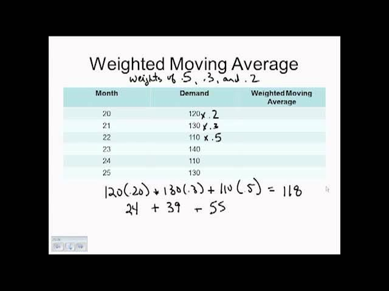

The Weighted Moving Average (WMA) serves as a pivotal technical indicator in the domain of algorithmic trading, primarily due to its inherent design that accords more significance to recent data points. This characteristic makes WMA stand out among various moving averages by offering a more immediate reflection of market conditions. By assigning higher weights to newer data, WMA enhances responsiveness, allowing traders to detect market trends more accurately and generate timely trading signals. This attribute is particularly advantageous compared to other moving averages, such as the Simple Moving Average (SMA) and Exponentially Weighted Moving Average (EWMA), which either treat data points equally or decrease the weights geometrically.

In algorithmic trading, the dynamic nature of financial markets necessitates tools that can effectively respond to rapid changes. The WMA's design caters to this need, making it an invaluable tool for traders who aim to capitalize on short-term market trends. This article will examine the mathematical formula underlying the WMA, explore its practical applications in algorithmic trading, and compare it with other moving average techniques to highlight its distinct advantages and limitations. Through this exploration, readers will gain a comprehensive understanding of how WMA operates within the broader spectrum of technical indicators.



## Table of Contents

## Understanding the Weighted Moving Average

The Weighted Moving Average (WMA) is calculated by placing different weights on data points, emphasizing the significance of more recent data. This method contrasts with simple averaging, where all data points hold equal importance. By weighting recent data more heavily, the WMA adjusts more rapidly to changes, making it especially useful for detecting short-term trends in financial markets.

The formula for calculating the WMA of a dataset involves multiplying each data point by a predetermined weight and then summing these products. Finally, the sum of these weighted values is divided by the total sum of the weights to obtain the WMA value. Mathematically, for a time series $x_1, x_2, \ldots, x_n$, the WMA is calculated as:

$$
\text{WMA} = \frac{w_1x_1 + w_2x_2 + \ldots + w_nx_n}{w_1 + w_2 + \ldots + w_n}
$$

Here, $w_1, w_2, \ldots, w_n$ are the weights assigned to the corresponding data points $x_1, x_2, \ldots, x_n$, and these weights usually decrease with age, often set in a linear or incremental fashion. For example, in a 5-period WMA, the weights might be set as 1, 2, 3, 4, and 5, where the latest data point has the highest weight, thereby exerting more influence on the moving average calculation.

This prioritization of recent information makes the WMA responsive to new market dynamics. Traders utilize this weighted approach to quickly adapt to changes, thus allowing them to make informed trading decisions. The sensitivity of the WMA to new data points is advantageous in fast-moving markets, where capturing the latest trends is crucial for maximizing returns.

## Calculating Weighted Moving Average

The weighted moving average (WMA) is computed by assigning specific weights to each data point within a set period, multiplying the weights by their respective data points, and summing the results. The final step involves dividing this summation by the total of the weights. This approach places more relevance on recent data points, offering a more dynamic and responsive analysis of trends.

The general formula for calculating a weighted moving average is as follows:

$$
\text{WMA} = \frac{\sum_{i=1}^{n} (w_i \cdot p_i)}{\sum_{i=1}^{n} w_i}
$$

Where:
- $w_i$ is the weight assigned to the $i$-th data point.
- $p_i$ is the price or value of the $i$-th data point.
- $n$ is the number of periods considered.

To illustrate, consider a simple example of a 5-period WMA. We would apply weights such that the most recent price has the greatest impact, e.g., 5, 4, 3, 2, and 1 where 5 is assigned to the most recent data point. Assuming we have the following prices over five periods: $50, $52, $51, $53, and $55, the calculation proceeds as follows:

1. Assign weights to each price:
   - Period 1: Price = $50, Weight = 1
   - Period 2: Price = $52, Weight = 2
   - Period 3: Price = $51, Weight = 3
   - Period 4: Price = $53, Weight = 4
   - Period 5: Price = $55, Weight = 5

2. Multiply each price by its corresponding weight:
$$
   (1 \cdot 50) + (2 \cdot 52) + (3 \cdot 51) + (4 \cdot 53) + (5 \cdot 55) = 50 + 104 + 153 + 212 + 275 = 794

$$

3. Sum the weights:
$$
   1 + 2 + 3 + 4 + 5 = 15

$$

4. Divide the weighted sum by the total of the weights to calculate the WMA:
$$
   \text{WMA} = \frac{794}{15} = 52.93

$$

This calculation results in a 5-period WMA of $52.93. This selective weighting scheme allows traders to better capture recent price movements and fluctuations, reflecting more current market conditions than a simple moving average (SMA) might. 

For automated and complex computations, Python can be utilized to dynamically calculate WMAs over large datasets. Below is a basic implementation in Python:

```python
def calculate_wma(prices, weights):
    if len(prices) != len(weights):
        raise ValueError("Prices and weights must be of the same length.")

    weighted_sum = sum(p * w for p, w in zip(prices, weights))
    total_weights = sum(weights)
    return weighted_sum / total_weights

prices = [50, 52, 51, 53, 55]
weights = [1, 2, 3, 4, 5]

wma = calculate_wma(prices, weights)
print(f"The WMA is: {wma:.2f}")
```

This Python script efficiently computes the WMA by iterating over the price and weight pairs, calculating the weighted sum, and dividing by the sum of weights. Through incorporating such calculations, traders can leverage the sensitivity of the WMA to refine their market analysis strategies.

## WMA in Algorithmic Trading

Algorithmic trading has reshaped the financial markets by leveraging statistical and mathematical models to execute trades rapidly and efficiently. One key component in this process is the Weighted Moving Average (WMA), which traders employ to develop strategies that adapt quickly to changing market conditions. The WMA's ability to prioritize recent data points allows it to provide timely buy and sell signals, essential for capitalizing on short-term price movements.

In [algorithmic trading](/wiki/algorithmic-trading), the integration of WMAs into complex trading algorithms helps automate decisions, minimizing human error and reaction time. For instance, a common strategy involves using WMA to generate signals when a price trend is likely to reverse. When a security's price drops below its WMA, it may indicate an oversold condition, prompting a buy signal. Conversely, when the price moves above its WMA, it may be considered overbought, signaling potential profit-taking opportunities.

To construct a backtested and statistically validated trading strategy using WMA, traders often employ historical data analysis to evaluate the effectiveness of the WMA in various market conditions. Backtesting involves simulating trades based on historical data to ascertain how a strategy would have performed. This process allows traders to refine their algorithms, optimizing parameters such as the period length of the WMA to maximize returns and minimize risk.

Python, a widely-used programming language in the financial industry, offers robust libraries such as pandas and NumPy to facilitate the calculation and implementation of WMAs in algorithmic trading strategies. Below is a basic example in Python demonstrating how to compute a 5-period WMA:

```python
import numpy as np
import pandas as pd

def weighted_moving_average(prices, window_size):
    weights = np.arange(1, window_size + 1)
    wma = np.convolve(prices, weights[::-1], 'valid') / weights.sum()
    return wma

# Example price data
prices = np.array([1.1, 1.2, 1.3, 1.4, 1.5, 1.3, 1.2])
window_size = 5

# Compute the WMA
wma_result = weighted_moving_average(prices, window_size)
print(wma_result)
```

This code calculates a WMA by creating weights for each period, applying them in reverse order, and then normalizing by the sum of the weights to obtain the average. Traders can modify and extend such scripts to tailor them to specific trading environments, enhancing performance by incorporating additional indicators and conditions.

Overall, the flexibility and responsiveness of the WMA make it a favored tool for traders seeking to exploit fleeting market opportunities while maintaining a systematic approach to risk management. Its integration into algorithmic trading systems underscores its utility in the dynamic landscape of financial markets, helping traders remain competitive in an ever-evolving arena.

## WMA vs. Other Moving Averages

The Weighted Moving Average (WMA) differs significantly from other types of moving averages, each of which offers unique advantages and potential drawbacks depending on the trading strategy applied. Unlike the Simple Moving Average (SMA), which assigns equal importance to all data points in a given period, the WMA places greater emphasis on more recent data. This weighting mechanism allows the WMA to react more swiftly to changes in market conditions, thereby providing traders with timely signals that are particularly advantageous in volatile markets.

The formula for calculating a WMA can be expressed as:

$$
\text{WMA} = \frac{\sum (P_i \times W_i)}{\sum W_i}
$$

where $P_i$ represents the data points (prices or values) in the series, and $W_i$ denotes the weights assigned to each data point, which decrease linearly for older data. This attribute facilitates the WMA's quick adaptability to the latest market events compared to other moving averages.

Another widely-used moving average is the Exponentially Weighted Moving Average (EWMA). While the EWMA, like the WMA, assigns greater importance to recent observations, it differs by decreasing weights exponentially rather than linearly. This results in an even more sensitive response to price changes, albeit with potential susceptibility to false signals in erratic market conditions. The formula for EWMA involves a smoothing [factor](/wiki/factor-investing) $\alpha$, which determines the rate of decline of the weights:

$$
\text{EWMA}_t = \alpha \times P_t + (1 - \alpha) \times \text{EWMA}_{t-1}
$$

where $\alpha$ is typically chosen between 0 and 1.

The differences between SMA, WMA, and EWMA highlight their varying suitability for different trading contexts. SMA's equal weighting can be beneficial for identifying long-term trends without undue influence from short-term market fluctuations. In contrast, the WMA's responsiveness is suited for short-term strategies where recent price movements are more relevant to the trading decisions. Meanwhile, EWMA provides a middle ground, offering quick adaptation with a balanced sensitivity that can be fine-tuned via the smoothing factor.

Traders must consider these characteristics when designing strategies, as the choice of moving average can significantly influence the efficacy of their trading outcomes. WMA tends to be favored for strategies requiring faster reaction times and reduced lag in signal generation, whereas SMA and EWMA might offer superior stability and robustness under different market conditions.

## Trading Strategies Using WMA

Weighted Moving Average (WMA) strategies provide traders with significant tools to exploit various market conditions. One prominent strategy involves mean-reversion, where traders capitalize on the short-term fluctuations of a security's price. In this approach, traders monitor the WMA as a benchmark; if the asset's price falls below the WMA, it may indicate a buying opportunity, anticipating the price will revert to its mean. Conversely, if the price surpasses the WMA, this can signal a selling opportunity, projecting an eventual return to the mean.

Another commonly employed strategy using WMA is trend-following. This approach is particularly effective with longer-period WMAs, enabling traders to identify and capitalize on sustained market trends. Trend-following relies on the notion that once a trend is established, it is likely to continue. In practice, traders use the WMA to validate the direction of the trend, entering trades in the trend's direction and holding positions as long as the price remains aligned with the WMA.

Backtesting these strategies is crucial for determining their efficacy. When [backtesting](/wiki/backtesting), traders assess historical data to evaluate how a specific WMA strategy would have performed in the past. This evidence-based approach allows for optimizations, such as fine-tuning the WMA period length to maximize potential returns. For example, shorter WMA periods may offer quicker responses to market shifts and are suitable for volatile markets, while longer WMAs may smooth out noise and better capture long-term trends.

Backtesting data often reveals optimal settings for WMA strategies depending on market conditions. For instance, during periods of high [volatility](/wiki/volatility-trading-strategies), WMAs with shorter periods might yield better results due to their faster reaction to rapid price changes. Meanwhile, in stable market environments, longer WMAs could be more effective, as they help in capturing the sustained [momentum](/wiki/momentum) of price movements without overreacting to minor fluctuations.

Various platforms offer tools for backtesting WMA strategies, utilizing programming languages such as Python to automate and refine these approaches. Here is an example of a simple Python script using the Pandas library to calculate a WMA and illustrate its application in a trading strategy:

```python
import pandas as pd
import numpy as np

def calculate_wma(prices, period):
    weights = np.arange(1, period + 1)
    def wma(prices):
        return np.dot(prices, weights) / weights.sum()
    return prices.rolling(period).apply(wma, raw=False)

# Sample data
dates = pd.date_range('2023-01-01', periods=10)
prices = pd.Series([100, 102, 101, 104, 107, 110, 114, 112, 113, 115], index=dates)

# Calculate 3-period WMA
wma = calculate_wma(prices, 3)

# Plotting for visualization
import matplotlib.pyplot as plt

plt.plot(prices, label='Price')
plt.plot(wma, label='3-Period WMA', linestyle='--')
plt.title('Price vs. Weighted Moving Average')
plt.xlabel('Date')
plt.ylabel('Price')
plt.legend()
plt.show()
```

By running simulations and observing historical outcomes, traders can optimize WMA-based strategies, enhancing their ability to predict future price movements and execute effective trading decisions.

## Conclusion

The Weighted Moving Average (WMA) serves as a critical tool for algorithmic traders due to its ability to generate swift and responsive signals reflective of current market conditions. Given its design, which assigns greater significance to recent data points, the WMA is highly effective in identifying short-term trends and adjustments in market prices. This responsiveness can provide a strategic advantage in dynamic financial environments where timely decisions are paramount.

Despite its strengths, the WMA is not without limitations. The sensitivity that allows it to track short-term fluctuations also means it can be prone to false signals, particularly in volatile market scenarios. As such, traders are advised to employ WMAs alongside other analytical tools and indicators to enhance reliability and mitigate risks associated with potential inaccuracies. This integration approach demands thorough backtesting and validation to ensure that trading strategies based on WMA are robust and effective.

Moreover, the versatility of WMA makes it an applicable choice for both short-term and long-term trading strategies. While short-term strategies might benefit from the WMA's quick reaction to market changes, long-term traders can leverage the WMA to confirm the sustainability of a trend over a more extended period. The adaptability of WMA across different trading contexts underscores its value to traders keen on optimizing their algorithmic trading strategies. When carefully calibrated and tested within a comprehensive trading plan, WMAs can significantly contribute to achieving successful trading outcomes.

## References & Further Reading

[1]: Fritz, P. (2011). ["Introduction to the Weighted Moving Average."](https://www.researchgate.net/publication/313992620_The_Exponentially_Weighted_Moving_Average) Investopedia.

[2]: Murphy, J. J. (1999). ["Technical Analysis of the Financial Markets."](https://www.amazon.com/Technical-Analysis-Financial-Markets-Comprehensive/dp/0735200661) New York Institute of Finance.

[3]: Perrin, T., & Joseph, M. (2013). ["The Complete Guide to Algorithmic Trading: How to Develop and Implement an Automated Trading System."](https://psycnet.apa.org/record/2018-12095-006) Harriman House.

[4]: Chan, E. P. (2009). ["Quantitative Trading: How to Build Your Own Algorithmic Trading Business."](https://github.com/ftvision/quant_trading_echan_book) John Wiley & Sons.

[5]: "Weighted Moving Average (WMA) Calculation and Usage in Trend Analysis," [Technical Analysis of Stocks & Commodities Magazine](https://www.wallstreetoasis.com/resources/skills/trading-investing/weighted-moving-average-wma).