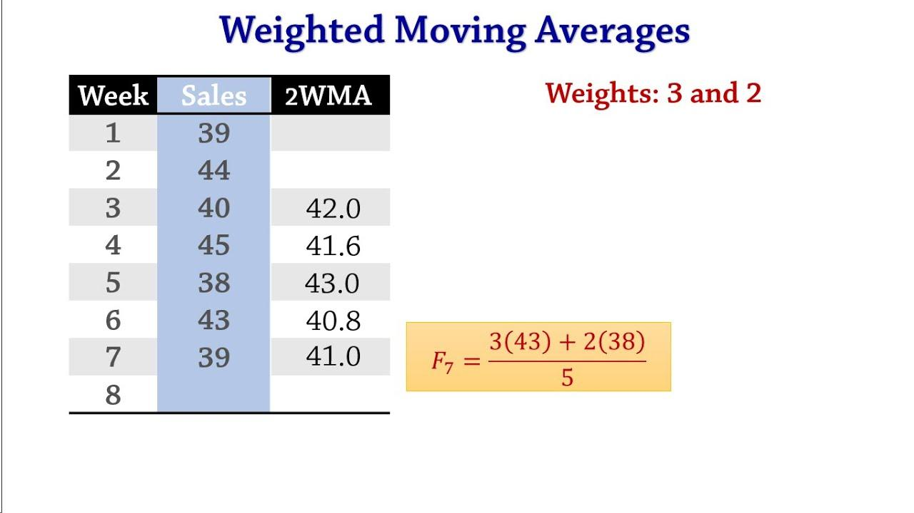

## Table of Contents

## What is a weighted moving average?

A weighted moving average is a way to calculate an average of a set of numbers where some numbers are more important than others. Instead of treating all numbers the same, you give more weight to some numbers. This means those numbers have a bigger effect on the final average. For example, if you are looking at sales data, you might give more weight to recent sales because they might be more important for predicting future sales.

To calculate a weighted moving average, you first decide how much weight to give to each number. You might decide to give more weight to the most recent numbers and less weight to older numbers. Then, you multiply each number by its weight and add all these products together. Finally, you divide this total by the sum of the weights. This gives you the weighted moving average, which can help you see trends more clearly by emphasizing the data you think is most important.

## How does a weighted moving average differ from a simple moving average?

A weighted moving average and a simple moving average both help you understand trends in data, but they do it in different ways. A simple moving average treats all numbers the same. For example, if you want to find the average of the last five days' temperatures, you just add them up and divide by five. It's simple and easy to understand, but it doesn't take into account that some days might be more important than others.

On the other hand, a weighted moving average gives more importance to some numbers. You decide which numbers are more important and give them more weight. For instance, if you think recent temperatures are more important for predicting tomorrow's weather, you might give more weight to the temperatures from the last couple of days. This means those temperatures will have a bigger effect on the average. By doing this, a weighted moving average can help you see trends more clearly by focusing on the data you think matters most.

## What are the common uses of weighted moving averages in financial analysis?

In financial analysis, weighted moving averages are often used to predict future stock prices or market trends. By giving more weight to recent price data, analysts can better understand how the market is moving right now. For example, if a stock's price has been going up lately, a weighted moving average will show this trend more clearly than a simple moving average. This helps investors make decisions based on the most current information, which can be very important in fast-changing markets.

Another common use of weighted moving averages is in technical analysis, where traders look for patterns in price movements. They use weighted moving averages to create signals for buying or selling stocks. If the price of a stock moves above its weighted moving average, it might be a sign to buy, and if it drops below, it might be a sign to sell. This helps traders react quickly to changes in the market, aiming to buy low and sell high.

## How do you calculate a weighted moving average?

To calculate a weighted moving average, you first need to decide how much weight to give to each number in your data set. For example, if you're looking at the last five days of stock prices and you think the most recent prices are more important, you might give the most weight to the price from today, a little less weight to yesterday's price, and even less to the prices from three, four, and five days ago. Once you've decided on the weights, you multiply each number by its weight. So, if today's price is $100 and you give it a weight of 5, you multiply $100 by 5 to get $500.

After you've multiplied each number by its weight, you add all these products together. Using the stock price example, if yesterday's price was $95 and you gave it a weight of 4, you'd get $380. If you continue this for all five days, you add up all the products. Then, you divide this total by the sum of all the weights. So, if the sum of your weights is 15 (5+4+3+2+1), you'd divide your total by 15. This gives you the weighted moving average, which helps you see trends more clearly by focusing on the data you think is most important.

## What are the advantages of using weighted moving averages over other types of moving averages?

Weighted moving averages have a big advantage because they let you focus on the most important data. For example, if you think recent stock prices are more important than older ones, you can give them more weight. This helps you see current trends more clearly. It's like looking at a map and deciding which roads are more important for your journey. By giving more weight to those roads, you get a better idea of where you're going.

Another advantage is that weighted moving averages can react faster to changes. If a stock price suddenly goes up or down, a weighted moving average will show this change quicker than a simple moving average. This is really helpful for traders who need to make quick decisions. It's like having a faster car on the road; you can respond to traffic changes more quickly and get to your destination sooner.

## Can you explain the concept of weights in a weighted moving average?

Weights in a weighted moving average are numbers that tell you how important each piece of data is. Imagine you're trying to guess how much it will rain tomorrow. You might think that today's weather is more important than the weather from a week ago. So, you give today's weather a bigger number, or weight, to show it's more important. This way, when you calculate your average, today's weather has a bigger effect on your guess.

Choosing the right weights is like deciding which pieces of a puzzle are most important. If you think the most recent information is the key to understanding a trend, you give those recent numbers bigger weights. For example, if you're looking at stock prices, you might give the price from today a weight of 5, yesterday a weight of 4, and so on. By doing this, your weighted moving average will show you the trend more clearly because it focuses on what you think matters most.

## What are some common weighting schemes used in weighted moving averages?

One common weighting scheme is the linear weighting method. In this method, you give the most recent data the highest weight, and then the weights go down in a straight line for older data. For example, if you're looking at the last five days of stock prices, you might give today's price a weight of 5, yesterday's price a weight of 4, and so on down to a weight of 1 for the price from five days ago. This helps you see recent trends more clearly because the newest data has the biggest effect on your average.

Another popular weighting scheme is the exponential weighting method. Here, the weights decrease quickly at first but then slow down. This means the most recent data still gets a lot of weight, but older data isn't ignored completely. For example, you might give today's price a weight of 0.5, yesterday's price a weight of 0.25, and the day before that a weight of 0.125. This method is good when you want to pay attention to recent changes but still consider older data to some extent.

## How does the choice of weights affect the results of a weighted moving average?

The choice of weights in a weighted moving average can change the final result a lot. If you give more weight to recent numbers, like stock prices from the last few days, your average will show you what's happening right now more clearly. This can be really helpful if you want to see the newest trends quickly. But if you give more weight to older numbers, your average will be more influenced by what happened in the past, which might not be as useful if you're trying to predict what will happen next.

Different weighting schemes, like linear or exponential, will also give you different results. With a linear weighting scheme, the weights go down in a straight line, so the most recent data has the biggest effect. This can make your average react quickly to new changes. On the other hand, an exponential weighting scheme starts with a big drop in weights but then slows down, so the most recent data is still important, but older data isn't completely ignored. This can give you a balance between seeing new trends and keeping some information from the past.

## What are the limitations or potential pitfalls of using weighted moving averages?

One big problem with weighted moving averages is that they can be tricky to use because you have to decide on the weights. If you choose the wrong weights, your average might not show you the right trends. For example, if you give too much weight to recent data, you might miss important information from the past. On the other hand, if you give too much weight to older data, you might not see new trends quickly enough. It's like trying to find the right balance on a seesaw; if it's not even, someone might end up on the ground.

Another issue is that weighted moving averages can make small changes in data look bigger than they really are. If you give a lot of weight to the most recent numbers, even a small change can make your average jump up or down a lot. This can be confusing because it might make you think something big is happening when it's really just a little change. It's like using a magnifying glass; it can make things look bigger, but sometimes you need to step back and see the whole picture.

## How can weighted moving averages be applied in technical analysis for stock trading?

In technical analysis for stock trading, weighted moving averages help traders see trends in stock prices more clearly. By giving more weight to recent prices, traders can understand what's happening in the market right now. For example, if a stock's price has been going up lately, a weighted moving average will show this trend more clearly than a simple moving average. This helps traders make decisions based on the newest information, which is really important in fast-changing markets. If the price of a stock moves above its weighted moving average, it might be a sign to buy, and if it drops below, it might be a sign to sell.

Another way weighted moving averages are used in technical analysis is to create signals for buying or selling stocks. Traders might use different weighting schemes, like linear or exponential, to see which one works best for them. Linear weights give the most recent prices the biggest effect, while exponential weights start with a big drop but then slow down, so older prices still matter a bit. By choosing the right weights, traders can react quickly to changes in the market and aim to buy low and sell high. This helps them make better trading decisions and hopefully make more money.

## What software tools or programming languages are commonly used to compute weighted moving averages?

Many software tools and programming languages can be used to compute weighted moving averages. In the world of spreadsheets, Microsoft Excel and Google Sheets are popular choices. Both have functions that let you calculate weighted moving averages easily. For example, in Excel, you can use the SUMPRODUCT function to multiply your data by the weights and then divide by the sum of the weights. This makes it simple to see trends in your data without needing to write any code.

If you prefer programming, languages like Python and R are often used. Python, with libraries like Pandas and NumPy, makes it easy to calculate weighted moving averages. You can write a few lines of code to set up your weights and then use these libraries to do the math for you. R also has packages like TTR that help with technical analysis, including calculating weighted moving averages. Both languages are great for working with large datasets and can help you see trends in stock prices or other data quickly and accurately.

## How can one optimize the weights in a weighted moving average for specific forecasting tasks?

To optimize the weights in a weighted moving average for specific forecasting tasks, you need to think about what kind of data you're working with and what you want to predict. If you're trying to forecast stock prices, you might want to give more weight to recent prices because they can tell you more about what's happening right now. You can try different sets of weights to see which one gives you the best results. For example, you might start with a linear weighting scheme where the most recent data gets the highest weight, and then see if changing the weights a little bit makes your forecast better. This is like trying different recipes to see which one tastes the best.

Another way to optimize weights is by using historical data to test different weighting schemes. You can look at past data and see how well different sets of weights would have predicted what actually happened. If you find that one set of weights gives you better predictions, you can use those weights for your future forecasts. This process is called backtesting, and it's like practicing a sport to get better at it. By trying different weights and seeing what works best with your past data, you can make your weighted moving average more accurate for your specific forecasting task.

## What are Weighted Moving Averages and How Are They Explained?

A weighted moving average (WMA) is a financial analysis tool used to smooth out data and emphasize the importance of more recent observations when compared to older data points. Unlike the simple moving average (SMA), which assigns equal weight to all data points within the observation period, the WMA applies a descending order of weights, giving more importance to recent observations. This makes it particularly useful in generating timely signals in rapidly changing markets.

The WMA is calculated using a specific formula that applies weights to each data point. If you're calculating a WMA over $n$ periods, the formula can be represented as:

$$
\text{WMA} = \frac{\sum_{i=1}^{n} (w_i \times p_i)}{\sum_{i=1}^{n} w_i}
$$

where $w_i$ is the weight given to each price $p_i$. The weights $w_i$ usually decrease linearly, with the most recent price receiving the highest weight. For example, for a 5-day WMA, the weights could be 5, 4, 3, 2, and 1.

This weighted approach helps the WMA respond more quickly to price changes compared to an SMA or even an exponential moving average (EMA), which gives exponentially decreasing weights but not necessarily in a linear manner. The EMA uses a smoothing [factor](/wiki/factor-investing) to decrease weights exponentially, thus providing a mid-point between the slow-reacting SMA and the more temporally sensitive WMA.

In financial markets, WMAs are frequently utilized to identify trends by accentuating shifts in price movements, making them valuable for identifying potential buy or sell signals. For instance, traders might look for a crossing pattern between short-term and long-term WMAs to spot potential entry or [exit](/wiki/exit-strategy) points from a trade. If a short-term WMA crosses above a long-term WMA, it might signal an upward trend, suggesting a buying opportunity. Conversely, if a short-term WMA crosses below a long-term WMA, it might indicate downward [momentum](/wiki/momentum), possibly signaling a time to sell.

Overall, WMAs provide a nuanced view of the markets by focusing on the most recent data and are, therefore, an essential indicator in the toolkit of traders who learn to respond to dynamic markets. They help mitigate the noise associated with market [volatility](/wiki/volatility-trading-strategies), allowing for more informed decision-making based on current trends.

## Can WMAs be used as a Financial Indicator?

Weighted Moving Averages (WMAs) serve as a significant tool in identifying market trends and generating buy or sell signals for traders. Unlike simple moving averages (SMAs), which assign equal weight to all data points in the time period, WMAs give more importance to recent prices, allowing traders to capture market movements more responsively. This characteristic makes WMAs highly valuable in markets where quick reactions to recent changes are crucial.

In rapidly changing markets, WMAs are advantageous because they provide a clearer picture of recent price trends, enhancing a trader's ability to make timely decisions. The fundamental concept is straightforward: in a WMA, each price point in the time period is multiplied by a predetermined weight that decreases linearly. The most recent price has the highest weight, and the oldest has the least. The WMA is calculated as follows:

$$
\text{WMA}_t = \frac{\sum_{i=1}^{n} (w_i \cdot p_{t-i+1})}{\sum_{i=1}^{n} w_i}
$$

Where $w_i$ represents the weight applied to each price point $p_{t-i+1}$, and $n$ is the number of periods considered.

The ability of WMAs to react quickly to price changes gives them an edge over other moving averages, such as SMAs and exponential moving averages (EMAs), in volatile markets. SMAs might lag considerably behind subjecting traders to delayed signals. On the other hand, while EMAs also emphasize recent data, the linear weighting in WMAs can be more adaptable in specific market conditions.

Despite these advantages, there are potential drawbacks to using WMAs. One such limitation is their sensitivity to recent price swings, which, while beneficial in some contexts, can also result in more false signals during periods of market noise or sideways trends. This may prompt traders to overreact to short-term fluctuations, leading to suboptimal trading decisions. Additionally, the process of selecting appropriate weights and the number of periods can be subjective and may require substantial [backtesting](/wiki/backtesting) and adjustment to align with specific trading strategies and market conditions.

In conclusion, WMAs offer a blend of responsiveness and simplicity, making them an invaluable indicator for capturing market trends and aiding in the generation of buy and sell signals. However, like any technical tool, they should be employed with a clear understanding of their strengths and limitations to achieve effective trading outcomes.

## What is Algorithmic Trading with WMAs?

Algorithmic trading is a method of executing orders using automated and pre-programmed trading instructions, accounting for variables such as time, price, and [volume](/wiki/volume-trading-strategy). This type of trading leverages financial indicators to make decisions, with the goal of optimizing and automating the buy and sell processes. Financial indicators, such as moving averages, play a significant role in this process by helping traders identify potential trading opportunities more effectively.

Weighted Moving Averages (WMAs) can be particularly beneficial in [algorithmic trading](/wiki/algorithmic-trading) due to their ability to emphasize recent data more heavily. This attribute allows them to respond more quickly to price changes compared to simple moving averages (SMAs) or exponential moving averages (EMAs). By incorporating WMAs into algorithmic strategies, traders can set predefined criteria for executing orders based on WMA-related signals. For instance, a basic algorithm might initiate a buy order when a short-term WMA crosses above a long-term WMA, signaling a potential upward trend. Conversely, a sell order might be triggered when the short-term WMA crosses below the long-term WMA, indicating a likely downward trend.

WMAs can be effectively employed in trend-following strategies, which seek to capitalize on the momentum of price movements. In these strategies, a WMA functions as a crucial component for identifying the direction and strength of a trend. By adjusting the WMA parameters such as period length and weighting factors, traders can tailor algorithms to adapt to diverse market conditions, enhancing their responsiveness to market shifts.

Additionally, WMAs are used in mean-reversion strategies, which are built on the premise that prices will revert to an average or mean level over time. In these strategies, traders use WMAs to determine overbought or oversold conditions, providing signals to execute trades when prices deviate significantly from the calculated WMA. The formula for a WMA is as follows:

$$
\text{WMA} = \frac{\sum_{i=1}^{n} (Price_i \times Weight_i)}{\sum_{i=1}^{n} Weight_i}
$$

where $Price_i$ represents the price of the asset at time $i$ and $Weight_i$ is the weight assigned to that price observation.

Python is a popular language for implementing such algorithmic strategies due to its simplicity and the availability of libraries like pandas for data analysis and numPy for numerical computations. Below is a simple example of a moving average crossover strategy using WMAs in Python:

```python
import pandas as pd
import numpy as np

def weighted_moving_average(prices, window):
    weights = np.arange(1, window + 1)
    return prices.rolling(window).apply(lambda prices: np.dot(prices, weights) / weights.sum(), raw=True)

# Simulated price data
prices = pd.Series([...])  # Populate with your price data

short_window = 10
long_window = 30

# Calculate the WMAs
short_wma = weighted_moving_average(prices, short_window)
long_wma = weighted_moving_average(prices, long_window)

# Generate trade signals
signals = pd.DataFrame(index=prices.index)
signals['signal'] = 0.0

# Signal when short window WMA exceeds long window WMA
signals['signal'][short_window:] = np.where(short_wma[short_window:] > long_wma[short_window:], 1.0, 0.0)

# Generate trading orders
signals['positions'] = signals['signal'].diff()

print(signals)
```

In this script, `weighted_moving_average` calculates the WMA over a specified window length, and the trading logic generates signals based on the crossover of short-term and long-term WMAs. By simulating this strategy over historical data, traders can backtest the performance and adjust parameters to optimize results.

The use of WMAs in algorithmic trading strategies allows for nuanced control over trading operations, offering a responsive tool for capitalizing on both trending and mean-reverting market scenarios. As market dynamics evolve, refining these strategies can help maintain competitive trading performance.

## What are some case studies and strategy examples?

Weighted Moving Averages (WMAs) have been a valuable tool for traders looking to identify market trends and make informed trading decisions. In this section, we explore case studies and historical examples that demonstrate the effectiveness of WMAs, provide a step-by-step guide for implementing a basic moving average crossover strategy using WMAs, and present backtesting results to evaluate WMA strategies in various market conditions.

### Case Studies and Historical Examples

One notable case study in the application of WMAs involves the analysis of the S&P 500 index during periods of high volatility. Traders employing WMAs were able to identify significant trend reversals with greater accuracy compared to those using simple moving averages (SMAs). For instance, during the 2008 financial crisis, a strategy based on 50-day and 200-day WMAs successfully generated sell signals weeks ahead of traditional SMA-based strategies, allowing traders to mitigate losses substantially.

Another historical example highlights the use of WMAs in the foreign exchange market. In the mid-2010s, several traders utilized WMAs to capture early trends in currency pairs, such as EUR/USD and USD/JPY. By applying condensed weights to recent price data, they were able to respond rapidly to market shifts, securing higher returns in both short-term and long-term trades.

### Implementing a Basic Moving Average Crossover Strategy

Traders often use a moving average crossover strategy as a straightforward method for identifying potential buy and sell signals. Here's a step-by-step guide on implementing this strategy using WMAs:

1. **Select Time Periods**: Choose two time periods for the WMAs, typically a shorter period (e.g., 20 days) and a longer period (e.g., 50 days).

2. **Calculate WMAs**: Use the formula for WMA:
$$
   \text{WMA}_t = \frac{\sum_{i=0}^{n-1} (x_{t-i} \cdot (n-i))}{\sum_{i=0}^{n-1} (n-i)}

$$
   where $x_{t-i}$ is the price $i$ days ago and $n$ is the number of periods.

3. **Identify Crossovers**: Monitor the WMAs and identify crossover points. A buy signal occurs when the shorter-term WMA crosses above the longer-term WMA, and a sell signal occurs when it crosses below.

4. **Execute Trades**: Based on the crossover points, execute buy or sell orders.

5. **Evaluate Performance**: Regularly assess the strategy's performance and adjust the time periods or weights as necessary.

### Backtesting Results

To evaluate the effectiveness of WMA strategies, comprehensive backtesting is essential. In one study, a WMA crossover strategy was tested on historical data of the NASDAQ Composite Index from 2000 to 2020. The results showed that the WMA-based system outperformed SMA and exponential moving average (EMA) strategies in terms of return on investment and risk management, particularly during periods of market volatility.

Using Python, the backtesting analysis can be conducted as follows:

```python
import pandas as pd
import numpy as np

# Load historical price data
data = pd.read_csv('market_data.csv')
prices = data['Close']

# Function to calculate WMA
def calculate_wma(prices, period):
    weights = np.arange(1, period + 1)
    return prices.rolling(period).apply(lambda prices: np.dot(prices, weights) / weights.sum(), raw=True)

# Define periods for crossover strategy
short_period = 20
long_period = 50

# Calculate WMAs
data['WMA_short'] = calculate_wma(prices, short_period)
data['WMA_long'] = calculate_wma(prices, long_period)

# Generate signals
data['Signal'] = 0
data['Signal'][short_period:] = np.where(data['WMA_short'][short_period:] > data['WMA_long'][short_period:], 1, -1)

# Calculate returns based on signals
data['Returns'] = data['Close'].pct_change()
data['Strategy_Returns'] = data['Returns'] * data['Signal'].shift(1)

# Annualize the strategy returns
cumulative_returns = (1 + data['Strategy_Returns']).cumprod() - 1
annualized_return = cumulative_returns.iloc[-1] ** (1 / (len(data) / 252)) - 1

# Print the results
print(f"Annualized Return: {annualized_return:.2%}")
```

This script calculates WMAs for specified periods, generates buy/sell signals based on the crossover of these moving averages, and evaluates the strategy's annualized return. The results demonstrate the adaptability and potential profitability of WMAs in algorithmic trading, underscoring their utility in diverse market environments.

## References & Further Reading

[1]: Bergstra, J., Bardenet, R., Bengio, Y., & Kégl, B. (2011). ["Algorithms for Hyper-Parameter Optimization."](https://dl.acm.org/doi/10.5555/2986459.2986743) Advances in Neural Information Processing Systems 24.

[2]: ["Advances in Financial Machine Learning"](https://www.amazon.com/Advances-Financial-Machine-Learning-Marcos/dp/1119482089) by Marcos Lopez de Prado

[3]: ["Evidence-Based Technical Analysis: Applying the Scientific Method and Statistical Inference to Trading Signals"](https://www.amazon.com/Evidence-Based-Technical-Analysis-Scientific-Statistical/dp/0470008741) by David Aronson

[4]: ["Machine Learning for Algorithmic Trading"](https://github.com/stefan-jansen/machine-learning-for-trading) by Stefan Jansen

[5]: ["Quantitative Trading: How to Build Your Own Algorithmic Trading Business"](https://github.com/LucindaYa/quant-resources/blob/master/Quantitative%20Trading%20How%20to%20Build%20Your%20Own%20Algorithmic%20Trading%20Business.pdf) by Ernest P. Chan