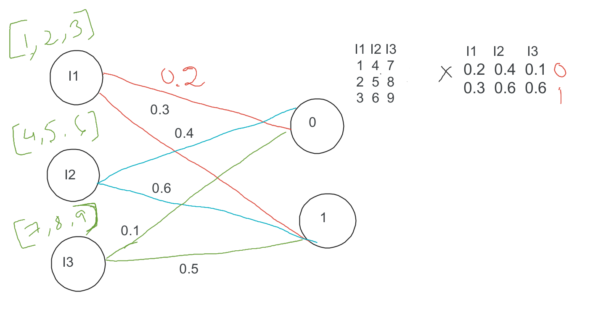

## Table of Contents

## What is a Weighted Sum in the context of machine learning?

In machine learning, a Weighted Sum is a basic mathematical operation used in many algorithms, especially in neural networks. It's like when you add up a bunch of numbers, but each number gets a special importance, or "weight," before you add it. Imagine you're making a smoothie and you have different fruits. Each fruit adds a different flavor, but you might want more of one fruit than another. The weights are like deciding how much of each fruit to put in. In a neural network, each input to a neuron is multiplied by its weight, and then all these products are added together to get the weighted sum.

The formula for a weighted sum looks like this: $$ \text{Weighted Sum} = w_1 \cdot x_1 + w_2 \cdot x_2 + ... + w_n \cdot x_n $$, where $w$ represents the weights and $x$ represents the inputs. If you have three inputs and their weights, for example, you would multiply each input by its weight and then add them all up. This weighted sum is often passed through an activation function to decide if the neuron should "fire" or not. It's a simple yet powerful concept that helps machines learn from data by adjusting the weights to improve predictions over time.

## How does a Weighted Sum contribute to a machine learning model's decision-making process?

In machine learning, a Weighted Sum helps a model make decisions by figuring out how important each piece of information is. Imagine you're trying to decide if you should bring an umbrella based on the weather. You might consider the chance of rain, the temperature, and the wind speed. Each of these factors has a different importance to you. In a machine learning model, these factors are the inputs, and their importance is represented by weights. The model multiplies each input by its weight and adds them all up to get the weighted sum. This sum helps the model decide if it's a good idea to bring an umbrella or not.

The weighted sum is crucial because it allows the model to learn from examples. At first, the model might not know which factors are most important, so it starts with random weights. As the model sees more examples, it adjusts the weights to make better predictions. For example, if the model keeps getting it wrong when it rains, it might increase the weight of the rain chance input. This way, the weighted sum becomes more accurate over time, helping the model make better decisions. The formula for the weighted sum is $$ \text{Weighted Sum} = w_1 \cdot x_1 + w_2 \cdot x_2 + ... + w_n \cdot x_n $$, where $w$ are the weights and $x$ are the inputs.

## Can you explain the basic mathematical formula for a Weighted Sum?

A Weighted Sum is a way to add up numbers where each number gets a special importance, or "weight," before you add it. Imagine you have three numbers: 2, 3, and 4. If you give them weights of 0.5, 1, and 2 respectively, you would multiply each number by its weight and then add them up. So, you'd do 0.5 times 2, which is 1, then 1 times 3, which is 3, and finally 2 times 4, which is 8. When you add these together, you get 1 + 3 + 8 = 12. That's the weighted sum.

The formula for a weighted sum is pretty simple. It looks like this: $$ \text{Weighted Sum} = w_1 \cdot x_1 + w_2 \cdot x_2 + ... + w_n \cdot x_n $$. In this formula, $w$ stands for the weights and $x$ stands for the numbers you're adding up. The dots ( ... ) mean you can keep going if you have more numbers and weights. So, if you have a bunch of numbers and you want to add them up in a special way, you just multiply each number by its weight and then add them all together.

## What are the key components needed to calculate a Weighted Sum?

To calculate a Weighted Sum, you need two main things: the numbers you want to add up and the weights that tell you how important each number is. The numbers are called inputs, and they can be anything you want to measure or consider. For example, if you're deciding what to wear based on the weather, your inputs might be the temperature, the chance of rain, and the wind speed. The weights are like special numbers that you multiply with your inputs to show how much each one matters to your decision.

The formula for a Weighted Sum is pretty simple. It looks like this: $$ \text{Weighted Sum} = w_1 \cdot x_1 + w_2 \cdot x_2 + ... + w_n \cdot x_n $$. In this formula, $w$ stands for the weights and $x$ stands for the inputs. You multiply each input by its weight, and then you add all those products together. That's it! If you have three inputs and their weights, for example, you would multiply the first input by the first weight, the second input by the second weight, and so on, and then add them all up to get your Weighted Sum.

## How do you determine the weights in a Weighted Sum model?

In a Weighted Sum model, the weights are usually determined through a process called training. Imagine you're trying to teach a computer to guess how much you'll like a movie based on things like the movie's rating, its length, and the genre. At first, the computer doesn't know which of these things is most important to you, so it starts with random guesses for the weights. As you tell the computer how much you actually liked different movies, it adjusts the weights to make better guesses. This process of adjusting the weights to improve predictions is called learning.

The way the computer adjusts the weights is by using an algorithm that looks at how wrong its guesses were and then changes the weights a little bit to make the guesses better next time. This might sound complicated, but it's a bit like tuning a guitar. You listen to the sound, and if it's off, you turn the knobs a little bit until it sounds right. In the same way, the computer keeps tweaking the weights until its predictions are as accurate as possible. The formula for updating the weights can be complex, but the basic idea is to make small changes to minimize the difference between the computer's guesses and the actual outcomes.

## What are the advantages of using a Weighted Sum in machine learning algorithms?

Using a Weighted Sum in [machine learning](/wiki/machine-learning) algorithms has several advantages. It helps the model figure out which pieces of information are more important for making good predictions. Imagine you're trying to guess how much you'll like a movie based on its rating, length, and genre. A Weighted Sum lets the model give more importance to the rating if it turns out that's what matters most to you. This makes the model's guesses more accurate because it focuses on what really matters.

Another advantage is that a Weighted Sum is simple yet powerful. It's easy to understand and use, but it can still handle complex problems. The formula for a Weighted Sum is $$ \text{Weighted Sum} = w_1 \cdot x_1 + w_2 \cdot x_2 + ... + w_n \cdot x_n $$, where $w$ are the weights and $x$ are the inputs. By changing the weights, the model can learn from examples and get better over time. This makes it a great tool for all kinds of machine learning tasks, from figuring out what people like to predicting the weather.

## Can you provide a simple example of a Weighted Sum used in a machine learning model?

Imagine you're trying to predict whether you should bring an umbrella based on the weather. You might consider the chance of rain, the temperature, and the wind speed. In a machine learning model, these factors are your inputs, and each one gets a weight that tells the model how important it is. Let's say the chance of rain is 80%, the temperature is 60 degrees, and the wind speed is 10 mph. If the weights for these inputs are 0.7, 0.2, and 0.1 respectively, you would calculate the weighted sum like this: $$ \text{Weighted Sum} = 0.7 \cdot 80 + 0.2 \cdot 60 + 0.1 \cdot 10 = 56 + 12 + 1 = 69 $$. This number helps the model decide if you should bring an umbrella or not.

At first, the model might not know which factors are most important, so it starts with random weights. As it sees more examples of when you brought an umbrella and when you didn't, it adjusts the weights to make better predictions. For example, if the model keeps getting it wrong when it rains, it might increase the weight of the rain chance input. This way, the weighted sum becomes more accurate over time, helping the model make better decisions. The process of adjusting the weights to improve predictions is called learning, and it's how the machine gets smarter with more data.

## How does the Weighted Sum method compare to other aggregation techniques in machine learning?

The Weighted Sum method is one way to combine different pieces of information in machine learning. It's like adding up numbers but giving some numbers more importance than others. Imagine you're deciding what to wear based on the weather. You might care more about the chance of rain than the temperature. The Weighted Sum lets you say, "Rain chance is really important, so I'll give it a bigger number." The formula for a Weighted Sum is simple: $$ \text{Weighted Sum} = w_1 \cdot x_1 + w_2 \cdot x_2 + ... + w_n \cdot x_n $$. It's easy to understand and use, but it can still handle complex problems. The model learns by changing the weights to make better guesses over time.

Other aggregation techniques, like averaging or taking the maximum value, don't let you say which piece of information is more important. An average treats all inputs the same, so if you care more about the rain chance, an average won't help you much. Taking the maximum value might be useful if you only care about the highest number, but it ignores all the other information. The Weighted Sum is different because it lets the model learn which inputs matter most and adjust the weights to make better predictions. This makes it a powerful tool for many machine learning tasks, from guessing what people like to predicting the weather.

## What are common challenges faced when optimizing weights in a Weighted Sum model?

Optimizing weights in a Weighted Sum model can be tricky because the model needs to find the best numbers to multiply each input by. Imagine you're trying to guess how much you'll like a movie based on its rating, length, and genre. At first, the model might not know which of these things is most important to you, so it starts with random guesses for the weights. As you tell the model how much you actually liked different movies, it adjusts the weights to make better guesses. This process of adjusting the weights to improve predictions is called learning, but it can be hard to get right. The model might get stuck on weights that aren't the best, or it might take a long time to find the right ones.

Another challenge is that the model might overfit, which means it learns the weights too well for the examples it's seen but doesn't work well on new examples. Imagine if the model only saw movies you liked because they were short, so it gives a high weight to the length input. If you then watch a long movie you like, the model might still guess wrong because it's too focused on length. To avoid this, the model needs to balance learning from the examples it's seen with being able to make good guesses on new examples. This balance can be hard to find, and it's one of the main challenges in optimizing weights in a Weighted Sum model.

## How can regularization be applied to a Weighted Sum to prevent overfitting?

Regularization is like adding a special rule to the Weighted Sum model to stop it from getting too focused on the examples it's seen. Imagine you're trying to guess how much you'll like a movie based on its rating, length, and genre. If the model only sees short movies you like, it might think the length is super important and give it a big weight. But then, if you watch a long movie you like, the model might guess wrong because it's too focused on length. Regularization helps by adding a penalty to the weights, making the model less likely to give any one input too much importance. This penalty is usually a term added to the cost function that the model tries to minimize, like $$ \text{Cost} = \text{Error} + \lambda \sum_{i=1}^n w_i^2 $$, where $\lambda$ is a number that controls how strong the penalty is.

By adding this penalty, the model is encouraged to keep the weights small and balanced, which helps it make better guesses on new examples it hasn't seen before. Think of it like trying to balance on a seesaw. If one side gets too heavy, you add a little weight to the other side to keep things even. In the same way, regularization helps the model stay balanced by not letting any one weight get too big. This makes the model more flexible and better at guessing what you'll like for movies you haven't seen yet, not just the ones it's already learned from.

## What advanced techniques can be used to dynamically adjust weights in a Weighted Sum model?

One advanced technique for dynamically adjusting weights in a Weighted Sum model is using an algorithm called gradient descent. Imagine you're trying to find the lowest point in a valley. You start somewhere and take small steps downhill, adjusting your direction based on how steep the slope is. In the same way, gradient descent helps the model adjust its weights by calculating how wrong its guesses are and then making small changes to the weights to make the guesses better. The formula for updating weights using gradient descent is $$ w_i = w_i - \alpha \frac{\partial \text{Error}}{\partial w_i} $$, where $\alpha$ is the learning rate and $\frac{\partial \text{Error}}{\partial w_i}$ is the gradient of the error with respect to the weight $w_i$. This method helps the model learn from its mistakes and get better over time.

Another technique is using adaptive learning rates, like in algorithms such as AdaGrad or Adam. These methods change the size of the steps the model takes based on how it's doing. If the model is making big mistakes, it might take bigger steps to fix them quickly. If it's doing well, it might take smaller steps to fine-tune its guesses. This helps the model adjust the weights more effectively, especially in situations where the importance of different inputs changes over time. For example, if you're predicting what you'll like in movies, your tastes might change, and adaptive learning rates can help the model keep up with those changes.

## How do you evaluate the performance of a machine learning model that uses a Weighted Sum?

To evaluate the performance of a machine learning model that uses a Weighted Sum, you need to see how well it makes predictions. Imagine you're trying to guess how much you'll like a movie based on its rating, length, and genre. You give the model some examples of movies you've seen and how much you liked them. Then, you let the model guess how much you'll like new movies. By comparing the model's guesses to what you actually think, you can see if the model is doing a good job. One common way to measure this is by using the mean squared error (MSE), which is the average of the squares of the differences between the model's guesses and the actual values. The formula for MSE is $$ \text{MSE} = \frac{1}{n} \sum_{i=1}^n (y_i - \hat{y}_i)^2 $$, where $y_i$ is the actual value and $\hat{y}_i$ is the model's guess. A smaller MSE means the model's guesses are closer to the actual values, which means the model is doing better.

Another way to evaluate the model is by looking at how well it works on new examples it hasn't seen before. This is important because the model might do well on the examples it's learned from but not as well on new ones. This is called overfitting. To check for overfitting, you can split your data into two parts: a training set and a test set. You use the training set to teach the model and adjust the weights, and then you use the test set to see how well the model guesses on new examples. If the model's guesses are good on both the training set and the test set, it's a sign that it's doing well overall. If the model does much better on the training set than the test set, it might be overfitting, and you might need to use techniques like regularization to help it make better guesses on new examples.

## References & Further Reading

[1]: Goodfellow, I., Bengio, Y., & Courville, A. (2016). ["Deep Learning."](https://link.springer.com/article/10.1007/s10710-017-9314-z) MIT Press.

[2]: Bishop, C. M. (2006). ["Pattern Recognition and Machine Learning."](https://www.cs.uoi.gr/~arly/courses/ml/tmp/Bishop_book.pdf) Springer.

[3]: Haykin, S. (2009). ["Neural Networks and Learning Machines."](https://dai.fmph.uniba.sk/courses/NN/haykin.neural-networks.3ed.2009.pdf) 3rd Edition. Pearson.

[4]: Murphy, K. P. (2012). ["Machine Learning: A Probabilistic Perspective."](https://www.cs.ubc.ca/~murphyk/MLbook/pml-toc-1may12.pdf) MIT Press.

[5]: Sutton, R. S., & Barto, A. G. (2018). ["Reinforcement Learning: An Introduction."](https://web.stanford.edu/class/psych209/Readings/SuttonBartoIPRLBook2ndEd.pdf) 2nd Edition. MIT Press.