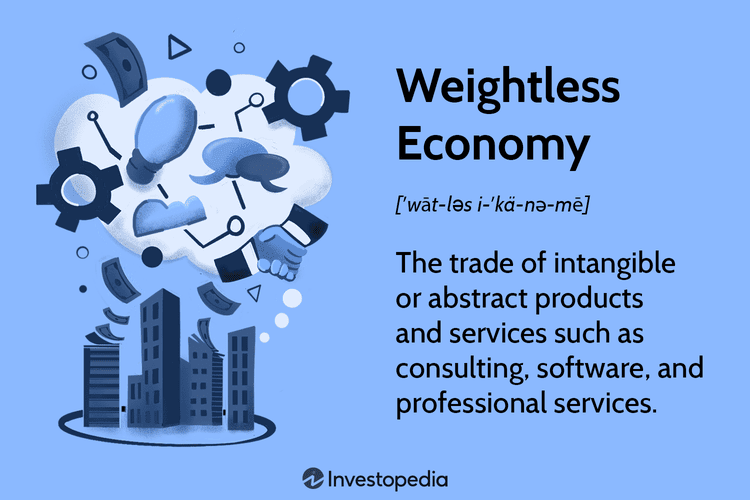

The global economy is undergoing a significant transformation, shifting from a foundation rooted in tangible, physical assets to a system predominantly driven by intangible assets. This evolving economy, often referred to as the "weightless economy," relies on assets that are not physical in nature, such as intellectual property, software, and data—each becoming increasingly vital in fostering modern economic growth. This transition holds profound implications for industries globally, particularly within the digital economy.

As technology continues to advance, intangible assets have emerged as critical components in shaping the landscape of businesses and markets. Intellectual property, including patents and trademarks, empowers companies to safeguard innovations and establish competitive market positions. Software, a lighthouse of productivity and efficiency, streamlines operations across diverse sectors. Data, often termed the "new oil," fuels decision-making processes, enabling businesses to tailor services and products to ever-evolving consumer demands.

Algorithmic trading, or "algo trading," epitomizes the intersection of these intangible assets with financial innovation. By utilizing complex software algorithms for executing trades at unparalleled speed and precision, algo trading capitalizes on the power of big data and advanced analytics. This integration not only highlights the profound impact of digital transformation on financial markets but also underscores the fusion of intellectual property, software, and data to achieve competitive advantage.

This article navigates the concept of the weightless economy and its implications across various sectors, examining the digital economy's rise and the burgeoning importance of intangible assets. Additionally, it highlights algorithmic trading's role in this transformative landscape, framing a narrative around the intricate interplay between intangible assets and financial innovation.

## Table of Contents

## Understanding the Weightless Economy

The weightless economy represents a dynamic and transformative sector where value arises from intangible elements such as information and ideas, as opposed to traditional, physical goods. This concept emphasizes a shift towards products and services that lack physical weight, driven by the proliferation of technology and seamless connectivity. In this evolving economic landscape, knowledge and creativity are the primary currencies, significantly enhanced by technological advancements and widespread access to the internet.

Key sectors that epitomize the weightless economy include technology services, digital media, and consulting. These industries capitalize on intellectual resources, digital content, and expertise to generate value and innovate continuously. For instance, technology services encompass cloud computing, software development, and IT consulting, offering solutions that optimize business processes without tangible deliverables. Digital media, comprising content creation, streaming services, and online advertising, leverages creative talents and technological platforms to engage audiences worldwide. Consulting firms utilize specialist knowledge to advise organizations on strategies, operational efficiencies, and market opportunities.

The transformation towards a weightless economy is driven by several factors, among which the global spread of the internet stands out. The internet facilitates the rapid exchange of information and provides an infrastructure for digital transactions and communications. As a result, businesses can operate internationally with reduced physical presence, reaching broader markets with unprecedented efficiency.

Data and analytics have emerged as crucial components in this economic paradigm. Organizations harness vast amounts of data to derive insights and inform decision-making processes, enabling more personalized and efficient services. Advanced analytics allows firms to predict trends, understand consumer behaviors, and optimize their operations, reinforcing the value generated from intangible assets.

Overall, the weightless economy represents a fundamental shift in how value is perceived and created, highlighting the importance of harnessing technology, creativity, and data. This transformation offers both challenges and opportunities, as industries must adapt to a landscape increasingly defined by intangibles. The continued evolution of digital infrastructure and analytic capabilities will likely accelerate the growth and influence of the weightless economy across the globe.

## The Rise of the Digital Economy

The digital economy represents a fundamental component of the weightless economy, distinctly characterized by its reliance on information technology. This new economic paradigm has redefined traditional business operations and competitive landscapes through the integration of e-commerce, online services, and digital content. These sectors have not only facilitated instantaneous global communications but also allowed businesses to reach vast markets with minimal physical presence.

E-commerce, encompassing business-to-consumer (B2C), business-to-business (B2B), and consumer-to-consumer (C2C) transactions, epitomizes the transformation of retail through digital platforms. Organizations like Amazon and Alibaba leverage digital technology to connect sellers with buyers worldwide, efficiently managing logistics and supply chains. Similarly, online services, including cloud computing, digital banking, and telemedicine, offer seamless accessibility and convenience, further promoting the proliferation of the digital economy.

Digital platforms and marketplaces have emerged as dominant industry players, offering various services that break down traditional barriers to entry. Their ascent has been driven by technological advancements and the widespread adoption of the internet, enabling businesses to operate with an unparalleled global reach. This transformation is largely attributed to the network effects, a phenomenon where the value of services or products increases as more individuals or entities engage with them. For instance, social media platforms like Facebook and search engines like Google become more valuable with each additional user, as they enhance connectivity and access to information.

In this interconnected economic structure, data has become a crucial asset, facilitating personalized marketing, customer profiling, and predictive analytics. Algorithms analyze immense datasets to produce insights that drive decision-making processes, offering competitive advantages and fostering innovation. This data-centric approach underscores the symbiotic relationship between technology and business models within the digital economy.

The rise of the digital economy has not been without challenges. Companies are compelled to adapt rapidly to technological advances and evolving consumer preferences. Furthermore, issues such as data privacy, cybersecurity, and digital infrastructure development demand continuous attention and robust solutions. Nevertheless, the digital economy presents unprecedented opportunities for innovation, efficiency, and growth across industries. Through strategic investments in technology and human capital, companies can harness the full potential of this economic revolution, positioning themselves advantageously in the global market landscape.

## The Role of Intangible Assets

Intangible assets have become an increasingly pivotal component of the modern economy, encompassing elements such as intellectual property (IP), brand reputation, and software. Unlike their tangible counterparts, intangible assets are characterized by their non-physical nature, offering the advantage of not undergoing deterioration over time. This characteristic enables businesses to derive substantial value from them without incurring significant ongoing costs, thus providing a mechanism for scalable growth.

Intellectual property is a primary form of intangible asset, encompassing patents, trademarks, copyrights, and trade secrets. These protect proprietary technologies and creative works, granting firms exclusive rights to exploit and monetize their innovations. Such legal protections provide a competitive edge by preventing rivals from duplicating products or services without permission, thereby fostering an environment conducive to innovation.

Brand reputation is another critical intangible asset, contributing to the intangible value through customer loyalty and brand equity. A strong brand can differentiate a company in the marketplace, commanding premium pricing and securing a loyal customer base. This, in turn, enhances the firm’s long-term profitability and market position.

Software, particularly in the form of proprietary applications and platforms, also represents a significant intangible asset. Custom software solutions can streamline operations, enhance productivity, and improve customer experiences, enabling companies to maintain a competitive advantage. The shift towards cloud-based solutions further exemplifies the strategic importance of software assets, allowing for greater flexibility and scalability.

However, assessing the value of intangible assets presents unique challenges. Traditional accounting practices often struggle to capture the true economic value of intangibles. This is due to their non-physical nature and the indirect ways they contribute to a company's financial performance. Various methods, such as the Relief from Royalty Method or the Excess Earnings Approach, are employed to estimate the value of intangible assets. Yet, these methods require careful consideration of market dynamics, growth projections, and potential risks.

In the context of decision-making, accurately measuring and valuing intangible assets is crucial. It allows businesses to make informed strategic decisions, ensures fair valuation in mergers and acquisitions, and provides transparency to investors. As the economy continues to evolve towards being more weightless, understanding and leveraging intangible assets will remain a cornerstone of sustainable competitive advantage and innovation.

## Algorithmic Trading in the Weightless Economy

Algorithmic trading has emerged as a pivotal innovation within the weightless economy, exemplifying the integration of intangible assets such as software algorithms and data-driven insights in financial markets. This advanced form of trading capitalizes on the technological dynamics of big data, predictive analytics, and [machine learning](/wiki/machine-learning), thereby transforming the traditional trading landscape.

Central to [algorithmic trading](/wiki/algorithmic-trading) is the use of highly sophisticated algorithms that execute trades at high velocity. Such algorithms are designed to analyze vast quantities of data, spotting patterns and trends that can be exploited for profit. Predictive analytics plays an essential role in this context by processing and analyzing historical and real-time market data to forecast future price movements with higher accuracy. Machine learning techniques further enhance these predictions by continuously adapting to new data and market conditions, thus improving decision-making processes.

One of the significant impacts of algorithmic trading is the increased [liquidity](/wiki/liquidity-risk-premium) it brings to financial markets. By automating trade execution, algorithms can respond to market signals and execute buy or sell orders almost instantaneously. This rapid response capability helps stabilize markets by narrowing bid-ask spreads and making it easier for buyers and sellers to transact without significant price concessions. Consequently, transaction costs are reduced, enabling more efficient allocation of capital.

Moreover, algorithmic trading improves price discovery—the process through which markets determine the price of assets. Algorithms can integrate information from multiple sources, allowing for prices to more accurately reflect the available information. This contributes to a more transparent and competitive trading environment.

However, the evolving regulatory landscape surrounding algorithmic trading presents both challenges and opportunities. Regulators are increasingly focused on ensuring transparency and mitigating risks associated with high-frequency trading strategies. Key areas of focus include establishing safeguards against market manipulation and systemic risks, which are heightened in fast-paced, automated trading environments. Ensuring that algorithms behave as intended requires robust testing and compliance protocols, which are critical for maintaining the integrity and stability of financial systems.

In summary, algorithmic trading showcases a modern application of intangible assets, harnessing cutting-edge technological advances to drive efficiency and innovation in financial markets. As it continues to evolve, its alignment with regulatory frameworks and risk management practices will play a crucial role in shaping its future trajectory.

## Challenges and Opportunities

The evolution towards a weightless economy creates both substantial opportunities for innovation and growth, and significant challenges that need addressing. One of the primary challenges in this digital-focused economy is the heightened risk of cybersecurity breaches. As businesses increasingly rely on intangible digital assets, the vulnerability to cyberattacks escalates, necessitating robust cybersecurity measures to protect sensitive information and maintain trust with consumers and stakeholders. Furthermore, data privacy concerns have intensified as massive volumes of personal and proprietary data are collected and processed. Companies must navigate complex privacy regulations and ensure transparent data handling practices to protect consumer rights and avoid legal repercussions.

Adapting to rapid technological advancements is another critical challenge. Businesses must remain agile in the face of continuously evolving digital tools and platforms. This includes staying updated with current technologies, reorienting business strategies to incorporate new digital solutions, and maintaining competitive relevancy. The reliance on digital assets also demands a shift in organizational culture, where innovation and agility are key drivers of success.

Despite these hurdles, the weightless economy offers remarkable opportunities, particularly for emerging markets. These regions have the potential to circumvent traditional industrialization pathways by leveraging digital technologies directly, thereby accelerating economic development. Access to digital platforms and services can empower local entrepreneurs, foster innovation, and enhance global competitiveness without the need for extensive physical infrastructure investments.

To capitalize on these opportunities, businesses should commit to significant investments in research and development to foster innovation. Building a skilled workforce capable of navigating the digital landscape is also essential. This requires strategic talent development initiatives, including education and training programs that equip employees with relevant digital skills. Furthermore, establishing strategic partnerships is crucial to harness digital capabilities, allowing businesses to share expertise, resources, and technology to drive mutual growth.

In summary, while the transition to a weightless economy presents notable challenges such as cybersecurity and data privacy issues, it simultaneously unlocks abundant opportunities for those who can adeptly navigate and innovate within this new economic paradigm.

## Conclusion

The transition to a weightless economy signifies a profound reshaping of the global economic landscape, underscoring the significance of intangible assets. Intangible assets, including intellectual property, software, and data, are becoming indispensable components of economic value and growth. This shift is propelled by digital transformation, which fuels innovation and competitive advantages across various sectors. Algorithmic trading exemplifies this digital shift, where software algorithms are employed for executing trades, thus optimizing market activities and enhancing liquidity.

In this rapidly evolving economic environment, it is imperative for stakeholders across industries to recognize and leverage the potential of intangible assets. Understanding how these assets generate value is key for businesses aiming to sustain competitiveness in the digital age. This involves not only adopting advanced technologies but also appreciating the nuanced challenges such as measurement and valuation of intangible assets, and addressing concerns like data privacy and cybersecurity.

Embracing change and nurturing innovation are paramount as we navigate this transformative era. Companies must focus on strategic investments in research and development, talent acquisition, and establishing collaborations that exploit digital capabilities. As we proceed further into this weightless economy, the ability to adapt, innovate, and efficiently utilize intangible assets will be determined as crucial to thriving in the global marketplace.

## References & Further Reading

[1]: Brynjolfsson, E., & McAfee, A. (2014). ["The Second Machine Age: Work, Progress, and Prosperity in a Time of Brilliant Technologies."](https://psycnet.apa.org/record/2014-07087-000) W.W. Norton & Company.

[2]: Haskel, J., & Westlake, S. (2018). ["Capitalism Without Capital: The Rise of the Intangible Economy."](https://www.jstor.org/stable/j.ctvc77hhj) Princeton University Press.

[3]: Nakamoto, S. (2008). ["Bitcoin: A Peer-to-Peer Electronic Cash System."](https://nakamotoinstitute.org/library/bitcoin/) 

[4]: BlackRock. (2020). ["The Rise of Sustainable Investing."](https://ir.blackrock.com/news-and-events/press-releases/press-releases-details/2020/BlackRock-Survey-Shows-Acceleration-of-Sustainable-Investing/default.aspx) 

[5]: Varian, H. R. (2014). ["Big Data: New Tricks for Econometrics."](https://www.jstor.org/stable/23723482) Journal of Economic Perspectives, 28(2), 3–28.