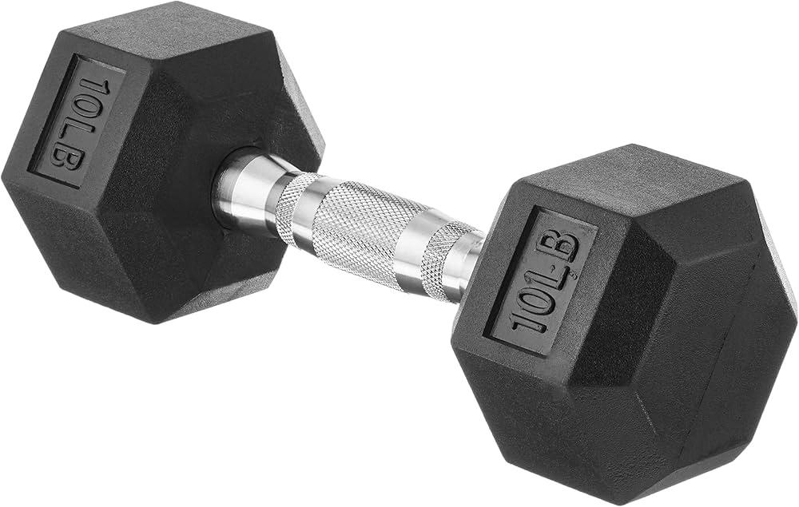

## Table of Contents

## What are weights and why are they used in fitness?

Weights are objects that people lift to make their muscles stronger. They can be things like dumbbells, barbells, or weight machines. When you lift weights, your muscles have to work harder than usual. This extra work helps your muscles grow bigger and stronger over time.

People use weights in fitness because they want to build muscle, get stronger, and sometimes look better. Lifting weights can also help you do everyday things more easily, like carrying heavy bags or climbing stairs. It's important to use weights the right way to avoid getting hurt, so many people work with a trainer or follow a good exercise plan.

## How do beginners start using weights safely?

If you're new to using weights, it's important to start slowly and safely. Begin by learning the right way to do exercises. You can watch videos, read guides, or work with a trainer who can show you how to lift weights correctly. Start with light weights that you can lift easily. This helps you learn the movements without hurting yourself. As you get better, you can slowly use heavier weights.

It's also good to warm up before you lift weights. You can do some light walking or stretching to get your muscles ready. When you're lifting, listen to your body. If something hurts, stop and rest. Don't try to lift too much too soon. It's better to go slow and steady. Over time, you'll get stronger and be able to lift more. Remember to rest between workouts so your muscles can recover and grow.

## What are the different types of weights available for home and gym use?

There are many types of weights you can use at home or in a gym. At home, you might use dumbbells, which are small weights you can hold in one hand. They come in different sizes, so you can start with light ones and move to heavier ones as you get stronger. Another option is kettlebells, which look like a ball with a handle. They are good for swinging and lifting exercises. You can also use resistance bands, which are stretchy bands that add resistance to your movements. They are light and easy to store.

In a gym, you will find more types of weights. Barbells are long bars that you can add weight plates to. They are good for exercises like squats and bench presses. Weight machines are another option. They guide your movements and can be easier to use if you're new to lifting. Some gyms also have cable machines, which use cables and pulleys to create resistance. You can adjust the weight and do many different exercises with them.

Both at home and in the gym, you can choose the type of weight that works best for you. It's important to pick weights that you can lift safely and that match your fitness goals. Whether you're at home or in a gym, starting with lighter weights and learning the right way to use them will help you get stronger and stay safe.

## What are the basic weightlifting exercises every beginner should know?

When you start lifting weights, it's good to know a few basic exercises. The first is the squat. You hold a barbell on your shoulders or use dumbbells, then bend your knees and hips to lower your body like you're sitting in a chair. Then, you stand back up. Squats help make your legs and butt stronger. Another exercise is the bench press. You lie on your back on a bench, hold a barbell or dumbbells above your chest, and then lower the weight to your chest and push it back up. This exercise works your chest, shoulders, and arms.

The deadlift is another important exercise. You stand in front of a barbell, bend down to grab it with both hands, and then stand up straight, lifting the weight off the ground. Deadlifts work your back, legs, and arms. The last exercise to know is the shoulder press. You can sit or stand, hold dumbbells or a barbell at shoulder height, and then push the weight up over your head and lower it back down. This exercise helps build your shoulder muscles. Learning these basic exercises will give you a good start in weightlifting and help you get stronger safely.

## How does one determine the right weight to lift for their fitness level?

When you start lifting weights, it's important to pick the right weight for your fitness level. You want to choose a weight that is heavy enough to make your muscles work hard, but not so heavy that you can't lift it properly. A good way to find the right weight is to start with something light. Try lifting it for the number of times, or reps, that your exercise plan says. If it feels too easy and you can do more reps than planned, the weight is too light. If you can't do the planned number of reps with good form, the weight is too heavy.

As you get stronger, you can slowly use heavier weights. It's important to listen to your body and not rush. If you feel pain or can't keep good form, the weight is probably too heavy. You should be able to finish your set of reps feeling like you worked hard, but not so tired that you can't do another set if you needed to. Over time, as you get better at lifting, you'll find the right weights that challenge you but keep you safe.

## What are the common mistakes to avoid when lifting weights?

One common mistake when lifting weights is using too much weight too soon. People often want to lift heavy weights to get strong fast, but this can lead to injuries. It's better to start with lighter weights and learn the right way to lift. As you get stronger, you can slowly use heavier weights. Another mistake is not using the right form. Bad form can hurt your muscles and joints. Always try to lift weights with the right technique, even if it means using lighter weights.

Another mistake is not resting enough between workouts. Your muscles need time to recover and grow after lifting weights. If you don't rest, you might feel tired and not get stronger. It's also important to breathe right when lifting. Holding your breath can make you feel dizzy and increase your blood pressure. Remember to breathe in when you start the lift and breathe out when you finish it. By avoiding these mistakes, you can lift weights safely and get stronger over time.

## How can weights be incorporated into a balanced fitness routine?

Weights can be a big part of a balanced fitness routine. You can lift weights a few times a week to help make your muscles stronger. It's good to mix different exercises like squats, bench presses, and shoulder presses. This helps work different parts of your body. You don't need to lift weights every day. It's better to give your muscles time to rest and grow between workouts. You can lift weights on some days and do other exercises like running or yoga on other days.

Along with lifting weights, it's important to do other types of exercise to stay healthy. You can add cardio exercises like walking, running, or cycling to help your heart and lungs. Stretching or doing yoga can help keep your muscles flexible and prevent injuries. Eating healthy food and drinking enough water also helps your body recover from lifting weights. By mixing weights with other exercises and taking care of your body, you can have a balanced fitness routine that keeps you strong and healthy.

## What are the benefits of progressive overload in weight training?

Progressive overload is when you slowly make your weightlifting harder over time. This can mean using heavier weights, doing more reps, or lifting weights more often. The main benefit of progressive overload is that it helps your muscles get stronger. When you lift the same weights all the time, your muscles get used to it and don't grow much. But if you keep making it harder, your muscles have to work more, and they get bigger and stronger.

Another benefit is that progressive overload can help you reach your fitness goals faster. If you want to lift heavier weights or look more muscular, slowly increasing the challenge is the best way to do it. It also keeps your workouts interesting and stops you from getting bored. Just remember to do it slowly and safely. Don't try to lift too much too fast, or you might get hurt. By adding a little more challenge each time, you can keep getting stronger and better at lifting weights.

## How do advanced techniques like supersets and drop sets enhance a weight training program?

Supersets and drop sets are advanced techniques that can make your weight training program more effective. Supersets are when you do two exercises back-to-back without resting in between. This can be two exercises for the same muscle group or for different muscle groups. Doing supersets can save you time and make your workout harder. Your muscles get tired faster because they don't get a break, which can help them grow bigger and stronger. It also keeps your heart rate up, so you get a bit of cardio while lifting weights.

Drop sets are another way to challenge your muscles more. In a drop set, you lift a heavy weight until you can't do any more reps, then quickly switch to a lighter weight and keep going. You keep dropping the weight and doing more reps until your muscles are totally tired out. Drop sets push your muscles to their limit, which can help them grow faster. They can also help you break through a plateau if you've been stuck at the same weight for a while. Both supersets and drop sets can make your workouts more intense and help you get better results from your weight training.

## What role does nutrition play in maximizing the benefits of weight training?

Nutrition is very important when you lift weights. The food you eat helps your muscles grow and get stronger. When you lift weights, you make tiny tears in your muscles. Eating the right food helps your body fix these tears and make the muscles bigger. Protein is really important because it's like the building blocks for muscles. Foods like chicken, fish, eggs, and beans have a lot of protein. You also need carbohydrates for energy. Foods like rice, bread, and fruits give you the energy you need to lift weights well.

It's not just about eating protein and carbs. You also need to drink enough water to stay hydrated. Water helps your body work right and keeps your muscles from getting too tight. Eating healthy fats, like those in nuts and avocados, can also help your body. And don't forget vitamins and minerals from vegetables and fruits. They help keep your body healthy and strong. By eating a good mix of these foods, you can get the most out of your weight training and help your muscles grow and recover well.

## How can one track progress and adjust their weight training program effectively?

To track your progress in weight training, you should keep a record of what you do in each workout. Write down how much weight you lift, how many times you lift it, and how many sets you do. You can use a notebook or an app on your phone to keep track. Every few weeks, look back at your records to see if you're lifting more weight or doing more reps than before. This will show you if you're getting stronger. Also, take pictures of yourself or measure your muscles to see if they're getting bigger. 

When you see that you're making progress, you can adjust your weight training program to keep getting better. If you can easily do more reps than your plan says, it's time to use heavier weights. If you're not getting stronger, you might need to change your exercises or do more sets. It's also important to listen to your body. If you feel tired or sore, you might need more rest days. Eating the right food and getting enough sleep will also help you keep making progress. By tracking and adjusting your program, you can keep getting stronger and reach your fitness goals.

## What are the latest trends and innovations in weight training equipment and methodologies?

One of the latest trends in weight training is the use of smart equipment. These are weights and machines that connect to apps on your phone or computer. They can track how much weight you lift, how many times you lift it, and even how fast you move. This helps you see your progress and make your workouts better. Another trend is using virtual reality (VR) for weight training. With VR, you can lift weights in a fun, game-like world. This can make your workouts more exciting and help you stay motivated.

Innovations in weight training methods include things like blood flow restriction training. This is when you use a special band to limit blood flow to your muscles while you lift lighter weights. It can help you get stronger even if you can't lift heavy weights. Another method is called eccentric training, where you focus on the part of the lift where you're lowering the weight slowly. This can make your muscles work harder and grow more. Both of these methods are becoming more popular as people look for new ways to get stronger and build muscle.

## What are the types of weighted strategies?

Weighted strategies in algorithmic trading involve the application of different weights to trading algorithms to achieve various objectives. These strategies help in optimizing trade execution and ensuring that the trading algorithm is responsive to market conditions.

Trend-following strategies leverage weights to give precedence to longer-term market signals compared to short-term market fluctuations. In these strategies, weights are used to ensure that significant trends are captured by the algorithm, minimizing the noise caused by short-term volatility. By assigning larger weights to longer-term indicators, traders can ensure that their algorithms focus on sustained movements in the market rather than reacting to minor price changes.

The Volume-Weighted Average Price (VWAP) strategy uses trading [volume](/wiki/volume-trading-strategy) to determine the importance of price data. VWAP is calculated by taking the average price a security has traded at throughout the day, weighted by volume. The formula for VWAP is:

$$
\text{VWAP} = \frac{\sum (\text{Price}_i \times \text{Volume}_i)}{\sum \text{Volume}_i}
$$

This approach helps in executing trades at a price that reflects the true market value of the asset, using volume as a weighing [factor](/wiki/factor-investing). Traders aim to buy below the VWAP or sell above it to ensure a more favorable trading position.

Mean reversion strategies focus on identifying and capitalizing on pricing deviations from an asset’s average price. Weights in these strategies are applied to track how prices oscillate around their mean. The reversion to mean is based on the assumption that prices and returns eventually move back towards the mean or average level. By weighing the historical pricing data, algorithms can identify overbought or oversold conditions, thereby offering opportunities to enter trades expecting prices to revert to their mean.

Each of these strategies requires precise configuration of weights to align with specific trading goals. A well-calibrated weighting system can significantly enhance the performance and accuracy of trading algorithms. To achieve this, traders often rely on historical data and backtesting to refine their weight assignments, ensuring that they meet the desired trading outcomes amidst varying market conditions.

## References & Further Reading

[1]: Bergstra, J., Bardenet, R., Bengio, Y., & Kégl, B. (2011). ["Algorithms for Hyper-Parameter Optimization."](https://proceedings.neurips.cc/paper/2011/file/86e8f7ab32cfd12577bc2619bc635690-Paper.pdf) Advances in Neural Information Processing Systems 24.

[2]: ["Advances in Financial Machine Learning"](https://www.amazon.com/Advances-Financial-Machine-Learning-Marcos/dp/1119482089) by Marcos Lopez de Prado

[3]: ["Evidence-Based Technical Analysis: Applying the Scientific Method and Statistical Inference to Trading Signals"](https://www.amazon.com/Evidence-Based-Technical-Analysis-Scientific-Statistical/dp/0470008741) by David Aronson

[4]: ["Machine Learning for Algorithmic Trading"](https://github.com/stefan-jansen/machine-learning-for-trading) by Stefan Jansen

[5]: ["Quantitative Trading: How to Build Your Own Algorithmic Trading Business"](https://books.google.com/books/about/Quantitative_Trading.html?id=j70yEAAAQBAJ) by Ernest P. Chan