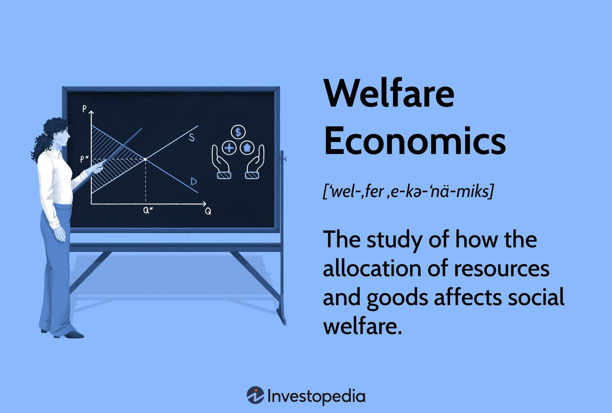

Economic theory is a comprehensive field that examines diverse topics essential for understanding human behavior within an economic context. Among the various branches, welfare economics stands out for its focus on resource allocation aimed at maximizing social welfare. This area of study evaluates how different economic policies and systems impact societal well-being, striving to achieve what is often referred to as economic efficiency and social welfare maximization.

Welfare economics employs several foundational concepts, such as Pareto efficiency—a situation in which resources cannot be reallocated to make one individual better off without making another worse off. This branch of economics provides a systematic approach to assessing public policies intended to enhance overall welfare, utilizing models like cost-benefit analysis and utility theory.



The integration of traditional economic theories with modern practices like algorithmic trading presents new dimensions for exploration and critique. Algorithmic trading, which uses computer algorithms for automating market trading, has significantly influenced market efficiency and price discovery. As artificial intelligence becomes increasingly involved in decision-making processes, it challenges conventional economic theories and introduces complexities regarding resource allocation and equity.

This article aims to explore key concepts and criticisms of welfare economics, as well as its relevance to current economic practices. We will also examine how technological advancements, such as algorithmic trading, impact economic theories. The evolution of these practices necessitates a comprehensive understanding of their intersections with welfare economics to devise policies that successfully integrate technological innovation while maintaining societal welfare.

## Table of Contents

## Understanding Welfare Economics

Welfare economics is a field that examines how economic policies and systems influence the overall well-being of society. It centers around key concepts such as economic efficiency, Pareto efficiency, and social welfare maximization. Economic efficiency occurs when resources are allocated in a way that maximizes the total benefit to society. Pareto efficiency, a core principle in welfare economics, is achieved when no individual can be made better off without making someone else worse off. These concepts form the basis for evaluating how well a society utilizes its resources.

Welfare economics equips policymakers with analytical tools to assess the benefits and drawbacks of various public policies aimed at enhancing societal welfare. Among these tools is cost-benefit analysis, which involves comparing the costs and benefits of a policy to determine its overall welfare impact. Utility theory, another key component, focuses on understanding and quantifying individual preferences and choices to evaluate overall societal welfare. This theory assumes that individuals act rationally, seeking to maximize their utility, or satisfaction, given their constraints.

Social welfare functions are mathematical representations that aggregate individual utilities into a single measure of societal welfare. These functions help policymakers balance trade-offs between equity and efficiency, aiming to achieve the highest possible social satisfaction. The formulation of a social welfare function involves ethical considerations, as it requires judgments about the relative importance of different individuals' welfare.

In practice, welfare economics often involves complex modeling and simulation to predict the outcomes of different policies. Analysts and economists use software tools and computational methods, including Python programming, to conduct these simulations. For instance, Python can be used to model utility functions and optimize resource allocation using libraries like NumPy and SciPy. Here is a simple example of calculating social welfare using a Python code snippet:

```python
import numpy as np

# Utility functions for individuals
def utility(x):
    return np.log(x)

# Aggregate social welfare function
def social_welfare(income_distribution):
    return sum(utility(income) for income in income_distribution)

# Example income distribution
incomes = [20000, 30000, 50000, 70000, 100000]

# Calculate the social welfare
welfare = social_welfare(incomes)
print("Social Welfare:", welfare)
```

This code snippet illustrates how individual utilities from an income distribution can be aggregated into a social welfare measure, reflecting the key principles of Pareto efficiency and economic efficiency. Welfare economics thus provides a structured approach to understanding and improving societal well-being through informed policy decisions.

## Key Theories and Concepts in Welfare Economics

Welfare economics is centered around concepts that aim to evaluate and improve societal well-being through resource allocation and policy formulation. A fundamental theory within this field is Pareto Efficiency, named after the Italian economist Vilfredo Pareto. It describes an optimal state where resources are allocated in such a way that no individual's situation can be improved without worsening another's condition. Mathematically, this can be expressed as a situation where no Pareto improvements are possible.

Another vital concept is Social Welfare Maximization, which seeks to adjust economic policies to achieve the highest level of societal satisfaction. This involves designing systems and interventions that maximize the aggregate welfare of a society. In practice, social welfare functions are employed to represent and evaluate the welfare of a society by aggregating individual utilities. A common approach is to use a utilitarian function, which sums individual utilities to form a collective measure of wellbeing:

$$
W = \sum_{i=1}^{n} U_i(x)
$$

where $W$ is the social welfare function, $U_i(x)$ is the utility of individual $i$, and $n$ represents the total number of individuals. 

These theories often rely on key assumptions, such as the measurability and comparability of individual utilities. Such assumptions make it possible to form aggregate measures of welfare. However, determining utility and comparing it across individuals is inherently challenging, as it necessitates subjective judgments and the acceptance of utility as a quantifiable metric.

Moreover, welfare economics frequently involves considerations of equity and fairness, especially in diverse societies with varying preferences and resources. The aim is to find a balance between efficiency and equity—an objective that requires nuanced strategies and often necessitates trade-offs. These foundational concepts and assumptions illustrate the complexity of aligning economic policies with the goal of maximizing social welfare.

## Criticism of Welfare Economics

Criticism of welfare economics often centers on the reliance on subjective judgments regarding utility and well-being. This subjectivity creates significant challenges when attempting to apply welfare economics in a manner that is both consistent and objective. Lionel Robbins was a prominent critic who argued that interpersonal utility comparisons, a fundamental aspect of welfare economics, lack a concrete basis because utility cannot be measured or compared between individuals with any degree of objectivity. Robbins maintained that because utility is inherently subjective, any comparison or aggregation used to inform policy is speculative at best.

Kenneth Arrow further analyzed these limitations through his groundbreaking work expressed in Arrow's Impossibility Theorem, also known as the General Possibility Theorem. This theorem demonstrates the difficulty in creating a social preference order—a method to rank societal welfare that adheres to a set of seemingly rational conditions. These conditions include unrestricted domain, non-dictatorship, Pareto efficiency, and independence of irrelevant alternatives. Arrow mathematically showed that no social welfare function can convert individual preferences into a collective decision while simultaneously fulfilling all these reasonable conditions, suggesting that constructing a comprehensive measure of social welfare based on individual utilities may be theoretically impossible.

Mathematically, the theorem can be presented as:
$$

\text{No function } f: (X_1, X_2, ..., X_n) \rightarrow R
$$
can exist, where $X_i$ represents individual preference orders, that satisfies the desired fairness criteria.

These criticisms underscore the inherent difficulties in utilizing welfare economics pragmatically, particularly in heterogeneous societies with complex social structures. The challenge of applying welfare economics lies in its theoretical underpinnings, which are often difficult to operationalize in diverse environments where individual well-being and preferences vary widely. This complexity implies that while welfare economics provides a framework for considering the implications of economic policies on societal well-being, it requires careful interpretation and adaptation to effectively inform public decision-making in practice.

## Algorithmic Trading and Economic Theory

Algorithmic trading, also known as automated or algo trading, employs computer algorithms to execute trading orders, often at speeds and frequencies that exceed human capabilities. This technological advancement plays a significant role in modern financial markets, altering market efficiency and the price discovery process. 

In traditional economic theory, market efficiency is a measure of how well market prices reflect all available information. According to the Efficient Market Hypothesis (EMH), if markets are perfectly efficient, prices should always incorporate and reflect all relevant information. Algorithmic trading contributes to this notion of efficiency by enabling rapid interpretation and incorporation of real-time data into asset pricing, arguably leading to more efficient markets.

However, the integration of [artificial intelligence](/wiki/ai-artificial-intelligence) within trading algorithms brings forth challenges to conventional economic theories. The central issue lies in the decision-making processes driven by algorithms as opposed to human judgment. Algorithms, especially those infused with [machine learning](/wiki/machine-learning) techniques, adapt to new information and patterns in ways that traditional models cannot predict, potentially altering the landscape of supply and demand dynamics. 

This shift brings new considerations for welfare economics, which seeks to understand optimal resource allocation for enhancing societal welfare. Algorithmic trading can influence this by affecting market [liquidity](/wiki/liquidity-risk-premium) and [volatility](/wiki/volatility-trading-strategies). High-frequency trading, a form of [algorithmic trading](/wiki/algorithmic-trading), can provide liquidity and narrower spreads, which are welfare-improving under certain conditions. Conversely, rapid trading might also cause market disruptions, such as the 2010 Flash Crash, leading to questions about stability and fairness—central themes in welfare economics. 

The impact of algorithmic trading on welfare economics extends to reshaping market dynamics and resource allocation. The ability of algorithms to predict and react to market movements more swiftly than human traders may lead to asymmetric benefits, potentially benefiting those with access to advanced technologies disproportionately. This could exacerbate existing disparities, raising concerns related to equity and justice in welfare economics. 

Recognizing algorithmic trading's potential to both enhance and disrupt market efficiency and social welfare prompts further exploration into appropriate regulatory frameworks. These frameworks aim to curb excesses while maintaining the liquidity and competitive advantages offered by such technologies. Understanding the synergy and conflict between algorithmic trading and economic theory is vital for policymakers and economists striving to align the benefits of technological advancement with societal welfare goals.

## Intersection of Welfare Economics and Algorithmic Trading

Algorithmic trading, powered by sophisticated algorithms and computing power, has drastically reshaped financial markets by enhancing both speed and efficiency in trade execution. This technological progression poses an interesting juncture for welfare economics, which traditionally focuses on optimal resource allocation to maximize social welfare. The integration of algorithmic trading with welfare economics presents opportunities for both alignment and contention, specifically regarding efficiency and equity.

The primary objective of welfare economics is to enhance social welfare, often assessed through Pareto efficiency and social welfare maximization. Algorithmic trading aligns with these objectives by potentially improving market efficiency. Fast and efficient trade execution can lead to more accurate price discovery, reducing [arbitrage](/wiki/arbitrage) opportunities and ensuring that prices reflect all available information. This can enhance the overall welfare of market participants by creating a more transparent and efficient market environment.

However, the potential disparities brought about by algorithmic trading highlight the limitations within welfare economics, particularly regarding equity. Algorithmic trading may benefit those with access to advanced technologies and data analytics, such as large financial institutions, potentially sidelining smaller participants and individuals. This disparity introduces a significant concern regarding equity, a core tenet of welfare economics, which seeks to ensure fair distribution of resources and opportunities.

Moreover, algorithmic trading can contribute to market concentration. Firms with more resources to develop and maintain sophisticated algorithms can dominate trading, influencing market prices and leading to greater income inequality. The welfare economics framework, which emphasizes distributional equity, must grapple with these challenges to address whether the benefits of increased efficiency outweigh potential inequities.

Regulatory considerations are crucial in aligning algorithmic trading with welfare economics' principles. Policymakers could employ measures such as ensuring equitable access to trading technology and implementing safeguards to prevent market manipulation and concentration. By doing so, they can aim to strike a balance between the benefits of efficiency and the potential drawbacks concerning equity.

In conclusion, the intersection of welfare economics and algorithmic trading offers both promising advancements and challenges. Aligning technological progress in trading with welfare economics' objectives requires a nuanced approach to policy and regulation to ensure that the efficiencies gained do not come at the cost of equity and fair market access.

## Conclusion

Welfare economics offers essential insights into the achievement of social good through thoughtfully crafted economic policies. It provides a framework for understanding how resources can be allocated to maximize social welfare, despite the inherent challenges. The criticisms aimed at welfare economics, particularly those concerning its reliance on subjective evaluations of utility and welfare, underscore the complexity of effectively measuring these concepts. As noted by influential economists such as Lionel Robbins and Kenneth Arrow, the absence of objective and universally accepted measurements complicates the application of theoretical models in real-world scenarios. Arrow's Impossibility Theorem further reveals the logical difficulties in creating a coherent social preference order, emphasizing that societal welfare cannot always be captured through simple aggregative metrics.

The rise of technologies like algorithmic trading signals an evolution in economic practices, which tests and expands traditional economic theories. Algorithmic trading introduces artificial intelligence and computational power into financial markets, affecting market efficiency and price discovery. This technological advancement demands a reconsideration of economic principles and their relevance to modern economic phenomena. The impact of algorithmic trading on welfare economics lies in its potential to influence market dynamics and the efficient allocation of resources, posing both opportunities and risks.

Understanding these intersections between welfare economics and technological innovation is essential for developing policies that effectively harness technology while safeguarding societal welfare. Policymakers must address the disparities which technological advancements like algorithmic trading might introduce, ensuring that the goals of economic efficiency and social welfare are aligned. The continued exploration of these areas is vital for crafting economic policies that support robust societal development in an increasingly technologically driven world.

## References & Further Reading

[1]: Atkinson, A.B., & Stiglitz, J.E. (1980). ["Lectures on Public Economics."](https://www.jstor.org/stable/2232622) McGraw-Hill.

[2]: Arrow, K.J. (1951). ["Social Choice and Individual Values."](https://www.jstor.org/stable/j.ctt1nqb90) Yale University Press.

[3]: Samuelson, P.A. (1947). ["Foundations of Economic Analysis."](https://archive.org/details/in.ernet.dli.2015.150369) Harvard University Press.

[4]: Sen, A. (1970). ["Collective Choice and Social Welfare."](https://www.hup.harvard.edu/books/9780674919211) Holden-Day.

[5]: Varian, H. R. (1992). ["Microeconomic Analysis."](https://archive.org/details/microeconomicana00vari_0) W.W. Norton & Company.

[6]: Lopez de Prado, M. (2018). ["Advances in Financial Machine Learning."](https://www.amazon.com/Advances-Financial-Machine-Learning-Marcos/dp/1119482089) Wiley.

[7]: Chan, E.P. (2009). ["Quantitative Trading: How to Build Your Own Algorithmic Trading Business."](https://github.com/ftvision/quant_trading_echan_book) Wiley.

[8]: Robbins, L. (1932). ["An Essay on the Nature and Significance of Economic Science."](https://milescorak.com/wp-content/uploads/2020/02/robbins-essay-nature-significance-economic-science.pdf) Macmillan and Co.