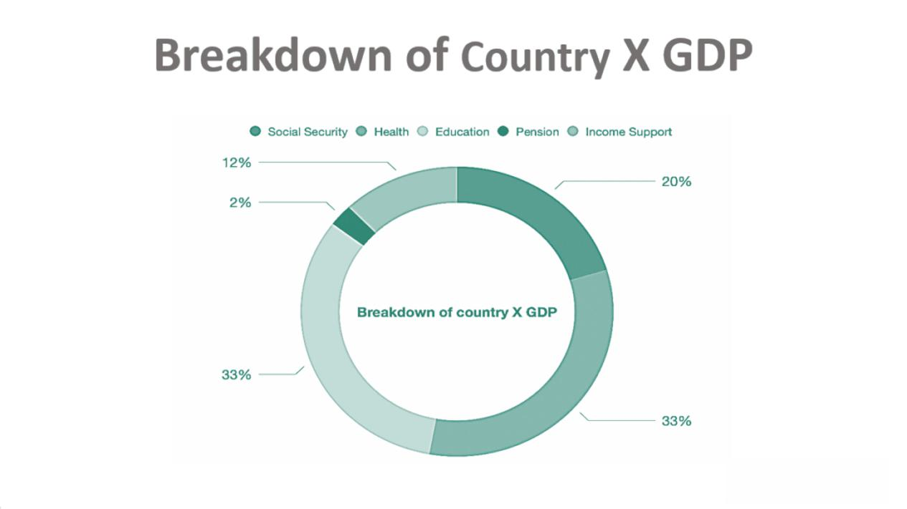

The interplay between welfare systems and algorithmic trading underscores critical aspects of modern socio-economic and financial landscapes. This article investigates the characteristics of welfare systems, establishing key frameworks that determine the eligibility and distribution of social aid programs, and the ways algorithmic trading facilitates operations within financial markets.

Welfare programs, integral to maintaining socio-economic balance, vary widely in structure and function. They encompass diverse categories designed to aid individuals and families in need, aiming to promote a stable standard of living and access to essential services. Understanding these systems involves exploring various types of assistance, such as cash transfers and in-kind benefits, while delving into detailed criteria that govern eligibility for aid.



Simultaneously, algorithmic trading represents the intersection of technology and market functionality, employing automated systems for executing trades based on defined strategies. Its significance is rooted in bringing efficiency and precision to financial markets while enhancing liquidity and pricing dynamics.

The intent of this comprehensive guide is to combine knowledge of socio-economic support mechanisms with insights into financial trading, revealing interdependencies that exist between social welfare operations and market-oriented technological advancements. Emphasizing the importance of welfare program types and eligibility criteria highlights the societal focus on equity and access. In parallel, exploring the impact of technology in financial markets underlines the role of innovation in shaping economic frameworks.

Understanding this duality is crucial, as both welfare systems and algorithmic trading fundamentally influence financial stability and social welfare. Through this exploration, the article seeks to provide a nuanced perspective on how these elements collectively contribute to a balanced, equitable society.

## Table of Contents

## Understanding Welfare Systems

Welfare systems are designed to provide financial aid and support to individuals and groups who face economic hardships, ensuring they have access to basic needs and services. The core objective of these systems is to maintain a healthy standard of living by mitigating poverty and reducing inequality. Welfare systems achieve these goals through diverse types of assistance programs that fall into categories such as cash transfers, in-kind benefits, and social insurance programs.

Cash transfers constitute direct monetary payments to eligible individuals or families, enabling them to fulfill their financial needs autonomously. These programs are often perceived as empowering recipients by providing them with the flexibility to spend where they see fit. In the United States, the Temporary Assistance for Needy Families (TANF) is a prominent example of a cash transfer program, aiming to assist low-income families with children by offering temporary financial aid and helping parents find employment.

In-kind benefits provide specific goods or services rather than cash, ensuring that recipients have direct access to essential commodities. These benefits often cover areas such as nutrition, housing, and healthcare. The Supplemental Nutrition Assistance Program (SNAP), which provides food-purchasing assistance to low- and no-income individuals, exemplifies an in-kind benefit program. Similarly, housing vouchers may be issued to subsidize rent payments, ensuring secure housing for those in need.

Social insurance programs are structured based on prior contributions from participants, typically through payroll taxes. These programs operate on the principle of shared risk and mutual benefit, providing coverage against life risks like unemployment, disability, or retirement. Social Security and Unemployment Insurance are key examples of social insurance initiatives in the U.S. Social Security provides financial protection to retired individuals, survivors of deceased workers, and disabled persons, while Unemployment Insurance offers temporary financial support to individuals who have lost their jobs involuntarily.

Ensuring access to healthcare services is another critical aspect of welfare systems, with programs like Medicaid and the Affordable Care Act (ACA) playing a significant role. Medicaid offers free or low-cost healthcare services to eligible low-income individuals, families, and children, while the ACA aims to expand healthcare access and improve quality.

In summary, welfare systems are integral to maintaining an equitable society by providing financial assistance and essential services to those in need. Their diverse programmatic approaches ensure that different facets of economic insecurity, such as food, shelter, and healthcare, are addressed comprehensively.

## Types of Welfare Programs

Welfare programs are essential components of a nation's social safety net, designed to provide support and assistance to individuals and families in need. These programs can be broadly categorized into several types, each serving a distinct purpose and population.

**Cash Transfers** are direct monetary payments made to eligible individuals or families, aiming to offer immediate financial relief. One prominent example in the United States is the Temporary Assistance for Needy Families (TANF) program, which provides financial assistance to families with children where one or both parents are either absent, incapacitated, or unemployed. Another concept often discussed is Universal Basic Income (UBI), a proposed model of social security in which all citizens receive a regular, unconditional sum of money from the government.

**In-Kind Benefits** refer to the provision of specific goods or services directly, rather than providing cash. This approach ensures that assistance is used for its intended purpose. Notable examples include the Supplemental Nutrition Assistance Program (SNAP), which offers food-purchasing assistance to low-income individuals and families, and housing vouchers that help cover the cost of rent. These benefits are crucial for ensuring basic needs are met, such as adequate nutrition and safe housing.

**Social Insurance** programs are designed based on the principle of previous contributions by the individuals or their employers, and they typically function as a form of risk management. In the U.S., Social Security is a well-known program providing retirement, disability, and survivor benefits to individuals who have paid into the system through payroll taxes during their working years. Unemployment Insurance is another key social insurance program, offering temporary financial assistance to workers who have lost their jobs through no fault of their own, provided they meet certain eligibility criteria.

**Health Benefits** are crucial for ensuring access to healthcare services. These programs aim to provide medical care and improve health outcomes for low-income and vulnerable populations. Medicaid stands as a major healthcare program in the United States, offering coverage to eligible low-income adults, children, pregnant women, elderly adults, and people with disabilities. Additionally, the Affordable Care Act (ACA) has expanded healthcare coverage and access through various provisions, including the establishment of health insurance exchanges and the expansion of Medicaid eligibility.

These welfare program types play a critical role in mitigating poverty, reducing inequality, and supporting economic stability by cushioning individuals against life's uncertainties and promoting equal access to essential services.

## Welfare Eligibility Criteria

Eligibility for welfare programs is heavily influenced by several key factors, primarily focusing on income levels, family size, and residency status. These criteria ensure that aid is directed toward those most in need and help maintain the sustainability and efficiency of the programs.

Income levels are a critical determinant, commonly assessed against a set benchmark such as the federal poverty level. This threshold varies depending on economic conditions and is adjusted annually. For instance, a household with an income below this level is typically deemed eligible for assistance. The determination can be represented mathematically as:

$$
\text{Eligibility} = 
  \begin{cases} 
  \text{Eligible} & \text{if } \text{Income} < \text{Federal Poverty Level} \\
  \text{Not Eligible} & \text{otherwise}
  \end{cases}
$$

Here, the "Income" denotes the total household income, while the "Federal Poverty Level" is the threshold set by the government.

Family size is another crucial parameter, as larger families often require greater resources to maintain their standard of living. Many welfare programs scale their income eligibility thresholds according to household size, recognizing that needs grow incrementally with each additional member. For example, a family of four might have a higher eligibility income limit compared to a single individual.

Residency status also plays a significant role in determining eligibility. Applicants typically need to prove legal residency within the country or state offering the aid. This requirement ensures that the benefits are reserved for residents contributing to the state's economy through taxes or permanent presence. Some programs impose citizenship requirements, whereas others may allow certain legal immigrants to qualify under specific conditions.

Moreover, caseworker assessments can be vital in confirming eligibility. This process involves reviewing the evidence provided by applicants, such as pay stubs, tax returns, and identification documents, to validate the reported income and residency. The human element ensures that the process is not solely reliant on automated checks, accommodating unique circumstances that might affect an applicant's eligibility.

Overall, eligibility criteria are designed to fairly and effectively allocate resources to those in need, supporting the foundational aim of welfare programs to alleviate poverty and improve access to essential services. These criteria are continuously evaluated and updated to reflect changing socio-economic landscapes, ensuring that welfare programs remain relevant and effective.

 to Algorithmic Trading

Algorithmic trading, often referred to as "algo trading," uses sophisticated technological solutions to automate financial trading activities based on strategic coding and predictive algorithms. This modern approach to trading leverages the power of computers to execute trades with high efficiency and minimal human intervention. 

### Benefits of Algorithmic Trading

1. **Speed:** One of the primary advantages of algorithmic trading is its speed. Trades can be executed in fractions of a second, allowing the trading system to capitalize on fleeting market opportunities that are imperceptible to human traders. This is particularly beneficial in markets that move quickly, such as the stock market or forex.

2. **Precision:** With algorithms, trades are executed with a level of precision that eliminates the errors typically associated with manual trades. The predefined strategies ensure that trades are made exactly as intended, reducing the impact of human emotion and error.

3. **Backtesting Capabilities:** Algorithmic strategies can be rigorously tested on historical data to evaluate their viability before live deployment. This backtesting process enables traders to refine strategies, improving their potential for success in live markets. For example, a Python script can be used to simulate algorithm performance:
   ```python
   import pandas as pd

   # Load historical data
   data = pd.read_csv('historical_data.csv')

   # Simple moving average strategy
   def moving_average_strategy(data, short_window, long_window):
       signals = pd.DataFrame(index=data.index)
       signals['signal'] = 0.0

       # Calculate the short and long moving averages
       signals['short_mavg'] = data['close'].rolling(window=short_window, min_periods=1).mean()
       signals['long_mavg'] = data['close'].rolling(window=long_window, min_periods=1).mean()

       # Generate signals
       signals['signal'][short_window:] = np.where(signals['short_mavg'][short_window:] > signals['long_mavg'][short_window:], 1.0, 0.0)

       return signals

   # Backtest the strategy
   signals = moving_average_strategy(data, 40, 100)
   ```

### Applications in Financial Markets

Algorithmic trading sees widespread application across various financial markets due to its numerous benefits. In stock markets, algo trading accounts for a significant portion of total trades, often harnessing high-frequency trading ([HFT](/wiki/high-frequency-trading-strategies)) techniques to gain competitive advantages. Forex trading similarly benefits from algo trading, with algorithms analyzing currency pairs to execute trades that may exploit small price differentials. Additionally, the burgeoning field of [cryptocurrency](/wiki/cryptocurrency) trading relies heavily on algorithmic systems to navigate its highly volatile market environment efficiently.

By integrating advanced technologies, [algorithmic trading](/wiki/algorithmic-trading) continues to optimize trading operations, redefine market dynamics, and set new standards for both institutional and retail traders.

## Role of Algorithmic Trading in Financial Markets

Algorithmic trading, often known as algo trading, revolutionizes financial markets by leveraging computational power to analyze expansive datasets and execute trades at speeds unattainable by human traders. This technological prowess brings several benefits, notably in enhancing market [liquidity](/wiki/liquidity-risk-premium) and influencing pricing dynamics, particularly through the lens of high-frequency trading (HFT).

High-frequency trading, a subset of algorithmic trading, involves executing a large number of orders at extremely high speeds. The algorithms engage in millisecond-level timing to identify and capitalize on fleeting market inefficiencies. The strategic advantage here lies in the capacity of these systems to react to market conditions swiftly, thus facilitating a greater [volume](/wiki/volume-trading-strategy) of transactions, which enhances overall market liquidity. According to a study by Brogaard et al. (2014), HFT firms were found to provide beneficial liquidity, with their strategies contributing to a more efficient price discovery process and reduced bid-ask spreads.

Additionally, algorithmic trading can impact pricing behaviors by engaging in strategies that exploit temporary price discrepancies between correlated assets—a practice known as [arbitrage](/wiki/arbitrage). Algorithms designed for [statistical arbitrage](/wiki/statistical-arbitrage) analyze price data rapidly to detect and act on these discrepancies. For example, if two stocks that usually move together start to diverge in their price paths, an algorithm can execute trades to profit from this divergence with the expectation that the relationship will revert to the mean.

Moreover, advanced algorithms incorporate [machine learning](/wiki/machine-learning) techniques to predict market trends based on historical data patterns. These predictive models can process complex, multifactor datasets to identify subtle patterns or signals that might indicate future movements. For instance, linear regression or more sophisticated techniques like neural networks can forecast price movements by considering variables such as trading volumes, historical prices, and even sentiment analysis from news and social media.

The influence of algo trading in financial markets is profound, yet it's not without challenges. The speed and complexity of these strategies sometimes trigger unintended market consequences, such as flash crashes, where rapid selling overwhelms the market, leading to sudden, drastic price drops. Despite these risks, algo trading remains an integral component of modern financial markets, enhancing their efficiency and offering new strategies for traders to explore.

In conclusion, the role of algorithmic trading in financial markets is multi-faceted, affecting everything from liquidity to pricing accuracy. Its ongoing evolution promises further shifts in how markets operate, underscoring the necessity for a balance between innovation and regulation to harness its benefits while mitigating potential risks.

## Challenges and Criticisms of Welfare and Algorithmic Trading

Welfare programs and algorithmic trading have garnered significant attention due to their complexities and implications within their respective fields. Welfare systems have been criticized for their financial burden on government budgets and the potential to create dependency among recipients. These programs often require substantial government funding, which can strain financial resources, especially during economic downturns. Critics argue that welfare benefits might discourage individuals from seeking employment, leading to a dependency trap. This concern implies that recipients could remain reliant on aid rather than improving their socio-economic status, which could undermine the program's objectives of promoting self-sufficiency and upward mobility.

On the algorithmic trading front, the use of automated systems in financial markets has raised concerns about market [volatility](/wiki/volatility-trading-strategies) and the occurrence of flash crashes. These systems, designed to execute trades at high speed and volume, can inadvertently lead to significant market disruptions. For instance, errors in algorithm design or implementation can result in unintended massive sell-offs or purchases, destabilizing prices and creating temporary chaos in the market. Flash crashes, rapid price declines within a short period, have been attributed to algorithmic trading, exemplifying the risks associated with its high-frequency nature.

There is an ongoing debate regarding the sustainability and efficiency of welfare programs and the need for regulation in algorithmic trading. To ensure welfare programs are sustainable, governments must constantly assess and re-evaluate eligibility criteria, funding mechanisms, and objectives to address both short-term needs and long-term socio-economic goals. Additionally, to mitigate the risks associated with algorithmic trading, regulatory bodies are exploring measures such as imposing circuit breakers, enhancing transparency, and establishing robust risk management protocols to prevent and respond to unexpected market anomalies.

The discourse surrounding these topics highlights the necessity for a balanced approach. Effective regulation and innovative solutions are essential for optimizing the benefits of welfare programs and algorithmic trading while minimizing their potential downsides. Addressing these challenges is crucial for maintaining economic stability and advancing the equitable distribution of resources in society.

## Conclusion

Understanding the socio-economic impact of welfare systems and the role of algorithmic trading in financial markets is essential for informed discourse around these critical components of modern society. Welfare systems and algorithmic trading, while distinctly different, are both fundamental to achieving financial stability and social welfare.

Welfare systems are designed to provide a safety net for individuals and families, ensuring that essential needs are met despite economic hardships. The ongoing challenge is to balance the cost of these programs with their benefits, addressing criticisms related to potential dependency while optimizing the criteria for eligibility to reach those genuinely in need. Innovations in determining welfare eligibility can make these systems more robust and targeted, ensuring assistance is both efficient and effective.

Algorithmic trading, with its speed and precision, has revolutionized the financial markets. It has made markets more liquid and efficient, but also introduced complexities such as market volatility and the risk of flash crashes. The evolution of trading algorithms must be closely monitored and regulated to prevent misuse and market disruptions. As algorithms become more sophisticated, there is an opportunity to enhance market stability through more accurate prediction models and diversified trading strategies.

Future innovations in welfare and algorithmic trading can catalyze positive changes across both fields. For welfare, embracing technologies such as data analytics could enhance the accuracy and fairness of eligibility assessments, thereby refining resource allocation and minimizing fraud. In algorithmic trading, incorporating advanced machine learning models can improve risk management and optimize trading performance.

The convergence of social welfare and financial technology holds the potential to build a more equitable society. By leveraging advancements in both domains, policymakers and financial institutions can foster environments that not only support economic growth but also ensure that growth translates into broader societal benefits. Ultimately, this synergy can lead to enhanced stability, reduced inequality, and a more inclusive economy.

## References & Further Reading

[1]: Bergstra, J., Bardenet, R., Bengio, Y., & Kégl, B. (2011). ["Algorithms for Hyper-Parameter Optimization."](https://papers.nips.cc/paper/4443-algorithms-for-hyper-parameter-optimization) Advances in Neural Information Processing Systems 24.

[2]: Brogaard, J., Hendershott, T., & Riordan, R. (2014). ["High-Frequency Trading and Price Discovery."](https://www.jstor.org/stable/24465658) The Review of Financial Studies, 27(8), 2267–2306.

[3]: ["Advances in Financial Machine Learning"](https://www.amazon.com/Advances-Financial-Machine-Learning-Marcos/dp/1119482089) by Marcos Lopez de Prado

[4]: Aronson, D. R. (2006). ["Evidence-Based Technical Analysis: Applying the Scientific Method and Statistical Inference to Trading Signals."](https://www.amazon.com/Evidence-Based-Technical-Analysis-Scientific-Statistical/dp/0470008741) John Wiley & Sons.

[5]: Jansen, S. (2018). ["Machine Learning for Algorithmic Trading: Predictive models to extract signals from market and alternative data for systematic trading strategies with Python."](https://www.amazon.com/Machine-Learning-Algorithmic-Trading-alternative/dp/1839217715) Packt Publishing.

[6]: Chan, E. P. (2008). ["Quantitative Trading: How to Build Your Own Algorithmic Trading Business."](https://github.com/ftvision/quant_trading_echan_book) John Wiley & Sons.

[7]: Welfare: Issues and Conflicts. The Economist. (n.d.). Retrieved from https://www.economist.com/special-report/1995/12/07/welfare-issues-and-conflicts

[8]: Zeng, X., & Luo, Y. (2013). ["Study of the Risks of Algorithmic Trading."](https://onlinelibrary.wiley.com/doi/10.1002/adfm.202003619) Procedia Computer Science, Elsevier.