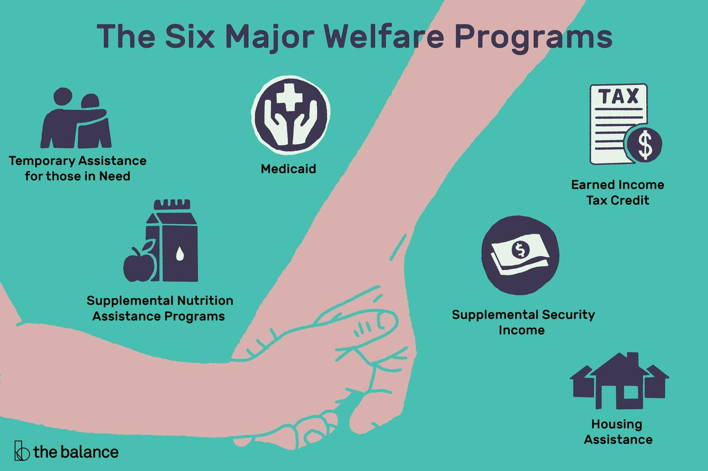

## Table of Contents

## What is welfare and why is it important?

Welfare refers to the various programs and services provided by the government to help people who are in need. This can include things like money to help pay for food, housing, and healthcare. Welfare is important because it helps make sure that everyone in society has their basic needs met, even if they are going through tough times like losing a job or facing health problems.

Having welfare programs is crucial because they support people when they can't support themselves. This can prevent bigger problems like homelessness or serious health issues. When people get the help they need, they can focus on getting back on their feet and contributing to society again. Welfare also promotes fairness by giving everyone a chance to live a decent life, no matter their situation.

## What are the main types of welfare programs?

Welfare programs come in different types, but they all aim to help people in need. One main type is cash assistance, like Temporary Assistance for Needy Families (TANF). This program gives money to families with children who are struggling financially. Another type is food assistance, such as the Supplemental Nutrition Assistance Program (SNAP), which helps people buy food. There are also housing programs, like Section 8, that help people pay for a place to live.

Another important type of welfare is healthcare assistance. Programs like Medicaid provide free or low-cost health care to people with low incomes. For older people, there's Medicare, which helps with medical costs. There are also programs that help with other needs, like job training and education. These programs, like Workforce Innovation and Opportunity Act (WIOA), help people learn new skills so they can find better jobs.

All these welfare programs work together to support people in different ways. They help make sure that everyone can have food, a home, healthcare, and a chance to improve their lives. By offering these services, welfare programs help create a fairer society where everyone has the support they need to live well.

## Who is eligible for welfare benefits?

People can get welfare benefits if they meet certain rules set by the government. Usually, you need to have a low income or be in a tough situation. For example, families with children might get help if they don't earn enough money. Some programs, like SNAP, look at how much money you make and how many people are in your family. If you're elderly or disabled, you might be able to get help too, like with Medicare or Medicaid.

Different programs have different rules. For TANF, you need to have kids and be very low income. SNAP looks at your income and how much you spend on things like rent. Section 8 housing help is for people who don't make enough to pay for a good place to live. To get job training help from WIOA, you might need to show that you're out of work or need new skills. Each program has its own way to decide who can get help, but they all want to support people who really need it.

## How does one apply for welfare?

To apply for welfare, you need to find out which program you want to apply for and then contact the right place. For example, if you want help with food, you might apply for SNAP. You can usually apply online, by mail, or in person at a local office. You'll need to fill out a form with information about your income, your family, and your situation. Sometimes, you might need to provide proof of your income, like pay stubs, or other documents.

After you send in your application, someone will look at it to see if you can get help. This can take some time, so be patient. If you're approved, you'll start getting the help you need, like money for food or help with housing. If you're not approved, you can usually ask why and sometimes even appeal the decision. It's important to keep your information up to date and report any changes in your situation, like if you get a new job or if your family size changes.

## What are the income limits for welfare eligibility?

Income limits for welfare eligibility can be different for each program. For example, SNAP looks at how much money you make and how many people are in your family. If your income is below a certain level, you might be able to get help. For a family of four, you might be able to get SNAP if you make less than around $2,800 a month. But these numbers can change and might be different in different places.

TANF has its own rules too. This program is for families with children, and the income limit is usually very low. For a family of three, you might be able to get TANF if you make less than about $800 a month. Again, these numbers can change and might be different depending on where you live. It's important to check with your local office to find out the exact numbers for your area.

Medicaid also has income limits, but they can be different from SNAP and TANF. For example, a family of four might be able to get Medicaid if they make less than around $3,000 a month. But like the other programs, these numbers can change and might be different in different states. Always check with your local office to find out the exact income limits for the programs you're interested in.

## How do welfare programs vary by state or country?

Welfare programs can be different in each state or country. In the United States, each state can decide some things about how to run programs like SNAP or TANF. For example, the income limits for SNAP might be a little different in California than in Texas. Also, some states might give more money to families through TANF than others. This means that what kind of help you can get might depend on where you live.

In different countries, welfare programs can be very different too. Some countries, like Sweden, have big welfare systems that give a lot of help to people. They might give free healthcare and good unemployment benefits. Other countries, like the United States, might have smaller welfare programs and people might need to pay for some things themselves. The rules for who can get help and how much help they get can be very different from one country to another.

## What are the differences between social security and welfare?

Social security and welfare are both ways the government helps people, but they are different. Social security is a program that mostly helps people who are retired or have disabilities. It gives them money every month to help them live. People usually pay into social security while they work, so it's like getting money back when they need it. You can get social security if you've worked long enough and paid into the system.

Welfare, on the other hand, is for people who need help right away, no matter if they worked or not. It includes programs like SNAP for food, TANF for cash help, and Medicaid for healthcare. Welfare is for people who don't have enough money to take care of their basic needs. You don't have to pay into welfare programs to get help; you just need to meet the rules, like having a low income. So, while social security is more for long-term help after working, welfare is for immediate help when you're in need.

## How is welfare funded and what are the economic impacts?

Welfare is funded by taxes that people and businesses pay. The government takes this money and uses it to help people who need it through different programs. For example, money from taxes helps pay for SNAP, which gives people money to buy food, and Medicaid, which helps with healthcare costs. The amount of money that goes to welfare can change depending on how much the government decides to spend and how much money they get from taxes.

The economic impacts of welfare can be good and bad. On the good side, welfare helps people who are struggling to get by. This can keep them from falling into even bigger problems, like homelessness or serious health issues. When people get help, they can spend money on things like food and housing, which helps the economy. On the bad side, some people worry that too much welfare might make people not want to work as hard. This could slow down the economy if fewer people are working. But overall, welfare helps make sure everyone has a chance to live a decent life, which can be good for the economy in the long run.

## What are the common criticisms of welfare systems?

Some people think welfare systems have problems. One big criticism is that welfare might make people not want to work. They think if people can get money or help without working, they might choose not to get a job. This could be bad for the economy because fewer people would be working and making things. Another criticism is that welfare costs a lot of money. The government has to use a lot of tax money to pay for these programs, and some people think this money could be used for other things, like fixing roads or helping schools.

But there are also other worries about welfare. Some people say that the rules for who can get help can be too strict or too easy. If the rules are too strict, people who really need help might not get it. If the rules are too easy, people who don't really need help might get it. This can make people upset and feel like the system is not fair. Also, some people think that welfare doesn't always help people get better in the long run. They say that instead of just giving money or food, welfare should help people learn new skills or find jobs so they can take care of themselves.

## How do welfare policies affect employment and poverty rates?

Welfare policies can help lower poverty rates by giving people money and other help when they need it. If someone loses their job or can't work because they are sick, welfare can help them pay for food and a place to live. This keeps them from becoming homeless or going hungry. By making sure people have their basic needs met, welfare can stop poverty from getting worse. Programs like SNAP and TANF give money to families so they can take care of their kids and stay out of poverty.

On the other hand, some people worry that welfare might make it harder for people to find jobs. They think if people can get money without working, they might not look for a job as hard. This could lead to more people not working, which can be bad for the economy. But, some welfare programs also help people get jobs. Programs like WIOA give people training and help them find work. So, while welfare can help with poverty right away, it's important to have programs that also help people get back to work so they can support themselves in the long run.

## What reforms have been proposed or implemented to improve welfare systems?

People have come up with different ideas to make welfare systems better. One big change that has happened is making rules that help people find jobs. Programs like TANF now have time limits and work requirements. This means people can only get help for a certain time, and they have to try to find a job while they get help. The idea is to help people get back on their feet and not stay on welfare forever. Another change is making it easier to apply for help. Some places now let people apply online or by phone, so it's not as hard to get the help they need.

Another idea to improve welfare is to focus more on helping people learn new skills. Some people think welfare should give more money for job training and education. This way, people can learn to do new jobs and make more money. It's about helping people in the long run, not just giving them money for a short time. There are also ideas about making the rules for welfare fairer. Some people want to make sure the rules are not too strict or too easy, so the right people get help. These changes can make welfare work better for everyone.

## How does welfare policy intersect with other social policies like healthcare and education?

Welfare policy is closely linked with healthcare and education policies. Welfare programs like Medicaid help people get the healthcare they need when they can't afford it. This is important because good health is a basic need. If people can't get healthcare, they might get very sick and not be able to work or take care of their families. Welfare also helps with education by giving money for things like school lunches through programs like SNAP. This makes sure kids can eat and focus on learning, which is important for their future.

These connections mean that welfare, healthcare, and education policies all work together to help people live better lives. If someone loses their job, welfare can help them pay for food and a place to live, while healthcare programs keep them healthy. At the same time, education programs help their kids learn and grow. By working together, these policies can help people get back on their feet and build a better future. Making sure these policies work well together is important for helping everyone in society.

## What are the Welfare Eligibility Criteria?

Eligibility for welfare programs is heavily influenced by several key factors, primarily focusing on income levels, family size, and residency status. These criteria ensure that aid is directed toward those most in need and help maintain the sustainability and efficiency of the programs.

Income levels are a critical determinant, commonly assessed against a set benchmark such as the federal poverty level. This threshold varies depending on economic conditions and is adjusted annually. For instance, a household with an income below this level is typically deemed eligible for assistance. The determination can be represented mathematically as:

$$
\text{Eligibility} = 
  \begin{cases} 
  \text{Eligible} & \text{if } \text{Income} < \text{Federal Poverty Level} \\
  \text{Not Eligible} & \text{otherwise}
  \end{cases}
$$

Here, the "Income" denotes the total household income, while the "Federal Poverty Level" is the threshold set by the government.

Family size is another crucial parameter, as larger families often require greater resources to maintain their standard of living. Many welfare programs scale their income eligibility thresholds according to household size, recognizing that needs grow incrementally with each additional member. For example, a family of four might have a higher eligibility income limit compared to a single individual.

Residency status also plays a significant role in determining eligibility. Applicants typically need to prove legal residency within the country or state offering the aid. This requirement ensures that the benefits are reserved for residents contributing to the state's economy through taxes or permanent presence. Some programs impose citizenship requirements, whereas others may allow certain legal immigrants to qualify under specific conditions.

Moreover, caseworker assessments can be vital in confirming eligibility. This process involves reviewing the evidence provided by applicants, such as pay stubs, tax returns, and identification documents, to validate the reported income and residency. The human element ensures that the process is not solely reliant on automated checks, accommodating unique circumstances that might affect an applicant's eligibility.

Overall, eligibility criteria are designed to fairly and effectively allocate resources to those in need, supporting the foundational aim of welfare programs to alleviate poverty and improve access to essential services. These criteria are continuously evaluated and updated to reflect changing socio-economic landscapes, ensuring that welfare programs remain relevant and effective.

 to Algorithmic Trading

Algorithmic trading, often referred to as "algo trading," uses sophisticated technological solutions to automate financial trading activities based on strategic coding and predictive algorithms. This modern approach to trading leverages the power of computers to execute trades with high efficiency and minimal human intervention. 

### Benefits of Algorithmic Trading

1. **Speed:** One of the primary advantages of algorithmic trading is its speed. Trades can be executed in fractions of a second, allowing the trading system to capitalize on fleeting market opportunities that are imperceptible to human traders. This is particularly beneficial in markets that move quickly, such as the stock market or forex.

2. **Precision:** With algorithms, trades are executed with a level of precision that eliminates the errors typically associated with manual trades. The predefined strategies ensure that trades are made exactly as intended, reducing the impact of human emotion and error.

3. **Backtesting Capabilities:** Algorithmic strategies can be rigorously tested on historical data to evaluate their viability before live deployment. This backtesting process enables traders to refine strategies, improving their potential for success in live markets. For example, a Python script can be used to simulate algorithm performance:
   ```python
   import pandas as pd

   # Load historical data
   data = pd.read_csv('historical_data.csv')

   # Simple moving average strategy
   def moving_average_strategy(data, short_window, long_window):
       signals = pd.DataFrame(index=data.index)
       signals['signal'] = 0.0

       # Calculate the short and long moving averages
       signals['short_mavg'] = data['close'].rolling(window=short_window, min_periods=1).mean()
       signals['long_mavg'] = data['close'].rolling(window=long_window, min_periods=1).mean()

       # Generate signals
       signals['signal'][short_window:] = np.where(signals['short_mavg'][short_window:] > signals['long_mavg'][short_window:], 1.0, 0.0)

       return signals

   # Backtest the strategy
   signals = moving_average_strategy(data, 40, 100)
   ```

### Applications in Financial Markets

Algorithmic trading sees widespread application across various financial markets due to its numerous benefits. In stock markets, algo trading accounts for a significant portion of total trades, often harnessing high-frequency trading ([HFT](/wiki/high-frequency-trading-strategies)) techniques to gain competitive advantages. Forex trading similarly benefits from algo trading, with algorithms analyzing currency pairs to execute trades that may exploit small price differentials. Additionally, the burgeoning field of [cryptocurrency](/wiki/cryptocurrency) trading relies heavily on algorithmic systems to navigate its highly volatile market environment efficiently.

By integrating advanced technologies, [algorithmic trading](/wiki/algorithmic-trading) continues to optimize trading operations, redefine market dynamics, and set new standards for both institutional and retail traders.

## References & Further Reading

[1]: Bergstra, J., Bardenet, R., Bengio, Y., & Kégl, B. (2011). ["Algorithms for Hyper-Parameter Optimization."](https://papers.nips.cc/paper/4443-algorithms-for-hyper-parameter-optimization) Advances in Neural Information Processing Systems 24.

[2]: Brogaard, J., Hendershott, T., & Riordan, R. (2014). ["High-Frequency Trading and Price Discovery."](https://www.jstor.org/stable/24465658) The Review of Financial Studies, 27(8), 2267–2306.

[3]: ["Advances in Financial Machine Learning"](https://www.amazon.com/Advances-Financial-Machine-Learning-Marcos/dp/1119482089) by Marcos Lopez de Prado

[4]: Aronson, D. R. (2006). ["Evidence-Based Technical Analysis: Applying the Scientific Method and Statistical Inference to Trading Signals."](https://www.amazon.com/Evidence-Based-Technical-Analysis-Scientific-Statistical/dp/0470008741) John Wiley & Sons.

[5]: Jansen, S. (2018). ["Machine Learning for Algorithmic Trading: Predictive models to extract signals from market and alternative data for systematic trading strategies with Python."](https://www.amazon.com/Machine-Learning-Algorithmic-Trading-alternative/dp/1839217715) Packt Publishing.

[6]: Chan, E. P. (2008). ["Quantitative Trading: How to Build Your Own Algorithmic Trading Business."](https://github.com/ftvision/quant_trading_echan_book) John Wiley & Sons.

[7]: Welfare: Issues and Conflicts. The Economist. (n.d.). Retrieved from https://www.economist.com/special-report/1995/12/07/welfare-issues-and-conflicts

[8]: Zeng, X., & Luo, Y. (2013). ["Study of the Risks of Algorithmic Trading."](https://onlinelibrary.wiley.com/doi/10.1002/adfm.202003619) Procedia Computer Science, Elsevier.