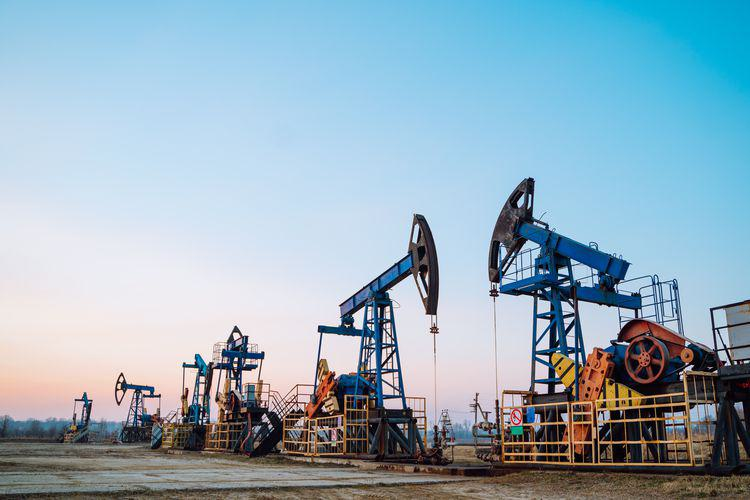

In the modern industrial economy, drilling technology and financial markets interact in unexpected yet intriguing ways. A prominent illustration of this interaction is the convergence of borehole, wellbore, oil drilling, and algorithmic trading, which symbolizes an evolving cross-industry synergy. The integration of these fields aims to optimize performance and foster innovation, providing a unique vantage point on how interconnected industries can elevate each other.

Technological advancements in oil extraction, such as horizontal and directional drilling techniques, have revolutionized resource retrieval by enhancing precision, reducing costs, and increasing safety. These advancements translate into strategic advantages in financial trading, particularly algorithmic trading. In this context, algorithmic trading harnesses the power of computer algorithms to automate financial transactions, seeking optimal timing and strategy. The influence of technological precision borrowed from drilling methodologies is evident in how algorithmic systems execute trades efficiently and react to market changes with minimal latency.



Understanding the connections between these industries not only offers a comprehensive view of their operational dynamics but also sheds light on emerging trends that may shape their futures. With rapid advances in big data and machine learning, both sectors stand to gain from enhanced analytical capabilities that improve decision-making processes and operational outcomes.

The goal of this article is to illustrate the mutual benefits enjoyed by industries through technological intersections. By exploring how innovation in oil drilling technology can inform and enhance algorithmic trading strategies—and vice versa—we reveal a landscape where cross-industry collaboration leads to economic growth and sustainability. This relationship highlights the potential for ongoing technological advancements that promise an ever-evolving industrial landscape, where shared insights and innovations lead to mutual benefits and future prosperity.

## Table of Contents

## Understanding Boreholes and Wellbores in Oil Drilling

A borehole is a narrow shaft drilled into the earth for purposes such as extracting underground resources, including oil, gas, or water. Within the oil industry, wellbores refer to the specific type of boreholes used for extracting oil or gas. They are essential components in the evaluation and extraction of resources, facilitating access to reservoirs that might otherwise remain unreachable. The process of creating boreholes and wellbores demands precise technology and skilled labor, as errors in drilling can lead to significant economic losses and potential environmental harm.

The drilling techniques employed for borehole and wellbore construction have evolved considerably, aided by technological advancements. Casing, a process where steel tubes are inserted into a borehole to stabilize and protect it, helps prevent contamination of groundwater and maintains the structural integrity of the well. This is particularly important in ensuring safety and efficiency during extraction.

Directional drilling is another significant advancement that enhances operational efficiency. Unlike traditional vertical wells, directional drilling allows the wellbore to deviate from a straight path, which is ideal for accessing reservoirs that are horizontally extended or located beneath areas that are environmentally sensitive or otherwise unreachable by vertical drilling.

Operational considerations for drilling efforts are influential in guiding decisions in the oil industry. Cost is a primary [factor](/wiki/factor-investing) as the financial investment required for drilling is substantial. Companies must assess the potential return on investment when deciding where and how to drill. Geological conditions also play a critical role; understanding the stratigraphy and tectonics of a region informs the feasibility and methods for drilling. Lastly, the desired outcomes, such as the [volume](/wiki/volume-trading-strategy) of oil extraction and the lifespan of the well, are crucial in planning and executing drilling operations.

Collectively, the integration of advanced tech and pragmatic operational strategies in borehole and wellbore drilling not only enhances resource extraction efficiency but also minimizes environmental impacts and aligns with the industry's sustainability goals.

## Horizontal and Vertical Drilling Technologies

Horizontal and vertical drilling technologies constitute fundamental methodologies in the oil extraction industry, each with unique strengths adapted to various geological and economic conditions. Horizontal drilling, a relatively modern technique, maximizes oil extraction efficiency by traversing a reservoir horizontally, thereby exposing a larger surface area to the wellbore. This technique proves advantageous in unconventional reserves, such as shale formations, where oil and gas are dispersed over extensive lateral distances. The enhanced exposure achieved through horizontal drilling can significantly increase production rates compared to traditional vertical wells, leading to more efficient resource extraction.

Conversely, vertical drilling remains an indispensable approach for certain geological contexts, primarily where reservoirs are best accessed directly from above. This method involves drilling straight down from the surface, rendering it simpler operationally and often less costly. Vertical wells are particularly favored in scenarios where deposits lie directly beneath the drilling site, making them economically viable for wells with a relatively straightforward geological layout.

The integration of simulation technology into drilling processes represents a substantial advancement in planning and operational efficiency for both horizontal and vertical methodologies. By employing sophisticated models, engineers can simulate various drilling scenarios, predicting potential challenges and outcomes. These simulations assist in optimizing well trajectory, minimizing risks, and ensuring cost-effective operations. With these predictive tools, drilling projects are better equipped to adapt to the dynamic variables encountered in subsurface conditions.

Both horizontal and vertical drilling methods have operational advantages contingent on the needs and conditions of the specific drilling project. Horizontal drilling is particularly beneficial in scenarios requiring maximum reservoir contact, whereas vertical drilling is advantageous when targeting isolated vertical reservoirs with minimal surface footprint. The choice between these methodologies hinges on a comprehensive assessment of geological data, financial considerations, and technological capabilities, ensuring that each project achieves its strategic objectives efficiently and sustainably.

## Algorithmic Trading in Financial Markets

Algorithmic trading has revolutionized financial markets by employing computer algorithms to execute transactions with precision, optimizing timing, and implementing complex trading strategies. These algorithms are designed to quickly analyze vast amounts of market data, identify trading opportunities, and execute trades at speeds that far exceed human capabilities. This process minimizes the impact of human error and emotional decisions, leading to more consistent and reliable trading outcomes.

Advanced [algorithmic trading](/wiki/algorithmic-trading) systems utilize a combination of mathematical models and statistical techniques to identify patterns and trends in market data. These algorithms operate on predefined criteria, which can range from simple moving averages to complex [machine learning](/wiki/machine-learning) models that adapt over time. For example, a typical algorithm might initiate a buy order when a short-term moving average crosses above a long-term moving average, signaling a potential upward trend.

The integration of big data analytics and machine learning has further enhanced the capabilities of algorithmic trading. By processing vast datasets, algorithms can make more informed decisions, predicting market movements with greater accuracy. Machine learning algorithms, in particular, can refine their models by continually learning from new data, improving their predictive accuracy over time. This self-improving capability is particularly beneficial in the highly dynamic environment of financial markets.

Python, as a popular language in data science and finance, provides numerous libraries and frameworks to implement algorithmic trading strategies. For instance, the `pandas` library is used for data manipulation and analysis, while `numpy` supports a range of mathematical functions useful in developing trading algorithms. Machine learning frameworks such as `scikit-learn` or `TensorFlow` can be employed to create predictive models that guide trading decisions. An example snippet of Python code that illustrates a basic moving average crossover strategy can be seen below:

```python
import pandas as pd

def moving_average_crossover(prices, short_window, long_window):
    signals = pd.DataFrame(index=prices.index)
    signals['price'] = prices
    signals['short_mavg'] = prices.rolling(window=short_window, min_periods=1).mean()
    signals['long_mavg'] = prices.rolling(window=long_window, min_periods=1).mean()
    signals['signal'] = 0
    signals['signal'][short_window:] = \
        np.where(signals['short_mavg'][short_window:] > signals['long_mavg'][short_window:], 1, 0)
    signals['positions'] = signals['signal'].diff()
    return signals

# Example usage with historical stock prices
price_data = pd.Series(...)  # This should be a time series of historical prices
signals = moving_average_crossover(price_data, short_window=40, long_window=100)
```

In this example, the function calculates a short-term and a long-term moving average of the given price data. A buy signal is triggered when the short-term average crosses above the long-term average, while a sell signal is indicated by the opposite crossover.

Overall, algorithmic trading in financial markets represents a synergy of technology and finance, leveraging advancements in data processing, machine learning, and [artificial intelligence](/wiki/ai-artificial-intelligence) to optimize trading strategies and outcomes. This integration not only increases the efficiency and [liquidity](/wiki/liquidity-risk-premium) of financial markets but also democratizes trading by making sophisticated strategies accessible to a wider range of participants.

## Synergies Between Oil Drilling Technology and Algorithmic Trading

The intersection of oil drilling technology and algorithmic trading heralds a unique synergy driven by precision and data-centric methodologies. Both fields prioritize leveraging real-time data to enhance operational efficiencies and strategic results. This convergence occurs as each sector adopts advanced technological tools that optimize their respective processes, thereby creating opportunities for cross-industry innovations.

In the oil drilling industry, the use of cutting-edge technologies such as seismic imaging and real-time monitoring systems facilitates accurate resource evaluation and efficient drilling operations. These technologies amass vast amounts of data, crucial for making informed decisions under varying geological conditions. The precision in determining wellbore paths, for instance, is enhanced by data analytics that process geological information to guide drilling with minimal wastage and reduced risks.

Similarly, algorithmic trading in financial markets employs sophisticated algorithms to automate and optimize trading strategies. These algorithms process large volumes of market data to make split-second trading decisions, minimizing human error and emotional biases. The ability to analyze trends and execute trades based on real-time information significantly boosts the reliability of trading outcomes.

The technological exchange between these two domains manifests in numerous ways. Innovations in data processing and machine learning algorithms in finance can inspire enhancements in data interpretation techniques in oil drilling, leading to more accurate predictions of oil reservoir locations and properties. Conversely, methodologies from resource extraction, such as predictive maintenance derived from equipment data, can be applied to financial models to predict market shifts or equipment failures in high-frequency trading infrastructure.

Economic benefits stemming from this synergy are significant. By optimizing resource utilization and reducing operational costs, both industries can achieve greater productivity. For instance, precise drilling techniques minimize non-productive time and material consumption, directly translating to cost savings. In finance, improved algorithmic strategies can enhance trading efficiency and profitability through more accurate market predictions and timely transactions.

In summary, the synergy between oil drilling technology and algorithmic trading underscores a shared reliance on precision and data-driven decision-making. This relationship fosters an environment where advancements in one field catalyze progress in the other, resulting in optimized operations and economic gains across industries.

## Economic and Environmental Implications

Technological advancements in both drilling technology and algorithmic trading are leading to significant reductions in costs and environmental impacts for their respective industries. These developments promote sustainable practices by optimizing operations and resource management.

Horizontal well technology is a prime example of how engineering innovations enhance extraction efficiency while minimizing environmental disruption. By allowing access to extensive parts of an oil reservoir from a single entry point, horizontal drilling reduces the number of wells required, lessening the surface footprint and the overall land disturbance. This technology also optimizes energy consumption and reduces emissions per barrel of oil extracted, contributing to a lower carbon footprint.

Similarly, algorithmic trading in financial markets enhances sustainability through efficiency and precision. By minimizing human intervention, algorithmic strategies decrease error rates and transactional friction, leading to more streamlined processes. The use of big data analytics and machine learning in trading algorithms further reduces the energy and resources spent on market predictions and decision-making, promoting economic efficiency.

However, these technological integrations demand corresponding adaptations in regulatory frameworks to ensure they align with environmental sustainability goals. Regulatory bodies must evaluate and revise policies to accommodate emerging technologies and encourage their adoption responsibly. This includes setting guidelines that promote energy-efficient practices and mitigate potential negative impacts.

By creating policies that incentivize sustainability, regulators can guide the evolution of these technologies toward practices that are both economically viable and environmentally responsible. The ongoing collaboration between industry participants and policymakers is crucial in achieving a balance between technological advancement and ecological preservation, ultimately supporting a sustainable future for both oil extraction and financial trading.

## Future Trends and Innovations

The integration of artificial intelligence (AI) and machine learning (ML) in both drilling operations and financial trading is paving the way for significant innovations. In the oil and gas sector, AI and ML algorithms are being developed to predict geological formations, optimize drilling paths, and assess equipment health, thereby increasing efficiency and reducing the risk of accidents. Techniques such as predictive analytics can forecast equipment failures before they happen, saving time and reducing costs. In financial markets, these technologies facilitate the development of predictive models that enhance algorithmic trading strategies by processing vast amounts of data faster and more accurately than ever before.

Interdisciplinary collaboration among engineers, data scientists, and financial analysts is essential for achieving breakthroughs. By sharing insights and methodologies, experts from diverse fields can cross-pollinate ideas, leading to innovations that benefit resource extraction and financial markets alike. For instance, the application of data visualization and pattern recognition techniques in trading can be adapted to interpret seismic data in drilling, offering a fresh perspective on evaluating subsurface conditions.

Sustainability practices are becoming a central focus in technological advancements, with efforts concentrated on reducing the ecological impact of both industries. In drilling, there is a shift towards using cleaner technologies that minimize emissions and enhance the efficiency of resource extraction. The financial sector is increasingly adopting sustainable investing strategies, integrating [ESG](/wiki/esg-investing) (Environmental, Social, and Governance) criteria into trading algorithms and portfolio management. This fosters a synergy where AI and ML are employed to evaluate the sustainability impact of investments, aligning financial objectives with environmental goals.

These trends collectively illustrate a future where innovation is intertwined with sustainability, reshaping how both industries operate. By adopting these advanced technologies and fostering cross-industry collaboration, there is potential for creating more sustainable and efficient practices that align with global environmental priorities.

## Conclusion

The intersection of borehole and wellbore drilling with algorithmic trading signals a transformative phase in industrial operations. This convergence fosters operational efficiencies by integrating precision and real-time data analytics from both industries. The meticulous nature of oil drilling, which involves careful resource assessment and extraction process optimization, complements the algorithmic precision in financial markets, where computer algorithms determine optimal trading strategies. Such synergies not only streamline processes but also contribute to economic growth by enhancing productivity and reducing operational costs through technological innovations.

Environmental sustainability is another significant outcome of this intersection. Advances in drilling technologies such as horizontal drilling reduce surface disruption and enhance resource extraction, aligning with environmental conservation goals. Similarly, algorithmic trading limits unnecessary financial activities, leading to a more efficient allocation of resources.

As technological advancements continue to unfold, the landscape promises to evolve with new innovations that mutually benefit the industries involved. The integration of artificial intelligence and machine learning is anticipated to further refine these systems, leading to smarter decision-making processes and industry practices. Both sectors stand to gain from this interdisciplinary relationship, which can lead to reduced costs, increased output, and minimized ecological impacts.

Understanding and leveraging the connections between these fields is essential for ensuring future prosperity. By nurturing this integration, stakeholders can develop more sustainable and economically viable industrial practices, underscoring the significance of technological intersections in driving advancement.

## References & Further Reading

Ezell, R.L., & Phung, T.T. (2013). "Horizontal Drilling: A Technology Home Run for the Oil and Gas Industry" – Journal of Petroleum Technology explores the pivotal role of horizontal drilling in revolutionizing oil extraction, enhancing efficiency, and mitigating environmental impacts. This paper provides insights into technological advancements and discusses the key operational benefits that have rendered horizontal drilling a vital technique in modern oil and gas industry practice. 

Aldridge, I. (2010). "High-Frequency Trading: A Practical Guide to Algorithmic Strategies and Trading Systems" – John Wiley & Sons offers an in-depth guide to algorithmic trading, detailing strategies, systems, and the application of high-frequency trading within financial markets. This book is particularly useful for understanding how automation and sophisticated algorithms improve trading efficiency and accuracy. It touches upon the reduction of human error and how data-driven trading strategies can benefit financial market participants.

Investopedia provides comprehensive articles on wellbores, boreholes, and oil drilling that explain the foundational concepts and technical terms associated with these processes. These resources help delineate the differences between various drilling techniques and their applications. Furthermore, Investopedia also offers resources on algorithmic trading, covering essential topics such as market trends analysis, trade execution methods, and the integration of big data technologies, which are crucial for anyone looking to grasp the nuances of automated trading in modern financial markets.

