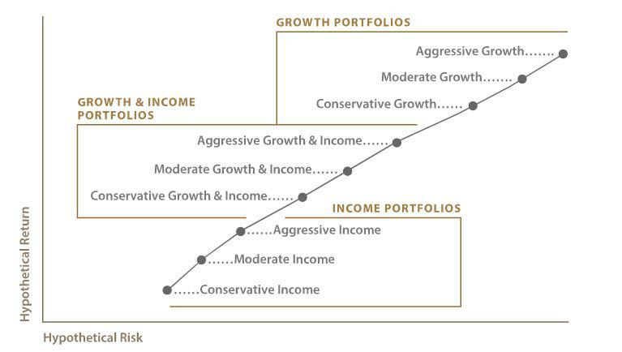

Wells Fargo Intuitive Investor is a robo-advisor platform that integrates automated investment management with professional financial advice. This service leverages technology to provide efficient, low-cost investment solutions, reflecting the growing trend towards automation in financial markets. Robo-advisors have become significant as they democratize access to investment strategies that were once exclusive to high net-worth individuals or institutional investors.

The purpose of this article is to offer a comprehensive review of the Wells Fargo Intuitive Investor platform. We will examine its features and the role of algorithmic trading, which is a cornerstone of robo-advisory services. Algorithmic trading employs complex mathematical models and algorithms to make investment decisions at speeds and frequencies on par with the rapid pace of today's financial markets. This approach enhances portfolio management by optimizing variables such as asset allocation, risk management, and tax efficiency, all while minimizing human biases that can affect investment decisions.

Automated investing, as embodied by platforms like Wells Fargo Intuitive Investor, has transformed how individuals approach the management of their financial portfolios. This technological advance offers increased accessibility, transparency, and efficiency, which are pivotal in meeting the diverse needs of modern investors. As the financial landscape continues to evolve, automated investing signifies a shift towards more cost-effective and user-friendly solutions, enabling investors to make well-informed decisions. This shift underscores the importance of balancing technological capabilities with personalized financial guidance, a balance that Wells Fargo aims to achieve with its Intuitive Investor platform.

## Table of Contents

## What is Wells Fargo Intuitive Investor?

Wells Fargo Intuitive Investor is a comprehensive digital investment platform that leverages the power of robo-advisory services combined with the personalized touch of human financial advisor support. Developed by Wells Fargo, one of the largest financial institutions in the United States, the Intuitive Investor platform aims to simplify the investment process for both novice and experienced investors, providing them with a streamlined and efficient way to grow their wealth.

At its core, the Intuitive Investor platform employs sophisticated algorithms to construct and manage investment portfolios tailored to the client's financial goals and risk tolerance. This robo-advisory service automatically manages investment portfolios, making adjustments as needed to align with the investor's objectives. Users benefit from a combination of advanced technology and human expertise, as Wells Fargo offers access to financial advisors for more personalized guidance and support. This blend ensures that investors receive the full spectrum of advisory services without sacrificing the ease of automated management.

The investment approach of Intuitive Investor emphasizes the importance of diversification and sustainability. The platform constructs globally diversified portfolios, spreading investments across various asset classes and geographical regions to mitigate risk and enhance potential returns. Such diversification is crucial for reducing the impact of market volatility on an investor's portfolio.

Moreover, Wells Fargo Intuitive Investor places a particular emphasis on sustainability-focused investments. This includes the integration of Environmental, Social, and Governance ([ESG](/wiki/esg-investing)) criteria into the portfolio selection process, allowing investors to align their financial goals with their personal values. By focusing on companies and funds that adhere to sustainable practices, the platform caters to the growing demand for responsible investing strategies.

In summary, Wells Fargo Intuitive Investor offers a robust solution for individuals seeking a blend of automated investing and personalized financial advice. Through its use of innovation, technology, and commitment to sustainable investment practices, it provides a compelling choice for those looking to navigate the complexities of today's financial markets with confidence and ease.

## Key Features of Wells Fargo Intuitive Investor

Wells Fargo Intuitive Investor stands out in the competitive landscape of robo-advisors with its distinct features designed to optimize investor returns while maintaining a user-friendly experience. One of the platform's primary offerings is its suite of smart-beta portfolios. Smart-beta strategies aim to outperform traditional market capitalization-weighted indices by employing alternative weighting schemes based on one or more factors like [volatility](/wiki/volatility-trading-strategies), value, or [momentum](/wiki/momentum). This can provide investors with enhanced risk-adjusted returns by targeting specific performance attributes.

Another crucial feature of the Intuitive Investor platform is tax-loss harvesting. This strategy involves selling securities at a loss to offset capital gains taxes from other investments, thereby maximizing an investor’s after-tax returns. By systematically identifying assets that can be sold at a loss, the platform helps investors take advantage of tax efficiencies. This practice is particularly beneficial in taxable accounts where managing tax liability is a significant concern.

Portfolio rebalancing is another integral component of the Wells Fargo Intuitive Investor framework. Over time, the asset allocation of a portfolio can drift due to market fluctuations. Rebalancing involves realigning the proportions of different assets to maintain the desired risk level and investment strategy. This is accomplished by periodically buying or selling assets to keep the portfolio aligned with the investor's goals. Automated rebalancing within Intuitive Investor ensures that portfolios are consistently optimized without requiring manual intervention from users.

Algorithmic trading plays a vital role in implementing these strategies on the Intuitive Investor platform. Algorithms can process vast amounts of data rapidly, making real-time adjustments based on market conditions. This technology enhances the platform’s ability to execute trades efficiently, capitalize on market opportunities, and adhere to strategic asset allocations. The benefits of [algorithmic trading](/wiki/algorithmic-trading) include increased trading speed, reduced transaction costs, and improved accuracy in managing large sets of investment data.

The Wells Fargo Intuitive Investor platform supports various account types to cater to diverse investor needs. Available options include individual taxable accounts, traditional Individual Retirement Accounts (IRAs), Roth IRAs, and rollover IRAs. This range of account types allows investors to select the best fit for their tax situation and investment objectives, offering flexibility whether they are saving for retirement or targeting other financial goals. The combination of smart technology and a variety of account options makes Wells Fargo Intuitive Investor a robust choice for both novice and seasoned investors seeking efficient wealth management solutions.

## Pros and Cons

Wells Fargo Intuitive Investor offers several advantages to investors seeking a balanced blend of automated and personal financial advisory services. One of its primary benefits is its competitive fee structure. With an annual advisory fee of only 0.35%, it stands as a cost-effective option compared to traditional financial advisory services, which often charge fees upwards of 1%. Additionally, clients have access to human financial advisors, offering personalized guidance that can complement the automated investment management typically associated with robo-advisors.

The platform also boasts diverse investment options, focusing on globally diversified portfolios, and gives ethical investors the opportunity to target sustainability-focused investments. Such diversity enhances portfolio resilience and aligns with contemporary trends toward responsible investing.

However, the Wells Fargo Intuitive Investor platform is not without its drawbacks. One major limitation is the restricted ability for portfolio customization. Investors looking for tailored strategies or specific asset classes might find the platform's offerings less flexible than desired. Furthermore, the platform isn't suitable for those inclined towards self-directed trading, as it primarily caters to individuals who prefer a hands-off approach, delegating investment management to algorithms and advisors.

When compared to other robo-advisors such as Betterment and Wealthfront, Wells Fargo Intuitive Investor holds its own with its access to financial advisors, a feature not universally offered by all robo-services. However, some competitors might offer more aggressive tax-loss harvesting strategies or lower account minimums, which can appeal to different segments of investors. User experience varies across platforms, with some competitors potentially providing more robust mobile applications or advanced account customization features.

In conclusion, while Wells Fargo Intuitive Investor provides a reliable and low-cost solution with access to financial advisors, its limited customization options and emphasis on automated management might not suit every investor. As with all financial services, potential investors should consider their individual needs, preferences, and investment goals when selecting a robo-advisor platform.

## Fees and Charges

Wells Fargo Intuitive Investor positions itself as a competitive player in the robo-advisory sector partly due to its transparent and relatively low fee structure. At the core of its cost model is an annual advisory fee of 0.35% of assets under management (AUM). This fee is in line with industry standards and provides clients with the automated investment management services offered by the Intuitive Investor platform.

One noteworthy feature is the ability to reduce this advisory fee by linking Intuitive Investor accounts to specific qualified Wells Fargo banking and brokerage accounts. Clients can potentially benefit from fee discounts or even fee waivers based on account relationships and balances, making the service more cost-effective for those who already bank with Wells Fargo. This integration strategy not only incentivizes clients to maintain multiple financial products under one institution but also highlights the financial advantages of doing so.

When comparing the cost-effectiveness of Intuitive Investor with its competitors, the 0.35% fee is fairly competitive. For instance, other robo-advisors like Betterment and Wealthfront charge fees ranging from 0.25% to 0.40%. While some competitors offer tiered services at lower price points, Wells Fargo's offering includes access to financial advisors, providing additional value beyond automated asset allocation. Furthermore, major players such as Vanguard’s Personal Advisor Services charge higher fees, around 0.30% to 0.40%, but with a more personalized service model, making Intuitive Investor a mid-ground option for clients seeking automated solutions with human advice.

Overall, the fee structure of Wells Fargo Intuitive Investor is structured to offer affordability and added value, especially for clients with existing Wells Fargo relationships, making it a compelling option for cost-conscious investors who appreciate integrated financial services.

## User Experience and Mobile Access

The Wells Fargo Intuitive Investor platform offers a streamlined user experience both on desktop and mobile applications. The design of the interface prioritizes ease of navigation, ensuring users can efficiently manage their investment accounts. On the desktop platform, users are greeted with a clean layout that presents key information such as portfolio performance, asset allocation, and account balance clearly and intuitively. Tools for setting financial goals and tracking progress are effortlessly accessible, making it straightforward for users to plan their financial strategies.

The mobile application mirrors the desktop experience with a responsive design tailored for on-the-go account management. Key features of the mobile app include real-time account monitoring, allowing users to track the status of their investments and market changes through up-to-date data visualization. The app also facilitates fund transfers between linked accounts with minimum hassle, maintaining the fluidity of financial transactions. Enhanced customer support is integrated within the app, giving users direct access to assistance via chat or phone, ensuring support is readily available when needed.

The user-friendliness of the platform is a considerable advantage for both beginners and experienced investors. For newcomers to investing, the Intuitive Investor platform offers educational prompts and simple explanations to help demystify the investment process. Meanwhile, experienced investors are likely to appreciate the efficiency with which the platform enables them to monitor and manage their portfolios. The ability to customize the dashboard view to display preferred metrics and alerts further enhances the user experience, as does the app’s smooth and responsive performance.

Overall, Wells Fargo Intuitive Investor's user interface is designed to be navigable and practical, catering to a broad spectrum of users who prefer digital financial management. The combination of comprehensive features and a user-centric interface ensures that it remains competitive in the automated investing landscape.

## Security Measures

Wells Fargo's Intuitive Investor ensures robust security measures to protect client information and maintain system integrity. The platform employs several layers of security protocols, including advanced encryption, fraud monitoring, and multi-[factor](/wiki/factor-investing) authentication, to safeguard user data and prevent unauthorized access.

### Encryption
Wells Fargo uses strong encryption methods to protect sensitive data. This involves encrypting data both at rest and in transit. The use of protocols such as SSL (Secure Sockets Layer) or TLS (Transport Layer Security) ensures that all communication between the client's device and Wells Fargo's servers is secure. This means that any data transmitted during a session is encrypted, making it difficult for unauthorized parties to intercept and decipher it.

### Fraud Monitoring
The platform implements continuous fraud monitoring to detect suspicious activities across client accounts. This system employs algorithms to identify unusual patterns of behavior and trigger alerts when potential fraudulent activity is suspected. As a result, clients are protected against unauthorized transactions and potential breaches. Wells Fargo continuously updates its fraud detection systems to address new and emerging threats, ensuring client accounts remain secure.

### Two-Step Verification
To further enhance security, Wells Fargo offers two-step verification to its users. This additional security layer requires clients to verify their identity through a second method—typically a code sent to their registered mobile device—after entering their password. Two-step verification significantly reduces the risk of unauthorized access, as an attacker would need both the account password and access to the user's mobile device or email to gain entry.

### User Data Privacy
Assuring user data privacy is paramount for Wells Fargo. The bank adheres to strict privacy policies and complies with relevant data protection regulations to ensure client information is secure. Wells Fargo limits data access to authorized personnel only and conducts regular audits to verify compliance with its data protection protocols. The bank's commitment to privacy extends to its third-party vendors, who are also required to adhere to stringent data security standards.

Overall, Wells Fargo's Intuitive Investor platform incorporates advanced security measures that prioritize client safety, data integrity, and privacy. By utilizing cutting-edge technology and maintaining rigorous standards, the platform provides a secure environment for investors to manage their portfolios and conduct financial transactions with confidence.

## Customer Support and Education

Wells Fargo Intuitive Investor provides several customer service options to ensure that users receive the support they need. Investors can access customer service through phone support managed by professional representatives who offer guidance on a range of inquiries. Additionally, Intuitive Investor users have access to human financial advisors. This feature is particularly noteworthy as it allows investors to have personalized, human consultation alongside automated portfolio management. The integration of personal financial advisors offers users a hybrid experience, blending technological efficiency with human expertise.

When evaluating educational resources, Intuitive Investor appears to have a limited range. While accessing financial advisors and customer service offers some educational benefits, specific educational tools and resources to enhance investors' knowledge are not heavily emphasized. This might include detailed market analysis, investment strategy tutorials, or comprehensive guides that could help investors better understand and optimize their portfolios.

The importance of accessible customer support in robo-advisors like Intuitive Investor cannot be overstated. By providing a variety of support channels, Wells Fargo helps ensure that all users, regardless of their experience level, can navigate the platform effectively. Convenient customer support can ease the transition for new users adapting to automated investing and offer reassurance to experienced investors seeking additional guidance. Therefore, the availability of both automated assistance and human advisors plays a crucial role in enhancing user satisfaction and confidence in the Intuitive Investor platform.

## Conclusion

Wells Fargo Intuitive Investor provides a comprehensive automated investment platform that combines the efficiency of robo-advisory services with the personalized support of human financial advisors. The platform's offerings, such as globally diversified and sustainability-focused portfolios, make it a viable choice for investors seeking to blend traditional investment wisdom with modern technological advancements. Its features like smart-beta portfolios, tax-loss harvesting, and algorithmic trading play significant roles in maintaining portfolio efficiency and maximizing potential returns.

The strengths of Wells Fargo Intuitive Investor include its low fee structure, the seamless integration of advisory services, and diverse investment options. These features make it particularly attractive to investors who are looking for a balance between cost-effectiveness and personalized guidance. However, the platform may not be suitable for investors wanting extensive portfolio customization or those interested in self-directed trading due to its structured investment approach.

Wells Fargo Intuitive Investor is best suited for individuals who appreciate the convenience of automated asset management combined with access to financial advisors for tailored advice. It caters well to those who prefer a guided investment approach with just enough human interaction to augment the robo-advisor's algorithmic prowess. While it offers a solid service, potential investors are encouraged to evaluate their specific investment goals, financial situation, and the level of control they wish to maintain over their investments. Comparing Wells Fargo Intuitive Investor with other available platforms will help ensure that one chooses the most appropriate service to meet their investment needs.

## References & Further Reading

[1]: Marcos Lopez de Prado. (2018). ["Advances in Financial Machine Learning."](https://books.google.com/books/about/Advances_in_Financial_Machine_Learning.html?id=oU9KDwAAQBAJ) Wiley.

[2]: David Aronson. (2007). ["Evidence-Based Technical Analysis: Applying the Scientific Method and Statistical Inference to Trading Signals."](https://www.amazon.com/Evidence-Based-Technical-Analysis-Scientific-Statistical/dp/0470008741) Wiley.

[3]: Stefan Jansen. (2020). ["Machine Learning for Algorithmic Trading."](https://github.com/stefan-jansen/machine-learning-for-trading) Packt Publishing.

[4]: Ernest P. Chan. (2009). ["Quantitative Trading: How to Build Your Own Algorithmic Trading Business."](https://books.google.com/books/about/Quantitative_Trading.html?id=NZlV0M5Ije4C) Wiley.

[5]: John Bergstra, Remi Bardenet, Yoshua Bengio, & Balazs Kégl. (2011). ["Algorithms for Hyper-Parameter Optimization."](https://proceedings.neurips.cc/paper/2011/file/86e8f7ab32cfd12577bc2619bc635690-Paper.pdf) Advances in Neural Information Processing Systems 24.