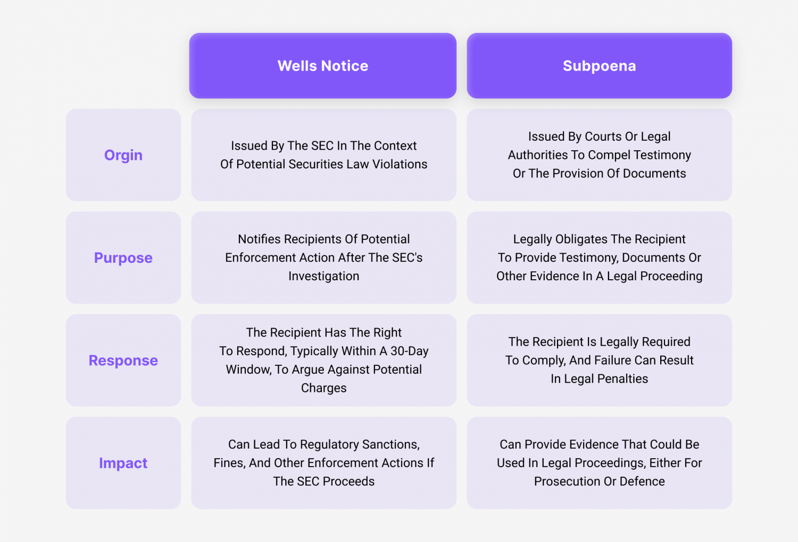

## Table of Contents

## What is a Wells Notice?

A Wells Notice is a letter that the U.S. Securities and Exchange Commission (SEC) sends to a person or company. It tells them that the SEC is planning to take legal action against them. This notice gives them a chance to explain why they think the SEC should not take action.

Getting a Wells Notice is a serious matter. It means the SEC believes there might be a problem with how the person or company has been following the rules. The person or company can respond to the notice by writing a letter back to the SEC. They can explain their side of the story and try to stop the SEC from taking further action.

## Who issues a Wells Notice?

A Wells Notice is issued by the U.S. Securities and Exchange Commission (SEC). The SEC is a government agency that makes sure people and companies follow the rules when they buy and sell stocks and other investments.

When the SEC thinks someone might have broken these rules, they send a Wells Notice. This letter tells the person or company that the SEC is thinking about taking legal action against them. It gives them a chance to explain why they think the SEC should not go ahead with the action.

## Why is it called a Wells Notice?

A Wells Notice is named after John A. Wells, who was once the head of the SEC's enforcement division. Back in the 1970s, he came up with the idea for this notice. He wanted to make sure that people and companies had a fair chance to explain themselves before the SEC took any legal action against them.

The notice is a way for the SEC to tell someone that they might be in trouble for breaking the rules. It gives them a chance to write back and explain why they think the SEC should not take action. This process is called the "Wells process," named after John A. Wells, and the notice itself is called a Wells Notice.

## What are the common reasons for receiving a Wells Notice?

People or companies might get a Wells Notice from the SEC if they think they broke some rules about buying and selling stocks or other investments. A common reason is if someone did something called "insider trading." This means they used secret information to make money, which is not allowed. Another reason could be if a company did not tell the truth about its money situation or other important things that people who buy their stocks should know.

Sometimes, a Wells Notice comes because a company did not follow the rules about how they should act when they sell stocks to the public. This can include not giving all the right information or not following the steps they are supposed to take. The SEC wants to make sure everyone plays fair, so they send a Wells Notice to let the person or company know they might take legal action if they think rules were broken.

## What should you do upon receiving a Wells Notice?

If you get a Wells Notice from the SEC, it's important to take it seriously. This letter means the SEC thinks you might have broken some rules about buying and selling stocks or other investments. You should talk to a lawyer who knows about these kinds of problems. They can help you understand what the notice means and what you should do next.

After you get the Wells Notice, you have a chance to write back to the SEC. This is called a Wells Submission. In your letter, you can explain why you think the SEC should not take legal action against you. Your lawyer can help you write this letter and make sure it says everything it needs to. It's important to do this because it might stop the SEC from going ahead with their plans.

## How does the Wells Notice process work?

When the SEC thinks someone might have broken the rules about buying and selling stocks or other investments, they send a Wells Notice. This letter tells the person or company that the SEC is thinking about taking legal action against them. The notice is named after John A. Wells, who came up with the idea to give people a fair chance to explain themselves before any action is taken.

After getting a Wells Notice, the person or company has a chance to respond. They can write a letter back to the SEC, which is called a Wells Submission. In this letter, they can explain why they think the SEC should not take legal action against them. It's important to get help from a lawyer who knows about these kinds of problems. The lawyer can help write the letter and make sure it says everything it needs to. This process gives the person or company a chance to stop the SEC from going ahead with their plans.

## What are the potential outcomes after receiving a Wells Notice?

After getting a Wells Notice, there are a few things that could happen. One possibility is that the person or company writes back to the SEC with a Wells Submission. If the SEC likes what they read in the letter, they might decide not to take any legal action. This means the person or company can go back to normal without any trouble from the SEC.

Another possibility is that the SEC does not like the Wells Submission or the person or company does not send one at all. In this case, the SEC might go ahead and take legal action. This could mean the person or company has to go to court and might have to pay money or face other punishments. It's a serious situation, so it's important to take the Wells Notice seriously and get help from a lawyer.

## How can a Wells Notice impact an individual or a company?

Getting a Wells Notice can be a big deal for a person or a company. It means the SEC thinks they might have done something wrong with buying or selling stocks or other investments. This can make people worried and can hurt the person's or company's reputation. People might not want to do business with them anymore because they think there might be trouble. This can lead to losing money or having a hard time getting new customers or investors.

If the SEC decides to take legal action after the Wells Notice, it can get even more serious. The person or company might have to go to court and could end up paying a lot of money in fines or other punishments. This can be really bad for a company because it might mean they have to close down or change how they do business. For a person, it could mean losing their job or not being able to work in the same field again. So, it's really important to take a Wells Notice seriously and get help from a lawyer to try to fix the problem.

## What is the timeline typically associated with a Wells Notice?

When you get a Wells Notice from the SEC, you usually have about 30 days to respond with a Wells Submission. This is your chance to explain why you think the SEC should not take legal action against you. It's important to use this time wisely and get help from a lawyer who knows about these kinds of problems. They can help you write a good letter to the SEC.

After you send your Wells Submission, the SEC will look at it and decide what to do next. This can take a few weeks or even a few months. If the SEC likes what you said in your letter, they might decide not to take any action. But if they do not like it, or if you do not send a letter at all, they might go ahead and take legal action against you. This could mean going to court and facing fines or other punishments.

## Can a Wells Notice be challenged or appealed?

Yes, you can challenge or appeal a Wells Notice, but it's a bit tricky. When you get a Wells Notice, you have about 30 days to send a Wells Submission back to the SEC. This is your chance to explain why you think the SEC should not take legal action against you. A good lawyer can help you write a strong letter that might make the SEC change their mind.

If the SEC decides to take action after your Wells Submission, you can still fight it in court. You can argue that the SEC made a mistake or that you did not break any rules. This can be a long and hard process, so it's really important to have a good lawyer to help you every step of the way.

## What are the differences between a Wells Notice and other regulatory notices?

A Wells Notice is a special letter from the SEC that tells someone they might take legal action against them for breaking rules about buying and selling stocks or other investments. It gives the person or company a chance to explain why they think the SEC should not go ahead with the action. This notice is different from other regulatory notices because it is specifically about possible legal action from the SEC, and it comes with a chance to respond before any action is taken.

Other regulatory notices might come from different agencies and can be about different kinds of rules. For example, the Federal Trade Commission (FTC) might send a notice about breaking rules on advertising or consumer protection. These notices might not always give you a chance to respond before action is taken, and they might be about different kinds of problems. So, while a Wells Notice is focused on SEC rules and gives you a chance to explain yourself, other notices can be about different rules and might not always offer the same opportunity to respond.

## How has the Wells Notice process evolved over time?

The Wells Notice process started in the 1970s when John A. Wells, who was in charge of the SEC's enforcement division, came up with the idea. He wanted to make sure that people and companies had a fair chance to explain themselves before the SEC took any legal action against them. Back then, the process was pretty simple. If the SEC thought someone broke the rules, they would send a letter, and the person or company could write back to explain their side of the story. This was a big change because it gave people a chance to stop the SEC from taking action.

Over the years, the Wells Notice process has gotten more detailed and formal. Now, when someone gets a Wells Notice, they have about 30 days to send a Wells Submission back to the SEC. This letter needs to be well-written and often needs help from a lawyer. The SEC then takes time to look at the letter and decide what to do next. If they decide to take legal action, the person or company can still fight it in court. The process has become more complicated, but it still gives people a chance to explain themselves before facing legal action.

## References & Further Reading

[1]: Gerding, E. H., Robu, V., Stein, S., Parkes, D. C., Rogers, A., & Jennings, N. R. (2011). ["Online Mechanism Design for Electric Vehicle Charging."](https://econcs.seas.harvard.edu/files/econcs/files/robu_amma2011.pdf) Management Science, 57(10), 1983-1994.

[2]: Lopez de Prado, M. (2018). ["Advances in Financial Machine Learning"](https://www.amazon.com/Advances-Financial-Machine-Learning-Marcos/dp/1119482089). Wiley.

[3]: Phillips, J., Kaufman, R., & Christensen, C. (2009). ["Regulating Narrow Banking in a System of Financial Regulation"](https://www.taylorfrancis.com/books/mono/10.4324/9781315757230/handbook-training-evaluation-measurement-methods-jack-phillips-patricia-pulliam-phillips) U.S. Securities and Exchange Commission.

[4]: Aronson, D. R. (2006). ["Evidence-Based Technical Analysis: Applying the Scientific Method and Statistical Inference to Trading Signals"](https://www.amazon.com/Evidence-Based-Technical-Analysis-Scientific-Statistical/dp/0470008741). Wiley.

[5]: Jansen, S. (2020). ["Machine Learning for Algorithmic Trading"](https://github.com/stefan-jansen/machine-learning-for-trading). Packt Publishing.