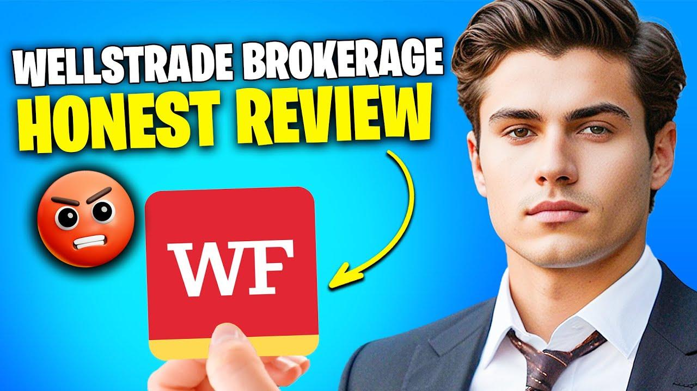

This article provides an in-depth review of WellsTrade, the brokerage platform offered by Wells Fargo, with a particular focus on its features, offerings, and suitability for algorithmic trading in 2024. As the financial landscape continues to evolve, characterized by rapid technological advancements and shifting investor preferences, brokerage platforms must adapt to meet these new demands. With the rise of algorithmic trading—a method that utilizes computer algorithms to automate the trading process—brokerages need to cater to both traditional investors and those looking to leverage these advanced trading strategies.

WellsTrade presents itself as a competitive option in the market using Wells Fargo's extensive banking resources and customer base. This review evaluates WellsTrade by examining its core features and offerings compared to other brokerage services. Such analysis will uncover its strengths, such as integration with Wells Fargo's banking services, and potential weaknesses, including any limitations in advanced trading tools. 

The platform is primarily aimed at infrequent, buy-and-hold investors, offering a range of asset classes including stocks, ETFs, mutual funds, and options. However, for investors interested in algorithmic trading, the platform's suitability remains a pressing question—does WellsTrade provide the technological support and infrastructure necessary for such trading strategies in 2024?

As we evaluate WellsTrade's position within the industry, aspects like its commission structure, integration features, and user interface will be considered in relation to its performance against competitors. Ultimately, this article aims to provide a comprehensive assessment of WellsTrade, offering insights into its value proposition for various investors, particularly those interested in algorithmic trading, ensuring they make informed decisions aligned with their financial goals.

## Table of Contents

## Overview of WellsTrade as a Brokerage Platform

WellsTrade is an integral part of Wells Fargo & Company, a leading financial services group with a long-standing presence in the banking and finance sectors. Founded in 1852, Wells Fargo has evolved to offer a diverse range of financial products and services, including asset management, commercial banking, and brokerage services through its various platforms. WellsTrade, specifically designed as Wells Fargo's brokerage arm, represents the company's foray into online self-directed trading.

Initially introduced to cater to customers of Wells Fargo Bank seeking investment options, WellsTrade has grown alongside the broader trend of digitizing financial services. Over the years, the platform has seen several enhancements and modifications to address the evolving needs of its clientele, notably focusing on providing an accessible solution for individuals with a preference for self-directed investments. This reflects Wells Fargo's strategic initiative to align its brokerage service offerings with modern trends in financial technology and consumer preferences.

The primary target audience for WellsTrade consists of infrequent, buy-and-hold investors. These clients typically prioritize a stable, long-term investment approach rather than active trading. They prefer to hold investments for extended periods to benefit from potential long-term capital appreciation and dividend income. This aligns with WellsTrade's focus on simplicity and integration with other Wells Fargo services, making it an appealing option for individuals who already bank with Wells Fargo and are looking for cohesive financial service experiences.

WellsTrade offers a variety of asset classes suitable for diverse investment needs. Investors can access:

1. **Stocks**: WellsTrade provides a platform for trading a comprehensive range of domestic and international stocks, allowing investors to build equity portfolios that align with their specific financial goals.

2. **Exchange-Traded Funds (ETFs)**: These funds, which trade similarly to individual stocks on exchanges, offer investors exposure to diverse themes, sectors, and markets, combining the benefits of mutual funds and individual stocks.

3. **Mutual Funds**: WellsTrade users can choose from a selection of mutual funds that provide diversified portfolios managed by professional fund managers.

4. **Options**: The platform also includes options trading, allowing more advanced investors to engage in strategic plays, such as hedging existing positions or speculating on market movements.

Through these offerings, WellsTrade enables investors to construct multi-faceted portfolios tailored to their investment strategies and risk tolerance. Although primarily appealing to infrequent investors, the range of available assets also accommodates those looking to venture into more sophisticated investment strategies.

## Key Features and Benefits

WellsTrade, the brokerage service offered by Wells Fargo, presents several key features and benefits that make it an attractive option for certain types of investors, particularly those interested in a cost-effective trading environment. One of the prominent features of WellsTrade is its zero-commission structure for stocks and exchange-traded funds (ETFs). This pricing model aligns with industry trends, offering traders a competitive edge by eliminating per-trade fees on these popular asset classes. Consequently, investors can execute trades without the burden of additional costs, particularly benefiting those who engage in frequent trading of stocks and ETFs.

Moreover, WellsTrade offers seamless integration with Wells Fargo's robust banking services, providing an added layer of convenience for users. This integration facilitates easy fund transfers between brokerage and banking accounts, streamlining the overall financial management process. Clients can manage their finances more efficiently, consolidating their investment and banking activities within a single platform. The ability to handle both banking and trading operations under one roof enhances the user experience, offering substantial time-saving benefits and reducing administrative complexity.

WellsTrade's mobile app further enhances user convenience by delivering a user-friendly interface optimized for both novice and experienced investors. The app provides essential features that enable users to manage their portfolios effectively while on the go. Its intuitive design ensures that users can easily navigate through various functions, such as checking account balances, executing trades, or reviewing investment performance. Access to real-time data and the ability to receive alerts and notifications allows investors to stay informed about market developments and make timely decisions.

These features collectively reinforce WellsTrade's appeal, particularly to investors who prioritize cost-efficiency and integration with banking services. Such attributes contribute to making WellsTrade a viable contender in the competitive landscape of brokerage platforms, catering to the needs of users who value simplicity and a consolidated approach to their financial activities.

## Cons and Limitations

WellsTrade, while offering several advantages for casual investors, has limitations that may affect more active traders and those seeking advanced functionalities. One core limitation is the lack of advanced trading tools and features when compared to competitors like TD Ameritrade or E*TRADE. These platforms often provide sophisticated tools for in-depth technical analysis, [algorithmic trading](/wiki/algorithmic-trading) support, and extensive charting features, which WellsTrade does not match. This comparative shortcoming may deter traders seeking to employ complex trading strategies or those who wish to engage in high-frequency trading.

For research and analysis, WellsTrade offers standard tools suitable for basic market assessment and portfolio tracking. However, the absence of advanced screening capabilities and comprehensive technical indicators means that users must rely on external resources for more intricate market analysis and strategy formulation. This can be a disadvantage for investors who prioritize data-driven decisions and robust analytical tools in their trading activities.

Another limitation arises from WellsTrade's cost structure. While the platform does provide a zero-commission environment for trading stocks and ETFs, options trades incur a commission fee. As of the latest update, WellsTrade charges a commission for options transactions, which can impact the investment strategy cost dynamics for options traders. Additionally, there is a fee for live broker assistance, which is an extra cost for investors needing personalized support or more involved transactions. These additional charges might accumulate over time, affecting both the cost-efficiency for frequent traders and the overall appeal of WellsTrade in a competitive brokerage market. 

These limitations highlight areas where WellsTrade could improve its offering to become a more attractive option for a broader range of investors, particularly those with more complex trading needs.

## Usability and Customer Experience

The account setup process on WellsTrade is designed to be straightforward, catering to both novice and experienced investors. Users can start by navigating to the WellsTrade website and selecting the option to open a new brokerage account. The process involves providing personal information, such as name, address, and employment details, followed by financial information to assess the user's investment profile. WellsTrade offers an online identity verification system, which helps streamline the procedure. Once approved, users can fund their accounts via linked Wells Fargo bank accounts, leveraging Wells Fargo’s seamless integration to facilitate easy and quick transfers.

Platform navigation is generally intuitive, with a dashboard that provides an overview of portfolio holdings, recent transactions, and account balance. The user interface is designed to be clean and accessible, with drop-down menus and search functionalities that allow users to find specific tools or information with minimal effort.

In terms of user experience, WellsTrade offers significant pros, such as system stability and ease of use. The platform is reported to operate with efficient speed, ensuring users can execute trades and obtain real-time data without delays. The integration with Wells Fargo's banking platform provides a seamless experience for users who are already customers of the bank, allowing them to navigate between banking and brokerage services through a single interface.

However, there are noted cons to the user experience. Some users have reported that while the basic functionalities of WellsTrade meet their needs, the platform occasionally lacks the advanced features and customizations offered by some competitors. These limitations can be a hindrance for users seeking more complex trading functionalities or detailed analytical tools. Additionally, certain users have expressed concerns about customer support availability, indicating that getting assistance for specific platform issues can be time-consuming.

Customer reviews and testimonials about WellsTrade indicate a mix of satisfaction and areas for improvement. Many users appreciate the platform’s integration with Wells Fargo banking services and the security that comes with dealing with a well-known financial institution. Positive feedback often highlights the platform's reliability and the convenience of managing banking and investment activities under one roof. On the downside, some reviews suggest that WellsTrade's offerings may lag behind in the areas of innovation and cutting-edge technology, which can be a disadvantage for technically-savvy traders or those looking for a wide array of investment tools.

## Suitability for Algorithmic Trading

WellsTrade, as a brokerage platform, offers a simplified and user-friendly environment for investors, yet it shows limitations concerning algorithmic trading. One of the primary attributes required by algorithmic traders is advanced trade execution technology, including robust APIs and the capability for high-frequency trading ([HFT](/wiki/high-frequency-trading-strategies)), which are generally not core strengths of WellsTrade. Unlike competitors such as [Interactive Brokers](/wiki/interactive-brokers-api) or TD Ameritrade, which provide sophisticated trading platforms akin to Python-based environments or proprietary solutions for developing and testing trading algorithms, WellsTrade does not offer extensive support or tools that cater to such strategies.

Algorithmic traders typically require seamless access to real-time data, low latency, and the capacity to execute large volumes of trades algorithmically based on pre-defined strategies. WellsTrade's focus on traditional investing paths means that it lacks the API connectivity vital for deploying extensive algorithmic strategies. For traders seeking to program trading algorithms in Python or another coding language, platforms like Alpaca or QuantConnect provide dedicated environments tailored for such needs, offering paper trading as an intermediate step before live trading.

Furthermore, the support for algorithmic trading extends beyond just the absence of APIs. The availability of detailed and customizable technical analysis tools and [backtesting](/wiki/backtesting) capabilities distinguishes platforms better suited for algorithmic trading from standard trading services. WellsTrade tends to align more closely with the needs of regular investors or those getting started in trading, focusing on providing convenient access to wealth management tools rather than emphasizing the data-heavy, rapid-execution focus that algorithmic traders require.

In comparison with its peers, WellsTrade falls short in catering to individuals or financial institutions looking to leverage algorithmic trading. Competitors typically offer a wider breadth of data feeds, customizable trading algorithms, [machine learning](/wiki/machine-learning) integration, and even cloud-based computation power, which are beneficial for managing and deploying complex trading strategies. This positions other platforms at a distinctive advantage for algorithmic trading, especially for those aiming to harness quantitative methods to gain an edge in volatile market conditions. Consequently, WellsTrade might not be the optimal choice for those whose trading approaches heavily depend on these features, while traditional investors seeking straightforward asset management might still find value in its offerings.

## Cost Analysis

### Cost Analysis

WellsTrade offers a fee structure that aligns moderately with industry standards, yet presents certain nuances that potential investors should consider, especially those utilizing algorithmic trading strategies. The platform boasts a competitive zero-commission policy for online stock and [ETF](/wiki/etf-trading-strategies) trades, a trend popularized by leading brokerage firms in recent years. This structure significantly benefits buy-and-hold investors, allowing them to hold equities long-term without incurring recurring costs.

Despite the zero-commission benefit on standard equity trades, WellsTrade imposes fees on specific financial products and services. For example, options trading incurs a $0.65 per contract fee, which aligns with the industry average observed among major competitors but might impact high-frequency traders who rely on cost efficiencies. Additionally, live broker-assisted trades [carry](/wiki/carry-trading) a fee of $25, which could deter investors preferring direct human interaction for transaction executions.

Algorithmic traders face unique cost considerations. The platform does not charge for quantitative data necessary for developing algorithms, maintaining customer appeal. However, the absence of advanced trading tools tailored for algorithmic strategies could necessitate third-party solutions, incurring additional costs and integration efforts. A comparative analysis indicates that other brokerage platforms may offer more robust support for algorithmic trading, such as access to sophisticated APIs and reduced latency execution, which are critical for algorithmic trade success.

To numerically evaluate these costs for an algorithmic trader conducting frequent options trades, consider a scenario:

1. Assume 1,000 options contracts are traded monthly.
2. The cost incurred will be $1,000 \times 0.65 = \$650$.
3. Annually, this totals to $650 \times 12 = \$7,800$.

In contrast, a firm offering lower options fees or bulk-trading discounts could offer significant savings. Thus, comparing WellsTrade's costs against industry standards shows competitiveness in basic services yet highlights limitations in supporting algorithmic trading needs.

WellsTrade's fee structure suits infrequent or passive investors focused on commission-free equities trading. However, algorithmic traders might find themselves incurring higher costs due to options trading fees and potential additional expenses from compensating for the lack of integrated advanced trading tools. The implications of these costs depend largely on the trader's activities, necessitating a comprehensive cost-benefit analysis when selecting a brokerage platform for 2024.

## Research, Tools, and Educational Resources

WellsTrade provides a selection of research reports and market commentary designed to support investors in making informed financial decisions. These resources include analyses from market experts, economic insights, and up-to-date information on market trends. The brokerage leverages proprietary research as well as third-party data to offer comprehensive insights into various asset classes, helping investors understand factors influencing market movements.

In terms of screening tools, WellsTrade offers several functionalities that aid investors in identifying potential investments based on specific criteria. These tools allow users to filter stocks, ETFs, and mutual funds by various parameters such as market capitalization, sector, dividend yield, and price-to-earnings ratios. While the platform's screening capabilities are functional, some investors might find them less sophisticated compared to those offered by dedicated trading platforms known for advanced analytics.

Educational resources at WellsTrade cater to both new and experienced traders, aiming to enhance financial literacy and investment acumen. Beginners can benefit from introductory articles and tutorials that cover the basics of stock market investing, explaining fundamental concepts and terminologies. For seasoned investors, WellsTrade provides more detailed content focusing on complex investment strategies and market analysis techniques. Although the educational materials are comprehensive, some users might seek more interactive formats such as webinars or live workshops to complement the available resources. Overall, the adequacy of these resources largely depends on individual learning preferences and investment experience levels.

## Security and Reliability

WellsTrade, as part of Wells Fargo's financial services, prioritizes security and reliability to protect client investments and maintain trust. A key component of WellsTrade's security measures involves data protection strategies that comply with industry standards. This includes using strong encryption protocols to secure online transactions and sensitive client information. Data encryption is pivotal in safeguarding client details both in transit and at rest.

WellsTrade also applies robust authentication processes, such as multi-[factor](/wiki/factor-investing) authentication (MFA), to ensure that only authorized users access accounts. This additional security layer helps protect against unauthorized access and potential cyber threats.

Investor insurance is another critical aspect. WellsTrade accounts are protected by the Securities Investor Protection Corporation (SIPC), which provides limited coverage against the loss of securities and cash in case a brokerage firm fails. The SIPC coverage limit is generally $500,000, including a $250,000 limit for cash claims, thus offering a safety net for investors.

Historically, Wells Fargo has faced regulatory challenges that have impacted its reputation. Notably, the bank has contended with legal issues over unethical sales practices, which culminated in substantial fines and legal settlements. These historical issues have necessitated a rigorous approach to rebuilding client trust. Consequently, WellsTrade has implemented various initiatives to enhance its security protocols and improve transparency.

To overcome past regulatory issues and reinforce reliability, WellsTrade has undertaken substantial measures. These improvements include strengthening compliance programs, enhancing risk management frameworks, and prioritizing client communication. By focusing on transparency and accountability, WellsTrade aims to differentiate itself from past missteps and provide a secure environment for its clients.

Furthermore, WellsTrade continues to update its technology infrastructure to provide reliable services. Regular system maintenance, updates, and security audits are conducted to identify and mitigate potential vulnerabilities. These efforts are integral to ensuring the platform's stability and reliability, fostering confidence among investors.

In conclusion, WellsTrade's approach to security and reliability encompasses comprehensive data protection, investor insurance, and proactive measures to address past regulatory challenges. By investing in technological improvements and prioritizing client trust, WellsTrade positions itself as a secure and reliable brokerage option for investors.

## Conclusion

WellsTrade, Wells Fargo’s brokerage platform, offers a robust set of features tailored primarily for buy-and-hold investors. Its strengths lie in its zero-commission trading for stocks and ETFs, seamless integration with Wells Fargo's banking services, and a user-friendly mobile app. These elements make it an attractive option for investors seeking a straightforward and cost-effective platform for managing their investments. However, WellsTrade's lack of advanced trading tools and limited support for algorithmic trading strategies may deter more active traders and those interested in complex trading methodologies.

For investors looking towards 2024, WellsTrade provides significant value through its commitment to reducing costs and enhancing user convenience, especially for long-term investors who do not require frequent trading. Its competitive fee structure supports this demographic by minimizing outlay on common trades, although its commission on options and supplementary broker-assisted fees may be a drawback for those utilizing these services extensively.

In terms of algorithmic trading, WellsTrade currently falls short compared to more technologically advanced brokerage services that offer sophisticated trading platforms and APIs conducive to automated trading strategies. This might limit its appeal to traders who rely on complex algorithms and extensive customization in their trading activities. While WellsTrade addresses the fundamental requirements of many investors effectively, it does not prioritize the advanced features needed for high-frequency or algorithmic trading.

In conclusion, WellsTrade caters efficiently to investors who prioritize cost-saving through commission-free trades and require a simple interface with banking integration. However, for those heavily invested in algorithmic trading or in need of high-tech analysis tools, WellsTrade may not suffice as their primary brokerage platform. Prospective investors should weigh these considerations carefully and explore alternative platforms if advanced trading capabilities are a critical criterion.

## Frequently Asked Questions (FAQs)

### Frequently Asked Questions (FAQs)

**1. What are the fees associated with WellsTrade?**

WellsTrade offers a zero-commission structure for stocks and ETFs, which aligns with the industry trend towards commission-free trading. However, there are fees for specific services: options trading incurs a $5.95 commission per trade, plus $0.75 per contract. For users seeking live broker assistance, an additional fee of $25 per trade applies. It's crucial for investors to review these fees relative to their trading strategies to ensure alignment with cost expectations.

**2. How does WellsTrade integrate with Wells Fargo's banking services?**

WellsTrade is integrated with Wells Fargo's comprehensive suite of banking services, allowing for seamless fund transfers between linked accounts. This integration facilitates unified account management, enabling users to view their brokerage and banking activities in a single interface. This feature enhances convenience, particularly for clients actively using Wells Fargo for various financial services.

**3. What account types are available to WellsTrade users?**

WellsTrade offers various account types to cater to different investor needs, such as individual and joint brokerage accounts, retirement accounts including Traditional and Roth IRAs, and custodial accounts for minors. These account types provide flexibility for clients at different life stages and investment goals.

**4. What features are accessible to WellsTrade users?**

WellsTrade users can access real-time market data, stock screening tools, investment tracking, and mobile platform features. While the platform offers essential trading functions, it lacks advanced tools found in competitor platforms, which may affect traders seeking robust technical analysis capabilities. The mobile app facilitates on-the-go trading and account management, ensuring users can stay connected with their investments.

**5. How does WellsTrade support customer service and inquiries?**

WellsTrade provides customer service through various channels, including phone support, live chat, and email. Service representatives are available to assist with technical issues, account inquiries, and trading support. However, live broker assistance incurs additional charges, emphasizing the platform's primary design for self-directed investors. 

Potential investors should carefully evaluate these features and services in the context of their personal investment strategies and goals to determine if WellsTrade aligns with their requirements.

## References & Further Reading

[1]: Bergstra, J., Bardenet, R., Bengio, Y., & Kégl, B. (2011). ["Algorithms for Hyper-Parameter Optimization."](https://dl.acm.org/doi/10.5555/2986459.2986743) Advances in Neural Information Processing Systems 24.

[2]: ["Advances in Financial Machine Learning"](https://www.amazon.com/Advances-Financial-Machine-Learning-Marcos/dp/1119482089) by Marcos Lopez de Prado

[3]: ["Evidence-Based Technical Analysis: Applying the Scientific Method and Statistical Inference to Trading Signals"](https://www.amazon.com/Evidence-Based-Technical-Analysis-Scientific-Statistical/dp/0470008741) by David Aronson

[4]: ["Machine Learning for Algorithmic Trading"](https://github.com/PacktPublishing/Machine-Learning-for-Algorithmic-Trading-Second-Edition) by Stefan Jansen

[5]: ["Quantitative Trading: How to Build Your Own Algorithmic Trading Business"](https://books.google.com/books/about/Quantitative_Trading.html?id=j70yEAAAQBAJ) by Ernest P. Chan