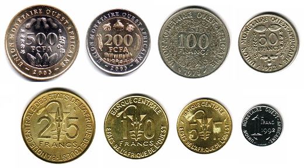

## Table of Contents

## What is the West African CFA Franc (XOF)?

The West African CFA Franc, or XOF, is a type of money used in eight countries in West Africa. These countries are Benin, Burkina Faso, Côte d'Ivoire, Guinea-Bissau, Mali, Niger, Senegal, and Togo. The XOF is tied to the Euro, which means its value stays the same compared to the Euro. This helps keep prices stable in these countries.

The West African CFA Franc was created by France to help its former colonies in Africa. It is managed by the Central Bank of West African States, which is based in Dakar, Senegal. Using the same money makes it easier for these countries to trade with each other and with France. However, some people think that using the CFA Franc keeps these countries too dependent on France.

## Which countries use the West African CFA Franc?

The West African CFA Franc, or XOF, is used in eight countries in West Africa. These countries are Benin, Burkina Faso, Côte d'Ivoire, Guinea-Bissau, Mali, Niger, Senegal, and Togo. People in these countries use the XOF as their money for buying things and trading.

The XOF is tied to the Euro, which means its value does not change compared to the Euro. This helps keep prices stable in these countries. The Central Bank of West African States, located in Dakar, Senegal, manages the XOF. Using the same money helps these countries trade with each other and with France more easily.

## What does CFA stand for in the context of the West African CFA Franc?

In the context of the West African CFA Franc, CFA stands for "Communauté Financière Africaine." This means "African Financial Community" in English. The name shows that the money is used by a group of countries in West Africa that work together financially.

The West African CFA Franc, or XOF, is used in eight countries: Benin, Burkina Faso, Côte d'Ivoire, Guinea-Bissau, Mali, Niger, Senegal, and Togo. These countries use the XOF to buy things and trade with each other. The money is tied to the Euro, which helps keep prices stable in these countries.

## How is the West African CFA Franc linked to the Euro?

The West African CFA Franc, or XOF, is linked to the Euro in a special way. For every 655.957 XOF, you get 1 Euro. This means the value of the XOF stays the same compared to the Euro. When the Euro goes up or down, the XOF goes up or down the same amount. This link helps keep prices stable in the countries that use the XOF.

The link to the Euro is managed by the Central Bank of West African States. This bank makes sure that the XOF stays tied to the Euro. Because the XOF is tied to a strong currency like the Euro, it helps the countries using it to have more stable money. But some people think this link makes these countries too dependent on Europe.

## What is the history of the West African CFA Franc?

The West African CFA Franc, or XOF, started in 1945. It was created by France to help its colonies in Africa after World War II. At first, it was used in many French colonies in Africa. The money was called the "Franc of the French Colonies in Africa." It helped these colonies trade with France and each other more easily. The XOF was tied to the French Franc, which was the money used in France at that time.

In 1958, the name changed to "Communauté Financière Africaine," which means "African Financial Community." This happened when some colonies became independent countries. The XOF was still tied to the French Franc. In 1999, the French Franc was replaced by the Euro. So, the XOF was then tied to the Euro instead. The rate was set at 655.957 XOF for 1 Euro. This link to the Euro helps keep prices stable in the countries that use the XOF.

Today, the West African CFA Franc is used in eight countries: Benin, Burkina Faso, Côte d'Ivoire, Guinea-Bissau, Mali, Niger, Senegal, and Togo. The Central Bank of West African States, based in Dakar, Senegal, manages the XOF. Some people like the XOF because it helps keep prices stable. But others think it makes these countries too dependent on Europe.

## How was the West African CFA Franc established?

The West African CFA Franc, or XOF, was created in 1945 by France to help its colonies in Africa after World War II. At first, it was called the "Franc of the French Colonies in Africa." This money helped the colonies trade with France and each other more easily. The XOF was tied to the French Franc, which was the money used in France at that time. This link helped keep the value of the XOF stable compared to the French Franc.

In 1958, the name of the money changed to "Communauté Financière Africaine," which means "African Financial Community." This happened when some colonies became independent countries. The XOF was still tied to the French Franc. In 1999, the French Franc was replaced by the Euro, so the XOF was then tied to the Euro instead. The rate was set at 655.957 XOF for 1 Euro. This link to the Euro helps keep prices stable in the countries that use the XOF. Today, the West African CFA Franc is used in eight countries: Benin, Burkina Faso, Côte d'Ivoire, Guinea-Bissau, Mali, Niger, Senegal, and Togo.

## What are the key events that have influenced the West African CFA Franc over time?

The West African CFA Franc, or XOF, was created in 1945 by France to help its colonies in Africa after World War II. At first, it was called the "Franc of the French Colonies in Africa." This money helped the colonies trade with France and each other more easily. The XOF was tied to the French Franc, which was the money used in France at that time. This link helped keep the value of the XOF stable compared to the French Franc.

In 1958, the name of the money changed to "Communauté Financière Africaine," which means "African Financial Community." This happened when some colonies became independent countries. The XOF was still tied to the French Franc. In 1999, the French Franc was replaced by the Euro, so the XOF was then tied to the Euro instead. The rate was set at 655.957 XOF for 1 Euro. This link to the Euro helps keep prices stable in the countries that use the XOF.

Today, the West African CFA Franc is used in eight countries: Benin, Burkina Faso, Côte d'Ivoire, Guinea-Bissau, Mali, Niger, Senegal, and Togo. The Central Bank of West African States, based in Dakar, Senegal, manages the XOF. Some people like the XOF because it helps keep prices stable. But others think it makes these countries too dependent on Europe.

## How does the West African CFA Franc impact the economies of the countries that use it?

The West African CFA Franc, or XOF, helps the economies of the countries that use it by keeping prices stable. Because the XOF is tied to the Euro, its value does not change much. This makes it easier for businesses in these countries to plan and trade with each other and with Europe. The Central Bank of West African States, which manages the XOF, helps make sure the money stays stable. This stability can attract foreign investment, which can help these countries grow their economies.

However, some people think that using the XOF makes these countries too dependent on Europe. Because the XOF is tied to the Euro, these countries cannot control their own money as much as they might want to. This can make it harder for them to make their own economic decisions. Some people also think that the link to the Euro can make it harder for these countries to grow their economies as fast as they could if they had their own money. So, while the XOF helps with stability, it also has some downsides that people argue about.

## What are the advantages and disadvantages of using the West African CFA Franc?

Using the West African CFA Franc, or XOF, has some good things about it. One big advantage is that it helps keep prices stable in the countries that use it. Because the XOF is tied to the Euro, its value does not change much. This makes it easier for businesses to plan and trade with each other and with Europe. The Central Bank of West African States, which manages the XOF, helps make sure the money stays stable. This stability can attract foreign investment, which can help these countries grow their economies.

However, there are also some downsides to using the XOF. Some people think that it makes these countries too dependent on Europe. Because the XOF is tied to the Euro, these countries cannot control their own money as much as they might want to. This can make it harder for them to make their own economic decisions. Some people also think that the link to the Euro can make it harder for these countries to grow their economies as fast as they could if they had their own money. So, while the XOF helps with stability, it also has some problems that people argue about.

## How does the West African CFA Franc compare to other currencies in Africa?

The West African CFA Franc, or XOF, is different from many other African currencies because it is tied to the Euro. This means its value stays the same compared to the Euro, which helps keep prices stable in the countries that use it. Other African currencies, like the Nigerian Naira or the South African Rand, are not tied to another currency in the same way. These currencies can change in value a lot, which can make prices go up and down more. The XOF is used in eight West African countries, while other African currencies are used in just one country or a smaller group of countries.

Some African countries, like those in the East African Community, use a different kind of money called the East African Shilling. This money is used in countries like Kenya, Uganda, and Tanzania. Unlike the XOF, the East African Shilling is not tied to a foreign currency like the Euro. This means its value can change more, which can make it harder to keep prices stable. The XOF's link to the Euro can make it easier for the countries that use it to trade with Europe, but it also means they have less control over their own money. Other African currencies, like the Ghanaian Cedi or the Egyptian Pound, are also not tied to another currency and can change in value more freely.

## What are the current debates and discussions surrounding the West African CFA Franc?

There are many debates about the West African CFA Franc, or XOF. Some people think that the XOF is good because it helps keep prices stable in the countries that use it. Since the XOF is tied to the Euro, its value does not change much. This makes it easier for businesses to plan and trade with each other and with Europe. The Central Bank of West African States, which manages the XOF, helps make sure the money stays stable. This stability can attract foreign investment, which can help these countries grow their economies.

However, other people think that using the XOF makes these countries too dependent on Europe. Because the XOF is tied to the Euro, these countries cannot control their own money as much as they might want to. This can make it harder for them to make their own economic decisions. Some people also think that the link to the Euro can make it harder for these countries to grow their economies as fast as they could if they had their own money. There have been calls for these countries to have their own money, so they can have more control over their economies. This debate continues, with different people having different views on what is best for these countries.

## What potential future changes could affect the West African CFA Franc?

One big change that could happen to the West African CFA Franc, or XOF, is that the countries using it might decide to have their own money. Some people think this would give these countries more control over their economies. They could make their own decisions about money without being tied to the Euro. This could help them grow their economies faster, but it might also make prices less stable.

Another change could be that the XOF stays tied to the Euro, but the rules change. For example, the countries might get more say in how the Central Bank of West African States works. This could make them feel less dependent on Europe. But keeping the link to the Euro would still help keep prices stable, which many people like. So, the future of the XOF depends on what these countries decide is best for them.

## References & Further Reading

[1]: Bordo, M. D., & Schwartz, A. J. (Eds.). (1999). ["The Implications of Globalization of World Financial Markets."](https://papers.ssrn.com/sol3/papers.cfm?abstract_id=225959) University of Chicago Press.

[2]: Cohen, D. (2019). ["The CFA franc: burning embers of empire."](https://www.tandfonline.com/doi/full/10.1080/01436597.2020.1852078) Financial History Review.

[3]: Davoodi, H. R., & Dixit, S. (2002). ["Monetary and Exchange Rate Policy of Transition Economies of Central and Eastern Europe after the Launch of EMU."](https://pmc.ncbi.nlm.nih.gov/articles/PMC6592997/) International Monetary Fund.

[4]: Helleiner, E. (2003). ["The Making of National Money: Territorial Currencies in Historical Perspective."](https://www.jstor.org/stable/10.7591/j.ctv2n7h0r) Cornell University Press.

[5]: Masson, P., & Pattillo, C. (2001). ["Monetary Union in West Africa (ECOWAS): Is It Desirable and How Could It Be Achieved?"](https://www.imf.org/external/pubs/nft/op/204/) International Monetary Fund.