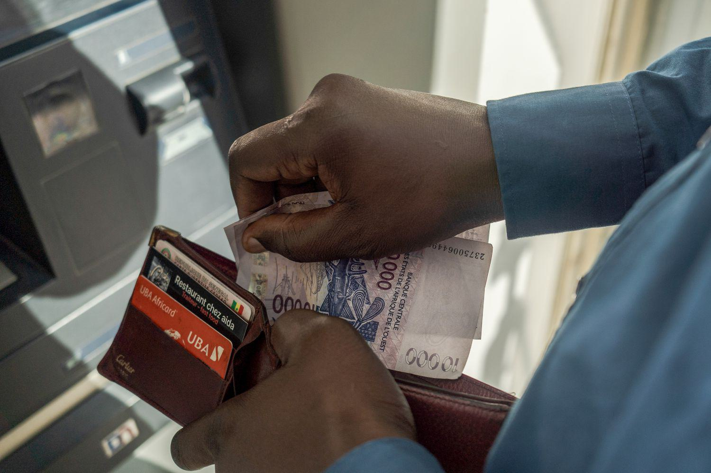

The West African CFA franc (XOF) is a crucial currency in the West African Economic and Monetary Union (WAEMU), encompassing eight countries: Benin, Burkina Faso, Guinea-Bissau, Ivory Coast, Mali, Niger, Senegal, and Togo. Established with enduring ties to France, the XOF is central to economic stability and integration within these nations. As a currency promoting financial cohesion, the XOF represents both historical continuity and economic interdependence among its member states.

The article will examine the complex history of the West African CFA franc, from its origins post-World War II to its role today. Key historical developments, such as its initial connection to the French franc and subsequent adjustments, including a notable devaluation, have shaped the currency’s function and perception in the region. The discussion will further illuminate the interchange with the euro, depicting how this linkage facilitates economic operations by enhancing trade stability with Eurozone nations, albeit at the expense of reduced monetary policy autonomy.



Understanding the influence of the XOF on the regional economy involves evaluating how its fixed exchange rate system inadvertently affects economic policies and decisions within WAEMU countries. This fixed-rate system with the euro stabilizes trade and inflation but imposes limitations on economic flexibility.

In addition to traditional economic impacts, the currency's relationship with modern financial practices like algorithmic trading is explored. With the XOF providing a stable backdrop for trading strategies, its integration into algorithmic models presents intriguing prospects for traders. The currency’s fixed peg to the euro supplies a predictable environment, potentially enhancing trading effectiveness in global markets.

The forthcoming sections will detail these dimensions, assessing how the XOF has underscored regional economic strategies, and how potential reforms, like the introduction of the proposed 'Eco' currency, might redefine the economic landscape. The intersections between traditional economic practices and innovative financial technologies highlight the evolving narrative of the West African CFA franc.

## Table of Contents

## Understanding the XOF

The West African CFA franc, designated as XOF, is the official currency utilized by eight countries within the West African Economic and Monetary Union (WAEMU): Benin, Burkina Faso, Guinea-Bissau, Ivory Coast, Mali, Niger, Senegal, and Togo. Established as a mechanism to promote economic stability and integration among these nations, the XOF emphasizes regional cohesion through its monetary policies and economic strategies.

A notable feature of the XOF is its backing by the French treasury, which provides a unique form of financial support ensuring the currency's backing. This arrangement guarantees that the XOF maintains its exchange value against the euro, thereby stabilizing its purchasing power and minimizing inflationary risks. The peg to the euro, established at a fixed rate, facilitates a predictable economic environment. This setup benefits both domestic economies and international trade partners by reducing currency fluctuations and providing a stable platform for economic transactions.

The linkage to the euro implies that the XOF's value is directly tied to the performance of the Eurozone economy. While this connection brings benefits like low inflation rates and stable prices, it also restricts the monetary policy flexibility of WAEMU member states. Since domestic monetary policy decisions are heavily influenced by the European Central Bank's directives, the WAEMU nations face limitations in crafting independent economic policies tailored to their specific national needs.

Economically, the XOF's framework promotes intra-regional trade by allowing transactions without the complexities of currency conversion between member countries. This ease of trade enhances market efficiency and reduces transaction costs, stimulating economic activity within the region. Furthermore, the unified currency fosters a stronger collective bargaining position in international markets by presenting a large, cohesive economic block.

However, there are challenges associated with this monetary integration. The reliance on the euro to stabilize the XOF means that any significant economic fluctuations within the Eurozone could potentially impact the WAEMU countries. Such a dependency could impede the ability of these nations to respond adequately to external economic shocks.

Overall, the XOF serves a critical function in shaping the economic landscape of the WAEMU region. Its connection to the euro provides predictability and confidence, while its limitations call for strategic economic planning to address the dynamic nature of global economic environments.

## Historical Background

The West African CFA franc (XOF) was established in 1945, shortly after the conclusion of World War II, marking a significant shift in the economic landscape of West Africa. It replaced the French West African franc, consolidating the region's currencies under a single entity regulated initially by the colonial authorities. This move was designed to facilitate economic coordination among the French colonies in West Africa, instilling financial stability and reducing transaction complexities that arose from multiple currencies.

Initially pegged to the French franc, the XOF created a stable monetary environment crucial for economic planning and cross-border trade within the colonies. The pegging mechanism provided a fixed exchange rate, offering predictability in international trade and investment. However, one of the most notable changes in the history of the West African CFA franc occurred in January 1994. This was the currency's devaluation by 50%, a decision driven by the need to improve economic competitiveness across the region. The devaluation aimed to correct imbalances caused by overvaluation and to spur export-driven growth by making West African goods more attractive on the global market.

This strategic monetary policy shift had far-reaching implications for the economic strategies of the WAEMU member states. Following the devaluation, countries within the union witnessed increased export activities, which, although beneficial for economic development, also posed challenges. Import costs rose, leading to inflationary pressures that affected the purchasing power of consumers. Moreover, this shift necessitated adjustments in fiscal policies and structural reforms to stabilize economies and mitigate inflationary effects.

In summary, the introduction of the West African CFA franc and its subsequent devaluation in 1994 were pivotal moments in the region's economic history. These events have had long-lasting impacts on the economic strategies of WAEMU member states, influencing their approaches to monetary policy, fiscal discipline, and international trade dynamics.

## XOF and the Euro: A Fixed Exchange Rate

The fixed exchange rate between the West African CFA franc (XOF) and the euro is a distinctive feature of the currency that greatly influences the economic dynamics of the West African Economic and Monetary Union (WAEMU). This system of pegging the XOF to the euro provides several advantages and disadvantages that impact the member countries' economies.

The primary benefit of a fixed exchange rate is the simplification of trade with Eurozone countries. By maintaining a stable value against the euro, the XOF offers predictability in international transactions and reduces the uncertainty associated with fluctuating exchange rates. This stability is crucial for businesses and investors engaging in trade between WAEMU nations and countries within the Eurozone, as it allows for more accurate financial planning and pricing strategies. 

Furthermore, the fixed peg contributes to low inflation rates within the region. By anchoring the XOF to the euro, WAEMU nations effectively import the Eurozone's monetary discipline, which has historically kept inflation relatively low. This stability bolsters consumer confidence and fosters an environment conducive to economic growth and foreign investment.

However, the fixed exchange rate comes with significant drawbacks, primarily related to limited monetary policy flexibility. Since the XOF's value is tied to the euro, the central banks of the member countries have restricted ability to respond independently to their unique economic challenges. For instance, in times of economic downturn or crisis, WAEMU nations cannot adjust interest rates or devalue their currency to boost competitiveness, as doing so would require altering the fixed exchange rate. This limitation can lead to a reliance on the Eurozone's economic health, placing the WAEMU economies at risk during European recessions or economic slowdowns.

Moreover, the fixed peg constrains economic independence, as WAEMU countries must align their monetary policies with the European Central Bank's decisions, which may not always align with their domestic needs. This dependency can hamper efforts to address local economic issues effectively and reduce the region's ability to enact tailored fiscal strategies.

In summary, while the fixed exchange rate between the XOF and the euro provides trading stability and inflation control, it also imposes constraints on monetary policy and economic independence. Balancing these benefits and drawbacks is crucial for the WAEMU member states as they navigate the complexities of integrated global and regional economies.

## Economic Impact of the XOF

The West African CFA franc (XOF) significantly enhances economic integration within the West African Economic and Monetary Union (WAEMU) by streamlining intra-regional trade. A common currency reduces currency exchange risks, thereby promoting business transactions across member nations, including Benin, Burkina Faso, Guinea-Bissau, Ivory Coast, Mali, Niger, Senegal, and Togo. This uniformity not only simplifies accounting and pricing but also reduces transaction costs, thus fostering a more stable and predictable business environment.

However, the XOF's fixed peg to the euro introduces certain economic dependencies. While this peg ensures low inflation rates within the WAEMU, it also ties the economic fate of these countries to the economic health of the Eurozone. Consequently, during economic downturns in Europe, the WAEMU countries may encounter reduced export competitiveness against countries with more flexible monetary policies. This situation can lead to balance of payments issues, reduced foreign direct investment, and economic strain as WAEMU nations lack the monetary policy autonomy to adjust their currency value in response to external shocks.

Moreover, while economic integration offers advantages, it can also impose constraints on economic sovereignty. Member nations of the WAEMU are bound by monetary policies set by the Central Bank of West African States (BCEAO), limiting their ability to implement independent fiscal measures tailored to their national needs. This lack of autonomy can be seen as a trade-off for stability and integration, but it may hinder individual states from responding effectively to unique economic challenges.

Despite these constraints, the XOF has played a crucial role in promoting regional cooperation and stability, acting as a catalyst for broader economic initiatives within the West African region. Its continued evolution will likely hinge on the balance between maintaining regional stability and addressing the economic independence needs of the member nations.

## Algorithmic Trading with the XOF

The West African CFA franc (XOF), with its stable peg to the euro, provides a predictable currency environment that is particularly advantageous for [algorithmic trading](/wiki/algorithmic-trading) strategies. This predictability allows traders to fine-tune their models for both long-term strategic investments and short-term trading opportunities. Algorithmic trading, which involves using computer programs and mathematical models to execute trades, can greatly benefit from the low-[volatility](/wiki/volatility-trading-strategies) environment that a fixed exchange rate system like the XOF provides.

To effectively incorporate the XOF into algorithmic trading models, traders primarily focus on the stability of the currency's exchange rate. A fixed peg reduces the number of variables in trading strategies, allowing algorithms to emphasize other economic indicators such as [interest rate](/wiki/interest-rate-trading-strategies) differentials, economic data from the West African Economic and Monetary Union (WAEMU) member countries, and changes in the economic climate of the Eurozone.

### Designing Algorithmic Trading Models with XOF

1. **Data Acquisition and Processing**:
   Reliable historical data is critical for [backtesting](/wiki/backtesting) trading strategies. Given the XOF's peg to the euro, traders often integrate economic data from both the WAEMU region and the Eurozone. Market data vendors can supply the necessary exchange rates, while public sources might offer macroeconomic indicators.

   ```python
   import pandas as pd
   import pandas_datareader.data as web

   # Fetch historical data for XOF/EUR exchange rates
   start_date = '2010-01-01'
   end_date = '2023-01-01'
   xof_data = web.DataReader('XOF/EUR', 'yahoo', start_date, end_date)
   ```

2. **Model Development**:
   Algorithms designed to trade XOF may employ statistical [arbitrage](/wiki/arbitrage), [trend following](/wiki/trend-following), or [machine learning](/wiki/machine-learning) to identify trading opportunities. For instance, a simple moving average crossover strategy could be applied given the stable base of the currency.

   ```python
   def simple_moving_average(data, short_window=10, long_window=50):
       data['SMA_Short'] = data['Close'].rolling(window=short_window, min_periods=1).mean()
       data['SMA_Long'] = data['Close'].rolling(window=long_window, min_periods=1).mean()
       data['Signal'] = 0.0
       data['Signal'][short_window:] = \
           np.where(data['SMA_Short'][short_window:] > data['SMA_Long'][short_window:], 1.0, 0.0)
       data['Position'] = data['Signal'].diff()
       return data

   xof_data_signal = simple_moving_average(xof_data)
   ```

3. **Risk Management and Execution**:
   Efficient execution of trades relies on sophisticated risk management techniques. Given the linkage with the euro, risk management can include tools such as stop-loss limits and position sizing to minimize potential losses.

4. **Backtesting and Optimization**:
   Once a model is developed, backtesting helps assess its past performance, assuming that market conditions will, to a reasonable degree, behave similarly in the future. Optimization involves adjusting the model's parameters to maximize returns and minimize risk across different market scenarios.

The incorporation of algorithmic trading with the XOF into broader investment strategies presents both unique opportunities and challenges. While the currency's stability offers a favorable backdrop for certain trading models, the relative economic size of WAEMU countries versus the Eurozone requires traders to be attentive to external economic impacts. By leveraging the XOF's predictable environment, traders can craft algorithms that efficiently exploit both long-standing and emergent market inefficiencies.

## Future Prospects and Challenges

With ongoing discussions about introducing the 'Eco' as a replacement for the CFA franc, the future of the West African CFA franc (XOF) appears both promising and uncertain. The proposed introduction of the Eco, a single currency intended for the Economic Community of West African States (ECOWAS), carries the potential to significantly influence the monetary strategies and economic autonomy of the West African Economic and Monetary Union (WAEMU) nations.

The concept of the Eco aims to enhance regional integration and economic stability by reducing reliance on external currencies and fostering greater intra-regional trade. If successfully implemented, it could bolster the economic sovereignty of participating nations by providing them with a currency that reflects their collective economic realities rather than being pegged to the euro. This shift could potentially enable member countries to tailor monetary policies more closely to their specific economic contexts, addressing local economic challenges more effectively.

However, transitioning from the CFA franc to the Eco is fraught with challenges. Foremost among them is the need for convergence in macroeconomic policies across ECOWAS member states. Achieving this convergence requires aligning fiscal policies, inflation rates, and budgetary guidelines, which vary significantly across the region. The diversity in economic structures, development levels, and external dependencies also complicates the transition process.

Moreover, there is the challenge of maintaining investor confidence during the transition. The fixed exchange rate of the XOF to the euro has provided stability and predictability, essential for attracting foreign investments. A shift to the Eco could introduce exchange rate volatility, potentially unsettling investors unless a robust framework is established to manage these fluctuations.

Strategically, it will be crucial for WAEMU nations to develop a transparent and structured roadmap for adopting the Eco. This plan should emphasize capacity building in monetary policy formulation and financial market infrastructure while ensuring public and private sector engagement in the transition process. Collaborative efforts with regional and international partners will also be vital to mitigate risks and ensure a smooth transition.

In summary, while the introduction of the Eco represents an opportunity to reshape the economic landscape of WAEMU nations, it requires careful planning and strategic alignment to overcome the challenges and capitalize on the potential benefits.

## Conclusion

The West African CFA franc continues to serve as a vital instrument for economic cohesion and a symbol of regional identity for the member states of the West African Economic and Monetary Union (WAEMU). Its longevity and consistency reflect its significance in binding these countries into a closely-knit economic bloc, enabling smoother trade relations and shared financial policies. 

Examining the history, current operations, and potential future of the XOF is crucial in understanding its role in fostering economic growth and innovation. The currency's peg to the euro has historically provided stability, helping shield the region from erratic inflation and global market volatility. This stability creates a conducive environment for economic planning and investment, key contributors to growth.

Looking ahead, algorithmic trading presents innovative possibilities by capitalizing on the predictability offered by the XOF's fixed exchange rate with the euro. Algorithmic strategies could enhance market efficiency and [liquidity](/wiki/liquidity-risk-premium), offering sophisticated investors new avenues for profit maximization while contributing to financial market depth in WAEMU.

However, the future of the XOF is potentially marked by significant change with the ongoing discussions surrounding the introduction of the "Eco." This potential shift could redefine monetary policies and present both opportunities and challenges. It offers prospects for increased regional autonomy and economic resilience but also necessitates careful planning to avoid destabilization. 

As WAEMU nations contemplate these changes, the evolution of the currency—whether continuing as the CFA franc or transitioning to the Eco—will remain central to regional economic strategies. Balancing tradition with innovation will be imperative as the currency adapts to meet the dynamic needs of West Africa's economies.

## References & Further Reading

[1]: Bordo, M. D., & Schwartz, A. J. (Eds.). (1999). ["The Implications of Globalization of World Financial Markets."](https://papers.ssrn.com/sol3/papers.cfm?abstract_id=225959) University of Chicago Press.

[2]: Cohen, D. (2019). ["The CFA franc: burning embers of empire."](https://www.tandfonline.com/doi/full/10.1080/01436597.2020.1852078) Financial History Review.

[3]: Davoodi, H. R., & Dixit, S. (2002). ["Monetary and Exchange Rate Policy of Transition Economies of Central and Eastern Europe after the Launch of EMU."](https://pmc.ncbi.nlm.nih.gov/articles/PMC6592997/) International Monetary Fund.

[4]: Helleiner, E. (2003). ["The Making of National Money: Territorial Currencies in Historical Perspective."](https://www.jstor.org/stable/10.7591/j.ctv2n7h0r) Cornell University Press.

[5]: Masson, P., & Pattillo, C. (2001). ["Monetary Union in West Africa (ECOWAS): Is It Desirable and How Could It Be Achieved?"](https://www.imf.org/external/pubs/nft/op/204/) International Monetary Fund.