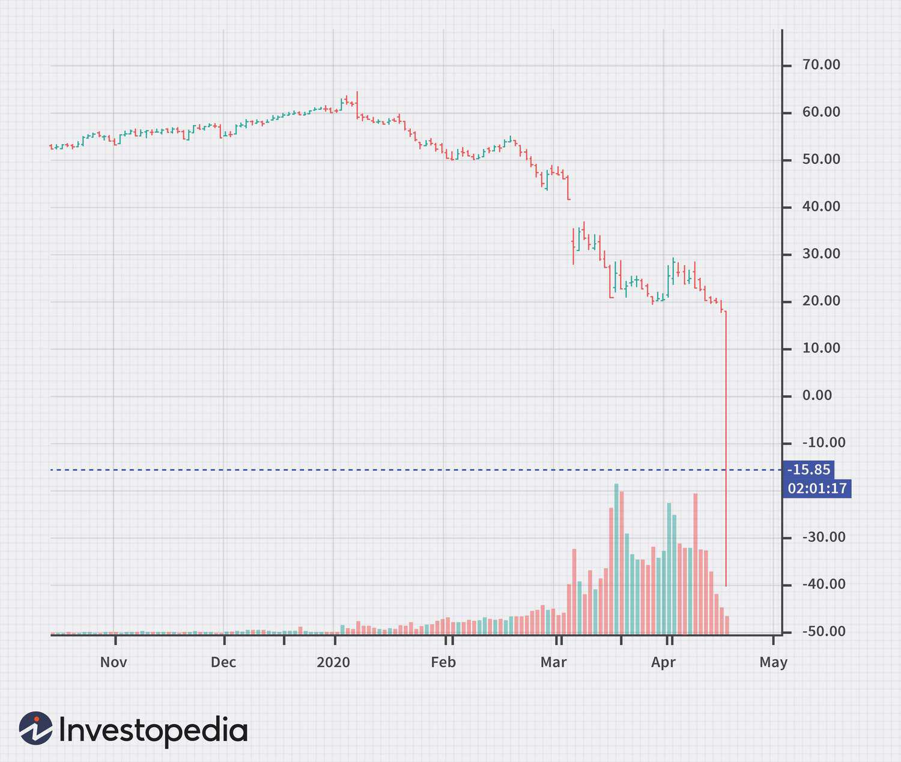

The West Texas Intermediate (WTI) oil benchmark is a cornerstone of the global oil market, critical in establishing prices and guiding trading activities worldwide. One of its most notable roles is its presence as a pricing benchmark for oil futures and global trading, where it provides a standard measure against which different types and sources of oil are traded and valued. As trading practices evolve, the influence of algorithmic trading has surged, profoundly affecting traditional methodologies within the oil industry.

Algorithmic trading, characterized by the use of complex algorithms to execute trades at high speed and frequency, is transforming how transactions are conducted across various financial markets, including those involving WTI crude oil. These technological advancements in trading algorithms have ushered in a new era of market dynamics, enhancing efficiency and driving precision in trading practices. The integration of such algorithms is reshaping the landscape of oil trading, providing traders with tools for real-time data analysis and decision-making.



The purpose of this article is to explore the intersection of WTI crude oil and algorithmic trading. Through this exploration, we aim to illustrate the transformative impact these algorithms have on the trading process and how they influence the behavior of market participants involved in WTI transactions. Whether it's through optimizing trade execution or interpreting complex market signals, algorithmic trading is paving the way for a future dominated by automated and intelligent trading systems.

As the market continues to shift, understanding the implications of these changes is essential for staying competitive and informed. This article aims to provide valuable insights into the ongoing transformation within the oil industry, emphasizing the importance of technological advancements and their role in shaping tomorrow's trading landscape.

## Table of Contents

## Understanding WTI Crude Oil

West Texas Intermediate (WTI) crude oil is a major benchmark in the oil industry, serving as a standard reference for pricing oil in global markets. Its significance stems from its role as a primary pricing mechanism for oil futures contracts traded on the New York Mercantile Exchange (NYMEX). Historically, WTI crude oil gained prominence in the early 1980s as increased oil production from the United States necessitated a reliable pricing reference for domestic crude supplies.

WTI crude oil is distinguished by several key characteristics. It is classified as light sweet crude due to its relatively low density and sulfur content. Specifically, it has an American Petroleum Institute (API) gravity of approximately 39.6 degrees and contains about 0.24% sulfur. These properties make WTI highly desirable for refining into gasoline and other high-value products, contributing to its status as a preferred source of crude oil in the United States.

The geographic origins of WTI [crude oil](/wiki/crude-oil) are primarily U.S. oil fields, particularly those located in the Midwest and the southern states, including Texas and Oklahoma. These regions have historically been prolific producers of crude oil, and the infrastructure developed in these areas facilitates the transport of WTI oil to refining centers and export terminals.

WTI plays a vital role in the U.S. economy by influencing domestic energy prices and, consequently, the broader financial landscape. As a benchmark, WTI prices are closely watched by analysts, policy makers, and market participants, as they affect the pricing of gasoline and other petroleum products. Furthermore, fluctuations in WTI prices can impact inflation, consumer spending, and the profitability of energy companies.

On a global scale, WTI's influence extends beyond the United States. Although Brent Crude is often considered more relevant in the international arena, WTI prices still contribute to the global pricing matrix for crude oil. Changes in WTI prices can affect global economic trends, as shifts in oil supply and demand dynamics often lead to broader market reactions. For instance, a significant increase in WTI prices can result in higher production costs for manufacturers, influencing production decisions and commodity prices worldwide. Similarly, a sharp decline in WTI prices may signal an economic slowdown, impacting global trade and investment patterns.

In conclusion, WTI crude oil stands out due to its specific physical characteristics and its role as a benchmark for pricing oil in the United States and beyond. Its origins in U.S. oil fields and its impact on both the national and global economies underscore its importance in the oil market. Understanding the dynamics of WTI pricing provides valuable insights into broader economic trends and the complex interplay of supply and demand in the energy sector.

## Algorithmic Trading: An Overview

Algorithmic trading, also known as automated trading or black-box trading, involves the use of computer algorithms to execute trading orders. These algorithms make decisions about the timing, price, and quantity of trade by processing real-time market data using predetermined criteria. The concept significantly differs from traditional trading, which relies heavily on human judgment and manual execution. 

In recent years, the importance of [algorithmic trading](/wiki/algorithmic-trading) has grown substantially. In financial markets, it accounts for a large percentage of trade volumes, particularly in highly liquid markets such as equities and foreign exchange. This trend is driven by the need for efficiency and speed, enabling traders to capitalize on brief windows of opportunity. The rise of algorithmic trading aligns with advancements in technology and data availability, allowing traders to implement complex strategies that were previously infeasible.

Algorithms automate the decision-making process by analyzing vast amounts of data to identify trading opportunities. A common method is the utilization of statistical models and historical data patterns to predict future market movements. For example, a simple moving average crossover strategy could be automated using such an algorithm:

```python
def moving_average_crossover(stock_prices, short_window, long_window):
    short_avg = stock_prices.rolling(window=short_window).mean()
    long_avg = stock_prices.rolling(window=long_window).mean()
    signals = (short_avg > long_avg).astype(int)
    return signals
```

This Python code demonstrates a basic strategy where a buy signal is generated when a short-term moving average crosses above a long-term average. Such strategies are foundational in algorithmic trading, facilitating rapid execution without human intervention.

Algorithmic trading offers several advantages, including increased trading speed, accuracy, and a reduction in transaction costs and human errors. With the ability to process transactions in fractions of a second, algorithms ensure trades are executed at optimal prices and with perfect precision concerning trade instructions. This efficiency reduces the market impact of trades and improves the overall execution quality.

However, algorithmic trading is not without its challenges. Algorithms can inadvertently amplify market [volatility](/wiki/volatility-trading-strategies), as seen during events like the Flash Crash in 2010 when a significant stock market drop occurred in minutes. Moreover, the reliance on complex algorithms introduces risks concerning model reliability and software errors, which could lead to substantial financial losses if not properly managed.

Technological innovations continue to propel the rise of algorithmic trading across various markets. The integration of [artificial intelligence](/wiki/ai-artificial-intelligence) (AI) and [machine learning](/wiki/machine-learning) (ML) processes allows for more adaptive and intelligent trading systems. These technologies enable algorithms to learn from historical data and make informed predictions, offering a competitive edge to traders who employ them. As these innovations progress, regulatory bodies are also evolving to ensure fair trading practices and to mitigate systemic risks inherent to automated trading systems.

## WTI Crude Oil and Algorithmic Trading

The integration of algorithmic trading in the WTI crude oil market has significantly altered traditional trading methodologies. Algorithmic trading refers to the use of computer algorithms to automate the buying and selling of financial instruments, including WTI futures. These algorithms process large datasets at high speeds, allowing traders to capitalize on market opportunities with enhanced precision.

Various algorithmic trading strategies are employed in the WTI futures market. One popular approach is statistical [arbitrage](/wiki/arbitrage), which involves exploiting price differentials of WTI futures across different trading platforms. Traders use algorithms to identify and act on these discrepancies almost instantaneously, securing profits from minimal price variations. Another technique is trend-following, where algorithms predict WTI price movements based on historical data trends and execute trades accordingly. Options pricing models such as Black-Scholes can also be used to inform trading algorithms, providing a mathematical foundation for decision making.

The role of artificial intelligence (AI) in optimizing trading decisions is profound. AI algorithms analyze real-time data, including market news, historical price patterns, and geopolitical events, to predict future WTI prices. These algorithms are capable of learning from new data, thus improving their predictive accuracy over time. Machine learning models, especially those using [deep learning](/wiki/deep-learning) techniques, have shown potential in enhancing the predictive capabilities of WTI trading algorithms by detecting complex patterns that traditional statistical models may overlook.

Several case studies highlight the successful application of algorithmic trading in the WTI market. For example, hedge funds leveraging AI-driven algorithms have reportedly achieved improved returns by accurately forecasting price movements and adjusting their trading strategies in response to market changes. The continuous influx of real-time data and advancements in AI have enabled these funds to maintain their competitive edge in the highly dynamic oil market.

Looking ahead, the future of algorithmic trading in WTI oil appears promising. As computational power and data availability continue to grow, algorithms will become increasingly sophisticated. We can anticipate the development of more advanced AI models capable of processing even larger datasets with greater accuracy and speed. Blockchain technology may also play a role, providing enhanced transparency and security in transaction recording, further advancing algorithm-driven trading strategies. Overall, the trend suggests that algorithmic trading will become an ever more integral aspect of WTI crude oil trading, shaping market dynamics and offering new opportunities for traders equipped with cutting-edge technologies.

## The Impact on Traders and the Market

Algorithmic trading has significantly influenced traditional oil traders and their strategies, particularly within the West Texas Intermediate (WTI) oil market. The automation and precision afforded by algorithmic systems allow for rapid execution of trades based on large datasets, resulting in shifts in trading strategies employed by traditional traders. These traders have had to adapt to a market landscape where high-frequency trading can impact price movements within milliseconds.

Market volatility and [liquidity](/wiki/liquidity-risk-premium) issues are among the notable effects of algorithmic trading. Algorithms can respond to market conditions more quickly than human traders, leading to increased volatility during periods of high-frequency trading activity. For instance, rapid buying or selling by trading algorithms can lead to significant price swings, commonly referred to as flash crashes. However, algorithmic trading can also enhance liquidity by continuously providing buy and sell orders in the market. The dual effect of increased volatility and potential liquidity provision by algorithms creates a complex trading environment that traders must navigate.

Regulatory considerations and ethical implications are crucial aspects of algorithmic trading. Regulatory bodies strive to keep pace with technological advancements to prevent market manipulation and ensure fair trading practices. Regulations like the European Union's Markets in Financial Instruments Directive II (MiFID II) and the U.S. Securities and Exchange Commission's (SEC) rules set guidelines for algorithmic trading practices, mandating measures such as circuit breakers to curb excessive volatility. The ethical concerns also focus on transparency and the fairness of algorithmic strategies, as there is ongoing debate about the advantages algorithms confer to certain market participants over others.

The employment landscape in the oil trading sector is changing, driven by the increasing importance of algorithmic systems. Traders are required to possess not only traditional trading skills but also a strong understanding of data analysis, programming, and quantitative finance. This shift necessitates retraining and upskilling of the workforce, with a growing emphasis on roles such as quantitative analysts and data scientists.

For individual traders and institutional investors engaged in WTI trades, algorithmic trading offers distinct benefits and disadvantages. Individual traders can leverage algorithms to eliminate emotional biases and make data-driven decisions, potentially increasing profitability. However, they often face challenges in competing with larger institutions that have access to more sophisticated trading algorithms and resources. For institutional investors, algorithmic trading provides the ability to manage large volumes of trades efficiently, reducing transaction costs and optimizing execution. Nonetheless, they must also contend with the regulatory scrutiny and ethical considerations associated with large-scale algorithmic trading operations.

Overall, algorithmic trading has transformed the WTI oil market landscape, presenting both opportunities and challenges. Traditional traders, regulatory bodies, and market participants must continuously adapt to the evolving environment to harness the benefits while mitigating the risks associated with algorithmic practices.

## Conclusion

The West Texas Intermediate (WTI) benchmark remains a cornerstone of the global oil market, representing a critical pricing standard for oil futures and trading activities worldwide. Its strategic significance is magnified through its intersection with algorithmic trading, a technology-driven approach to trading that has revolutionized the oil industry. Algorithmic trading has the transformative potential to significantly influence the dynamics of the oil market by automating processes, optimizing decision-making, and enhancing trading efficiency.

The rise of algorithmic trading presents both challenges and opportunities for traders. On one hand, it offers increased speed and precision, minimizing human error and capitalizing on market fluctuations faster than traditional methods. On the other hand, it poses challenges such as increased market volatility and new ethical and regulatory considerations. As markets become more automated, traders must adapt by acquiring new skills and knowledge to stay competitive.

In this evolving landscape, the importance of staying informed and adaptable is paramount. Traders and investors need to continuously educate themselves on emerging technologies, market trends, and regulatory changes to navigate this fast-paced environment effectively. Balancing innovation with market stability and integrity remains a pressing concern, as excessive reliance on algorithms could lead to unintended consequences, such as flash crashes or systemic risks.

Ultimately, as algorithmic trading continues to shape the future of WTI and global oil markets, stakeholders must strike a delicate balance between leveraging technological advancements and ensuring the resilience and integrity of financial systems. By doing so, they can harness the benefits of innovation while safeguarding the stability and reliability of the trading ecosystem.

## References & Further Reading

[1]: Yergin, D. (2011). ["The Quest: Energy, Security, and the Remaking of the Modern World"](https://www.jstor.org/stable/24693824). Penguin Books.

[2]: Elder, A. (2014). ["Trading for a Living: Psychology, Trading Tactics, Money Management"](https://www.amazon.com/Trading-Living-Psychology-Tactics-Management/dp/0471592242). Wiley.

[3]: Geman, H. (2005). ["Commodities and Commodity Derivatives: Modeling and Pricing for Agriculturals, Metals and Energy"](https://download.e-bookshelf.de/download/0000/5675/90/L-G-0000567590-0015270354.pdf). Wiley Finance.

[4]: Lavin, M. (2018). ["Automated Trading with R: Quantitative Research and Platform Development"](https://link.springer.com/book/10.1007/978-1-4842-2178-5). Wiley.

[5]: Aldridge, I. (2013). ["High-Frequency Trading: A Practical Guide to Algorithmic Strategies and Trading Systems"](https://onlinelibrary.wiley.com/doi/pdf/10.1002/9781119203803.fmatter). Wiley.

[6]: Lo, A. W. (2016). ["Adaptive Markets: Financial Evolution at the Speed of Thought"](https://www.jstor.org/stable/j.ctvc77k3n). Princeton University Press.