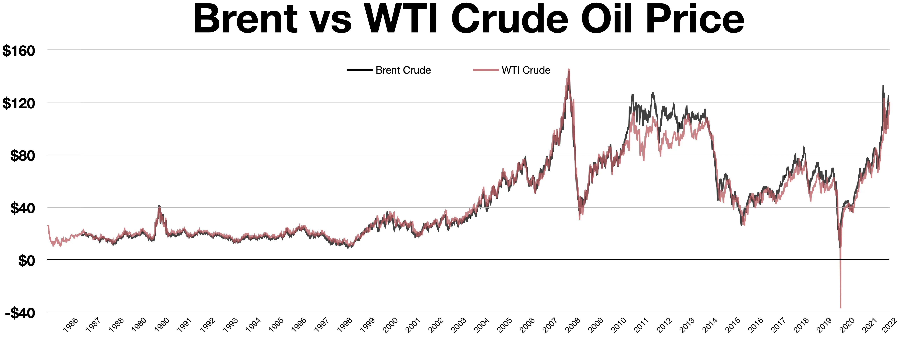

## Table of Contents

## What is West Texas Intermediate (WTI)?

West Texas Intermediate (WTI) is a type of crude oil that is used as a benchmark in oil pricing in the United States. It is a light, sweet crude oil, which means it has a low density and low sulfur content. WTI is produced in the United States, mainly in Texas, and it is considered a high-quality oil that is easy to refine into gasoline, diesel, and other products.

The price of WTI is closely watched by people in the oil industry and by investors. It is traded on the New York Mercantile Exchange (NYMEX) and is often used as a reference point for pricing other types of oil. Changes in the price of WTI can affect the prices of gasoline and other fuels, which can impact the economy as a whole.

## Why is WTI used as an oil price benchmark?

WTI is used as an oil price benchmark because it is a high-quality oil that is easy to refine. It comes from the United States, mostly from Texas, and it is known for being light and sweet. This means it has low density and low sulfur, which makes it easier and cheaper to turn into gasoline and other products that people use every day.

Because WTI is traded on the New York Mercantile Exchange, it is easy for people to buy and sell it. This makes it a good choice for a benchmark because it helps set a standard price that other oils can be compared to. When the price of WTI goes up or down, it can affect the prices of other oils and even the cost of gas at the pump.

## How is the price of WTI determined?

The price of WTI is determined by what people are willing to pay for it on the New York Mercantile Exchange, where it is traded. This exchange is like a big marketplace where buyers and sellers come together to trade oil. The price goes up when more people want to buy WTI than there are people willing to sell it. On the other hand, the price goes down when more people want to sell WTI than there are people willing to buy it.

Many things can affect the price of WTI. For example, if there is news about a big storm that might stop oil from being produced, the price might go up because people think there will be less oil available. Also, if the economy is doing well and people are driving more, they will need more gasoline, which can push the price of WTI up. On the other hand, if there is a lot of oil being produced and not many people want to buy it, the price can go down.

## What are the key characteristics of WTI crude oil?

WTI [crude oil](/wiki/crude-oil) is known for being light and sweet. This means it has a low density, which makes it easier to turn into gasoline and other products. It also has low sulfur content, which is good because it means less work and cost to clean it up before it can be used.

WTI comes from the United States, mostly from Texas. It is a high-quality oil that many people want to buy. Because it is easy to refine and use, it is a popular choice for setting the price of oil around the world.

## Where is WTI crude oil primarily extracted?

WTI crude oil is mainly extracted from the United States, with a big focus on Texas. The oil comes from places like the Permian Basin, which is a large area in West Texas and southeastern New Mexico. This region is known for producing a lot of oil, and it's where WTI gets its name from.

The Permian Basin is important because it has a lot of oil that is easy to get out of the ground. This makes it a key spot for WTI production. Other places in the U.S. also produce WTI, but the Permian Basin is the main area where it comes from.

## How does WTI compare to other oil benchmarks like Brent?

WTI and Brent are both important oil benchmarks, but they come from different places and have some differences. WTI comes from the United States, mostly from Texas, while Brent comes from the North Sea, near Europe. WTI is known for being light and sweet, which means it has low density and low sulfur. Brent is also light and sweet, but it can be a bit heavier and have a bit more sulfur than WTI. These differences can affect how easy it is to turn them into gasoline and other products.

The prices of WTI and Brent can be different because they are traded in different places. WTI is traded on the New York Mercantile Exchange, while Brent is traded on the Intercontinental Exchange in London. Sometimes, the price of WTI can be lower than Brent because it's easier to get to the U.S. market. But other times, things like how much oil is being produced or what's happening in the world can make their prices closer together or even make WTI more expensive. Both benchmarks are important for setting the price of oil around the world, but they can give different information about what's happening in the oil market.

## What factors influence the price fluctuations of WTI?

The price of WTI can go up and down because of many things. One big reason is how much oil people want to buy compared to how much is available. If there's a lot of oil but not many people want to buy it, the price can go down. But if there's not enough oil and a lot of people want it, the price can go up. Things like big storms or problems at oil refineries can also make the price change because they can stop oil from being produced or moved around.

Another thing that can change the price of WTI is what's happening in the world. If the economy is doing well and people are driving more, they need more gasoline, which can push the price of WTI up. On the other hand, if there's a big problem like a war or a financial crisis, people might not want to buy as much oil, and the price can go down. Also, decisions made by countries that produce a lot of oil, like Saudi Arabia, can affect the price. If they decide to produce more or less oil, it can change how much oil is available and what people have to pay for it.

## How does the WTI benchmark impact global oil markets?

The WTI benchmark is really important for the global oil market because it helps set the price for oil all around the world. When people talk about the price of oil, they often look at the price of WTI to get an idea of what's happening. Since WTI is traded in the United States and is a high-quality oil, changes in its price can affect the prices of other oils. For example, if WTI goes up, it can make the price of oil in other places go up too. This can impact how much people pay for gasoline and other fuels, which can affect the economy everywhere.

Another way WTI impacts global oil markets is by showing what's happening with oil supply and demand. If the price of WTI goes up, it might mean that there's not enough oil to meet the demand, or something is making it harder to get oil. On the other hand, if the price goes down, it might mean there's too much oil and not enough people want to buy it. This information helps people in the oil industry and investors make decisions about buying and selling oil. So, even though WTI comes from the United States, it has a big effect on oil markets all over the world.

## What are the historical trends in WTI pricing?

Over the years, the price of WTI has gone up and down a lot. In the early 2000s, the price was pretty low, often around $20 to $30 per barrel. But then, as more people around the world started using more oil, the price started to go up. By 2008, the price of WTI hit almost $150 per barrel. This was because a lot of people wanted oil, but there wasn't enough to go around. But then, the price crashed because of the global financial crisis, dropping back down to around $30 per barrel by the end of 2008.

After that, the price of WTI went through more ups and downs. In the early 2010s, the price started to climb again, reaching over $100 per barrel in 2011 and 2012. But then, starting in 2014, the price started to fall again because there was too much oil being produced, especially from places like the United States and Saudi Arabia. By early 2016, the price had dropped to below $30 per barrel. Since then, the price has been more stable, but it still goes up and down because of things like changes in how much oil people want, problems in oil-producing countries, and big events like the COVID-19 pandemic, which made the price drop a lot in 2020.

## How do geopolitical events affect WTI prices?

Geopolitical events can really shake up the price of WTI. If there's a war or a big problem in a country that makes a lot of oil, like Saudi Arabia or Iran, it can make people worried about whether there will be enough oil. This worry can push the price of WTI up because people might want to buy oil now before it gets harder to get. For example, when there were conflicts in the Middle East, the price of WTI often went up because people were scared that oil might not be able to get to where it needed to go.

On the other hand, if countries that make oil decide to work together and produce less oil, like what OPEC sometimes does, it can also make the price of WTI go up. They do this to try to keep the price high. But if they decide to produce more oil, or if a new country starts making a lot of oil, like the United States did with shale oil, it can make the price go down because there's more oil available. So, what happens in the world can really change how much people have to pay for WTI.

## What role does WTI play in futures and options trading?

WTI plays a big role in futures and options trading. Futures are contracts where people agree to buy or sell oil at a certain price in the future. Options are similar, but they give people the right to buy or sell oil at a certain price if they want to. WTI is used as the standard for these contracts because it's a high-quality oil that's easy to trade. People use these contracts to guess what the price of oil will be in the future and to protect themselves from big changes in the price.

When people trade WTI futures and options, they're trying to make money by guessing if the price of oil will go up or down. If they think the price will go up, they might buy a futures contract now and sell it later for more money. If they think the price will go down, they might sell a futures contract now and buy it back later for less money. Options give people more choices because they don't have to buy or sell the oil if they don't want to. All of this trading helps set the price of WTI and can affect the price of oil all over the world.

## How might future energy trends impact the relevance of WTI as a benchmark?

As the world moves towards using more renewable energy like solar and wind power, the importance of oil, including WTI, might change. If people start using less oil because they're driving electric cars or heating their homes with clean energy, the demand for WTI could go down. This means the price might not be as important to as many people. Also, new technology could make it easier to find and use other kinds of oil or even new energy sources, which could make WTI less of a standard for setting oil prices.

Even though the world is changing, WTI might still be important for a while. Oil is still a big part of our lives, and many countries and companies will keep using it for a long time. WTI is a high-quality oil that's easy to trade, so it will likely stay a key benchmark until we use a lot less oil. But as we move towards cleaner energy, the way we think about and use WTI could change, and other benchmarks or energy sources might become more important.

## References & Further Reading

[1]: Yergin, D. (2011). ["The Quest: Energy, Security, and the Remaking of the Modern World"](https://www.jstor.org/stable/24693824). Penguin Books.

[2]: Elder, A. (2014). ["Trading for a Living: Psychology, Trading Tactics, Money Management"](https://www.amazon.com/Trading-Living-Psychology-Tactics-Management/dp/0471592242). Wiley.

[3]: Geman, H. (2005). ["Commodities and Commodity Derivatives: Modeling and Pricing for Agriculturals, Metals and Energy"](https://download.e-bookshelf.de/download/0000/5675/90/L-G-0000567590-0015270354.pdf). Wiley Finance.

[4]: Lavin, M. (2018). ["Automated Trading with R: Quantitative Research and Platform Development"](https://link.springer.com/book/10.1007/978-1-4842-2178-5). Wiley.

[5]: Aldridge, I. (2013). ["High-Frequency Trading: A Practical Guide to Algorithmic Strategies and Trading Systems"](https://onlinelibrary.wiley.com/doi/pdf/10.1002/9781119203803.fmatter). Wiley.

[6]: Lo, A. W. (2016). ["Adaptive Markets: Financial Evolution at the Speed of Thought"](https://www.jstor.org/stable/j.ctvc77k3n). Princeton University Press.