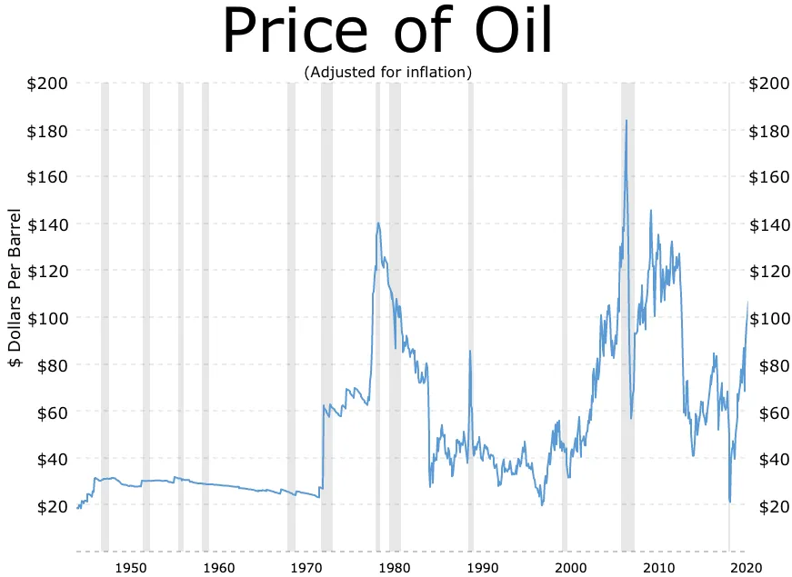

## Table of Contents

## What is West Texas Intermediate (WTI)?

West Texas Intermediate (WTI) is a type of crude oil that comes from the United States. It is a very important oil because it is used as a standard to set the price of other oils around the world. WTI is known for being light and sweet, which means it has low density and low sulfur content. This makes it easier and cheaper to refine into products like gasoline and diesel.

The price of WTI is often talked about in the news because it affects the price of oil and gas that people use every day. The price can change a lot because of things like how much oil is being produced, problems in oil-producing countries, and how much people around the world want to use oil. The main place where WTI is traded is in Cushing, Oklahoma, and its price is used as a benchmark for oil trading in North America.

## Where is WTI crude oil primarily extracted?

WTI crude oil is mainly extracted from wells in Texas, specifically in the Permian Basin. This area is a large oil field that covers parts of western Texas and southeastern New Mexico. The Permian Basin is one of the most productive oil regions in the United States, and it's where a lot of the WTI oil comes from.

Besides Texas, WTI crude oil is also extracted from other places in the United States, like North Dakota. The Bakken Formation in North Dakota is another important source of WTI. Oil from these regions is then transported to places like Cushing, Oklahoma, where it is stored and traded.

## How does WTI differ from other crude oils like Brent?

WTI and Brent are both types of crude oil, but they come from different places and have some differences. WTI, or West Texas Intermediate, comes from the United States, mostly from Texas and North Dakota. It's known as a "light" and "sweet" oil because it has low density and low sulfur content. This makes it easier and cheaper to turn into things like gasoline and diesel. The price of WTI is used as a standard to set prices for other oils in North America, and it's traded mainly in Cushing, Oklahoma.

Brent crude, on the other hand, comes from the North Sea, off the coast of Europe. It's also considered light and sweet, but it's a bit heavier and has a bit more sulfur than WTI. Brent is used as a benchmark for oil prices around the world, especially in Europe and Asia. The price of Brent can be different from WTI because of things like where the oil comes from, how it's transported, and what's happening in the world that affects oil prices. Both WTI and Brent are important, but they serve different parts of the global oil market.

## What is the significance of WTI in the global oil market?

WTI, or West Texas Intermediate, is really important in the global oil market. It's used as a standard to set the price of other oils, especially in North America. When people talk about the price of oil, they often mention WTI because it helps everyone understand how much oil costs. The price of WTI can change a lot because of things like how much oil is being produced, problems in oil-producing countries, and how much people around the world want to use oil.

WTI is different from other oils like Brent because it comes from the United States, mostly from Texas and North Dakota. It's known for being light and sweet, which means it's easier and cheaper to turn into things like gasoline and diesel. Because WTI is so important, its price can affect the price of gas at the pump and other products that come from oil. This makes WTI a big deal for everyone who uses oil, not just in the U.S. but all over the world.

## How is the price of WTI determined?

The price of WTI, or West Texas Intermediate, is determined by what people are willing to pay for it at the market. This happens every day on something called the New York Mercantile Exchange (NYMEX). Traders buy and sell WTI oil, and the price goes up or down based on how much they want to buy or sell. If more people want to buy WTI than sell it, the price goes up. If more people want to sell than buy, the price goes down.

Lots of things can change the price of WTI. For example, if there's a problem in an oil-producing country, like a war or a big storm, it can make it harder to get oil, and the price might go up. Also, if countries start using more oil because their economies are growing, the price can go up because there's more demand. On the other hand, if new ways to get oil are found or if people start using less oil, the price can go down. All these things together help decide the price of WTI every day.

## What are the key factors that influence WTI prices?

The price of WTI can go up and down because of many different things. One big thing is how much oil is being produced. If there's a lot of oil, the price might go down because there's more to go around. But if there's not enough oil, maybe because of problems like wars or storms in oil-producing countries, the price can go up. Another thing that matters is how much people want to use oil. If countries are growing and using more oil, the price can go up because there's more demand. If people start using less oil, maybe because they're driving less or using other kinds of energy, the price can go down.

Another factor that can change WTI prices is what's happening in the world. If there's a lot of uncertainty or if there are big changes in the economy, people might want to buy more oil to be safe, and this can make the price go up. Also, the value of the U.S. dollar can affect WTI prices. If the dollar is strong, oil can seem more expensive to people in other countries, and this might make them buy less, which can bring the price down. If the dollar is weak, oil can seem cheaper, and people might buy more, pushing the price up. All these things together help decide how much WTI costs every day.

## Can you explain the WTI futures contract?

A WTI futures contract is like a promise to buy or sell WTI oil at a certain price on a certain date in the future. People use these contracts to guess what the price of oil will be and to protect themselves from big changes in oil prices. For example, if you think the price of oil will go up, you might buy a futures contract now to get oil later at today's lower price. If the price does go up, you can make money by selling the contract for more than you paid for it.

These contracts are traded on the New York Mercantile Exchange (NYMEX), where traders can buy and sell them every day. Each contract is for 1,000 barrels of WTI oil, and they are set to end on specific dates each month. The price of these contracts can change a lot because they are affected by things like how much oil is being produced, what's happening in the world, and how much people want to use oil. By trading futures contracts, people can try to make money or protect themselves from the ups and downs of oil prices.

## How does the WTI benchmark impact the U.S. economy?

The WTI benchmark, or West Texas Intermediate, is really important for the U.S. economy. It helps set the price for oil in North America, and because oil is used to make things like gasoline and diesel, the price of WTI can affect how much people pay at the gas pump. When the price of WTI goes up, it can make things more expensive for everyone, which might make people spend less money on other things. This can slow down the economy because businesses might sell less and people might have less money to spend.

On the other hand, when the price of WTI goes down, it can make things cheaper for people and businesses. This can help the economy grow because people might spend more money on other things, and businesses might make more money. The price of WTI can also affect jobs in the oil industry. If the price is high, oil companies might hire more people to produce more oil. If the price is low, they might not need as many workers. So, the WTI benchmark plays a big role in how well the U.S. economy does.

## What are the storage and transportation challenges associated with WTI?

Storing and moving WTI oil can be tricky. One big challenge is that WTI oil is mostly stored in Cushing, Oklahoma. If too much oil comes to Cushing and there's not enough room to store it all, the price of WTI can go down a lot. This happened before, like in 2020 when the price of WTI even went negative because there was so much oil and nowhere to put it. Also, building more storage places can be expensive and take a long time, so it's hard to quickly fix the problem when there's too much oil.

Moving WTI oil from where it's made to where it's needed is another challenge. Most of the oil comes from places like Texas and North Dakota, and it has to be moved to Cushing or other places. This is usually done with pipelines, but sometimes there are not enough pipelines, or they might be full. When this happens, oil companies might have to use trucks or trains, which can be more expensive and slower. Sometimes, oil has to be moved to places outside the U.S., like through the Gulf of Mexico, and this can also be tricky because of things like bad weather or problems with other countries.

## How has the production of WTI evolved over the past decade?

Over the past ten years, the production of WTI has grown a lot, especially because of new ways to get oil out of the ground. One big change was the use of fracking, which is a way to break rocks underground to get the oil out. This helped the U.S. produce more WTI, especially from places like the Permian Basin in Texas and the Bakken Formation in North Dakota. Because of fracking, the U.S. became one of the biggest oil producers in the world, and this changed how much WTI was available and how much it cost.

Even though WTI production went up, there were still ups and downs. Sometimes, the price of oil would drop a lot, and this made oil companies slow down or stop drilling because it wasn't making them enough money. Other times, new technology or more demand for oil would push production up again. Overall, the past decade saw a big increase in WTI production, but it was not always steady because of changes in the oil market and new ways of getting oil out of the ground.

## What role does WTI play in geopolitical energy strategies?

WTI, or West Texas Intermediate, is really important in the world of energy and politics. Because it comes from the U.S., it can affect how other countries think about their energy plans. If the U.S. produces a lot of WTI, it might not need to buy as much oil from other countries. This can make the U.S. more independent and change how it acts in the world. Other countries might worry about this because they might sell less oil to the U.S. and make less money.

Also, the price of WTI can affect what other countries do. If WTI is cheap, countries might buy more oil from the U.S. instead of from other places. This can make some oil-producing countries unhappy because they might lose business. On the other hand, if WTI is expensive, countries might look for oil from other places or try to use less oil. So, WTI can be a big deal in how countries plan their energy future and how they work with each other.

## How do environmental regulations affect WTI production and pricing?

Environmental rules can change how much WTI oil is made and how much it costs. These rules are made to help the environment by making oil companies be more careful about how they get oil out of the ground and how they clean up after. Sometimes, these rules can make it more expensive for oil companies to produce WTI because they have to spend more money on things like better technology or cleaning up pollution. If it costs more to make WTI, the price of the oil might go up because the companies need to make back the money they spent.

Also, strict environmental rules can make oil companies slow down or stop drilling in some places. For example, if a new rule says they can't drill in a certain area, they might have to find another place to get oil, which can take time and money. This can mean less WTI oil is available, and when there's less oil, the price can go up because more people are trying to buy the same amount of oil. So, environmental rules can have a big effect on how much WTI is made and how much it costs.

## What is Risk Management in Algorithmic Trading?

Risk management is essential in algorithmic trading, particularly when dealing with volatile commodities like West Texas Intermediate (WTI) crude oil. The high price volatility seen in WTI markets requires traders to implement robust risk management strategies to safeguard against potential losses and to enhance profitability.

One fundamental aspect of risk management in algorithmic trading is setting stop-loss levels. Stop-loss orders are predetermined [exit](/wiki/exit-strategy) points that automatically trigger the sale of an asset once a specific price is reached, thereby limiting potential losses. For example, a trader might configure a stop-loss order to sell WTI futures if the price drops by 5% from its purchase price. Algorithmically calculating and setting these levels can help ensure they are in alignment with the trader's risk tolerance and market conditions.

Hedging is another vital strategy that traders employ. Hedging involves taking a position in a related market to offset potential losses in the primary market. For instance, traders might take a contrary position in another oil benchmark like Brent Crude oil futures or use options to cushion against adverse price movements in WTI. Automating such strategies allows for more effective management given the complexity and rapid pace of market changes.

Leverage, the use of borrowed funds to increase the potential return of an investment, is commonly used in trading WTI. However, leverage amplifies both potential gains and losses, making it a double-edged sword. To manage leverage risks, traders can employ strategies such as calculating the optimal leverage ratio based on their risk tolerance and the volatility of the WTI market. This can be done by optimizing the payoff function $L$ with respect to the leverage [factor](/wiki/factor-investing) $\lambda$, constrained by the volatility $\sigma$ of the asset:

$$
L = E[R] - \frac{\lambda^2 \sigma^2}{2}
$$

where $E[R]$ is the expected return. Minimizing the variance helps in managing the level of risk exposure effectively.

Regularly updating algorithms is crucial to adapt to market changes. Markets evolve and trading algorithms must be adjusted to effectively mitigate risks associated with new patterns and trends. This involves updating the data inputs and refining the signals that the algorithm uses to make trading decisions.

In conclusion, effective risk management in WTI algorithmic trading involves a comprehensive strategy incorporating stop-loss orders, hedging techniques, regulated use of leverage, and continuous algorithm updates. As market conditions change and evolve, so too must the strategies used to manage the associated risks, ensuring the sustainability and profitability of trading activities.

## References & Further Reading

[1]: [Bergstra, J., Bardenet, R., Bengio, Y., & Kégl, B. (2011). "Algorithms for Hyper-Parameter Optimization."](https://dl.acm.org/doi/10.5555/2986459.2986743) Advances in Neural Information Processing Systems 24.

[2]: ["Advances in Financial Machine Learning"](https://www.amazon.com/Advances-Financial-Machine-Learning-Marcos/dp/1119482089) by Marcos Lopez de Prado

[3]: ["Evidence-Based Technical Analysis: Applying the Scientific Method and Statistical Inference to Trading Signals"](https://www.amazon.com/Evidence-Based-Technical-Analysis-Scientific-Statistical/dp/0470008741) by David Aronson

[4]: ["Machine Learning for Algorithmic Trading"](https://github.com/PacktPublishing/Machine-Learning-for-Algorithmic-Trading-Second-Edition) by Stefan Jansen

[5]: ["Quantitative Trading: How to Build Your Own Algorithmic Trading Business"](https://books.google.com/books/about/Quantitative_Trading.html?id=j70yEAAAQBAJ) by Ernest P. Chan