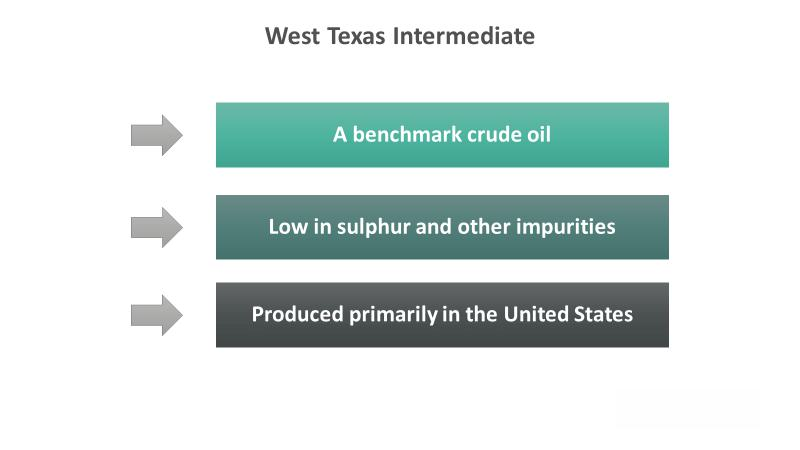

Understanding the intricacies of oil trading is essential for any investor or trader looking to participate in the global commodities market. Oil is a critical energy source, and fluctuations in its prices can have widespread economic implications. Among the different grades of crude oil, West Texas Intermediate (WTI) is a key benchmark in the oil market. Known for its light and sweet characteristics, WTI is preferred for refining into gasoline and is often the focus of trading strategies due to its relative stability and transparency in pricing.

The trading of WTI is a significant component of the oil market, influencing decisions across diverse sectors. In recent years, algorithmic trading has emerged as a transformative force in financial markets, including commodities like WTI. Algorithmic trading, or algo trading, involves using advanced computer programs to automate the buying and selling of financial instruments. This approach can optimize trading strategies, capitalize on market movements, and offer several advantages such as speed of execution and the elimination of human error. By analyzing large datasets, algorithmic trading can help predict future price movements, making it particularly useful in dynamic and volatile markets.



In this article, we will explore the role of WTI in the global commodities market and examine how algorithmic trading can be applied to WTI trading. Understanding this intersection of technology and commodity trade is essential for investors seeking to enhance their performance in oil markets. By leveraging algorithmic trading, traders can better navigate the complexities of WTI trading and potentially improve their risk management and profit potential.

## Table of Contents

## What is WTI Crude Oil?

West Texas Intermediate (WTI) represents a pivotal grade of crude oil that holds a significant position in global oil markets. As a benchmark that substantially influences oil pricing, WTI is renowned for its light and sweet properties. These characteristics refer to its low density and low sulfur content, respectively. The "lightness" means the oil has a higher API gravity, and the "sweetness" refers to its lower sulfur concentration, both of which simplify the refining process, making WTI an ideal choice for gasoline production.

WTI is primarily traded on the New York Mercantile Exchange (NYMEX), where it serves as a critical reference point for oil contracts and futures. It is often compared to Brent Crude, another major benchmark originating from the North Sea, which tends to have slightly different physical properties and market dynamics. Additionally, Dubai/Oman is another competing benchmark used in pricing, particularly for markets in the Middle East. The differences in these benchmarks are often crucial in determining regional pricing and can impact global trade flows.

For traders and investors, grasping the fundamentals of WTI is vital. This encompasses an understanding of supply and demand dynamics, geopolitical factors, and economic influences that can significantly affect oil prices. Furthermore, the quality and availability of WTI can dictate fluctuations in its market value, which in turn influences other energy commodities and related financial instruments. A nuanced understanding of WTI not only aids in more informed trading decisions but is indispensable for constructing effective strategies in crude oil trading and related financial activities.

## The Significance of WTI in Oil Trading

West Texas Intermediate (WTI) plays a pivotal role in the global oil markets as a primary benchmark for pricing [crude oil](/wiki/crude-oil). Its importance stems from its high quality and the stable supply from domestic U.S. production, which makes it an attractive choice for refineries and traders alike. WTI is characterized by its light and sweet nature, meaning it has a lower density and sulfur content compared to other crude oils, facilitating easier and more efficient refining into gasoline and other petroleum products.

The movements in WTI prices have a broad impact across various sectors, notably influencing energy stocks and related commodities. This is due to the direct relationship between crude oil prices and the profitability of oil-producing and refining companies. Furthermore, shifts in WTI prices are often mirrored in global markets, affecting currencies, equities, and even geopolitical dynamics. For instance, as oil prices rise, countries that are net importers of oil may experience economic strain, while those that are exporters may see economic benefits.

Traders regularly use WTI prices as a critical reference in decision-making processes involving futures contracts, options, and other financial instruments. Futures contracts based on WTI are one of the most actively traded, providing a means for companies to hedge against price [volatility](/wiki/volatility-trading-strategies). Options on WTI futures offer additional strategies for managing risk and speculating on future price movements.

The significance of WTI in influencing financial markets is underscored by its inclusion in indices like the S&P GSCI and its widespread use in financial models that forecast global economic conditions. As a result, investors, policymakers, and analysts closely monitor WTI price trends to gauge market sentiment and economic outlooks. In summary, WTI's role as a price-setting benchmark underscores its influence on the global oil market and its far-reaching economic implications.

## Overview of Algorithmic Trading

Algorithmic trading, commonly referred to as algo trading, involves the use of computer programs to execute trades based on predefined parameters, enhancing the efficiency and effectiveness of trading decisions. This method leverages complex algorithms capable of analyzing large datasets, identifying optimal trade opportunities, and executing trades with minimal delay. One of the significant advantages of [algorithmic trading](/wiki/algorithmic-trading) is its ability to eliminate human errors, as decisions are made systematically based on objective criteria rather than subjective judgment. This automation minimizes the influence of emotional factors on trading activities, potentially leading to more consistent outcomes.

The speed of execution in algorithmic trading is a notable benefit, allowing traders to capitalize on market movements almost instantaneously. In highly volatile markets, such as those for commodities or [forex](/wiki/forex-system), the ability to respond swiftly to price changes can be crucial for maximizing profits or minimizing losses. The algorithms can process vast quantities of information in real-time, enabling traders to make informed decisions promptly.

Algorithmic trading is applicable across various asset classes, including equities, forex, and commodities like West Texas Intermediate (WTI) crude oil. In each of these markets, traders utilize algorithms to execute trades based on various strategies, such as [trend following](/wiki/trend-following), mean reversion, or statistical [arbitrage](/wiki/arbitrage). These strategies rely on historical data and market indicators to anticipate future price movements and execute trades accordingly.

The implementation of algorithmic trading in these markets typically involves the use of programming languages such as Python. Python's rich ecosystem, with libraries like NumPy, pandas, and SciPy, offers robust tools for data analysis and algorithm development. For example, a Python script for a simple moving average crossover strategy might look like this:

```python
import pandas as pd

# Load historical data
data = pd.read_csv('historical_WTI_prices.csv')

# Calculate moving averages
data['SMA_50'] = data['Close'].rolling(window=50).mean()
data['SMA_200'] = data['Close'].rolling(window=200).mean()

# Generate signals
data['Signal'] = 0
data['Signal'][50:] = np.where(data['SMA_50'][50:] > data['SMA_200'][50:], 1, -1)

# Shift signals to align with trade execution
data['Position'] = data['Signal'].shift(1)

# Example execution: print the first few rows with signals
print(data[['Close', 'SMA_50', 'SMA_200', 'Signal', 'Position']].head())
```

In summary, algorithmic trading provides numerous advantages, including fast execution, error reduction, and enhanced data analysis capabilities, which are invaluable across different markets. By automating the decision-making process, traders can operate more efficiently and potentially increase their competitiveness in rapidly changing market environments.

## Applying Algorithmic Trading to WTI

In WTI trading, algorithms facilitate the automation of buying and selling processes by analyzing market indicators and historical data. These computer-based systems can systematically process vast amounts of information with speed and precision, identifying potential trading opportunities in milliseconds. Given WTI's volatility, especially in rapidly changing market environments, such algorithms are essential for optimizing trading activities.

### Pattern Recognition and Prediction

Traders utilize algorithms primarily to recognize patterns in the data that may predict future price movements. Historical price data, combined with technical indicators such as moving averages, Bollinger Bands, and Relative Strength Index (RSI), serve as inputs for these algorithms. By training models to discern these trends, traders can establish predictive frameworks capable of anticipating market shifts.

For example, the Moving Average Convergence Divergence (MACD) is a trend-following [momentum](/wiki/momentum) indicator that shows the relationship between two moving averages of a security’s price. In Python, calculating MACD might look like this:

```python
import pandas as pd

def calculate_macd(data, short_window=12, long_window=26, signal_window=9):
    short_ema = data['Close'].ewm(span=short_window, adjust=False).mean()
    long_ema = data['Close'].ewm(span=long_window, adjust=False).mean()
    macd = short_ema - long_ema
    signal = macd.ewm(span=signal_window, adjust=False).mean()
    return macd, signal

# Example usage with a DataFrame containing WTI price data
# wti_data is assumed to be a pandas DataFrame with a 'Close' column
macd, signal = calculate_macd(wti_data)
```

This code demonstrates the application of MACD, enabling predictive analytics to inform trading decisions.

### Execution and Timing

Algorithms also play a crucial role in executing trades with precision. High-frequency trading ([HFT](/wiki/high-frequency-trading-strategies)) systems, for instance, leverage algorithms to place numerous orders within microseconds based on the detected signals. This allows traders to capitalize on small price discrepancies that occur within ultra-short timeframes, thus maximizing profit margins.

### Risk Management

The volatility of oil markets like WTI requires robust risk management strategies embedded within algorithmic systems. Algorithms can be pre-programmed to impose stop-loss orders, which automatically sell a security when its price falls to a certain level, thus mitigating potential losses. Furthermore, diversification strategies can be implemented, where algorithms balance trades across various commodities or financial instruments to spread risk.

Leveraging is another critical consideration, where traders amplify potentials returns through borrowed capital. However, it increases the risk exposure, necessitating algorithms to dynamically adjust leverage based on current market conditions. Traders might use conditional statements in their code to adjust the weight of their positions:

```python
def adjust_leverage(portfolio_value, max_leverage=2.0):
    if portfolio_value < threshold_value:
        return max_leverage
    else:
        return max_leverage / 2

# Example usage
current_leverage = adjust_leverage(current_portfolio_value)
```

Overall, the application of algorithmic trading in WTI allows traders to enhance both efficiency and efficacy in their trading strategies, while navigating the complexities and risks inherent in volatile oil markets.

## Risk Management in Algorithmic Trading

Risk management is essential in algorithmic trading, particularly when dealing with volatile commodities like West Texas Intermediate (WTI) crude oil. The high price volatility seen in WTI markets requires traders to implement robust risk management strategies to safeguard against potential losses and to enhance profitability.

One fundamental aspect of risk management in algorithmic trading is setting stop-loss levels. Stop-loss orders are predetermined [exit](/wiki/exit-strategy) points that automatically trigger the sale of an asset once a specific price is reached, thereby limiting potential losses. For example, a trader might configure a stop-loss order to sell WTI futures if the price drops by 5% from its purchase price. Algorithmically calculating and setting these levels can help ensure they are in alignment with the trader's risk tolerance and market conditions.

Hedging is another vital strategy that traders employ. Hedging involves taking a position in a related market to offset potential losses in the primary market. For instance, traders might take a contrary position in another oil benchmark like Brent Crude oil futures or use options to cushion against adverse price movements in WTI. Automating such strategies allows for more effective management given the complexity and rapid pace of market changes.

Leverage, the use of borrowed funds to increase the potential return of an investment, is commonly used in trading WTI. However, leverage amplifies both potential gains and losses, making it a double-edged sword. To manage leverage risks, traders can employ strategies such as calculating the optimal leverage ratio based on their risk tolerance and the volatility of the WTI market. This can be done by optimizing the payoff function $L$ with respect to the leverage [factor](/wiki/factor-investing) $\lambda$, constrained by the volatility $\sigma$ of the asset:

$$
L = E[R] - \frac{\lambda^2 \sigma^2}{2}
$$

where $E[R]$ is the expected return. Minimizing the variance helps in managing the level of risk exposure effectively.

Regularly updating algorithms is crucial to adapt to market changes. Markets evolve and trading algorithms must be adjusted to effectively mitigate risks associated with new patterns and trends. This involves updating the data inputs and refining the signals that the algorithm uses to make trading decisions.

In conclusion, effective risk management in WTI algorithmic trading involves a comprehensive strategy incorporating stop-loss orders, hedging techniques, regulated use of leverage, and continuous algorithm updates. As market conditions change and evolve, so too must the strategies used to manage the associated risks, ensuring the sustainability and profitability of trading activities.

## Challenges and Considerations

Algorithmic trading in West Texas Intermediate (WTI) crude oil markets offers numerous advantages, but it also presents several challenges and considerations that traders must navigate effectively. One of the primary challenges is the risk of technical failures. These can occur when the technology infrastructure, including the hardware and software used to execute trades, malfunctions or experiences downtime. Reliable systems and regular maintenance checks are essential to mitigate such risks. Moreover, traders should implement robust backup systems and disaster recovery plans to ensure continuity.

Market data inaccuracies are another significant concern. Algorithmic trading relies heavily on real-time data feeds for decision-making. Inaccurate or delayed data can lead to faulty trading decisions and significant financial losses. To manage this risk, traders should use multiple data sources and implement cross-validation techniques to ensure data accuracy.

Evolving market conditions also pose a challenge for algorithmic trading in WTI. The oil market is highly volatile and influenced by a myriad of factors, including geopolitical events, economic shifts, and changes in supply and demand dynamics. Algorithms need to be adaptable and regularly updated to account for these changes. Traders should employ [machine learning](/wiki/machine-learning) techniques to develop algorithms that can learn from historical data and predict future market movements.

Regulatory considerations are critical to ensure compliance with trading standards. Algorithmic traders must adhere to rules set by financial regulatory bodies, which may include limits on the speed and frequency of trades, transparency requirements, and best execution practices. Staying informed about regulatory changes and maintaining compliance through regular audits and updates to trading systems is essential.

To remain competitive in the oil trading landscape, traders must continuously evolve their strategies and algorithms. This involves ongoing research and development, leveraging new technologies, and integrating advanced analytics tools. Additionally, traders should focus on enhancing their understanding of market dynamics and refining their risk management strategies to address potential price swings and leverage effectively.

In summary, while algorithmic trading offers significant potential for optimizing WTI crude oil trading, it requires careful management of technical, regulatory, and strategic challenges to ensure success.

## Conclusion

WTI crude oil stands as a pivotal component in the global commodities market, providing a benchmark for pricing that influences a vast array of financial instruments and energy sectors. Trading WTI is not only intrinsically complex due to the myriad factors affecting oil prices but also presents opportunities for significant financial gain. With the advent of algorithmic trading, market participants are equipped with powerful tools that enhance decision-making processes and trading efficiencies. 

Algorithmic trading, by automating execution and leveraging vast data analytics, allows traders to implement strategies that respond rapidly to market conditions. This capability is crucial in the WTI markets characterized by volatility and swift price movements. Algorithms can be designed to detect market patterns, execute trades at optimal times, and manage risks through predefined strategies, making them indispensable for traders aiming for higher performance.

For investors and traders, a comprehensive understanding of WTI and algorithmic trading dynamics is vital. This knowledge can facilitate the identification of market trends and the execution of informed trades while effectively managing the risks associated with volatility and leverage. As the oil market continues to evolve, staying informed and adaptive to technological advancements will enable traders to capitalize on emerging opportunities. By combining the insights gained from WTI’s market role with algorithmic trading techniques, investors are better positioned to navigate the complexities of the commodities market, ensuring sustainable and profitable trading endeavors.

## References & Further Reading

[1]: [Bergstra, J., Bardenet, R., Bengio, Y., & Kégl, B. (2011). "Algorithms for Hyper-Parameter Optimization."](https://dl.acm.org/doi/10.5555/2986459.2986743) Advances in Neural Information Processing Systems 24.

[2]: ["Advances in Financial Machine Learning"](https://www.amazon.com/Advances-Financial-Machine-Learning-Marcos/dp/1119482089) by Marcos Lopez de Prado

[3]: ["Evidence-Based Technical Analysis: Applying the Scientific Method and Statistical Inference to Trading Signals"](https://www.amazon.com/Evidence-Based-Technical-Analysis-Scientific-Statistical/dp/0470008741) by David Aronson

[4]: ["Machine Learning for Algorithmic Trading"](https://github.com/PacktPublishing/Machine-Learning-for-Algorithmic-Trading-Second-Edition) by Stefan Jansen

[5]: ["Quantitative Trading: How to Build Your Own Algorithmic Trading Business"](https://books.google.com/books/about/Quantitative_Trading.html?id=j70yEAAAQBAJ) by Ernest P. Chan