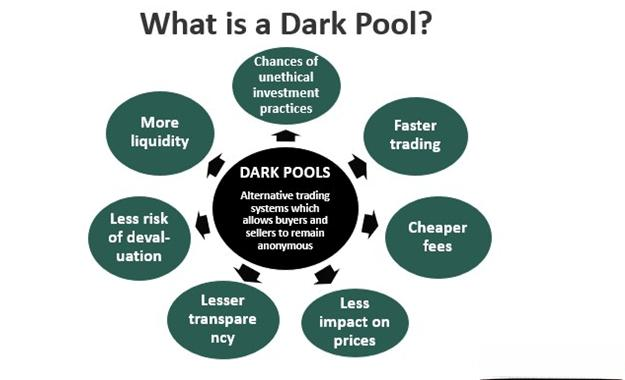

In algorithmic trading, dark pools have emerged as significant elements that influence the execution of trades and strategies. These private exchanges, where financial securities are traded, offer a different landscape compared to traditional stock exchanges. For traders who rely heavily on algorithmic strategies, understanding the implications of dark pools is crucial. These platforms, characterized by their lack of transparency, allow trades to be executed without immediate public disclosure, presenting unique opportunities and challenges. This article explores the advantages and disadvantages associated with dark pools in algorithmic trading, providing insights into how traders can navigate this opaque environment. By grasping the potential benefits and pitfalls, traders can make informed decisions to optimize their strategies and maintain a competitive edge in an evolving market.

## Table of Contents



## Understanding Dark Pools

Dark pools represent a unique component of modern financial markets. These private exchanges facilitate the trading of financial securities, providing an alternative to the traditional stock exchanges. Unlike public exchanges, where trades and order sizes are known immediately, dark pools offer an environment where transactions are conducted with a significant degree of secrecy. The primary feature that sets dark pools apart is their lack of transparency, as trade details are not disclosed to the public at the moment of execution. This anonymity allows institutional investors to execute large trades without significantly impacting the market price, which might happen if the trade were executed on a public exchange.

Dark pools primarily appeal to institutional investors who need to move large blocks of shares without alerting the broader market to their intentions. For instance, consider a scenario where a trader wants to purchase a large quantity of a company's stock. Executing this trade on a public exchange might drive up the price due to increased demand, making it more costly for the buyer. However, through a dark pool, the same transaction can be completed more discreetly, potentially leading to cost savings.

It's important to note that while dark pools provide certain advantages, they are often scrutinized due to their opaqueness. The lack of immediate public disclosure can result in a less transparent market environment, raising concerns about fair trading practices. As these private exchanges continue to grow in use, understanding their function, as well as their benefits and challenges, is vital for traders, particularly those employing sophisticated algorithmic strategies.

## Advantages of Dark Pools in Algorithmic Trading

Dark pools offer several advantages for [algorithmic trading](/wiki/algorithmic-trading), primarily by reducing market impact, increasing privacy, and potential price improvement. 

### Reduced Market Impact

One of the most significant benefits of using dark pools in algorithmic trading is the reduction in market impact. When large orders are executed on public exchanges, they can significantly influence market prices, leading to unfavorable price movements against the trader. In contrast, dark pools allow the execution of large trades discreetly, minimizing any potential ripple effects in the market. This aspect is particularly advantageous for institutional investors and [hedge fund](/wiki/hedge-fund-trading-strategies)s that routinely handle massive orders. By reducing the visibility of these transactions, dark pools help maintain market stability and potentially lower transaction costs.

### Increased Privacy

Dark pools also provide an enhanced level of privacy, critical for traders managing sizeable transactions. On traditional exchanges, revealing large order sizes can lead to adverse market movements as other market participants may react to these signals. Dark pools mitigate this risk by allowing trades to occur away from the public eye. This increased privacy prevents the trader's intentions from being disclosed, thus protecting against strategies like front-running, where other traders might act on the information of a large pending order to gain an advantage. The ability to trade anonymously supports strategic decision-making without the fear of revealing sensitive trading goals.

### Price Improvement

Additionally, there is potential for price improvement when trades are conducted in dark pools. Unlike public exchanges where the price is determined by the highest bid and the lowest ask, dark pool transactions often occur at a midpoint price – the average of the bid and ask prices. This midpoint execution can lead to cost-effective trading outcomes. Traders might achieve a more favorable price than they would have on the open market, contributing to better overall execution quality. The absence of a spread between buy and sell prices in dark pools can result in significant cost savings, particularly when executing large transactions.

In summary, dark pools offer distinct advantages by reducing market impact, providing increased privacy, and enabling potential price improvement, making them a valuable tool for algorithmic traders aiming to execute large trades with greater efficiency and discretion.

## Disadvantages of Dark Pools in Algorithmic Trading

Dark pools have carved out a critical yet controversial niche within algorithmic trading. One of the primary disadvantages of dark pools is the lack of transparency inherent in their operations. Unlike traditional stock exchanges where orders are publicly visible, trades in dark pools are executed behind the scenes. This opacity can lead to concerns about fairness and market abuse, as it is challenging for market participants to discern the true price discovery process or identify potential manipulative practices.

Another significant drawback is the issue of [liquidity](/wiki/liquidity-risk-premium). While dark pools are beneficial for executing large trades with minimal market impact, they often suffer from lower liquidity than public exchanges. This can pose a risk for traders seeking to execute sizable transactions swiftly, as finding a matching order may take longer, potentially leading to execution at less favorable prices. The insufficient liquidity could also lead to increased [volatility](/wiki/volatility-trading-strategies) in pricing, as the absence of a robust [order book](/wiki/order-book-trading-strategies) may cause larger price swings during transaction matching.

Moreover, the potential for favoritism in dark pools compounds these issues. Given the opaque environment, there are concerns that certain participants might receive preferential treatment, getting priority or better pricing on their trades. This perceived inequality can erode trust among traders and may lead to regulatory scrutiny, as markets rely on fair and equitable treatment of all participants to function efficiently.

These disadvantages highlight the need for careful consideration and strategy adaptation by traders engaging in dark pools, taking into account the trade-off between privacy and the risks associated with these trading venues.

## Regulatory Challenges

Dark pools, characterized by their opaque nature, have drawn considerable regulatory scrutiny, primarily due to concerns over market transparency and integrity. Regulators worry that the lack of public visibility in dark pool transactions can undermine the conventional market's price-setting mechanism, potentially giving room to unfair or manipulative trading practices. These concerns are rooted in the fact that trades occur without revealing the investor's identity or the transaction size until after execution, challenging fair market operations.

Efforts to address these concerns have led to a push for stricter regulatory frameworks. For example, the European Union's Markets in Financial Instruments Directive II (MiFID II) aims to enhance transparency in dark pool operations by imposing caps on the [volume](/wiki/volume-trading-strategy) of trading that can occur in these venues. This regulation is designed to prevent excessive off-exchange trading that might negatively impact the price formation process on lit exchanges.

In the United States, the Securities and Exchange Commission (SEC) has similarly increased its oversight of dark pools. The SEC's focus includes ensuring that these trading environments maintain fair access for all participants and do not favor certain high-frequency traders over others. Regulatory measures may involve enhanced disclosure requirements, where dark pools might need to provide more detailed reporting on their operations, including trade execution quality and participant activity.

These regulatory initiatives highlight the need for balance. While maintaining the benefits that dark pools offer, such as reduced market impact for large trades, there is a move towards increased oversight to safeguard market integrity. Traders engaging in algorithmic strategies within dark pools need to stay informed about evolving regulations to ensure compliance and strategize effectively in a landscape that is becoming progressively regulated.

## Impact on Algorithmic Trading Strategies

In algorithmic trading, adapting strategies to effectively operate within dark pools requires a nuanced approach to leverage their unique characteristics. Given the advantages such as reduced market impact and increased privacy, traders can benefit from incorporating these elements into their algorithms. For instance, large trades executed in dark pools are less likely to influence market prices, ensuring that traders maintain favorable conditions without triggering adverse reactions. This advantage is critical when executing substantial transactions, as it allows the algorithm to operate discreetly without alerting other market participants to its intentions.

However, to fully capitalize on these benefits, algorithms must be fine-tuned to account for the potential drawbacks of dark pools like liquidity concerns. Compared to public exchanges, the lack of transparency in dark pools can lead to uncertain liquidity levels. Therefore, algorithms could integrate adaptive mechanisms that monitor liquidity conditions across different venues, ensuring optimal trade execution. This could involve using historical data to predict liquidity trends or implementing [machine learning](/wiki/machine-learning) models that adjust trading strategies based on real-time liquidity assessments.

Python code, for instance, can be used to simulate and optimize such strategies by analyzing available data:

```python
import pandas as pd

# Load historical trade data
data = pd.read_csv('trade_data.csv')

# Function to analyze liquidity trends
def liquidity_trend_analysis(data):
    # Calculate average liquidity over time
    data['liquidity'] = data['ask_volume'] + data['bid_volume']
    avg_liquidity = data['liquidity'].rolling(window=20).mean()
    return avg_liquidity

# Adaptively choose trading strategy based on liquidity
def adapt_strategy(avg_liquidity, threshold=10000):
    if avg_liquidity[-1] > threshold:
        return "aggressive"
    else:
        return "conservative"

# Example usage
avg_liquidity = liquidity_trend_analysis(data)
strategy = adapt_strategy(avg_liquidity)
print("Current strategy:", strategy)
```

By focusing on both market conditions and liquidity, algorithms can dynamically adjust their trading tactics. This agility allows traders to navigate the complexities of dark pools, potentially offering a competitive edge. Implementing such strategies not only improves trade execution but also enhances overall performance by strategically choosing when and where to execute trades, based on real-time analysis and historical insights. 

As regulatory landscapes evolve, algorithmic traders will need to continuously update their strategies to adhere to new rules while taking full advantage of the efficiencies offered by dark pools. Embracing these changes can ensure that sophisticated trading algorithms remain at the forefront of innovation and profitability in the financial markets.

## Conclusion

Dark pools offer both advantages and challenges in algorithmic trading. Traders can benefit from reduced market impact and enhanced privacy when executing large orders. These attributes make dark pools particularly attractive for those looking to minimize the immediate effect of their trades on market prices.

However, there are significant drawbacks related to transparency and liquidity. The lack of transparency can lead to market fairness concerns and may leave traders vulnerable to potential abuses within the market. Furthermore, liquidity in dark pools is often not as robust as public exchanges, which may affect trade execution efficiency.

Regulations surrounding dark pools are continually evolving as authorities attempt to address these transparency and fairness issues. As these regulatory landscapes reshape, traders and firms involved in algorithmic trading must stay informed and adapt their strategies accordingly. Balancing the benefits against the risks is crucial for traders looking to leverage dark pools effectively in their strategies.

## References & Further Reading

[1]: Madhavan, A. (2012). ["Exchange-Traded Funds, Market Structure, and the Flash Crash."](https://www.tandfonline.com/doi/abs/10.2469/faj.v68.n4.6) The Review of Financial Studies, 25(11), 3305-3330.

[2]: Buti, S., Rindi, B., & Werner, I. M. (2011). ["Diving into Dark Pools."](https://onlinelibrary.wiley.com/doi/full/10.1111/fima.12395) Working Paper. 

[3]: Mittal, H. (2008). ["Are You Playing in a Toxic Dark Pool? A Guide and a Warning."](https://www.pm-research.com/content/iijtrade/3/3/20) Working Paper.

[4]: O’Hara, M., & Ye, M. (2011). ["Is Market Fragmentation Harming Market Quality?"](https://www.sciencedirect.com/science/article/abs/pii/S0304405X11000390#:~:text=Regression%20analysis%20provides%20confirming%20evidence,not%20harmed%20by%20market%20fragmentation.) Journal of Financial Economics, 100(3), 459-474.