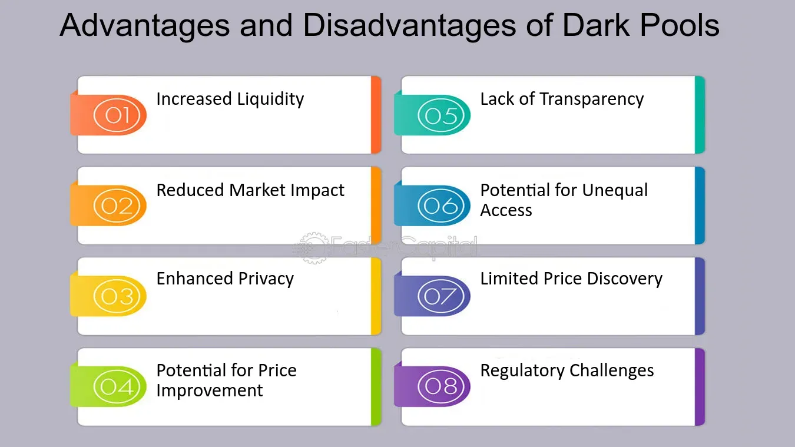

## Table of Contents

## What are dark pools in the context of trading?

Dark pools are private stock trading platforms where investors can buy and sell large amounts of shares without other people knowing about it. They are called "dark" because the trades are not shown to the public until after they happen. This helps big investors, like banks and big funds, to trade without affecting the stock's price too much. If everyone knew about their big trades, it could make the stock price go up or down a lot.

Using dark pools can be good because it helps keep the stock market stable. When big trades happen in the open market, they can cause big price changes. But in a dark pool, these trades are hidden, so they don't scare other investors. However, dark pools can also be bad because they make the market less open. Some people worry that dark pools give an unfair advantage to big investors who can use them, while smaller investors can't.

## How do dark pools function differently from traditional stock exchanges?

Dark pools work differently from traditional stock exchanges because they keep trades secret until they are done. In a regular stock exchange, like the New York Stock Exchange, everyone can see the trades happening in real time. This means that when someone wants to buy or sell a stock, everyone knows about it right away. But in a dark pool, big investors can trade without other people knowing about it until after the trade is finished. This helps them move large amounts of stocks without causing big price changes.

The main reason dark pools are used is to keep the market stable. When big investors trade a lot of stocks on a regular exchange, it can make the stock price go up or down a lot. This can scare other investors and make the market less stable. Dark pools help avoid this by hiding the big trades until they are done. However, this also means that the market is less open because not everyone can see what is happening. Some people think this gives big investors an unfair advantage over smaller ones who can't use dark pools.

## What is algorithmic trading and how does it relate to dark pools?

Algorithmic trading is when computers use math formulas to decide when to buy or sell stocks. These formulas, or algorithms, can look at a lot of information very quickly and make trades based on that information. This can be faster and sometimes more accurate than a person making the same decisions. Many big investors use algorithmic trading because it can help them make money by finding the best times to trade.

Algorithmic trading and dark pools are connected because big investors often use algorithms to trade in dark pools. Since dark pools keep trades secret, they are a good place for algorithms to work without other people knowing what is happening. This can help big investors move large amounts of stocks without causing big price changes in the market. However, it can also make the market less fair because not everyone can use dark pools or see what is happening in them.

## What are the primary advantages of using dark pools for trading?

Dark pools offer big investors a way to trade large amounts of stocks without other people knowing about it right away. This helps keep the stock price from moving too much. When big investors trade a lot of stocks on a regular exchange, it can make the stock price go up or down a lot. This can scare other investors and make the market less stable. By using dark pools, big investors can avoid this problem and help keep the market calm.

Another advantage of dark pools is that they can be faster and more private. Big investors often use computer programs, called algorithms, to decide when to buy or sell stocks. These algorithms can work better in dark pools because they can trade without other people seeing what they are doing. This can help big investors make more money by finding the best times to trade without other people knowing about it.

## Can dark pools help in reducing market impact when trading large volumes?

Dark pools can help reduce market impact when trading large volumes. When big investors want to buy or sell a lot of stocks, doing it on a regular exchange can make the stock price go up or down a lot. This is because everyone can see the big trade happening, and it can scare other investors. But in a dark pool, the trade is hidden until it's done. This means the big trade doesn't affect the stock price as much, and the market stays more stable.

Using dark pools for large trades helps keep the market calm. If a big investor wants to sell a million shares of a stock, doing it on a regular exchange could make the stock price drop a lot. But if they use a dark pool, they can sell those shares without other people knowing about it right away. This way, the stock price doesn't change as much, and it's better for everyone in the market.

## How do dark pools enhance privacy for traders?

Dark pools help keep traders' actions private. When someone trades in a dark pool, other people don't know about it until the trade is done. This is different from regular stock exchanges where everyone can see what's happening all the time. Big investors like this because they can buy or sell a lot of stocks without other people knowing about it right away.

This privacy is good for big investors because it helps them keep their trading plans secret. If everyone knew what they were doing, it could affect the stock price and make it harder for them to trade. By using dark pools, big investors can move large amounts of stocks without causing big price changes, which helps keep the market stable.

## What are the potential disadvantages of trading in dark pools?

Trading in dark pools can make the market less fair. Not everyone can use dark pools, so big investors have an advantage over smaller ones. When big investors trade in secret, it can be hard for other people to know what's happening in the market. This can make it harder for smaller investors to make good decisions because they don't have all the information.

Another problem with dark pools is that they can make the market less open. When trades happen in secret, it can be hard to trust that everything is fair. Some people worry that dark pools might be used in ways that are not good for the market. This can make people feel less confident about investing, which can hurt the market overall.

## How might dark pools affect market transparency and fairness?

Dark pools can make the market less open and fair. When big investors trade in dark pools, their trades are secret until they are done. This means other people don't know what's happening in the market. Smaller investors might not have all the information they need to make good choices. This can make the market less fair because big investors have an advantage. They can move large amounts of stocks without other people knowing, which can affect stock prices in ways that smaller investors can't see.

This lack of openness can also make people trust the market less. If trades are happening in secret, it's hard to know if everything is fair. Some people worry that dark pools might be used in ways that are not good for the market. This can make investors feel less safe about putting their money in the market. When people don't trust the market, it can hurt everyone because fewer people might want to invest.

## Are there regulatory concerns associated with dark pools?

Yes, there are regulatory concerns with dark pools. Regulators worry that dark pools can make the market less fair. Big investors can use dark pools to trade in secret, which means smaller investors might not know what's happening. This can give big investors an unfair advantage. Regulators want to make sure everyone has the same information and can trade fairly.

Another concern is that dark pools can make the market less open. When trades happen in secret, it's hard to know if everything is fair. Regulators want to make sure the market is open and that people can trust it. They are always looking at rules to make sure dark pools don't hurt the market. This helps keep the market safe for everyone.

## How do dark pools influence price discovery in the financial markets?

Dark pools can make it harder for the market to find the right price for stocks. When big investors trade in dark pools, their trades are secret until they are done. This means other people don't know about these big trades right away. Because of this, the information that helps set stock prices is not shared with everyone at the same time. This can make it harder for the market to figure out what a stock should really be worth.

However, dark pools can also help keep the market stable. When big investors trade a lot of stocks on a regular exchange, it can make the stock price go up or down a lot. This can scare other investors and make the market less stable. By using dark pools, big investors can move large amounts of stocks without causing big price changes. This can help the market find a more stable price over time, even if it takes a bit longer.

## What advanced strategies can be implemented using dark pools in algorithmic trading?

In algorithmic trading, dark pools can be used for advanced strategies like "iceberg orders." This is when a big investor wants to buy or sell a lot of stocks but doesn't want everyone to know about it. They can break their big order into smaller pieces and trade them slowly in a dark pool. This way, they can move a large amount of stocks without causing big price changes. The algorithm helps decide the best times to trade these smaller pieces, making sure the big order stays hidden and the market stays calm.

Another strategy is called "sniper trading." This is when an algorithm looks for the best prices in dark pools without other people knowing. The algorithm can quickly buy or sell stocks at good prices before other investors see what's happening. This can help big investors get better deals and make more money. By using dark pools, these algorithms can work in secret and find the best times to trade without affecting the stock price too much.

## How can traders assess the performance and efficiency of dark pools in their trading algorithms?

Traders can assess the performance and efficiency of dark pools in their trading algorithms by looking at how well their trades are done. They can check if their big orders are filled without causing big price changes. If the stock price stays calm after their trade, it means the dark pool helped keep the market stable. Traders can also see if their algorithms are finding good prices in the dark pool. If they are getting better deals than on regular exchanges, it shows the dark pool is working well for them.

Another way to check is by comparing the costs of trading in dark pools versus regular exchanges. If the costs are lower in dark pools, it means the algorithms are using them efficiently. Traders can also look at how fast their orders are filled. If the dark pool helps them trade quickly and quietly, it's a sign that their algorithms are performing well. By keeping an eye on these things, traders can make sure their use of dark pools is helping them trade better.

## References & Further Reading

[1]: Madhavan, A. (2012). ["Exchange-Traded Funds, Market Structure, and the Flash Crash."](https://www.tandfonline.com/doi/abs/10.2469/faj.v68.n4.6) The Review of Financial Studies, 25(11), 3305-3330.

[2]: Buti, S., Rindi, B., & Werner, I. M. (2011). ["Diving into Dark Pools."](https://onlinelibrary.wiley.com/doi/full/10.1111/fima.12395) Working Paper. 

[3]: Mittal, H. (2008). ["Are You Playing in a Toxic Dark Pool? A Guide and a Warning."](https://www.pm-research.com/content/iijtrade/3/3/20) Working Paper.

[4]: O’Hara, M., & Ye, M. (2011). ["Is Market Fragmentation Harming Market Quality?"](https://www.sciencedirect.com/science/article/abs/pii/S0304405X11000390#:~:text=Regression%20analysis%20provides%20confirming%20evidence,not%20harmed%20by%20market%20fragmentation.) Journal of Financial Economics, 100(3), 459-474.