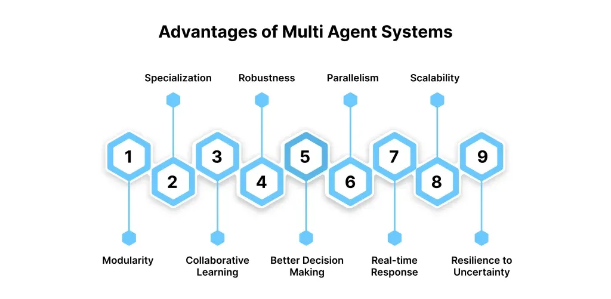

## Table of Contents

## What is a multi-agent trading system?

A multi-agent trading system is a type of computer program used in financial markets where many small programs, called agents, work together to buy and sell things like stocks or currencies. Each agent follows its own set of rules to make decisions, but they all work towards the same goal of making money. These agents can learn from the market and from each other, which helps them make better trading choices over time.

In a multi-agent trading system, the agents can be set up to do different jobs. Some might focus on finding the best times to buy, while others might look for the best times to sell. By working together, these agents can cover more of the market and react faster to changes than a single trader could. This teamwork can lead to better results and can help manage risks better, making the trading process smoother and more efficient.

## How does a multi-agent trading system differ from traditional trading systems?

A multi-agent trading system is different from traditional trading systems because it uses many small programs, called agents, to make trading decisions. In a traditional system, usually one person or a small team makes all the decisions about buying and selling. But in a multi-agent system, each agent follows its own rules and works together with other agents to reach the goal of making money. This means the system can look at the market from many different angles at the same time, which can lead to better and faster decisions.

Traditional trading systems often rely on human judgment and a set of fixed rules. They might use computer programs to help, but the final decisions are usually made by people. On the other hand, a multi-agent system can learn and change over time. The [agents](/wiki/agents) can adapt to new market conditions and learn from each other, making the system more flexible and able to handle complex situations better. This learning ability can help the system find new ways to make money that a traditional system might miss.

## What are the basic components of a multi-agent trading system?

A multi-agent trading system has several key parts that work together to make trading decisions. The first part is the agents themselves. These are small programs that each follow their own set of rules to decide when to buy or sell. Each agent might focus on different parts of the market, like looking at price trends or news events. By working together, these agents can cover more of the market and make better decisions.

Another important part is the communication system that lets the agents share information with each other. This helps them learn from each other and work towards the same goal. The system also needs a way to keep track of all the trades and make sure they follow the rules set by the market. This part is called the trading platform, and it makes sure that all the buying and selling happens smoothly and correctly.

The last part is the learning system. This allows the agents to get better over time by learning from past trades and market changes. The learning system can change the rules the agents follow, making them smarter and better at finding good trading opportunities. Together, these parts make a multi-agent trading system that can adapt and make money in a changing market.

## Can you explain how agents interact within a multi-agent trading system?

In a multi-agent trading system, agents interact with each other by sharing information and working together to make trading decisions. Each agent has its own job, like looking at price trends or news events, but they all share what they find with the other agents. This sharing helps them see the whole market better and make smarter choices about when to buy or sell. For example, if one agent sees that a stock's price is going up, it can tell the other agents, who might then decide to buy that stock.

The agents also work together to reach the main goal of making money. They might vote on what to do next or follow a leader agent that makes the final decisions. This teamwork helps them manage risks better and react faster to changes in the market. Over time, the agents learn from each other and from their past trades, which makes them better at finding good trading opportunities. By working together and sharing information, the agents in a multi-agent trading system can make better and more profitable trading decisions.

## What are the primary advantages of using multi-agent systems in trading?

Using multi-agent systems in trading has several big advantages. One main advantage is that they can look at the market from many different angles at the same time. Each agent focuses on a different part of the market, like price trends or news events. By working together, these agents can see the whole market better and make smarter choices about when to buy or sell. This teamwork helps them find good trading opportunities that a single trader might miss.

Another advantage is that multi-agent systems can learn and get better over time. The agents can change their rules based on what they learn from past trades and market changes. This makes them more flexible and able to handle new situations better. By learning from each other and adapting to the market, the agents can make more profitable trading decisions and manage risks better. This learning ability is something that traditional trading systems often can't do as well.

## How do multi-agent systems enhance decision-making in trading?

Multi-agent systems help make better trading decisions by letting many small programs, called agents, work together. Each agent looks at a different part of the market, like price trends or news events. By sharing what they find, the agents can see the whole market better than one person could. This teamwork helps them find good times to buy or sell that might be missed by a single trader. When all the agents work together, they can make smarter choices and find more ways to make money.

Another way multi-agent systems improve decision-making is by learning over time. The agents can change their rules based on what they learn from past trades and market changes. This makes them more flexible and able to handle new situations better. By learning from each other and adapting to the market, the agents can make more profitable trading decisions and manage risks better. This learning ability helps the system keep getting better at finding good trading opportunities.

## What role does machine learning play in multi-agent trading systems?

Machine learning is a big part of multi-agent trading systems. It helps the agents learn from past trades and market changes. Each agent can change its rules over time to make better decisions. This means the system can get smarter and find new ways to make money that it might not have seen before. By using [machine learning](/wiki/machine-learning), the agents can adapt to new situations and keep improving their trading strategies.

The agents in a multi-agent system also learn from each other. When one agent finds something useful, like a good time to buy or sell, it can share that information with the other agents. This teamwork helps the whole system make better choices. Machine learning makes this sharing and learning process even better, so the system can react faster and more accurately to changes in the market. This helps the multi-agent trading system stay ahead and make more profitable trades.

## How can multi-agent systems improve market prediction and analysis?

Multi-agent systems can make market prediction and analysis better by using many small programs, called agents, to look at the market from different angles. Each agent focuses on a different part of the market, like price trends or news events. By working together and sharing what they find, the agents can see the whole market better than one person could. This teamwork helps them find patterns and trends that might be missed by a single trader. When all the agents combine their information, they can make more accurate predictions about where the market is going.

Another way multi-agent systems improve market prediction is by using machine learning. The agents can learn from past trades and market changes, which helps them get better over time. They can change their rules to make better decisions and find new ways to make money. By learning from each other and adapting to the market, the agents can react faster and more accurately to changes. This learning ability helps the system keep improving its predictions and analysis, making it more reliable and useful for traders.

## What are the scalability benefits of multi-agent trading systems?

Multi-agent trading systems can handle more work as the market grows because they can add more agents easily. Each agent has a small job, like looking at price trends or news events. When the market gets bigger or more complex, you can just add more agents to help out. This means the system can keep working well even if there are a lot more trades to manage. It's like having more helpers to do the work, so the system doesn't get overwhelmed.

Another benefit is that the agents can work on different parts of the market at the same time. This means the system can look at more data and make decisions faster. If the market changes a lot, the agents can quickly share new information and adjust their plans. This makes the system more flexible and able to handle big changes without slowing down. So, multi-agent trading systems can grow and adapt as the market grows, making them very useful for traders.

## How do multi-agent systems handle risk management in trading?

Multi-agent systems help manage risk in trading by spreading the work among many small programs, called agents. Each agent looks at different parts of the market and makes decisions based on its own rules. This means that if one agent makes a bad choice, the other agents can help balance it out. By working together, the agents can see the whole market better and make safer choices. They can also share information about risks, like if a stock is becoming too risky to hold, so the system can adjust its trades to avoid big losses.

Another way multi-agent systems handle risk is by learning over time. The agents can change their rules based on what they learn from past trades and market changes. This makes them better at spotting risks and avoiding them. For example, if an agent sees that a certain type of trade often leads to losses, it can tell the other agents to avoid that trade in the future. By learning from each other and adapting to the market, the agents can manage risks better and make more profitable trades while keeping losses small.

## What are the challenges and limitations of implementing multi-agent trading systems?

Setting up a multi-agent trading system can be tricky because it needs a lot of computer power to run all the agents at the same time. Each agent has its own job, and they all need to talk to each other to make good trading choices. This means the system has to handle a lot of information quickly, which can be hard and expensive. Also, making sure all the agents work well together can be a challenge. If one agent makes a bad choice, it could affect the whole system, so the system needs to be set up carefully to avoid big mistakes.

Another challenge is that multi-agent systems can be hard to understand and control. Because the agents learn and change over time, it can be tough to know exactly why they make certain choices. This can make it hard for traders to trust the system and feel in control of their trades. Plus, there's always a risk that the agents might learn the wrong things from the market, which could lead to bad trading decisions. So, while multi-agent systems can be very powerful, they need careful watching and managing to work well.

## Can you discuss any case studies or real-world applications of successful multi-agent trading systems?

One real-world example of a successful multi-agent trading system is the work done by the company Citadel. They use a system where many small programs, called agents, work together to make trading decisions. Each agent looks at different parts of the market, like price trends or news events. By sharing what they find, the agents can see the whole market better and make smarter choices about when to buy or sell. This teamwork has helped Citadel make a lot of money and manage risks better. Their system shows how multi-agent systems can be very useful in real trading.

Another example is the use of multi-agent systems by the financial firm JPMorgan Chase. They have developed a system where agents learn from past trades and market changes to make better decisions over time. This learning ability helps the system adapt to new situations and find new ways to make money. By using machine learning, the agents can share information and work together to react faster to changes in the market. This has helped JPMorgan Chase improve their trading strategies and stay ahead in the competitive world of finance.

## References & Further Reading

[1]: De Prado, M. L. (2018). ["Advances in Financial Machine Learning."](https://www.amazon.com/Advances-Financial-Machine-Learning-Marcos/dp/1119482089) Wiley.

[2]: Chen, Paul. (2017). ["Artificial Intelligence in Finance: A Review."](https://www.sciencedirect.com/science/article/abs/pii/S1567422317300790) Annals of Operations Research, 30, 1–32.

[3]: Aronson, D. R. (2006). ["Evidence-Based Technical Analysis: Applying the Scientific Method and Statistical Inference to Trading Signals."](https://www.wiley.com/en-gb/Evidence+Based+Technical+Analysis:+Applying+the+Scientific+Method+and+Statistical+Inference+to+Trading+Signals-p-9780470008744) Wiley.

[4]: Jansen, S. (2020). ["Machine Learning for Algorithmic Trading."](https://www.amazon.com/Machine-Learning-Algorithmic-Trading-intelligence/dp/9918608013) Packt Publishing.

[5]: Chan, E. P. (2008). ["Quantitative Trading: How to Build Your Own Algorithmic Trading Business."](https://www.amazon.com/Quantitative-Trading-Build-Algorithmic-Business/dp/0470284889) Wiley.

[6]: Tesfatsion, L. & Judd, K. L. (2006). ["Handbook of Computational Economics, Volume 2: Agent-Based Computational Economics."](https://www.sciencedirect.com/handbook/handbook-of-computational-economics/vol/2/suppl/C) Elsevier.