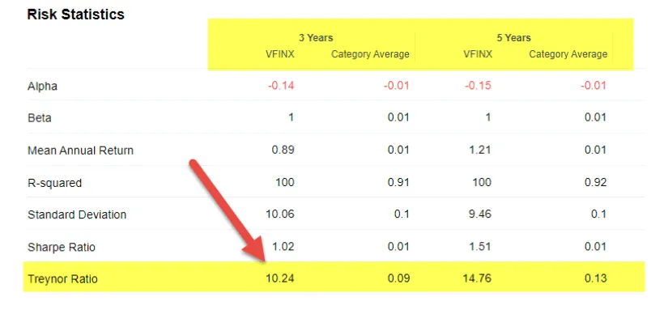

## Table of Contents

## What is the Sharpe Ratio and why is it important?

The Sharpe Ratio is a way to measure how well an investment is doing compared to how risky it is. It was created by a man named William F. Sharpe. The ratio looks at the return of an investment and then subtracts the risk-free rate, which is usually the return you get from something very safe like a government bond. Then, it divides that number by the standard deviation of the investment's returns, which is a way to measure how much the returns go up and down. A higher Sharpe Ratio means the investment is doing better for the amount of risk it takes.

The Sharpe Ratio is important because it helps investors understand if they are being rewarded enough for the risks they are taking. If two investments have the same return, but one has a higher Sharpe Ratio, it means that investment is less risky for the same reward. This can help investors choose between different investments. It's like comparing two rides at an amusement park: if they both give you the same thrill, but one is less scary, you might choose the less scary one. This tool is widely used by professionals to make smarter investment decisions.

## What are the limitations of the Sharpe Ratio?

The Sharpe Ratio is helpful, but it has some limitations. One big problem is that it assumes that returns are normally distributed, which means they follow a bell-shaped curve. But in real life, investment returns can be more unpredictable and have big jumps or drops that don't fit this pattern. This can make the Sharpe Ratio less accurate because it doesn't account for these sudden changes well.

Another issue is that the Sharpe Ratio uses the standard deviation to measure risk, but this might not capture all types of risk. For example, it doesn't consider the timing of the risk, like how some investments might lose a lot of money at bad times. Also, the Sharpe Ratio looks at past data, and past performance doesn't always tell us what will happen in the future. So, while it's a useful tool, it's important to use it along with other ways to measure risk and reward.

## What is the Sortino Ratio and how does it differ from the Sharpe Ratio?

The Sortino Ratio is another way to measure how well an investment is doing, but it focuses on the bad kind of risk. It was created by a man named Frank A. Sortino. Instead of looking at all the ups and downs of an investment like the Sharpe Ratio does, the Sortino Ratio only looks at the downs, or the times when the investment loses money. It does this by using something called the downside deviation, which measures how much and how often the investment falls below a certain level, usually the risk-free rate. A higher Sortino Ratio means the investment is doing better for the amount of bad risk it takes.

The main difference between the Sortino Ratio and the Sharpe Ratio is how they measure risk. The Sharpe Ratio looks at all the risk, both good and bad, by using the standard deviation of returns. This means it treats gains and losses the same way. On the other hand, the Sortino Ratio only cares about the bad risk, or losses. This can be helpful because investors usually worry more about losing money than about the ups and downs of an investment. So, the Sortino Ratio might give a better picture of how an investment performs when you're trying to avoid losses.

## How does the Treynor Ratio improve upon the Sharpe Ratio?

The Treynor Ratio is another way to measure how well an investment is doing, and it was created by Jack L. Treynor. It looks at the return of an investment after taking away the risk-free rate, just like the Sharpe Ratio. But instead of using the standard deviation to measure risk, the Treynor Ratio uses something called beta. Beta measures how much an investment moves with the overall market. If an investment has a high beta, it moves a lot with the market, and if it has a low beta, it doesn't move as much. This means the Treynor Ratio is better for looking at how an investment does compared to the market, which can be helpful for investors who care about market risk.

The main way the Treynor Ratio improves upon the Sharpe Ratio is by focusing on market risk instead of total risk. The Sharpe Ratio counts all the ups and downs of an investment as risk, even if those ups and downs are not related to the market. But the Treynor Ratio only looks at the risk that comes from the market, which is often what investors are most worried about. This can make the Treynor Ratio a better choice for investors who want to know how an investment will do in different market conditions. So, while both ratios help measure how well an investment is doing for the risk it takes, the Treynor Ratio gives a more specific look at market-related risk.

## What is the Information Ratio and in what scenarios is it more useful than the Sharpe Ratio?

The Information Ratio is a way to measure how well a portfolio manager is doing compared to a benchmark, like a stock market index. It looks at the extra return the manager gets, called the active return, and divides it by the tracking error, which is how much the portfolio's returns differ from the benchmark's returns. A higher Information Ratio means the manager is doing a better job of beating the benchmark for the amount of extra risk they take.

The Information Ratio is more useful than the Sharpe Ratio when you want to see how well a manager is doing compared to a specific benchmark. If you're trying to choose between different managers or funds that are all trying to beat the same index, the Information Ratio can help you see which one is doing the best job. The Sharpe Ratio, on the other hand, looks at total risk and might not tell you as much about how well a manager is doing compared to a specific goal. So, if your main question is "How well is this manager doing compared to the market?", the Information Ratio is the better tool to use.

## Can you explain the Omega Ratio and its advantages over the Sharpe Ratio?

The Omega Ratio is a way to measure how well an investment is doing by looking at all the possible returns it could have, not just the average. It compares the good returns, which are above a certain level called the threshold, with the bad returns, which are below that level. If the Omega Ratio is higher than 1, it means the investment has more good returns than bad ones. This can be useful because it gives a full picture of the investment's performance, not just a single number like the average return.

One big advantage of the Omega Ratio over the Sharpe Ratio is that it doesn't assume returns follow a normal pattern. The Sharpe Ratio uses the standard deviation to measure risk, which works best when returns are predictable and follow a bell-shaped curve. But in real life, returns can be all over the place, and the Omega Ratio can handle this better. It looks at all the possible returns, so it can give a more accurate picture of risk and reward, especially for investments that have big ups and downs. This makes the Omega Ratio a good choice when you want to understand the full range of an investment's performance.

## What is the Calmar Ratio and how does it address the shortcomings of the Sharpe Ratio?

The Calmar Ratio is a way to measure how well an investment is doing by looking at its returns and the biggest drop in value it has had over the past few years. It was created by a man named Terry W. Young. The ratio takes the average yearly return of the investment and divides it by the maximum drawdown, which is the biggest loss the investment had over a certain time, usually three years. A higher Calmar Ratio means the investment is doing well for the amount of risk it takes, especially when it comes to big drops in value.

The Calmar Ratio helps address some of the problems with the Sharpe Ratio. The Sharpe Ratio looks at all the ups and downs of an investment and uses something called standard deviation to measure risk. But this can miss big drops in value that really scare investors. The Calmar Ratio focuses on these big drops, so it gives a better idea of how risky an investment might feel to someone who doesn't want to lose a lot of money at once. By looking at the maximum drawdown instead of standard deviation, the Calmar Ratio gives investors a clearer picture of the worst-case scenarios they might face.

## How does the Sterling Ratio provide a different perspective compared to the Sharpe Ratio?

The Sterling Ratio is another way to measure how well an investment is doing, but it looks at things a bit differently than the Sharpe Ratio. Instead of using the standard deviation to measure risk like the Sharpe Ratio does, the Sterling Ratio focuses on the biggest drop in value, or the maximum drawdown, that the investment has had over the past few years. It then takes the average yearly return of the investment and divides it by this maximum drawdown minus a small safety number, usually around 10%. This means the Sterling Ratio is really good at showing how well an investment does when you're worried about big losses.

The main difference between the Sterling Ratio and the Sharpe Ratio is how they think about risk. The Sharpe Ratio looks at all the ups and downs of an investment and treats them the same, which can make it hard to see the really bad times that investors want to avoid. The Sterling Ratio, on the other hand, only cares about the worst drops in value, which can be more helpful if you're trying to avoid big losses. By focusing on these big drops and giving a safety cushion, the Sterling Ratio gives investors a clearer idea of how risky an investment might feel in real life.

## What are the benefits of using the Gain-to-Pain Ratio as an alternative to the Sharpe Ratio?

The Gain-to-Pain Ratio is a way to see how well an investment is doing by looking at its good times and bad times. It adds up all the good returns, or gains, and then adds up all the bad returns, or pains. The ratio is just the total gains divided by the total pains. This means it gives you a simple number that shows if the good times are worth the bad times. If the ratio is high, it means the investment has a lot more good days than bad days, which can be really helpful for people who want to know if the investment is worth the risk.

One big benefit of using the Gain-to-Pain Ratio instead of the Sharpe Ratio is that it's easier to understand. The Sharpe Ratio uses something called standard deviation to measure risk, which can be hard to get your head around. But the Gain-to-Pain Ratio just looks at the actual good and bad returns, so it's more straightforward. Also, the Gain-to-Pain Ratio doesn't assume that returns follow a normal pattern like the Sharpe Ratio does. This makes it better for investments that can have big ups and downs, because it looks at all the real gains and pains, not just an average.

## How does the Modigliani Risk-Adjusted Performance (M2) measure differ from the Sharpe Ratio?

The Modigliani Risk-Adjusted Performance, or M2, is a way to see how well an investment is doing by comparing it to a safe investment, like a government bond. It takes the extra return an investment gets over the safe investment and then adjusts it to see what it would be if the investment had the same risk as the market. This makes it easier to compare different investments because it shows you what the return would be if they all had the same amount of risk. The M2 is good because it gives you a number that's easy to understand and compare, kind of like comparing apples to apples.

The main difference between M2 and the Sharpe Ratio is how they show risk and return. The Sharpe Ratio uses a number called standard deviation to measure risk, and it gives you a ratio that can be hard to understand because it's not in the same units as returns. M2, on the other hand, changes the return to match the market's risk level, so the number you get is in the same units as returns, like percentages. This makes M2 easier to use when you want to see how different investments stack up against each other, especially if you're comparing them to the market.

## What advanced statistical methods can be used to refine risk-adjusted performance measures beyond the Sharpe Ratio?

To make risk-adjusted performance measures better than the Sharpe Ratio, you can use something called Conditional Value at Risk (CVaR). CVaR looks at the worst losses an investment might have, not just the average ups and downs like the Sharpe Ratio does. It's good for understanding how bad things could get, which is important for people who want to avoid big losses. By using CVaR, you can get a better idea of the risk an investment has, especially in times when the market is doing badly. This can help you make smarter choices about which investments to pick.

Another way to improve on the Sharpe Ratio is by using something called the Expected Shortfall (ES). ES is a lot like CVaR, but it focuses on the average of the worst losses instead of just the worst loss. This gives you a fuller picture of what could happen if things go really wrong. By looking at these big losses, you can see if an investment is worth the risk, even if it looks good on average. Using ES can help you understand the risk of an investment better and make more informed decisions about where to put your money.

## How do multi-factor models like the Fama-French three-factor model serve as alternatives to the Sharpe Ratio?

Multi-[factor](/wiki/factor-investing) models like the Fama-French three-factor model look at how well an investment is doing by thinking about more than just one thing. The Fama-French model, made by Eugene Fama and Kenneth French, looks at three things: the overall market, how big or small a company is, and if a company's stock price is high or low compared to its earnings. This is different from the Sharpe Ratio, which just looks at how much an investment goes up and down. By looking at these three things, the Fama-French model can help you understand why an investment is doing well or badly, not just that it is. This can be really helpful because it gives you a fuller picture of what's going on with your investment.

The Fama-French model is a good alternative to the Sharpe Ratio because it helps you see if an investment is doing well for the right reasons. For example, if an investment is doing better than the market, the Fama-French model can tell you if it's because the companies in the investment are small or have low stock prices compared to their earnings. The Sharpe Ratio might just tell you the investment is doing well, but not why. By using the Fama-French model, you can make better choices about which investments to pick because you understand more about what's driving their performance.

## What are the limitations of the Sharpe Ratio?

The Sharpe Ratio is a widely respected metric used to evaluate the risk-adjusted return of an investment, defined as:

$$
\text{Sharpe Ratio} = \frac{R_p - R_f}{\sigma_p}
$$

where $ R_p $ is the return of the portfolio, $ R_f $ is the risk-free rate, and $ \sigma_p $ is the standard deviation of the portfolio's excess return. Despite its widespread use, the Sharpe Ratio has notable limitations, primarily in how it assesses risk using volatility alone.

Firstly, the ratio's reliance on standard deviation implies that it treats all types of [volatility](/wiki/volatility-trading-strategies) equally, whether it be upwards or downwards. This approach overlooks investors' typical aversion to downside risk more than the overall unpredictability of returns. As it solely measures total volatility, the Sharpe Ratio fails to differentiate between "good" and "bad" volatility, meaning both gains and losses contribute to risk, which isn't always reflective of the true investment experience.

Furthermore, the Sharpe Ratio assumes that investment returns are normally distributed. This assumption can lead to inaccuracies since many financial instruments exhibit non-normal return distributions characterized by skewness (asymmetry of returns) and kurtosis (tailedness of returns). Positive or negative skewness can imply investment opportunities or risks that are not captured by standard deviation. High kurtosis indicates fat tails or the presence of outliers that standard deviation alone might underestimate or overlook, potentially leading investors to misjudge the risk of extreme loss events.

Critics argue that the Sharpe Ratio’s reliance on normally distributed returns may not adequately account for these higher moments of the return distribution, making it a less comprehensive measure for assessing investment risk. Investments like options, commodities, and even some equity markets often display these non-normal characteristics, prompting investors to seek metrics that better capture these risk aspects.

Incorporating alternative metrics that account for downside risk, skewness, and kurtosis can provide a more rounded view of an investment's risk-return profile, highlighting the need for a more nuanced approach to risk assessment than the Sharpe Ratio offers on its own.

## What is the Sortino Ratio?

The Sortino Ratio is a financial metric designed to evaluate the risk-adjusted return of an investment, addressing some of the limitations associated with the Sharpe Ratio. Unlike the Sharpe Ratio, which considers total volatility as a measure of risk, the Sortino Ratio focuses specifically on downside risk, which many investors find more relevant when assessing potential investments. 

Mathematically, the Sortino Ratio is defined as:

$$
\text{Sortino Ratio} = \frac{R - R_f}{DR}
$$

where $ R $ is the expected return of the portfolio, $ R_f $ is the risk-free rate, and $ DR $ is the downside deviation. The downside deviation considers only the returns that fall below a user-defined target or threshold, often the risk-free rate or a minimum acceptable return level, rather than the standard deviation of the portfolio's entire return distribution.

By focusing on downside risk, the Sortino Ratio provides a more accurate representation of an investment's risk relative to its potential underperformance. This is particularly relevant for investors who are more concerned with the risk of losing money than with overall variability, which includes both ups and downs.

The Sortino Ratio is often more appropriate than the Sharpe Ratio in scenarios where the investment return distribution is skewed or exhibits non-normal characteristics. For example, in cases where a portfolio has a [high frequency](/wiki/high-frequency-trading) of small gains and a few large losses, the Sharpe Ratio might not accurately reflect the risk because it penalizes all volatility equally, regardless of direction. Conversely, the Sortino Ratio responds to only negative deviations from the expected return, thus providing a clearer picture of the likelihood and severity of loss.

Investors evaluating [hedge fund](/wiki/hedge-fund-trading-strategies)s, real estate investments, or any strategy with non-symmetrical return profiles may find that the Sortino Ratio offers valuable insights. Additionally, it can be particularly beneficial for conservative investors or those whose primary focus is to minimize downside risk while achieving reasonable returns. These contexts illustrate the specific sensitivity of the Sortino Ratio to downside fluctuations, providing a useful tool for making more informed investment decisions.

## What is the Treynor Ratio?

The Treynor Ratio is a financial measurement that emphasizes systematic risk rather than total risk, distinguishing it from other risk-adjusted performance metrics like the Sharpe Ratio. This focus on systematic risk makes the Treynor Ratio especially valuable for analyzing and comparing well-diversified portfolios.

Systematic risk, often referred to as market risk, is the type of risk inherent to the entire market or market segment. Unlike unsystematic risk, which can be mitigated through diversification, systematic risk is unavoidable. The Treynor Ratio accounts for this by using beta ($\beta$) as its measure of risk. Beta represents the sensitivity of a portfolio's returns to market movements, allowing investors to understand how much market risk a portfolio is exposed to relative to the entire market.

Mathematically, the Treynor Ratio is expressed as:

$$
\text{Treynor Ratio} = \frac{R_p - R_f}{\beta_p}
$$

Where:
- $R_p$ is the return of the portfolio,
- $R_f$ is the risk-free rate,
- $\beta_p$ is the beta of the portfolio.

This formula highlights how the Treynor Ratio assesses the excess return per unit of systematic risk, setting it apart from the Sharpe Ratio, which incorporates total risk measured by standard deviation. 

Because the Treynor Ratio relies on beta, it assumes that the portfolio is well-diversified, minimizing unsystematic risk. As such, it is particularly useful for comparing portfolios that have similar levels of diversification or assessing the performance of portfolios against a benchmark. It also provides insights into how well a portfolio manager is compensated for taking systematic risk rather than random shocks or specific asset risk.

Overall, the Treynor Ratio provides a clearer picture of an investor's compensation for taking systematic risk, making it a critical tool in the evaluation of diversified investment strategies. When used in conjunction with other financial ratios, it aids investors in making well-rounded decisions aligned with their risk tolerance and investment goals.

## What is the Calmar Ratio?

The Calmar Ratio is a financial metric designed to assess the risk-adjusted return of an investment portfolio with a specific focus on maximum drawdown. It is calculated by dividing the portfolio's annualized rate of return by its maximum drawdown over the same period. The formula is:

$$
\text{Calmar Ratio} = \frac{\text{Annualized Return}}{\text{Maximum Drawdown}}
$$

The maximum drawdown is the greatest observed loss from a peak to a trough in the portfolio's value over a specified time frame. By concentrating on this measurement, the Calmar Ratio is particularly suited for evaluating investment strategies where capital preservation is a significant concern.

In certain scenarios, the Calmar Ratio can provide a more insightful risk assessment than the Sharpe Ratio. While the Sharpe Ratio measures risk in terms of volatility, the Calmar Ratio focuses specifically on downside risk, making it a more targeted metric for investments with significant potential for large losses. If an investor is particularly concerned about an investment's potential for drawdown, the Calmar Ratio offers a clearer picture than standard volatility metrics.

This ratio is especially useful in evaluating hedge funds and other investment vehicles where avoiding substantial losses is paramount. Such funds often pursue strategies that might not exhibit high volatility on a daily basis but could be susceptible to significant drops during adverse market conditions. By employing the Calmar Ratio, investors and analysts can gain insights into how effectively a manager is generating returns relative to the risk of substantial losses, thereby facilitating more informed decision-making regarding the allocation of capital to different strategies.

In summary, the Calmar Ratio serves as a critical tool for analyzing investments through the lens of maximum drawdown, offering valuable insights particularly in scenarios where safeguarding against large, adverse price movements is a priority.

## What is the Omega Ratio?

The Omega Ratio is a comprehensive tool for assessing the risk-return profile of an investment, offering a versatile approach that goes beyond the limitations of traditional metrics. Unlike the Sharpe Ratio, which only considers the average return and volatility, the Omega Ratio looks at the entire distribution of returns. This thorough examination allows the Omega Ratio to account for all possible outcomes, incorporating not just volatility but also skewness, kurtosis, and other aspects of the return distribution.

Mathematically, the Omega Ratio is calculated as the ratio of the probability-weighted gains above a certain threshold to the probability-weighted losses below that threshold:

$$
\Omega(R) = \frac{\int_{r= \text{threshold}}^{\infty} [1 - F(r)] \, dr}{\int_{r=-\infty}^{\text{threshold}} F(r) \, dr}
$$

where $ F(r) $ is the cumulative distribution function of returns, and the threshold is often taken as a minimal acceptable return (MAR) or a risk-free rate.

One of the key advantages of the Omega Ratio is its flexibility in accommodating different investor risk preferences. By adjusting the threshold level, investors can tailor the metric to reflect their risk tolerance. For instance, a conservative investor might set a higher threshold to prioritize capital preservation, while an aggressive investor might choose a lower threshold to focus on higher returns. This adaptability makes the Omega Ratio suitable for a wide range of investment strategies.

Additionally, because the Omega Ratio includes all aspects of the return distribution, it provides a more nuanced view of an investment's risk and potential reward. This can be particularly useful in scenarios where the return distribution deviates from normality, as it captures the impact of extreme events or outliers that traditional metrics might overlook.

In summary, the Omega Ratio's ability to encompass the entire return distribution and its adjustability to different risk preferences make it a powerful alternative to more conventional risk measures like the Sharpe Ratio. This ensures a more precise alignment with investor objectives and aids in making informed investment decisions.

## What is the Sterling Ratio?

The Sterling Ratio is a financial metric used primarily to evaluate the performance of investment funds, particularly with a focus on managing drawdowns. Unlike the Sharpe Ratio, which concentrates on the relationship between excess return and overall volatility, the Sterling Ratio focuses specifically on the magnitude and frequency of drawdowns, which are periods where the investment suffers a significant decline from its peak.

The Sterling Ratio is typically calculated as follows:

$$
\text{Sterling Ratio} = \frac{\text{Average Annual Return} - \text{Risk-Free Rate}}{\text{Average Drawdown}}
$$

Here, the average drawdown represents the average amount by which the fund's high-water mark falls during declines throughout the considered period. This focus on drawdown makes the Sterling Ratio especially useful for assessing the risk of investment strategies that may involve significant downswings, such as certain hedge funds or alternative investments where protecting against severe losses is crucial.

In contrast to the Sharpe Ratio, the Sterling Ratio does not assume that returns are normally distributed or that volatility is a symmetric measure of risk. This is an important distinction as the Sterling Ratio provides a more nuanced view of risk by directly addressing how an investor might perceive the pain of losses, rather than just variability in returns.

The Sterling Ratio can be particularly useful in contexts where investors are risk-averse and are primarily concerned with capital preservation. It serves well for investments that may not exhibit significant short-term volatility (as volatility would be captured by the Sharpe Ratio) but have historically endured or are susceptible to occasional severe drawdowns. This makes the Sterling Ratio a preferred tool among investors who prioritize sustaining capital over merely achieving high returns.

Using the Sterling Ratio alongside the Sharpe Ratio and other metrics can help investors achieve a more comprehensive risk assessment, enabling them to balance the desire for return against the potential for drawdown, thereby aligning investment choices more closely with their risk tolerance and investment goals.

## References & Further Reading

[1]: Sharpe, W. F. (1966). ["Mutual Fund Performance."](https://www.jstor.org/stable/2351741) Journal of Business, 39(1), 119-138.

[2]: Sortino, F. A., & Van der Meer, R. (1991). ["Downside Risk."](https://jpm.pm-research.com/content/17/4/27) Journal of Portfolio Management, 17(4), 27-31.

[3]: Treynor, J. L. (1965). ["How to Rate Management of Investment Funds."](https://onlinelibrary.wiley.com/doi/10.1002/9781119196679.ch10) Harvard Business Review, 43(1), 63-75.

[4]: Kazemi, H., Schneeweis, T., & Gupta, B. (2003). ["Omega as a Performance Measure."](https://people.duke.edu/~charvey/Teaching/BA453_2005/Schneeweis_Omega_as_a.pdf) Journal of Performance Measurement, 8(1), 16-25.

