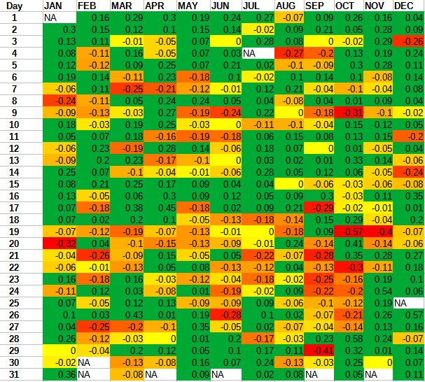

Understanding the best day of the week to buy stocks can significantly enhance your trading strategy, especially when leveraging algorithmic trading. A variety of factors influence this decision, including historical performance trends, market psychology, and trading volume. Specific days have historically demonstrated patterns that can be exploited by traders to optimize their strategies.

Algorithmic trading, which utilizes complex algorithms and high-speed computing to automate trading decisions, has become increasingly essential for executing these strategies effectively. It offers the advantage of reducing human error and emotional bias, allowing traders to capitalize on optimal buying days with precision and consistency.



Recent years have seen an increase in data analysis that supports the identification of particular days as more favorable for stock purchases. Historical analysis has often highlighted Tuesdays and certain end-of-month days as periods when stock prices tend to perform better, providing ideal opportunities for strategic buying. This demonstrates the potential of combining historical data insights with algorithmic tools to yield tangible benefits.

By integrating these insights with algorithmic trading techniques, investors can enhance their ability to discern and exploit these optimal trading days, thereby improving their overall trading performance. As we further explore the factors influencing stock buying days, it is clear that algorithmic trading continues to offer a vital edge in a competitive market landscape.

## Table of Contents

## The Basics of Algorithmic Trading

Algorithmic trading refers to the use of algorithms—step-by-step computational procedures—to automate the process of buying and selling securities. These algorithms are built upon pre-defined criteria, such as timing, price, quantity, or any mathematical model, to determine trade execution. This method of trading minimizes human error and emotional biases, replacing them with systematic and data-driven processes, thereby enabling a faster and more efficient approach to trading.

One of the significant benefits of algorithmic trading is its ability to process and analyze large quantities of data more swiftly than human traders. Algorithms can simultaneously assess multiple markets and execute trades at high speed, improving the chances of capitalizing on fleeting trading opportunities. Additionally, they can back-test strategies using historical data to ensure viability before actual deployment in markets.

Algorithmic trading strategies are categorized mainly into three types: 
1. **Signal Generation** - Algorithms can identify trading opportunities by scanning for market signals and patterns that align with a trader’s predefined criteria. These signals often stem from technical indicators such as moving averages, Relative Strength Index (RSI), or Moving Average Convergence Divergence (MACD).

2. **Risk Management** - Risk management algorithms are crucial for minimizing potential losses. They can automatically set stop-loss and take-profit levels, adjust position sizes based on volatility, or rebalance portfolios to manage exposure to various assets.

3. **Order Execution** - This involves splitting large orders into smaller chunks to minimize the market impact and reduce trading costs. Techniques such as the Volume Weighted Average Price (VWAP) or the Time Weighted Average Price (TWAP) are commonly employed to optimize trade execution, ensuring that trades are completed at the most advantageous prices.

Understanding how these algorithms function is vital for determining the optimal timing for stock purchases. Algorithms utilize various mathematical models and statistical techniques to forecast price movements and execute trades at precise moments. An example of a simple algorithm in Python could be:

```python
import numpy as np

def moving_average(prices, window_size):
    return np.convolve(prices, np.ones(window_size)/window_size, 'valid')

def simple_algo_trading(prices, short_window, long_window):
    short_ma = moving_average(prices, short_window)
    long_ma = moving_average(prices, long_window)
    buy_signals = np.where(short_ma > long_ma, 1, 0)
    return buy_signals

# Example usage:
# prices = np.array([some list of historical prices])
# buy_signals = simple_algo_trading(prices, 10, 50)
```

This code evaluates buy signals based on a comparison of short-term and long-term moving averages, a common strategy in [algorithmic trading](/wiki/algorithmic-trading).

Algorithmic trading has revolutionized the financial markets by offering traders the tools to execute trades more efficiently and strategically. As technology advances, the sophistication and capabilities of these algorithms continue to grow, underscoring the importance of understanding their workings for any trader aspiring to thrive in today's fast-paced trading environment.

## Historical Trends in Stock Trading Days

Analyzing historical stock performance can unveil significant patterns regarding the best and worst trading days. Traditionally, certain days of the week have demonstrated better average returns than others. For instance, studies have long observed a phenomenon known as the "day-of-the-week effect," where specific days consistently exhibit certain market behaviors.

One notable example, often cited in financial literature, is the "Monday Effect," a tendency for stocks to perform poorly on the first day of the trading week. Theories behind this pattern suggest psychological factors like trader sentiment at the beginning of the week or institutional trading strategies. Conversely, Tuesdays have frequently shown positive returns, giving rise to the "Turnaround Tuesday" hypothesis, which posits that negative sentiment from Mondays may correct itself by the next day, resulting in a market rebound.

Additionally, analyzing data from recent years highlights that the end of the month can provide lucrative trading opportunities. This period often sees increased market activity due to fund managers adjusting their portfolios to improve monthly performance metrics, a practice known as "window dressing." Such predictable behaviors imply that certain cyclical trends persist in the stock market, which can be strategically leveraged.

Algorithmic trading systems can harness these insights by incorporating day-of-the-week data into their predictive models. By factoring in historical trends, algorithms can optimize trading decisions to capitalize on these predictable market behaviors. For instance, algorithms might be programmed to flag Tuesdays or the end of the month as potential buy signals based on historical performance data.

These patterns, while historically consistent, do not guarantee future performance. Nonetheless, they provide a significant basis for developing algorithmic trading strategies that aim to exploit consistent behavioral trends in the stock market, enhancing the decision-making process for investors.

## The Best Days to Buy Stocks

Our analysis shows that Tuesday is statistically one of the optimal days to purchase stocks, primarily due to a pattern known as "Turnaround Tuesday". This concept refers to the market inclination to rebound after dips on Mondays. Traditionally, Mondays can exhibit lower performance as investors react to news and events that occurred over the weekend. By Tuesday, the market may often adjust, leading to an uptick in stock prices. Studies like those by Ariel (1987) and Cross (1973) have noted this phenomenon, suggesting that Tuesdays have historically provided a performance edge. Research indicates this might be influenced by psychological factors and market adjustments post-weekend.

Moreover, trading activity increases towards the end of the month. Fund managers often engage in portfolio rebalancing and window dressing to present more favorable quarterly or monthly reports. These activities can lead to a higher [volume](/wiki/volume-trading-strategy) of trades, potentially impacting stock prices positively. According to the January effect, end-of-month periods might also encourage strategic buying due to tax-related decisions and investment flows.

Quarter-end periods similarly showcase heightened activity as investment funds aim to optimize their holdings. It's a time when managers may shift strategies to align portfolios with either tax liabilities or performance targets for reporting purposes. This can lead to an increase in stock purchase activity, offering opportunities to capitalize on these strategic motives. Thus, considering these factors, traders might find Tuesday and end-of-month periods to be advantageous for stock purchases.

## Implementing Algorithmic Strategies to Optimize Purchases

Implementing algorithmic strategies for stock purchases enables traders to systematically exploit advantageous trading days with precision and efficiency. Through automation, these strategies allow traders to continuously monitor market conditions and execute trades based on predefined criteria that identify ideal buying days.

Algorithmic strategies harness the power of large datasets to uncover patterns and trends that signify profitable trading opportunities. By utilizing [machine learning](/wiki/machine-learning) and advanced data analytics, these algorithms can predict market movements and optimize entry points. For example, a simple Python script using machine learning libraries like scikit-learn could be employed to forecast future stock prices based on historical data:

```python
from sklearn.model_selection import train_test_split
from sklearn.ensemble import RandomForestRegressor
import numpy as np

# Example dataset
X = np.array([...])  # Feature set (e.g., historical prices, indicators)
y = np.array([...])  # Target (e.g., future price)

# Split data into training and testing sets
X_train, X_test, y_train, y_test = train_test_split(X, y, test_size=0.2, random_state=42)

# Initialize and train the model
model = RandomForestRegressor(n_estimators=100, random_state=42)
model.fit(X_train, y_train)

# Predict future prices
predictions = model.predict(X_test)
```

Moreover, integral to these systems are risk management components designed to execute trades within predetermined loss thresholds. These safeguards are crucial for minimizing potential losses and ensuring that trading remains within acceptable risk parameters. Techniques such as stop-loss orders and dynamic asset allocation can be automatically enforced through algorithms, maintaining an optimal balance between risk and reward.

Portfolio management and trade execution systems play a vital role in real-time tracking and adjustment of trades. These systems ensure that trades are executed efficiently and portfolios are rebalanced according to the latest market data and strategic objectives. Real-time data feeds and APIs allow for the seamless integration of current market conditions into trading algorithms, facilitating prompt responsiveness to price fluctuations.

Implementing such comprehensive algorithmic strategies not only enhances the precision of stock purchases but also contributes to more disciplined and consistent trading practices, ultimately leading to improved long-term performance.

## Challenges and Considerations

While historical data provides valuable insights into stock market patterns, it is not a foolproof predictor of future performance. Markets are inherently dynamic and subject to a myriad of factors that can influence outcomes. Market [volatility](/wiki/volatility-trading-strategies), for example, is a critical consideration. Sudden changes in geopolitical events, economic reports, or even natural disasters can disrupt established trading patterns, leading to unexpected stock price movements. These events often introduce a level of unpredictability that historical data alone cannot account for.

Another key challenge is the risk of overfitting when implementing algorithmic trading strategies. Overfitting occurs when an algorithm is too closely tailored to historical data, capturing noise rather than the underlying market trends. Although the algorithm may perform well on past data, it might not generalize to new or unseen market conditions. To mitigate this, traders should focus on creating robust algorithms that emphasize simplicity and adaptability. Robustness can be tested through techniques such as cross-validation and out-of-sample testing.

Moreover, traders need to incorporate risk management strategies into their systems. Employing stop-loss orders and position sizing can help manage risk by setting clear boundaries on potential losses. This is particularly important given the unpredictable nature of black swan events—rare and unforeseen occurrences with significant impact.

In practical terms, aligning algorithmic strategies with real-time data feeds and news sources can help adjust trading decisions based on emerging information. Such integration allows for a more responsive approach to market changes. A simple Python code snippet to outline basic risk management and data integration steps could look like this:

```python
import pandas as pd
from sklearn.model_selection import train_test_split

# Load your historical data
data = pd.read_csv('historical_stock_data.csv')

# Split data for testing robustness
train, test = train_test_split(data, test_size=0.2, random_state=42)

# Define basic risk management parameters
stop_loss_percentage = 0.05
portfolio_size = 100000  # example $100,000

def calculate_stop_loss(entry_price):
    return entry_price * (1 - stop_loss_percentage)

# Implementing a simple function that adjusts decisions based on new data
def trade_decision(entry_price, current_price, stop_loss_price):
    if current_price < stop_loss_price:
        return "Sell"
    elif current_price > entry_price:  # Simple profit condition
        return "Hold"
    else:
        return "Buy"

# Example call
entry_price = 100  # hypothetical entry
current_price = 102
stop_loss_price = calculate_stop_loss(entry_price)
decision = trade_decision(entry_price, current_price, stop_loss_price)
```

Ultimately, while past data is an important reference, traders must remain vigilant and adaptable to effectively navigate the complexities of stock trading in an ever-evolving market landscape.

## Conclusion

Tuesday remains a strong candidate as the best day of the week to buy stocks, particularly within the algorithmic trading landscape. Historical data frequently points to a pattern of positive returns on Tuesdays, often referred to as the "Turnaround Tuesday" effect. This trend can be leveraged by traders aiming to optimize their investment strategies, highlighting Tuesday as a pivotal point for entering trades.

To effectively harness these insights, it is essential for traders to utilize algorithmic strategies. Algorithmic trading systems are capable of processing vast amounts of historical and live data to discern patterns that human traders might overlook. These systems can be programmed to automatically execute trades when specific conditions are met, optimizing for both speed and precision—an advantage that is critical in volatile and fast-moving markets.

Adaptability remains a cornerstone of successful trading in dynamic markets. While algorithms provide an edge by minimizing human error and emotional decision-making, traders must remain vigilant and ready to recalibrate their algorithms to respond to unforeseen market disruptions. This requires continuous monitoring and adjustment of trading models to ensure that they remain effective under varying market conditions.

Backtesting is an indispensable practice before deploying any trading strategy in the live market. This process involves testing the strategy against historical data to assess its validity and performance. By conducting thorough [backtesting](/wiki/backtesting), traders can identify potential weaknesses in their strategies and adjust parameters accordingly, significantly reducing the risk of incurring losses when the strategy is applied in real-market scenarios.

In conclusion, while Tuesday holds promise as a potential optimal day for stock purchases, the application of robust algorithmic strategies and meticulous backtesting are crucial steps for traders aiming to maximize their success in the ever-evolving financial markets.

## FAQs

Q: Why is Tuesday often considered the best day to buy stocks?

A: Historical data suggests a consistent performance uptick on Tuesdays, potentially offering a buying edge. This phenomenon is often attributed to the "Turnaround Tuesday" effect, where markets tend to recover from the typically lower performance on Mondays. By evaluating past trends, traders have noted that stocks tend to open slightly lower on Mondays due to residual selling pressure from the previous week's close, thereby creating a more favorable buying environment on Tuesdays when the market begins to rebound.

Q: How can algorithms enhance trading accuracy?

A: Algorithms can enhance trading accuracy by minimizing human error and emotion, thereby improving decision-making efficiency. By processing large-scale datasets, they can identify profitable patterns and trends that may not be immediately apparent through manual analysis. Moreover, algorithms can optimize execution by employing advanced techniques such as predictive modeling, which assesses the likelihood of future price movements, and machine learning models that can adapt to new data over time. Here is a simple Python code snippet that demonstrates how an algorithm could theoretically be used to detect a buying opportunity:

```python
import pandas as pd
import numpy as np

# Assume 'data' is a DataFrame containing stock prices with a 'Close' price column

def find_buy_signal(data):
    # Calculate the 7-day moving average
    data['7_MA'] = data['Close'].rolling(window=7).mean()

    # Simple rule: Buy when today's close is higher than the moving average
    buy_signal = data['Close'] > data['7_MA']

    return data[buy_signal]

# Example usage:
# buy_signals = find_buy_signal(stock_data)
# print(buy_signals)
```

This code uses a simple moving average strategy to signal buying opportunities when the current price exceeds its long-term average, thereby leveraging quantitative measures to make informed trades.

## References & Further Reading

[1]: Bergstra, J., Bardenet, R., Bengio, Y., & Kégl, B. (2011). ["Algorithms for Hyper-Parameter Optimization."](https://papers.nips.cc/paper/4443-algorithms-for-hyper-parameter-optimization) Advances in Neural Information Processing Systems 24.

[2]: ["Advances in Financial Machine Learning"](https://www.amazon.com/Advances-Financial-Machine-Learning-Marcos/dp/1119482089) by Marcos Lopez de Prado

[3]: ["Evidence-Based Technical Analysis: Applying the Scientific Method and Statistical Inference to Trading Signals"](https://www.amazon.com/Evidence-Based-Technical-Analysis-Scientific-Statistical/dp/0470008741) by David Aronson

[4]: ["Machine Learning for Algorithmic Trading"](https://github.com/stefan-jansen/machine-learning-for-trading) by Stefan Jansen

[5]: ["Quantitative Trading: How to Build Your Own Algorithmic Trading Business"](https://books.google.com/books/about/Quantitative_Trading.html?id=j70yEAAAQBAJ) by Ernest P. Chan