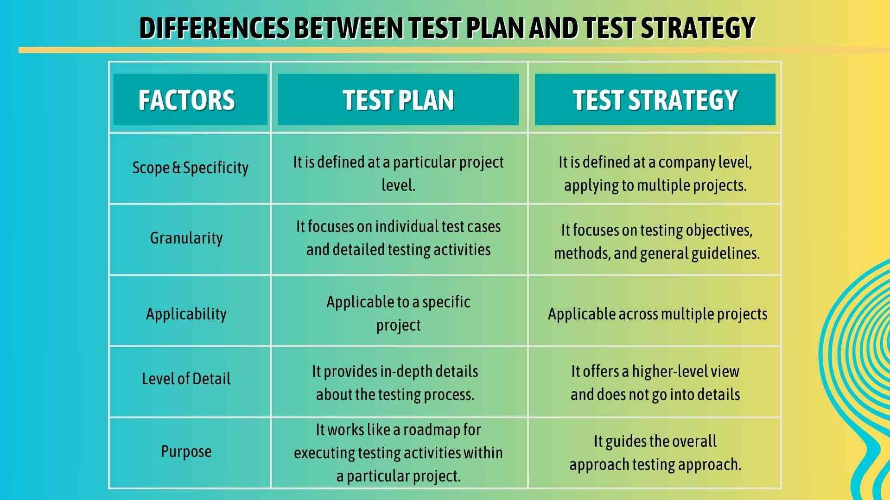

## Table of Contents

## What is strategy testing and why is it important?

Strategy testing is when you try out a plan or method to see if it works well before using it for real. It's like practicing a game move before the big match. You can test strategies in many areas, like business, sports, or even video games. By testing, you can find out what works and what doesn't, and then make your plan better.

It's important because it helps you avoid mistakes that could cost time, money, or a game. If you test your strategy, you can fix problems before they become big issues. This way, when you use your plan for real, you have a better chance of success. Testing also helps you learn and improve, making you ready for whatever comes next.

## What are the basic steps involved in testing a strategy?

The first step in testing a strategy is to clearly define what you want to achieve. This means setting a goal and figuring out how you'll know if your strategy is working. Once you have a clear goal, you can start planning your test. This involves breaking down your strategy into smaller parts and deciding how you'll test each part. You might use simulations, small-scale trials, or other methods to see how each piece of your strategy performs.

Next, you [carry](/wiki/carry-trading) out the test according to your plan. During the test, you should collect data and observe how things are going. This helps you see if your strategy is working as expected or if there are problems you need to fix. After the test, you analyze the results. Look at the data you collected and think about what it tells you. Did your strategy meet your goal? What worked well, and what didn't? Use this information to make your strategy better.

Finally, after you've analyzed the results, you make changes to your strategy based on what you learned. This might mean tweaking a few things or making big changes. Once you've updated your strategy, you might want to test it again to make sure the changes work. Testing a strategy is a cycle of planning, testing, analyzing, and improving. By going through these steps, you can make your strategy stronger and more likely to succeed when you use it for real.

## How can you use historical data to test a strategy?

You can use historical data to test a strategy by looking at what happened in the past and seeing if your strategy would have worked back then. For example, if you have a strategy for investing in the stock market, you can use old stock prices to see how your strategy would have done. This helps you understand if your strategy is good or if it needs changes. By using real data from the past, you can see how your strategy might work in the future.

Historical data is useful because it gives you a real-world test of your strategy. It's like having a time machine to see if your plan would have been successful in different situations. This can help you find problems with your strategy that you might not see otherwise. By testing with historical data, you can make your strategy better and more likely to work when you use it for real.

## What are the key performance indicators (KPIs) to monitor during strategy testing?

When you test a strategy, you need to keep an eye on key performance indicators (KPIs) to see how well it's working. Some important KPIs to watch are success rate, which tells you how often your strategy achieves its goal, and efficiency, which shows how much time or resources your strategy uses. You should also look at the return on investment (ROI), which measures the profit or benefit you get compared to what you put in. These KPIs help you understand if your strategy is effective and worth using.

Another set of KPIs to monitor are related to risk and adaptability. Risk indicators, like the frequency and impact of failures, help you see how safe your strategy is. Adaptability measures, such as how quickly you can change your strategy when things don't go as planned, are also important. By keeping track of these KPIs, you can make sure your strategy is not only successful but also safe and flexible enough to handle different situations.

## How do you set up a controlled environment for strategy testing?

To set up a controlled environment for strategy testing, you need to create a space where you can test your strategy without real-world consequences. This means making a situation that is as close as possible to the real thing but where you can control everything. For example, if you're testing a business strategy, you might use a computer simulation or a small-scale trial with a limited group of people. The key is to make sure that the conditions are the same every time you test, so you can see how changes to your strategy affect the results.

In this controlled environment, you can change one thing at a time to see how it impacts your strategy. This helps you understand what works and what doesn't. You can also use historical data or past results to set up different scenarios and see how your strategy would perform in each one. By keeping everything else the same and only changing the part of the strategy you're testing, you can get clear and reliable results. This way, you can make your strategy better before using it in the real world.

## What are common pitfalls to avoid when testing a strategy?

One common pitfall to avoid when testing a strategy is not having a clear goal. If you don't know what you want to achieve, it's hard to tell if your strategy is working. Make sure you set a specific goal and know how you'll measure success before you start testing. Another mistake is not testing in a controlled environment. If you test your strategy in a real situation without control, you might not be able to see what's working and what's not. Use a controlled setting so you can change one thing at a time and see the results clearly.

Another pitfall is ignoring the data you collect during testing. It's important to look at the numbers and see what they tell you about your strategy. If you don't analyze the data, you might miss important information that could help you improve. Also, be careful not to test for too short a time. Sometimes, a strategy might seem to work at first but fail later on. Make sure you test long enough to see how your strategy performs over time. By avoiding these common mistakes, you can make your strategy testing more effective and increase your chances of success.

## How can you use simulation and modeling in strategy testing?

Simulation and modeling are great tools for testing a strategy. They let you create a pretend world where you can try out your plan without real risks. In a simulation, you can set up different situations and see how your strategy works in each one. For example, if you're testing a business strategy, you can use a computer program to simulate how your business might do in different markets or with different products. This helps you see what might happen in the real world without actually doing it.

Modeling is another way to test your strategy. It's like making a smaller version of your plan that you can study and change. With a model, you can look at different parts of your strategy and see how they fit together. For example, if you're testing a sports strategy, you can make a model of how your team might play against different opponents. By changing things in the model, you can see what works best and make your strategy stronger. Both simulation and modeling help you learn and improve your strategy before you use it for real.

## What role does backtesting play in strategy validation?

Backtesting is a way to check if a strategy would have worked in the past. You use old data to see how your plan would have done if you used it back then. This helps you understand if your strategy is good or if it needs changes. By looking at real data from the past, you can see how your strategy might work in the future. It's like having a time machine to test your plan in different situations.

Backtesting is important because it gives you a real-world test of your strategy without any risks. It helps you find problems with your plan that you might not see otherwise. By testing with historical data, you can make your strategy better and more likely to work when you use it for real. This way, you can be more confident that your strategy will succeed when you put it into action.

## How can you incorporate real-time data into your testing process?

You can use real-time data to test your strategy by looking at what's happening right now. This means you can see how your plan works in the current situation. For example, if you're testing a strategy for a website, you can use real-time data to see how many people are visiting the site and what they're doing. This helps you understand if your strategy is working well right now or if you need to make changes.

Using real-time data is important because it gives you the most up-to-date information. This can help you make quick decisions and adjust your strategy as things change. By keeping an eye on real-time data, you can see if your plan is still working or if you need to try something different. This way, you can keep your strategy strong and effective, even when things around you are changing.

## What advanced statistical methods can enhance strategy testing?

Advanced statistical methods can make strategy testing better by helping you understand your data more deeply. One method is regression analysis, which helps you see how different parts of your strategy affect the results. For example, if you're testing a sales strategy, regression analysis can show you which parts of your plan are making the biggest difference in sales. Another method is time series analysis, which looks at how things change over time. This can help you see if your strategy is working better or worse as time goes on. By using these methods, you can find patterns and make smarter decisions about your strategy.

Another useful method is Monte Carlo simulation, which lets you test your strategy in many different pretend situations. This helps you see how your plan might work in the real world, even if things don't go as expected. You can also use [machine learning](/wiki/machine-learning) to find hidden patterns in your data that you might miss otherwise. Machine learning can help you predict how well your strategy will work in the future. By using these advanced statistical methods, you can make your strategy testing more thorough and improve your chances of success.

## How do you scale up testing from small to large datasets?

When you start testing a strategy, you might begin with a small dataset to see if your plan works. This is like trying out a new recipe with a small batch first. You can quickly see if your strategy is good or if it needs changes. But as you get more confident, you'll want to test it with bigger datasets. This means using more data to see how your strategy works in different situations. You can do this by adding more data to your tests little by little, making sure your strategy still works well as you go.

Scaling up to larger datasets can help you find problems that you might not see with smaller ones. It's like testing a car on a short track versus a long highway. With more data, you can see how your strategy performs over time and in different conditions. To do this, you might need more powerful tools or computers to handle all the data. But by testing with larger datasets, you can make your strategy stronger and more ready for the real world.

## What are the best practices for iterative testing and continuous improvement of a strategy?

Iterative testing and continuous improvement of a strategy means you keep testing and making your plan better over time. Start by testing your strategy in small ways to see if it works. Use the results to make changes and then test again. Keep doing this, making your tests bigger and more detailed each time. This way, you can find and fix problems early and make your strategy stronger. Always set clear goals for each test so you know what you're trying to achieve. Use data to guide your changes and make sure you're moving in the right direction.

It's also important to keep learning and adapting as you go. Don't just test once and stop. Keep testing your strategy in different situations and with new data. This helps you see how well your plan works over time and in different conditions. Listen to feedback from others and use it to improve your strategy. By testing and improving your plan again and again, you can make it the best it can be. This way, when you use your strategy for real, you'll have a much better chance of success.

## References & Further Reading

[1]: Bergstra, J., Bardenet, R., Bengio, Y., & Kégl, B. (2011). ["Algorithms for Hyper-Parameter Optimization."](https://papers.nips.cc/paper_files/paper/2011/hash/86e8f7ab32cfd12577bc2619bc635690-Abstract.html) Advances in Neural Information Processing Systems 24.

[2]: ["Advances in Financial Machine Learning"](https://www.amazon.com/Advances-Financial-Machine-Learning-Marcos/dp/1119482089) by Marcos Lopez de Prado

[3]: ["Evidence-Based Technical Analysis: Applying the Scientific Method and Statistical Inference to Trading Signals"](https://www.wiley.com/en-gb/Evidence+Based+Technical+Analysis:+Applying+the+Scientific+Method+and+Statistical+Inference+to+Trading+Signals-p-9780470008744) by David Aronson

[4]: ["Machine Learning for Algorithmic Trading"](https://www.amazon.com/Machine-Learning-Algorithmic-Trading-intelligence/dp/9918608013) by Stefan Jansen

[5]: ["Quantitative Trading: How to Build Your Own Algorithmic Trading Business"](https://www.amazon.com/Quantitative-Trading-Build-Algorithmic-Business/dp/0470284889) by Ernest P. Chan