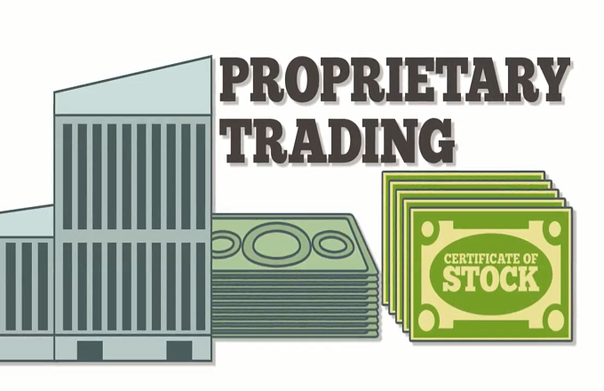

## Table of Contents

## What is prop trading and how does it work?

Prop trading, short for proprietary trading, is when a financial firm or bank uses its own money to buy and sell stocks, bonds, or other financial products. Instead of making trades for clients, the firm is trading for itself to make a profit. This can be risky because the firm could lose its own money, but it can also be very rewarding if the trades are successful.

In prop trading, traders use different strategies to try to make money. They might use computer programs to find patterns in the market, or they might use their own knowledge and experience to decide when to buy or sell. The goal is always the same: to make more money than they spend. Prop trading can be exciting because it involves quick decisions and can lead to big profits, but it also requires a lot of skill and understanding of the market.

## What are the key differences between prop trading and traditional trading?

Prop trading and traditional trading are different in a few main ways. In prop trading, the firm uses its own money to make trades, trying to make a profit for itself. This is different from traditional trading, where traders use money from clients to buy and sell things like stocks or bonds, and they earn money by charging fees or commissions for their services. In prop trading, the firm keeps all the profits or losses, while in traditional trading, the profits or losses belong to the clients.

Another big difference is the level of risk and reward. Prop trading can be very risky because the firm is using its own money, so if the trades don't go well, the firm could lose a lot. But if the trades are successful, the firm can make a lot of money too. Traditional trading, on the other hand, usually involves less risk for the trader because they are using the client's money, and their main focus is on making good trades for the client, not on making big profits for themselves.

## How can someone get started with prop trading?

To get started with prop trading, you first need to learn about the financial markets. This means understanding how stocks, bonds, and other financial products work. You can do this by reading [books](/wiki/algo-trading-books), taking online courses, or even going to school for finance. It's also a good idea to practice trading with a simulator or a demo account. This lets you make trades without risking real money, so you can learn without losing anything.

Once you feel ready, you need to find a prop trading firm that will let you trade with their money. These firms look for people who know a lot about trading and have good skills. You might need to pass a test or go through a training program to show that you can make good trades. If a firm hires you, they will give you money to trade with, but you'll need to follow their rules and strategies. Remember, prop trading can be risky, so always be careful and keep learning.

## What criteria should be used to evaluate the best prop trading firms?

When looking for the best prop trading firms, it's important to think about how much money they give you to trade with. Some firms might give you a lot of money, but they might also take a big part of your profits. Other firms might give you less money but let you keep more of what you earn. You should also check if the firm has a good reputation. You can do this by reading reviews and talking to other traders. A good firm should be honest and have traders who are happy with them.

Another thing to consider is the training and support the firm offers. Good prop trading firms often have training programs that help you learn and get better at trading. They should also have people who can answer your questions and help you when you need it. Lastly, think about the technology and tools the firm provides. The best firms have good trading platforms and software that make it easier for you to make trades and keep track of the market. By looking at these things, you can find a prop trading firm that is right for you.

## Which prop trading firms are most suitable for beginners?

For beginners, some prop trading firms are better than others because they offer good training and support. One such firm is Topstep. They have a program called the Trading Combine, which is like a test where you can show your trading skills without risking your own money. If you do well, you can become a funded trader. Topstep also gives you access to good trading tools and has a community where you can learn from other traders. This makes it easier for beginners to get started and improve their skills.

Another good firm for beginners is Maverick Trading. They offer a lot of training and mentorship, which is really helpful if you are new to prop trading. Maverick Trading also has a program where you can start with a smaller amount of money and work your way up as you get better. This means you can learn and grow without too much pressure. Both Topstep and Maverick Trading focus on helping beginners succeed in prop trading, making them great choices for someone just starting out.

## What are the typical fees and commissions associated with top prop trading firms?

Top prop trading firms usually don't charge you fees or commissions in the same way that traditional brokers do. Instead, they take a part of the profits you make from trading. For example, a firm might let you keep 80% of your profits and take 20% for themselves. This is how they make money from your trading. Some firms might also charge a one-time fee to join their program or a monthly fee for using their trading platform and tools.

Different firms have different rules about fees and how they share profits. For instance, Topstep might charge a monthly fee for their Trading Combine program, but if you pass and become a funded trader, they take a percentage of your profits. Maverick Trading might have a similar setup, where they take a cut of your earnings but also offer training and support. It's important to read the fine print and understand exactly what you're agreeing to before you start trading with a firm.

## How do the trading platforms of leading prop trading firms compare?

The trading platforms of leading prop trading firms like Topstep and Maverick Trading are designed to help traders make quick and smart decisions. Topstep's platform is user-friendly and comes with a lot of tools that help you analyze the market and make trades. They also have a feature called the Trading Combine, where you can practice trading without risking your own money. This makes it easier for beginners to learn and get better at trading. Maverick Trading's platform also offers a lot of tools and resources, but they focus more on giving you personalized training and support. They have a community of traders who can help you learn and improve your skills.

Both platforms are good, but they are a bit different. Topstep's platform might be better for people who want to start trading quickly and practice a lot. It's easy to use and has a lot of features that help you track the market. Maverick Trading's platform, on the other hand, might be better for people who want more help and guidance. They offer a lot of training and mentorship, which can be really helpful if you are new to prop trading. In the end, the best platform for you depends on what you need and how you like to learn.

## What kind of training and support do the best prop trading firms offer?

The best prop trading firms like Topstep and Maverick Trading offer great training and support to help traders succeed. Topstep has a program called the Trading Combine, which is like a practice test where you can learn to trade without using your own money. This is really helpful for beginners because it lets you make mistakes and learn without losing anything. Topstep also has a lot of online resources and a community of traders who can share tips and advice. This makes it easier for you to get better at trading and feel supported as you learn.

Maverick Trading focuses a lot on giving you personalized training and mentorship. They have experienced traders who can guide you and help you improve your skills. Maverick Trading also has a community where you can talk to other traders and learn from their experiences. This kind of support is really important, especially if you are new to prop trading. Both firms want to help you succeed, but they do it in slightly different ways. Topstep is great for practicing and learning on your own, while Maverick Trading is better if you want more one-on-one help and guidance.

## Can you explain the risk management practices of top prop trading firms?

Top prop trading firms like Topstep and Maverick Trading use good risk management practices to help traders not lose too much money. They set rules on how much money you can risk on each trade. This means you can't bet all your money on one trade, which helps keep you safe. They also have something called a "stop-loss," which is like a safety net that stops your trade if you start losing too much money. This helps you not lose everything if the market goes against you.

These firms also watch how you trade to make sure you are following their rules. They might have a team of people who check your trades and give you advice on how to do better. This helps you learn and get better at managing risk. By having these rules and support, top prop trading firms help traders stay safe and make smart decisions, even when the market is hard to predict.

## What are the profit-sharing models used by leading prop trading firms?

Leading prop trading firms like Topstep and Maverick Trading use profit-sharing models where they take a part of the profits you make from trading. For example, a firm might let you keep 80% of your profits and take 20% for themselves. This is how they make money from your trading. The exact percentage can be different from one firm to another, so it's important to check what the rules are before you start trading with them.

Some firms might also charge a one-time fee to join their program or a monthly fee for using their trading platform and tools. But once you start making money, the main way they earn is by taking a share of your profits. This means that the more successful you are at trading, the more money both you and the firm can make. It's a good idea to understand the profit-sharing model of the firm you choose, so you know how much of your earnings you will get to keep.

## How do regulatory compliance and firm reputation impact the choice of a prop trading firm?

Regulatory compliance is really important when choosing a prop trading firm. It means the firm follows the rules set by the government or financial authorities. If a firm is compliant, it's less likely to get into trouble, which keeps your money safer. You can check if a firm is compliant by looking at their licenses and any reports from regulators. Choosing a firm that follows the rules can help you avoid problems and make sure your trading is legal and safe.

Firm reputation also matters a lot. A good reputation means other traders trust the firm and have had good experiences with them. You can learn about a firm's reputation by reading reviews and talking to other traders. A firm with a good reputation is usually more reliable and will treat you fairly. Picking a firm with a strong reputation can help you feel more confident and secure as you start trading.

## What advanced strategies can expert traders employ at the best prop trading firms?

Expert traders at the best prop trading firms can use advanced strategies like [algorithmic trading](/wiki/algorithmic-trading). This means they use computer programs to make trades based on patterns they find in the market. These programs can make trades much faster than a person can, and they can look at a lot of data to find the best times to buy or sell. This can help expert traders make more money and take advantage of small changes in the market that others might miss.

Another strategy expert traders might use is called [scalping](/wiki/gamma-scalping). This is when they make a lot of small trades in a short time, trying to make a little bit of money on each one. The idea is that these small profits can add up to a big total. Scalping requires a lot of focus and quick thinking, but it can be very rewarding if done right. Both of these strategies need a lot of skill and understanding of the market, but the best prop trading firms give expert traders the tools and support they need to succeed.

## What are the risks and challenges in prop trading?

Prop trading, while offering enticing opportunities, comes with its own set of risks and challenges that traders must navigate. Recognizing these challenges early can lead to the development of strategies that not only mitigate risks but also guide traders toward a sustainable trading career.

One of the primary risks in prop trading is the high-pressure environment where traders must continuously deliver profits. Unlike retail traders, prop traders operate with the firm’s capital, which demands consistent performance under strict risk management rules. The pressure to perform can lead to psychological stress, causing traders to make impulsive decisions.

**Strategies to Mitigate These Risks**

1. **Robust Risk Management:** It's vital for traders to implement robust risk management strategies. Techniques such as setting stop-loss orders and using proper position sizing can protect against significant losses. The commonly used risk management formula is:

$$
\text{Risk per Trade} = \text{Account Size} \times \text{Risk Percentage}
$$

   For instance, risking 1-2% of the account per trade ensures that no single loss significantly impacts the trader's capital.

2. **Continuous Education and Training:** Staying updated with market trends and enhancing trading skills is crucial. Participating in workshops and leveraging educational resources offered by prop firms can help traders remain competitive.

3. **Emotional Discipline:** Maintaining emotional discipline is essential. Traders should develop psychological resilience by practicing mindfulness and adhering to trading plans, which can reduce emotional decision-making.

4. **Adapting Strategies:** The financial markets are dynamic; thus, adapting trading strategies to changing market conditions is necessary. Using backtesting and analyzing historical data can help in refining strategies for different market environments.

**Realistic Expectations**

Understanding what to expect in terms of profits and trading conditions is fundamental to establishing a successful trading career. Prop trading firms typically offer a high-profit sharing ratio, but traders should be aware that achieving consistent returns requires significant skill and dedication. Initial trading periods may not yield high returns as traders acclimate to the firm’s strategies and risk parameters.

Furthermore, trading conditions such as market [volatility](/wiki/volatility-trading-strategies), [liquidity](/wiki/liquidity-risk-premium), and execution speed can affect profitability. It’s crucial for traders to set realistic profit goals and be prepared for periods of drawdown. Establishing a clear set of personal benchmarks and regularly evaluating performance against these can foster a long-term, sustainable trading career.

Ultimately, recognizing the risks and challenges and employing strategies to mitigate them are essential steps for any trader. With a disciplined approach and realistic expectations, traders can navigate the demanding environment of prop trading and achieve their financial goals.

## References & Further Reading

[1]: Aldridge, I. (2013). ["High-Frequency Trading: A Practical Guide to Algorithmic Strategies and Trading Systems."](https://www.amazon.com/High-Frequency-Trading-Practical-Algorithmic-Strategies/dp/1118343506) Wiley.

[2]: Harris, L. (2003). ["Trading and Exchanges: Market Microstructure for Practitioners."](https://www.amazon.com/Trading-Exchanges-Market-Microstructure-Practitioners/dp/0195144708) Oxford University Press.

[3]: Narang, R. (2013). ["Inside the Black Box: The Simple Truth About Quantitative Trading, 2nd Edition."](https://www.amazon.fr/Inside-Black-Box-Quantitative-Trading/dp/0470432063) Wiley.

[4]: Patterson, S. (2010). ["The Quants: How a New Breed of Math Whizzes Conquered Wall Street and Nearly Destroyed It."](https://www.amazon.com/Quants-Whizzes-Conquered-Street-Destroyed/dp/0307453383) Crown Business.

[5]: MacKenzie, D. (2008). ["An Engine, Not a Camera: How Financial Models Shape Markets."](https://www.jstor.org/stable/10.1086/518053) MIT Press.

[6]: Rishi K. Narang, "Trading and Exchanges: Market Microstructure for Practitioners" (2003). 

[7]: Kissell, R. (2013). ["The Science of Algorithmic Trading and Portfolio Management."](https://www.elsevier.com/books/the-science-of-algorithmic-trading-and-portfolio-management/kissell/978-0-12-401689-7) Academic Press.

[8]: Spooner, J. (2011). ["Diary of a Day Trader."](https://www.asx.com.au/blog/investor-update/2022/diary-of-a-day-trader) Harriman House.