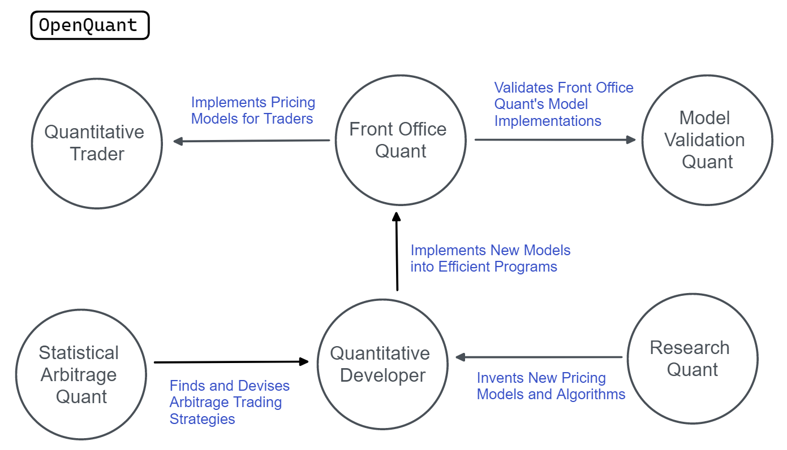

## Table of Contents

## What is a quantitative analyst?

A quantitative analyst, often called a "quant," is a person who uses math and computer skills to help make decisions in finance. They work in areas like banks, investment firms, and insurance companies. Their main job is to create models and algorithms that can predict how markets will move or how much risk there is in certain investments. This helps companies make smarter choices about where to put their money.

Quants use a lot of data to build their models. They look at things like stock prices, interest rates, and economic reports. By analyzing this data, they can find patterns and trends that others might miss. This makes their predictions more accurate. Quants need to be good at math, statistics, and programming, but they also need to understand how financial markets work.

## What are the primary responsibilities of a quantitative analyst?

A quantitative analyst's main job is to create and use mathematical models to help make financial decisions. They look at a lot of data, like stock prices and economic reports, to find patterns and predict how markets will move. This helps companies decide where to invest their money to make the most profit or to manage risk better. Quants use their skills in math, statistics, and computer programming to build these models, making sure they are accurate and useful.

Another important part of a quant's job is to keep their models up to date. Markets change all the time, so quants need to adjust their models to reflect new information. They also need to test their models to make sure they work well and fix any problems they find. This means they are always learning and improving their work. By doing this, quants help their companies stay ahead in the fast-changing world of finance.

## What are the different types of quantitative analysts?

Quantitative analysts, or quants, come in different types based on what they do. One type is the financial quant, who works on creating models to predict how markets will move. They use math and data to help banks and investment firms make smart choices about where to put their money. Another type is the risk quant, who focuses on figuring out how much risk there is in different investments. They help companies understand and manage the risks they take, making sure they don't lose too much money.

There are also [algorithmic trading](/wiki/algorithmic-trading) quants, who build computer programs that can buy and sell stocks automatically. These programs follow rules set by the quants to make trades quickly and efficiently. Lastly, there are data quants, who work on collecting and cleaning up data so it can be used in models. They make sure the data is accurate and ready for other quants to use in their work. Each type of quant plays a key role in helping companies make better financial decisions.

## What is a financial quantitative analyst and what do they do?

A financial quantitative analyst, often called a financial quant, is someone who uses math and computer skills to help make decisions about money. They work in places like banks and investment firms. Their main job is to create models that can predict how the stock market or other financial markets will move. By looking at a lot of data, like stock prices and economic reports, they can find patterns and trends. This helps companies decide where to invest their money to make the most profit.

Financial quants need to be good at math, [statistics](/wiki/bayesian-statistics), and programming. They use these skills to build their models and make sure they are accurate. But they also need to understand how financial markets work. Their job is not just about numbers; it's about using those numbers to help companies make smart choices. By doing this, financial quants play a big role in helping their companies succeed in the world of finance.

## What is a risk quantitative analyst and what are their main tasks?

A risk quantitative analyst, or risk quant, is someone who helps companies understand and manage the risks they take with their money. They work in places like banks and insurance companies. Their main job is to figure out how much risk there is in different investments. They do this by creating models that look at a lot of data, like how the market has moved in the past and what might happen in the future. This helps companies decide if an investment is too risky or if it's worth taking a chance on.

Risk quants need to be good at math and statistics to build their models. They also need to know a lot about how financial markets work. Their job is to make sure the company doesn't lose too much money. They do this by always checking and updating their models to make sure they are accurate. By doing this, risk quants help their companies make safer choices about where to put their money.

## What is an algorithmic trading quantitative analyst and how do they operate?

An algorithmic trading quantitative analyst, or algo quant, is someone who builds computer programs that can buy and sell stocks automatically. They work in places like investment firms and trading companies. Their main job is to create these programs, called algorithms, that follow certain rules to make trades. These rules are based on math and data, like stock prices and market trends. By using these algorithms, algo quants help companies trade faster and more efficiently than if people did it by hand.

Algo quants need to be good at math, programming, and understanding how markets work. They spend a lot of time writing code and testing their algorithms to make sure they work well. They also need to keep their programs up to date because markets change all the time. By doing this, algo quants help their companies make money by trading in a smart and quick way.

## What is a data quantitative analyst and what kind of data do they work with?

A data quantitative analyst, or data quant, is someone who works with data to help other quants do their jobs better. They collect and clean up data so it can be used in models. This means they make sure the data is accurate and ready to use. Data quants work in places like banks and investment firms, where they help make sure everyone has the right information to make good decisions.

The kind of data that data quants work with includes things like stock prices, interest rates, and economic reports. They also look at data from trading, like how often stocks are bought and sold. By making sure this data is clean and organized, data quants help other quants build better models. This is important because good data leads to better predictions and smarter choices about where to invest money.

## How does a quantitative analyst in derivatives pricing differ from others?

A quantitative analyst who works on derivatives pricing, often called a derivatives quant, focuses on figuring out the value of financial products called derivatives. Derivatives are like bets on how other things, like stocks or interest rates, will change in the future. The job of a derivatives quant is to create models that can predict what these derivatives will be worth. They use a lot of math and data to do this, looking at things like how the market has moved in the past and what might happen next. This helps companies decide if they should buy or sell these derivatives.

Derivatives quants are different from other quants because they need to understand a lot about these special financial products. While other quants might focus on predicting stock prices or managing risk, derivatives quants spend their time figuring out the price of options, futures, and other complex financial tools. They need to be good at math and programming, but they also need to know a lot about how derivatives work. By doing this, they help their companies make smart choices about these tricky investments.

## What are the educational requirements for becoming a quantitative analyst?

To become a quantitative analyst, you usually need a strong background in math, statistics, and computer science. Most quants have at least a bachelor's degree in one of these fields. Some even have a master's degree or a PhD, especially if they want to work in more advanced roles. Courses in finance and economics can also be helpful because they give you a better understanding of how markets work.

Besides formal education, many quants learn a lot on the job. They might start in entry-level positions and work their way up as they gain experience. Internships and co-op programs can be a great way to get started. It's also important to keep learning new things because the world of finance is always changing. By staying up to date with the latest tools and techniques, quants can keep doing their jobs well.

## What skills are essential for a quantitative analyst to succeed?

A quantitative analyst needs to be good at math and statistics to build models that predict how markets will move. They use these skills to look at a lot of data, like stock prices and economic reports, to find patterns and trends. Being good at programming is also important because quants need to write code to make their models work. They use computer programs to test and improve their models, making sure they are accurate and useful.

Understanding how financial markets work is another key skill for quants. They need to know about things like stocks, bonds, and derivatives to make good predictions. Quants also need to be good at solving problems and thinking critically. They often have to figure out why their models are not working right and fix them. By using all these skills together, quants can help their companies make smart choices about where to put their money.

## How do the roles of quantitative analysts vary across different industries?

Quantitative analysts, or quants, work in many different industries, and their roles can change a lot depending on where they are. In the finance industry, like banks and investment firms, quants help make decisions about where to put money. They build models to predict how the stock market will move or how much risk there is in certain investments. This helps companies decide if they should buy or sell stocks, bonds, or other financial products. In insurance companies, quants focus on figuring out how much to charge for insurance and how much risk the company is taking on. They use data to predict how likely it is that people will need to use their insurance, which helps the company set fair prices.

In other industries, like technology or healthcare, quants might work on different kinds of problems. In tech companies, they might build models to help with things like predicting how many people will use a new app or how to price a product. In healthcare, quants could work on figuring out how likely it is that a patient will get better with a certain treatment. They use data to help doctors and hospitals make better decisions. No matter where they work, quants use their skills in math, statistics, and programming to help their companies make smart choices based on data.

## What advanced techniques do expert quantitative analysts use in their work?

Expert quantitative analysts use advanced techniques like [machine learning](/wiki/machine-learning) and [artificial intelligence](/wiki/ai-artificial-intelligence) to make their models better. Machine learning helps them find patterns in data that are hard to see with regular math. They use it to predict how markets will move or how much risk there is in an investment. Artificial intelligence can help them make decisions faster and more accurately. These tools let quants build models that can learn from new data and get better over time.

Another technique they use is called Monte Carlo simulation. This is a way to predict what might happen in the future by running a lot of different scenarios. Quants use it to see how different things, like changes in interest rates or stock prices, could affect their investments. It helps them understand the risks better and make smarter choices. By using these advanced techniques, expert quants can give their companies a big advantage in the fast-changing world of finance.

## References & Further Reading

[1]: Bergstra, J., Bardenet, R., Bengio, Y., & Kégl, B. (2011). ["Algorithms for Hyper-Parameter Optimization."](https://papers.nips.cc/paper/4443-algorithms-for-hyper-parameter-optimization) Advances in Neural Information Processing Systems 24.

[2]: ["Advances in Financial Machine Learning"](https://www.amazon.com/Advances-Financial-Machine-Learning-Marcos/dp/1119482089) by Marcos Lopez de Prado

[3]: ["Evidence-Based Technical Analysis: Applying the Scientific Method and Statistical Inference to Trading Signals"](https://www.amazon.com/Evidence-Based-Technical-Analysis-Scientific-Statistical/dp/0470008741) by David Aronson

[4]: ["Machine Learning for Algorithmic Trading"](https://github.com/stefan-jansen/machine-learning-for-trading) by Stefan Jansen

[5]: ["Quantitative Trading: How to Build Your Own Algorithmic Trading Business"](https://books.google.com/books/about/Quantitative_Trading.html?id=j70yEAAAQBAJ) by Ernest P. Chan