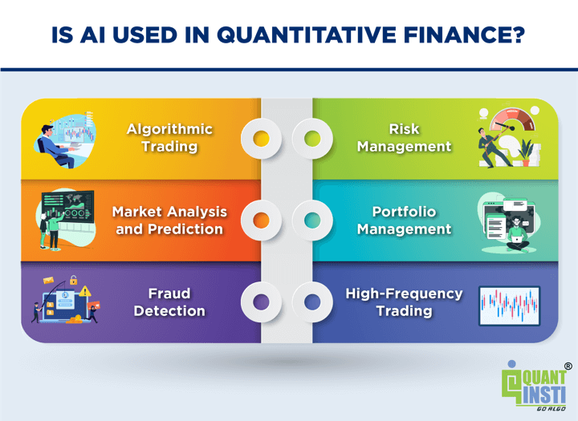

## Table of Contents

## What is quantitative trading?

Quantitative trading is a method of trading where decisions are made using math and computer programs instead of human judgment. Traders use numbers and data to find patterns and make predictions about how the market will move. This approach relies on creating models that can analyze large amounts of data quickly and accurately, helping traders to buy and sell assets at the best possible times.

In quantitative trading, traders often use algorithms, which are sets of rules that a computer follows to make trading decisions. These algorithms can be very complex and are designed to spot opportunities that might be missed by human traders. By using computers, quantitative trading can handle many trades at once and react to market changes faster than a person could. This method is popular among big financial firms and hedge funds because it can potentially lead to more consistent profits.

## How is AI currently used in quantitative trading?

AI is used in quantitative trading to make better and faster decisions. Traders use AI to look at huge amounts of data, like stock prices, news, and social media, to find patterns that humans might miss. AI can learn from this data and make predictions about what might happen next in the market. This helps traders decide when to buy or sell, aiming to make more money.

AI also helps by making trading strategies that can change on their own. If the market changes, AI can adjust the strategy without needing a person to do it. This is really helpful because markets can change quickly. AI can also handle many trades at the same time, which is something a person can't do as well. This makes trading more efficient and can lead to better results for traders.

## What are the basic AI techniques applied in trading?

AI techniques in trading include machine learning, which is a way for computers to learn from data. Traders use machine learning to look at past stock prices, news, and other information to find patterns. These patterns help predict what might happen next in the market. For example, a machine learning model might learn that certain news stories often lead to a drop in stock prices, so it can warn traders when similar news comes out.

Another technique is neural networks, which are like the brain's way of thinking. Neural networks can handle lots of different types of data at once, like numbers, text, and even pictures. They are good at finding complex patterns that are hard for humans to see. Traders use neural networks to make better predictions about the market and to create trading strategies that can change on their own when the market changes.

A third technique is natural language processing (NLP), which helps computers understand human language. Traders use NLP to read news articles, social media posts, and other text to see how people feel about certain stocks or the market in general. This can give traders an idea of what might happen next. For example, if many people are talking positively about a company, it might be a good time to buy its stock.

## What are the potential benefits of using AI in quantitative trading?

Using AI in quantitative trading can help traders make better decisions. AI can look at a lot of data very quickly, like stock prices, news, and social media. This helps AI find patterns that humans might miss. By finding these patterns, AI can predict what might happen next in the market. This means traders can buy or sell at the best times, which can lead to making more money.

AI also makes trading more efficient. It can handle many trades at the same time, something a person can't do as well. AI can also change trading strategies on its own if the market changes. This is helpful because markets can move fast, and AI can react quickly. This can lead to better results for traders and can save them time and effort.

## How can AI improve trading strategies?

AI can make trading strategies better by looking at a lot of data very fast. It can find patterns and trends that humans might not see. For example, AI can look at stock prices, news, and social media to predict what might happen next in the market. This helps traders decide when to buy or sell, which can lead to making more money. AI can also learn from past trades and get better over time, making its predictions more accurate.

Another way AI helps is by changing trading strategies on its own. If the market changes, AI can adjust the strategy without needing a person to do it. This is really helpful because markets can move quickly, and AI can react faster than a human. By doing this, AI can make trading more efficient and can help traders make better decisions, leading to better results.

## What are the challenges of implementing AI in quantitative trading?

One big challenge of using AI in quantitative trading is getting good data. AI needs a lot of data to learn and make good predictions. But, the data has to be correct and up-to-date. If the data is wrong or old, the AI might make bad decisions. Also, some data can be hard to get because it's private or expensive. This makes it tough for traders to use AI effectively.

Another challenge is that AI models can be very complex. It can be hard to understand how the AI makes its decisions. This is called the "black box" problem. Traders need to trust the AI, but if they don't know how it works, it can be scary to use it. Also, AI models need a lot of computer power to run, which can be costly. Traders have to balance the cost of running AI with the benefits it brings.

Lastly, markets can change quickly, and AI models might not keep up. What worked yesterday might not work today. Traders have to keep updating and checking their AI models to make sure they are still good. This takes time and effort. If they don't do this, the AI might start making bad trades, which can lose money.

## How does AI handle large datasets in trading?

AI is really good at handling large datasets in trading. It can look at a lot of information very quickly, like stock prices, news, and social media posts. This helps AI find patterns and trends that humans might miss. For example, AI can see how certain news stories affect stock prices over time. By doing this, AI can make better predictions about what might happen next in the market. This is important for traders because it helps them decide when to buy or sell.

AI also uses special techniques to manage all this data. One technique is called machine learning, where AI learns from the data to get better at making predictions. Another technique is called neural networks, which are like the brain's way of thinking. They can handle different types of data at the same time, like numbers, text, and even pictures. This makes AI very powerful at finding complex patterns in large datasets. By using these techniques, AI can help traders make smarter decisions and handle the huge amount of data that comes with trading.

## What are the ethical considerations of using AI in trading?

Using AI in trading brings up some important ethical questions. One big issue is fairness. AI can look at a lot of data very fast, which can give traders who use AI an advantage over those who don't. This can make the market less fair because not everyone can afford to use AI. Also, AI might make decisions based on data that includes personal information. This raises questions about privacy and whether it's right to use that data to make money.

Another ethical concern is the impact of AI on jobs. As AI gets better at trading, it might take over jobs that people used to do. This can lead to fewer jobs in the trading industry, which can be hard for people who lose their jobs. There's also the issue of transparency. AI can be like a "black box," meaning it's hard to understand how it makes its decisions. This can make it difficult for people to trust AI and for regulators to make sure it's being used in a fair way.

## How might AI evolve to impact high-frequency trading?

AI is already changing high-frequency trading by making it faster and smarter. High-frequency trading is all about making a lot of trades very quickly, often in milliseconds. AI can help by looking at huge amounts of data in real-time, like stock prices and news, to find the best times to buy and sell. This means AI can make trades even faster and more accurately than before. As AI gets better, it might be able to predict market changes even more quickly, making high-frequency trading even more effective.

In the future, AI might also make high-frequency trading more complex. Right now, AI can learn from past trades and get better over time. But as AI evolves, it might start to use more advanced techniques, like deep learning, to understand the market in new ways. This could lead to new trading strategies that are very hard for humans to understand or compete with. As a result, high-frequency trading could become even more dominated by AI, changing the way the market works and possibly making it harder for regular traders to keep up.

## What advanced AI models are being researched for future trading applications?

Researchers are looking into advanced AI models like deep reinforcement learning for future trading applications. Deep reinforcement learning is a way for AI to learn by doing. It tries different trading strategies and learns from the results, getting better over time. This could help AI make smarter decisions in high-frequency trading, where speed and accuracy are very important. By using deep reinforcement learning, AI might be able to find new patterns and strategies that are too complex for current models.

Another model being researched is called generative adversarial networks (GANs). GANs use two AI models that work together to create and check trading strategies. One model makes up new strategies, and the other model tries to find flaws in them. This back-and-forth helps the AI come up with better and better strategies. GANs could be useful in trading because they can create strategies that are good at handling different market conditions, making trading more flexible and effective.

## How can AI integration affect market efficiency and liquidity?

AI can make the market more efficient by looking at a lot of data very quickly. It can find patterns and trends that humans might miss. This helps traders make better decisions about when to buy or sell, which can make the market work better. When traders use AI, they can react to new information faster, which means prices can adjust more quickly to what's happening in the market. This can lead to prices that are more accurate and fair.

AI can also affect liquidity, which is how easy it is to buy or sell something in the market. When AI is used in trading, it can handle a lot of trades at the same time. This can make the market more liquid because there are more trades happening. More trades mean it's easier for people to buy and sell without big changes in price. But, if too many traders use AI in the same way, it might make the market less liquid because everyone is trying to do the same thing at the same time.

## What are the regulatory implications of AI in quantitative trading?

Using AI in quantitative trading can make it hard for regulators to keep things fair. AI can make a lot of trades very quickly, and it can be hard for regulators to understand how AI makes its decisions. This is called the "black box" problem. If regulators can't see how AI works, it's tough for them to make sure it's being used in a fair way. Also, AI might give some traders an advantage over others, which can make the market less fair. Regulators need to make rules to stop this from happening, but it's not easy because AI is always changing and getting better.

Another issue is that AI can use a lot of data, including personal information. This raises questions about privacy and whether it's right to use that data to make money. Regulators need to make sure that AI is not using data in ways that hurt people or break privacy laws. They also need to think about how AI might affect jobs in the trading industry. As AI gets better, it might take over jobs that people used to do, which can be hard for those people. Regulators have to balance the benefits of AI with these ethical concerns to make sure the market stays fair and safe for everyone.

## References & Further Reading

[1]: Bergstra, J., Bardenet, R., Bengio, Y., & Kégl, B. (2011). ["Algorithms for Hyper-Parameter Optimization."](https://papers.nips.cc/paper_files/paper/2011/hash/86e8f7ab32cfd12577bc2619bc635690-Abstract.html) Advances in Neural Information Processing Systems 24.

[2]: ["Advances in Financial Machine Learning"](https://www.amazon.com/Advances-Financial-Machine-Learning-Marcos/dp/1119482089) by Marcos Lopez de Prado

[3]: ["Evidence-Based Technical Analysis: Applying the Scientific Method and Statistical Inference to Trading Signals"](https://www.wiley.com/en-gb/Evidence+Based+Technical+Analysis:+Applying+the+Scientific+Method+and+Statistical+Inference+to+Trading+Signals-p-9780470008744) by David Aronson

[4]: ["Machine Learning for Algorithmic Trading"](https://www.amazon.com/Machine-Learning-Algorithmic-Trading-intelligence/dp/9918608013) by Stefan Jansen

[5]: ["Quantitative Trading: How to Build Your Own Algorithmic Trading Business"](https://www.amazon.com/Quantitative-Trading-Build-Algorithmic-Business/dp/0470284889) by Ernest P. Chan