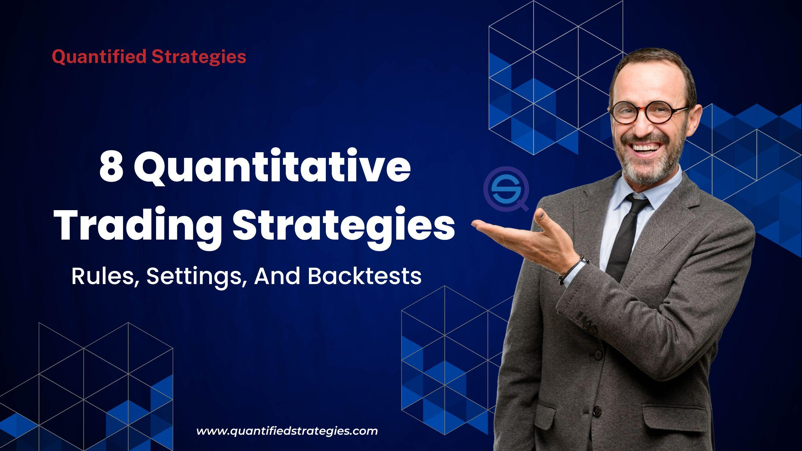

In the ever-evolving world of finance, quantitative trading has rapidly ascended as a formidable and transformative force. Quantitative trading, or quant trading, leverages sophisticated mathematical models and algorithms to make trading decisions, providing a structured approach to identifying financial market opportunities. With the capacity to process vast amounts of data and execute trades at lightning speed, quant trading strategies have become indispensable tools for modern investors and financial institutions.

This article focuses on the most common quant trading strategies employed by traders worldwide. These strategies harness advanced analytics and computing power to dissect market patterns, uncover inefficiencies, and execute trades with precision. Understanding these approaches empowers investors to make more informed decisions and capitalize on emerging market opportunities, minimizing risks and maximizing potential returns. As the financial landscape continues to evolve with technological advancements, staying informed about these strategies is crucial for anyone looking to succeed in quantitative trading.



## Table of Contents

## What is Quantitative Trading?

Quantitative trading, commonly known as quant trading, utilizes mathematical models and algorithms to pinpoint trading opportunities across various financial markets. This approach depends heavily on historical data and statistical analysis to assess and execute trades with remarkable efficiency.

The underlying principle of quant trading is to exploit minimal market inefficiencies by leveraging computational prowess. This requires comprehensive models, often based on past market behaviors and statistical methods, to predict future price movements. Central to this method is the use of algorithms that can automate the trading process, allowing for rapid decision-making that human traders cannot achieve manually.

Quant traders build strategies through mathematical models that transform historical market data into actionable insights. These models often incorporate various statistical techniques, such as regression analysis, time series analysis, and machine learning algorithms, to detect patterns and correlations in the data.

A simple example is the utilization of a moving average, where traders might observe if the current price level of a security deviates significantly from its average price over a specific period. The formula for a simple moving average (SMA) for a security can be expressed as:

$$
\text{SMA} = \frac{P_1 + P_2 + \cdots + P_n}{n}
$$

where $ P_1, P_2, \ldots, P_n $ are the daily prices over $ n $ days. When the actual price diverges significantly from this average, it may signal a trading opportunity.

Moreover, quant trading emphasizes speed and precision—traders can execute high-frequency trades based on minute pricing differences that would be unexploitable without advanced technologies. This speed is crucial in today’s markets, where information dissemination and market adjustments happen at lightning pace.

Ultimately, the precision of these trades reduces risk and maximizes profit potential, allowing traders to capitalize on short-lived and often minuscule inefficiencies in the market. However, it requires a deep understanding of both the markets and the quantitative techniques used to develop reliable models. Quantitative trading is not merely about creating complex algorithms, but about using these algorithms effectively to outpace the competition in an ever-evolving financial marketplace.

## Market Making

Market making is a pivotal strategy in [quantitative trading](/wiki/quantitative-trading), providing essential [liquidity](/wiki/liquidity-risk-premium) to financial markets. By continuously quoting both buy and sell prices, market makers facilitate trades by ensuring that there is always someone available to buy or sell a security. The primary source of profit for market makers arises from the bid-ask spread—the difference between the price at which they are willing to buy (bid) and the price at which they are willing to sell (ask) a security. 

To efficiently manage this spread and remain profitable, market makers utilize sophisticated algorithms capable of adjusting quotes in real-time as market conditions evolve. For instance, if a market maker sets a bid price of $100 and an ask price of $101 for a particular stock, the spread would be $1. The goal is to execute a buy at the bid price and a sell at the ask price, thus capturing this spread.

The success of a [market making](/wiki/market-making) strategy hinges on the algorithm's ability to rapidly adapt to market changes, minimizing risk exposure. One approach is to employ inventory management techniques, which balance the quantity of securities held by dynamically adjusting bid and ask prices. This can help mitigate the risk of holding too much or too little of a security as market prices fluctuate.

Market makers also often utilize predictive models that anticipate short-term price movements to set optimal bid-ask spreads. These models might consider various [factor](/wiki/factor-investing)s, such as [order book](/wiki/order-book-trading-strategies) dynamics, historical [volatility](/wiki/volatility-trading-strategies), and macroeconomic news. Here is a simplified example of how Python might be used to adjust prices based on changing spread:

```python
def adjust_quotes(current_bid, current_ask, market_stress_factor):
    # Adjust the bid/ask spread based on market conditions
    new_bid = current_bid * (1 - market_stress_factor)
    new_ask = current_ask * (1 + market_stress_factor)
    return new_bid, new_ask

current_bid = 100
current_ask = 101
market_stress_factor = 0.01  # Represents a 1% market stress increase

new_bid, new_ask = adjust_quotes(current_bid, current_ask, market_stress_factor)
print(f"Adjusted Bid: {new_bid}, Adjusted Ask: {new_ask}")
```

In this example, a market stress factor—indicative of heightened volatility or reduced liquidity—modifies the bid-ask spread. The algorithm dynamically adjusts the market maker’s quotes to optimize profitability while maintaining an acceptable level of risk.

In summary, market making is a complex yet lucrative strategy that focuses on providing liquidity and exploiting the bid-ask spread. It requires real-time data processing, advanced algorithms, and robust risk management practices to adapt swiftly to ever-changing market dynamics.

## Statistical Arbitrage

Statistical [arbitrage](/wiki/arbitrage), or 'stat arb', is a quant trading strategy that exploits price discrepancies between related securities. The core idea is to identify and trade on these discrepancies, which are usually minimal and temporary. Traders typically focus on short-term horizons to capitalize on these fleeting inefficiencies, often executing a high [volume](/wiki/volume-trading-strategy) of trades to achieve substantial profits.

To effectively employ [statistical arbitrage](/wiki/statistical-arbitrage), advanced statistical models and econometric techniques are essential. These models leverage historical price data to detect patterns and anomalies that might indicate potential profit opportunities. A common method in statistical arbitrage is the pairs trading strategy, which involves forming a portfolio of two (or more) securities that are historically correlated. The goal is to short one security while going long on the other when their prices diverge from their historical mean, expecting that they will revert to this mean over time.

Mathematically, one could represent the long/short strategy as:

$$
\text{Profit} = (P_{\text{sell}} - P_{\text{buy}}) \times N
$$

where $ P_{\text{sell}} $ and $ P_{\text{buy}} $ are the selling and buying prices, respectively, and $ N $ is the number of shares or contracts traded.

In addition to pairs trading, other models, such as cointegration and mean-reversion models, are often employed. Cointegration measures the long-term relationship between time series data, allowing traders to identify pairs or groups of securities that have a stable long-run equilibrium relationship, even if they deviate in the short term.

One of the key challenges in statistical arbitrage is managing the risk associated with model assumptions and external market shocks. For instance, during periods of market turmoil, historical relationships may break down, leading to unexpected losses. To mitigate this risk, traders often incorporate [machine learning](/wiki/machine-learning) techniques to enhance model robustness and adaptability. These algorithms can analyze vast datasets and adjust to new information more quickly than traditional statistical methods.

Despite its potential for high returns, statistical arbitrage requires significant technological infrastructure and expertise. Traders must continuously refine their models to ensure they remain effective in the face of changing market conditions and increasing competition. As such, while stat arb offers lucrative opportunities, it demands careful and constant management to succeed.

## Trend Following

Trend following is a strategy premised on the idea that assets displaying significant upward or downward trajectories will maintain their trends. This approach typically involves using technical indicators and price patterns to ascertain optimal entry and [exit](/wiki/exit-strategy) points in the market.

One of the foundational tools in [trend following](/wiki/trend-following) is moving averages, which serve as key signals for identifying [momentum](/wiki/momentum). A simple moving average (SMA) calculates the average price of a security over a specific period, such as 50 or 200 days. When the current price crosses above its moving average, it could signify a buying opportunity, whereas a cross below might indicate a sell signal. A common strategy is to use two moving averages of different lengths (e.g., a 50-day SMA and a 200-day SMA) and trade based on their crossovers:

- Buy signal: When a short-term moving average (SMA 50) crosses above a long-term moving average (SMA 200), it suggests a bullish trend.
- Sell signal: Conversely, when a short-term moving average crosses below a long-term moving average, it may indicate a bearish trend.

Another key indicator frequently used is the Relative Strength Index (RSI), which measures the magnitude of recent price changes to evaluate overbought or oversold conditions. RSI values above 70 indicate that a security might be overbought, whereas values below 30 suggest it might be oversold.

Python libraries such as Pandas and TA-Lib are useful for implementing trend-following strategies. Here’s a simple example of calculating a moving average using Python:

```python
import pandas as pd

# Assume 'data' is a DataFrame containing historical prices with a 'Close' column
data['SMA_50'] = data['Close'].rolling(window=50).mean()
data['SMA_200'] = data['Close'].rolling(window=200).mean()

# Identify buy/sell signals
data['Signal'] = 0 
data['Signal'][50:] = np.where(data['SMA_50'][50:] > data['SMA_200'][50:], 1, -1) 
```

By focusing on sustained momentum rather than short-term fluctuations, trend following allows traders to ride significant moves in the market, often reducing the noise that can lead to premature exits. However, it's crucial to acknowledge that this strategy may not be effective in sideways or choppy markets where trends are not pronounced. Therefore, proper risk management and the use of stop losses are essential components of a successful trend-following approach.

## Mean Reversion

Mean reversion is a quantitative trading strategy predicated on the assumption that an asset's price will tend to return to its historical average over time. This theory posits that deviations from this mean are temporary and that prices will revert, providing trading opportunities.

To identify potentially profitable trades, traders focus on recognizing overbought or oversold conditions within the market. Overbought conditions occur when prices rise to levels unjustified by fundamentals, whereas oversold conditions happen when prices drop too low. Traders typically position themselves against the current market trend when they expect reversion to the mean. For example, in an overbought situation, a trader might sell the asset in anticipation of a price decline, while in an oversold condition, the trader could buy, expecting an increase in price.

Models for mean reversion often utilize statistical measures such as standard deviation to detect price anomalies. A commonly used indicator is the z-score, which is calculated as follows:

$$
Z = \frac{(X - \mu)}{\sigma}
$$

where:
- $ X $ is the current price of the asset,
- $ \mu $ is the mean price,
- $ \sigma $ is the standard deviation of the asset prices.

A z-score can help quantify how far an asset's price is from its historical average in terms of standard deviations. A high negative or positive z-score might indicate a potential for price reversion.

Some traders employ moving averages to estimate the mean. For instance, if the current asset price significantly deviates from a moving average over a specified period, it could signal a reversion opportunity. Python can be used to calculate moving averages and identify trading opportunities. An example might look like this:

```python
import pandas as pd

# Assuming 'data' is a DataFrame with a 'price' column
window = 20  # Set window for moving average
data['moving_average'] = data['price'].rolling(window=window).mean()
data['price_deviation'] = data['price'] - data['moving_average']

# Identify mean reversion signals
oversold_threshold = -2 * data['price_deviation'].std()
overbought_threshold = 2 * data['price_deviation'].std()

oversold_signals = data[data['price_deviation'] < oversold_threshold]
overbought_signals = data[data['price_deviation'] > overbought_threshold]
```

This script calculates a 20-day moving average and deviations from it, identifying overbought and oversold conditions based on standard deviations.

While mean reversion strategies are popular in quantitative trading, they also [carry](/wiki/carry-trading) risks. Extreme market trends can persist for longer than expected, and external factors might lead to alterations in the historical average itself. Successful implementation of mean reversion strategies requires rigorous risk management and regular updates to the underlying models to reflect current market conditions.

## Machine Learning and Quant Trading

Machine learning has revolutionized quantitative trading, offering powerful tools to enhance predictive capabilities and decision-making processes. By employing sophisticated algorithms, traders are able to process and analyze vast datasets, uncovering complex patterns that might be elusive to human perception. Machine learning models, such as [neural network](/wiki/neural-network)s and decision trees, allow for the automation of intricate trading strategies and adapt to dynamic market conditions.

One major advantage of integrating machine learning in quant trading is the ability to handle large-scale data, both structured and unstructured, from diverse sources. Traditional statistical models often rely on linear relationships and assumptions of normal distribution, which may not capture the intricacies of financial markets. Machine learning, on the other hand, can identify non-linear correlations and interactions within the data, offering a more holistic view. For example, [deep learning](/wiki/deep-learning) models are capable of modeling intricate relationships between numerous variables, leading to more accurate predictions of asset price movements.

However, the integration of [artificial intelligence](/wiki/ai-artificial-intelligence) and machine learning into quantitative trading is not without challenges. Model transparency remains a significant concern; many machine learning models, particularly deep neural networks, operate as "black boxes," making it difficult to interpret how specific inputs translate to outputs. This lack of transparency can be problematic for traders who need to ensure that their models align with regulatory requirements and risk management protocols.

Overfitting poses another challenge, where a machine learning model performs exceptionally well on historical data but fails to generalize to new, unseen data. Overfitting occurs when a model learns noise and random fluctuations in the training dataset as if they were meaningful patterns, leading to poor predictive performance. To mitigate overfitting, techniques such as cross-validation, regularization, and ensemble learning are frequently employed. Cross-validation involves partitioning the dataset into training and validation sets to ensure model robustness, while regularization techniques add a penalty to more complex models to prevent them from fitting noise. Ensemble methods combine multiple models to improve accuracy and robustness, leveraging their diverse predictions.

In conclusion, the application of machine learning in quantitative trading offers significant promise by empowering traders with advanced tools to analyze and act on data-driven insights. Nevertheless, careful consideration of model transparency, overfitting, and regulatory compliance is essential to harness these technologies effectively. The ongoing evolution of machine learning algorithms will likely continue to shape the future of quantitative trading, presenting both opportunities and challenges in the complex financial landscape.

## Conclusion

Quantitative trading strategies are continually advancing, propelled by technological innovations and shifts in market dynamics. These strategies, encompassing techniques such as market making, statistical arbitrage, trend following, and mean reversion, allow traders to exploit market opportunities with greater precision and speed. By comprehending these methodologies, traders can enhance their ability to navigate the intricate landscape of financial markets.

Despite their potential for substantial profits, quantitative trading strategies carry inherent risks that must be meticulously managed. One of the critical challenges is overfitting, where a model performs well on historical data but fails to generalize to new, unseen data. This risk underscores the importance of rigorous [backtesting](/wiki/backtesting) and validation using robust statistical methods. Moreover, the rapid pace of market changes requires traders to continuously adjust their models and algorithmic strategies to maintain efficacy.

The integration of machine learning into quantitative trading further amplifies both opportunities and challenges. While machine learning algorithms can uncover complex patterns and insights from vast datasets, they also introduce concerns regarding model transparency and interpretability. As a result, ensuring that machine learning models are understandable and auditable is crucial for maintaining trust and efficacy in automated trading systems.

In conclusion, quantitative trading offers a strategic edge in today’s fast-paced financial environment. However, traders must remain vigilant, continually updating their knowledge and tools to keep pace with evolving market conditions and technological advancements. By balancing the potential rewards with careful risk management, traders can leverage quantitative strategies to optimize their trading outcomes effectively.

## References & Further Reading

[1]: Avellaneda, M., & Stoikov, S. (2008). ["High-frequency trading in a limit order book."](https://math.nyu.edu/~avellane/HighFrequencyTrading.pdf) Quantitative Finance, 8(3), 217-224.

[2]: Jegadeesh, N., & Titman, S. (1993). ["Returns to Buying Winners and Selling Losers: Implications for Stock Market Efficiency."](https://onlinelibrary.wiley.com/doi/abs/10.1111/j.1540-6261.1993.tb04702.x) The Journal of Finance, 48(1), 65-91.

[3]: Lo, A. W., & MacKinlay, A. C. (1990). ["When Are Contrarian Profits Due to Stock Market Overreaction?"](https://www.jstor.org/stable/2962020) Review of Financial Studies, 3(2), 175-205.

[4]: Narang, R. K. (2013). ["Inside the Black Box: A Simple Guide to Quantitative and High Frequency Trading."](https://www.amazon.fr/Inside-Black-Box-Quantitative-Frequency/dp/1118362411) Wiley Finance.

[5]: Chan, E. (2009). ["Quantitative Trading: How to Build Your Own Algorithmic Trading Business."](https://www.amazon.fr/Quantitative-Trading-Build-Algorithmic-Business/dp/0470284889) Wiley.

[6]: ["Advances in Financial Machine Learning"](https://www.amazon.com/Advances-Financial-Machine-Learning-Marcos/dp/1119482089) by Marcos Lopez de Prado.

[7]: ["Evidence-Based Technical Analysis: Applying the Scientific Method and Statistical Inference to Trading Signals"](https://www.wiley.com/en-gb/Evidence+Based+Technical+Analysis:+Applying+the+Scientific+Method+and+Statistical+Inference+to+Trading+Signals-p-9780470008744) by David Aronson.

[8]: ["Machine Learning for Algorithmic Trading"](https://www.amazon.com/Machine-Learning-Algorithmic-Trading-intelligence/dp/9918608013) by Stefan Jansen.

[9]: Hull, J. (2017). ["Options, Futures, and Other Derivatives."](https://www.pearson.com/us/higher-education/program/Hull-Options-Futures-and-Other-Derivatives-10th-Edition/PGM1313280.html) Pearson.

[10]: Shreve, S. E. (2004). ["Stochastic Calculus for Finance."](https://link.springer.com/book/10.1007/978-1-4614-0320-7) Volume I: The Binomial Asset Pricing Model. Springer.