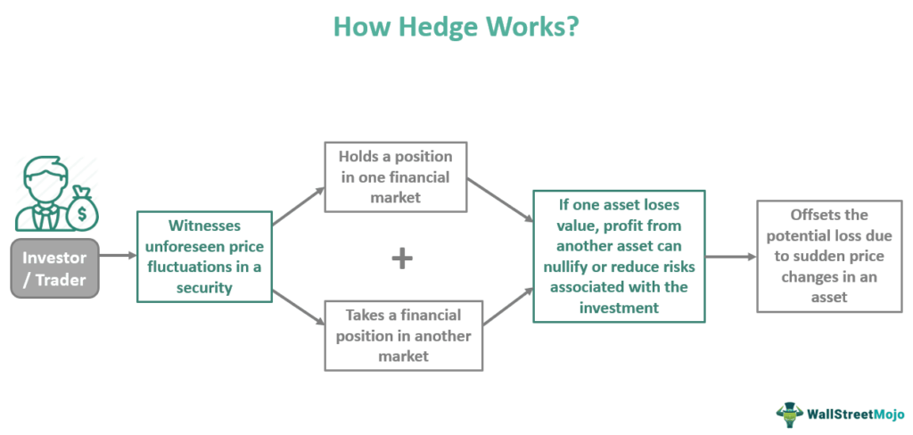

## Table of Contents

## What is a systematic trading hedge fund?

A systematic trading hedge fund is a type of investment fund that uses computer programs and mathematical models to make trading decisions. Instead of relying on human judgment, these funds use algorithms to analyze market data, identify patterns, and execute trades automatically. This approach aims to remove emotional biases from trading and can handle large amounts of data quickly and consistently.

These funds often focus on specific strategies, such as trend following, statistical arbitrage, or market-neutral strategies. They can trade in various financial instruments like stocks, bonds, commodities, and currencies. The goal is to generate steady returns over time, regardless of market conditions, by exploiting small price movements and inefficiencies in the market. Systematic trading hedge funds are popular among investors looking for a disciplined and data-driven approach to investing.

## What are the basic regulatory requirements for starting a hedge fund?

Starting a hedge fund involves meeting several regulatory requirements that can vary depending on where you plan to operate. In the United States, one of the first steps is to register with the Securities and Exchange Commission (SEC) if your fund manages over a certain amount of assets. This registration involves filling out Form ADV, which asks for detailed information about your fund's operations, investment strategies, and key personnel. Additionally, you'll need to comply with the Investment Advisers Act of 1940, which sets standards for how you manage client assets and disclose information.

Besides SEC registration, you may need to follow rules set by the Commodity Futures Trading Commission (CFTC) if your fund trades in commodities or futures. This might require registering as a Commodity Pool Operator (CPO) or a Commodity Trading Advisor ([CTA](/wiki/cta-strategy)). State regulations can also come into play, especially if you're operating in multiple states. Each state might have its own set of rules and registration requirements for investment advisers. It's important to consult with a legal expert to ensure you meet all necessary regulations and avoid potential legal issues down the line.

## How do regulations differ for systematic trading compared to other hedge fund strategies?

Regulations for systematic trading hedge funds are similar to those for other [hedge fund](/wiki/hedge-fund-trading-strategies) strategies in many ways. Both types of funds need to register with the SEC if they manage over a certain amount of assets, and they must comply with the Investment Advisers Act of 1940. This means they have to fill out Form ADV and follow rules about how they manage client money and share information. If a fund trades in commodities or futures, it might also need to register with the CFTC as a CPO or CTA, no matter if it's a systematic trading fund or another type of hedge fund.

However, systematic trading funds might face some unique regulatory challenges because they use algorithms and computer programs to make trading decisions. Regulators might pay extra attention to how these funds manage their technology and data. They might need to show that their systems are secure and that they have good plans in place for if something goes wrong with their technology. Also, because systematic trading often involves high-frequency trading, there might be specific rules about how quickly they can buy and sell assets. Despite these differences, the core regulatory requirements remain the same for all hedge funds, focusing on transparency, client protection, and market integrity.

## What are the key regulatory bodies that oversee systematic trading hedge funds?

The main regulatory body for systematic trading hedge funds in the United States is the Securities and Exchange Commission (SEC). The SEC makes sure that hedge funds follow the rules, especially if they manage a lot of money. Hedge funds need to register with the SEC and fill out a form called Form ADV. This form asks about how the fund works, what it invests in, and who runs it. The SEC also makes sure that hedge funds treat their clients fairly and share important information with them.

Another important regulator is the Commodity Futures Trading Commission (CFTC). If a systematic trading hedge fund trades in things like commodities or futures, it might need to register with the CFTC as a Commodity Pool Operator (CPO) or a Commodity Trading Advisor (CTA). The CFTC looks after these kinds of trades to make sure everything is done correctly and fairly. Besides these federal regulators, state agencies might also have rules that hedge funds need to follow, especially if they operate in different states.

## What specific compliance issues arise from using algorithms in trading?

Using algorithms in trading can create some special compliance issues. One big issue is making sure the computer systems are safe and secure. Regulators want to know that the algorithms won't be hacked or messed up by mistakes. Hedge funds need to show they have good plans to keep their technology safe and what they will do if something goes wrong. This is important because if the systems fail, it could lead to big losses or unfair trading.

Another issue is about how fast the algorithms can trade. Some regulators have rules about high-frequency trading, which is when computers buy and sell things very quickly. They want to make sure this fast trading doesn't mess up the market or give some traders an unfair advantage. Hedge funds using algorithms need to follow these rules and make sure their trading doesn't cause problems. Keeping everything fair and transparent is key for staying compliant.

## How do data privacy laws impact the operations of a systematic trading hedge fund?

Data privacy laws can have a big impact on how a systematic trading hedge fund works. These funds use a lot of data to make their trading decisions, and they need to make sure they are following the rules about how they collect, store, and use this data. For example, laws like the General Data Protection Regulation (GDPR) in Europe say that people have rights over their personal data. If a hedge fund is working with data from people in Europe, they need to make sure they are following these rules. This might mean they have to change how they handle data or get permission from people before using their information.

Another way data privacy laws affect hedge funds is by making them more careful about where they store their data. They might need to keep data in certain places or use special security measures to protect it. This can make things more complicated and expensive for the fund. But it's important because if they don't follow the rules, they could get in trouble with regulators and face fines. So, hedge funds need to think about data privacy from the start and make sure they are always following the law.

## What are the reporting requirements for systematic trading hedge funds?

Systematic trading hedge funds have to follow certain rules about what they need to report. They need to tell the Securities and Exchange Commission (SEC) about their business by filling out a form called Form ADV. This form asks about how the fund works, what it invests in, and who runs it. If the fund manages a lot of money, it has to do this. The SEC wants to make sure the fund is being honest and treating its clients fairly. So, the fund has to keep this form up to date and share important information with the SEC regularly.

If a systematic trading hedge fund trades in things like commodities or futures, it might also need to report to the Commodity Futures Trading Commission (CFTC). They might have to register as a Commodity Pool Operator (CPO) or a Commodity Trading Advisor (CTA). This means they have to tell the CFTC about their trades and how they are managing the money they invest in these markets. Keeping everything clear and open is important for following the rules and staying out of trouble with regulators.

## How do international regulations affect a systematic trading hedge fund operating globally?

International regulations can make things more complicated for a systematic trading hedge fund that works in different countries. Each country has its own rules about how hedge funds should operate. For example, in Europe, there are laws like the General Data Protection Regulation (GDPR) that say how funds can use people's data. In the United States, the Securities and Exchange Commission (SEC) and the Commodity Futures Trading Commission (CFTC) have their own rules. A hedge fund that works globally needs to follow all these different rules, which can be hard and might need the fund to change how it does things in each place.

Dealing with these different rules can also mean more work and costs for the hedge fund. They might need to hire experts who know the laws in each country or use special systems to keep track of everything. If the fund doesn't follow the rules in one country, it could get in trouble and have to pay fines. So, it's really important for a systematic trading hedge fund to understand and follow all the international regulations where it operates. This helps them stay out of trouble and keep their business running smoothly.

## What are the challenges related to market manipulation and insider trading in systematic trading?

Systematic trading hedge funds use computers and math to make trading decisions. But this can sometimes lead to problems with market manipulation and insider trading. Market manipulation happens when someone tries to control the market to make money unfairly. For example, if a fund's algorithm trades in a way that makes the price of a stock go up or down on purpose, that could be seen as manipulation. Regulators watch out for this and can punish funds that do it. It's hard for systematic trading funds to prove that their algorithms are not trying to manipulate the market, especially if their trading patterns look suspicious.

Insider trading is another big issue. This happens when someone uses secret information to make money from trading. Systematic trading funds need to be careful that their algorithms don't use any inside information. Even if the fund doesn't know it's using inside info, if the data they use comes from someone who shouldn't have shared it, the fund could still get in trouble. Keeping data sources clean and making sure no one in the fund is using secret information is really important. Regulators are strict about this, and breaking the rules can lead to big fines and other punishments.

## How does the use of high-frequency trading affect regulatory compliance?

High-frequency trading can make it harder for systematic trading hedge funds to follow the rules. When a fund trades very quickly, it can sometimes look like they are trying to control the market. Regulators don't like this and want to make sure everyone plays fair. So, they watch high-frequency trading closely to stop any bad behavior. This means hedge funds need to be careful and show that their fast trading isn't hurting the market or giving them an unfair advantage.

Also, high-frequency trading can create problems with technology and data security. Because these trades happen so fast, any mistake or hack in the system could cause big problems. Regulators want to know that the funds have good plans to keep their technology safe and to handle any issues that come up. This means the funds need to spend time and money on making sure their systems are secure and can be trusted. Keeping everything fair and safe is important for staying compliant with the rules.

## What are the best practices for managing regulatory risk in a systematic trading hedge fund?

Managing regulatory risk in a systematic trading hedge fund means making sure the fund follows all the rules set by different regulators. This starts with understanding the laws in every place where the fund works. For example, in the U.S., the fund needs to register with the SEC and fill out Form ADV. If the fund trades in commodities or futures, it might also need to register with the CFTC. Keeping up with these rules and updating the information regularly helps the fund stay out of trouble. It's also important to have good plans for keeping data safe and secure, especially since systematic trading uses a lot of data and technology.

Another key part of managing regulatory risk is having strong systems to watch for any problems. This means checking the fund's trading activities to make sure they are not trying to control the market or use secret information. High-frequency trading can make this harder, so the fund needs to be extra careful. Hiring experts who know the laws in different countries can help the fund follow all the rules. By being careful and proactive, a systematic trading hedge fund can lower its chances of breaking the rules and facing fines or other punishments.

## How can a systematic trading hedge fund stay ahead of evolving regulatory landscapes?

Staying ahead of changing rules is important for a systematic trading hedge fund. The fund needs to keep an eye on what regulators are doing in different countries. This means reading up on new laws and understanding how they might affect the fund's work. It's a good idea to join groups or go to meetings where people talk about new rules. This way, the fund can learn about changes before they happen and plan how to follow them. Hiring experts who know a lot about laws in different places can also help the fund stay ready for new rules.

Having good systems to watch for problems is another way to stay ahead. The fund should check its trading activities all the time to make sure they are not breaking any rules. This is especially important because systematic trading uses a lot of data and technology. If the fund finds any issues, it can fix them quickly before they become big problems. By being careful and always learning about new rules, a systematic trading hedge fund can keep doing well even as the rules change.

## References & Further Reading

[1]: Bergstra, J., Bardenet, R., Bengio, Y., & Kégl, B. (2011). ["Algorithms for Hyper-Parameter Optimization."](https://papers.nips.cc/paper_files/paper/2011/hash/86e8f7ab32cfd12577bc2619bc635690-Abstract.html) Advances in Neural Information Processing Systems 24.

[2]: ["Advances in Financial Machine Learning"](https://www.amazon.com/Advances-Financial-Machine-Learning-Marcos/dp/1119482089) by Marcos Lopez de Prado

[3]: ["Evidence-Based Technical Analysis: Applying the Scientific Method and Statistical Inference to Trading Signals"](https://www.wiley.com/en-gb/Evidence+Based+Technical+Analysis:+Applying+the+Scientific+Method+and+Statistical+Inference+to+Trading+Signals-p-9780470008744) by David Aronson

[4]: ["Machine Learning for Algorithmic Trading"](https://www.amazon.com/Machine-Learning-Algorithmic-Trading-intelligence/dp/9918608013) by Stefan Jansen

[5]: ["Quantitative Trading: How to Build Your Own Algorithmic Trading Business"](https://www.amazon.com/Quantitative-Trading-Build-Algorithmic-Business/dp/0470284889) by Ernest P. Chan