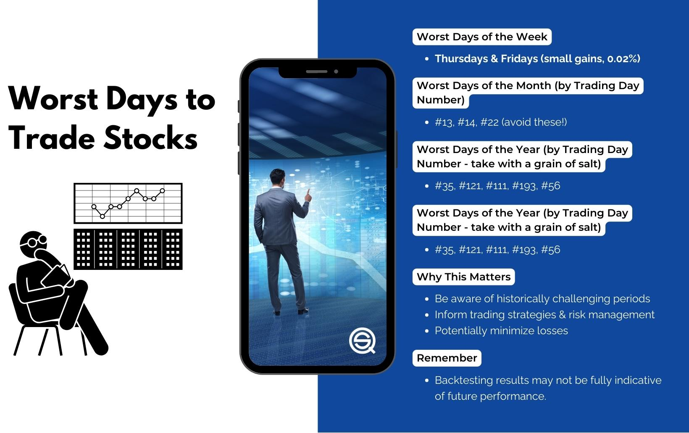

## Table of Contents

## What are the general factors that can make a day bad for stock trading?

A day can be bad for stock trading due to several general factors. One major factor is economic news. If there is bad news about the economy, like a report showing that fewer jobs were created than expected, it can make investors worried. This worry can lead them to sell their stocks, causing stock prices to go down. Another factor is global events. If something big happens in the world, like a political crisis or a natural disaster, it can affect how people feel about investing. When people are scared or unsure, they often sell their stocks, which can make the market go down.

Another important factor is company-specific news. If a company reports lower earnings than expected or faces a scandal, its stock price can drop quickly. This can affect not just that company's stock but also the stocks of other companies in the same industry. Additionally, market sentiment plays a big role. If many investors are feeling pessimistic, they might start selling their stocks, leading to a broader market decline. All these factors can combine to make a day bad for stock trading, as they can lead to lower stock prices and more uncertainty in the market.

## How do economic reports and announcements affect stock market volatility?

Economic reports and announcements can make the stock market go up and down a lot. When new information comes out, like a report on how many jobs were created or how fast the economy is growing, investors try to figure out what it means for the future. If the news is good, like more jobs being created than expected, investors might feel happy and buy more stocks, pushing prices up. But if the news is bad, like fewer jobs being created than expected, investors might get worried and start selling their stocks, causing prices to go down. This back-and-forth can make the market more volatile because people are reacting quickly to new information.

Sometimes, just the anticipation of an economic report can cause the market to be more volatile. Investors might start guessing what the report will say and trade based on those guesses. If the actual report turns out to be very different from what they expected, it can lead to big swings in the market as people adjust their investments. For example, if everyone thinks a report will show the economy is doing well but it actually shows the opposite, there can be a lot of selling and the market can drop suddenly. This shows how important economic reports are in influencing how much the stock market moves around.

## What is the impact of major holidays on stock trading?

Major holidays can have a big effect on stock trading. When a holiday comes up, stock markets are usually closed for the day. This means no trading happens on that day, so the stock prices stay the same until the market opens again. Because of this, the days just before and after a holiday can be busy. Traders might buy or sell more stocks to get ready for the market being closed, which can make the market more active and the prices move more.

Also, holidays can change how people feel about the market. Some holidays, like the ones at the end of the year, can make investors feel happy and hopeful. This can lead to more buying and higher stock prices. But other holidays might make people worried about things like taxes or the economy, which can lead to more selling and lower prices. So, holidays can make the stock market more unpredictable because they affect when trading happens and how people feel about their investments.

## How does the day of the week influence stock market performance?

The day of the week can affect how the stock market does. Some days, like Mondays, can be a bit scary for the market. This is because over the weekend, people might hear news that makes them worried about their investments. So, when the market opens on Monday, they might start selling their stocks, which can make prices go down. This is called the "Monday effect." But it's not always true, and the market can go up on Mondays too.

On the other hand, Fridays can be different. People might feel happier at the end of the week and want to buy more stocks. This can make the market go up. Also, if there's good news at the end of the week, people might want to keep their stocks over the weekend, hoping for even better prices when the market opens again on Monday. So, the day of the week can change how people act in the stock market, but it's just one of many things that can affect it.

## What are the effects of seasonal patterns on stock trading?

Seasonal patterns can affect how the stock market does throughout the year. One big pattern is called the "January effect." This is when stock prices often go up in January. People think this happens because investors sell their losing stocks at the end of the year to save on taxes, and then buy new stocks in January. This buying can push stock prices up. Another pattern is the "Santa Claus rally," which happens around the end of December. During this time, the market often goes up because people are in a good mood and want to invest more.

Another seasonal pattern is the "summer doldrums." This is when the market can be slower and less active during the summer months. People might be on vacation and not paying as much attention to their investments, so there's less trading. This can make the market less exciting and sometimes even go down a bit. Overall, these seasonal patterns show that the time of year can change how people act in the stock market, but they're just one part of what can affect stock prices.

## How can geopolitical events lead to unfavorable trading days?

Geopolitical events can make a day bad for stock trading because they can scare investors. When something big happens, like a war starting or a country putting new rules on trade, it can make people worried about the future. If investors are scared, they might start selling their stocks to avoid losing money. This selling can make stock prices go down quickly, leading to a bad day for trading.

Also, geopolitical events can affect specific industries more than others. For example, if there's a problem in the Middle East, it might make oil prices go up because people worry about getting oil from that area. This can hurt companies that need a lot of oil to make their products, like airlines or car makers. When these companies' stocks go down, it can make the whole market feel worse, leading to an unfavorable trading day.

## What role do earnings announcements play in creating volatile trading days?

Earnings announcements can make the stock market go up and down a lot. When a company tells everyone how much money it made, investors look at the numbers to see if the company did better or worse than they thought. If the company made more money than expected, people might feel happy and buy more of its stock, making the price go up. But if the company made less money than expected, people might get worried and start selling the stock, making the price go down. This quick buying and selling can make the market very busy and unpredictable on the day of the announcement.

Sometimes, the market can be volatile even before the earnings announcement. Investors might guess what the company will say and trade based on those guesses. If the actual numbers are very different from what people expected, it can lead to big changes in the stock price. For example, if everyone thinks a company will report good earnings but it actually reports bad earnings, there can be a lot of selling and the stock price can drop a lot. This shows how important earnings announcements are in making the stock market move around a lot.

## How do unexpected news events impact the stock market?

Unexpected news events can shake up the stock market a lot. When something big and surprising happens, like a natural disaster or a sudden change in government policy, it can make investors feel scared or unsure. If they're worried, they might start selling their stocks to avoid losing money. This selling can make stock prices go down quickly, leading to a bad day for trading. The market can become very busy and unpredictable as everyone tries to figure out what the news means for their investments.

These events can also affect specific industries more than others. For example, if there's a big earthquake in a country that makes a lot of cars, it might hurt car companies because their factories could be damaged. When people see this, they might sell stocks in car companies, making their prices drop. This can make the whole market feel worse, leading to an unfavorable trading day. Unexpected news can really change how people act in the stock market, making it go up and down a lot.

## What technical indicators suggest a day might be bad for trading stocks?

Technical indicators can give clues that a day might be bad for trading stocks. One important indicator is the moving average. If the stock price goes below its moving average, like the 50-day or 200-day moving average, it can mean the stock might keep going down. Another indicator is the Relative Strength Index (RSI). If the RSI is over 70, it means the stock might be overbought and could go down soon. If it's under 30, it might be oversold and could go up, but if it stays low, it could mean more bad days are coming.

Another useful indicator is the Bollinger Bands. If the stock price moves outside the upper Bollinger Band, it might be too high and could fall back down. If it moves outside the lower band, it might be too low and could go up, but if it stays low, it could mean the stock will keep going down. Also, watching the trading volume can help. If the volume is high when the stock price is going down, it can mean more people are selling, which could make the day bad for trading. These indicators can help traders see when a day might not be good for buying or selling stocks.

## How can a trader use historical data to identify the worst days for trading?

A trader can use historical data to find out which days were the worst for trading by looking at past stock prices and trading volumes. They can go back and see which days had the biggest drops in stock prices. By doing this, they might notice patterns, like certain days of the week or times of the year when the market often goes down. They can also look at what was happening in the world or the economy on those bad days to see if there are common reasons for the drops.

Another way to use historical data is to look at how certain events or news affected the market in the past. For example, if a trader sees that the market often goes down after certain economic reports or geopolitical events, they can be more careful on days when similar events are expected. By studying this data, traders can get a better idea of when the market might be risky and plan their trading strategies accordingly to avoid the worst days.

## What strategies can traders employ to mitigate risks on potentially bad trading days?

Traders can use a few strategies to lower their risks on days that might be bad for trading. One way is to set stop-loss orders. This means they tell their trading platform to sell a stock if it goes down to a certain price. This can help them lose less money if the stock price drops a lot. Another strategy is to not trade as much on days that are likely to be bad. If they know from past data or news that the market might go down, they can wait and trade less until things calm down.

Another good idea is to spread out their investments. Instead of putting all their money into one stock, traders can buy different kinds of stocks or even other things like bonds. This way, if one stock goes down a lot, they won't lose all their money. Also, keeping an eye on the news and economic reports can help. If they see something that might make the market go down, they can be ready and maybe sell some stocks before the bad day happens. By using these strategies, traders can protect their money better on days that might be tough for trading.

## How do different market sectors react differently to the same adverse conditions?

Different market sectors can react in their own ways to the same bad conditions. For example, if there's a big problem in the world that makes oil prices go up, the energy sector might do well because they sell oil. But other sectors, like airlines or car makers, might do badly because they need to buy more expensive oil to run their businesses. This shows how the same event can make some sectors go up and others go down.

Another way sectors can react differently is during economic downturns. When people are worried about the economy, they might stop buying things they don't need, like new clothes or gadgets. This can hurt the retail and technology sectors because they sell these things. But people might still need to buy food and medicine, so the healthcare and consumer staples sectors might not go down as much. By understanding how different sectors react, traders can make better choices about where to put their money during tough times.

## References & Further Reading

[1]: ["Advances in Financial Machine Learning"](https://www.amazon.com/Advances-Financial-Machine-Learning-Marcos/dp/1119482089) by Marcos Lopez de Prado

[2]: ["Quantitative Trading: How to Build Your Own Algorithmic Trading Business"](https://books.google.com/books/about/Quantitative_Trading.html?id=j70yEAAAQBAJ) by Ernest P. Chan

[3]: Jegadeesh, N., & Titman, S. (1993). ["Returns to Buying Winners and Selling Losers: Implications for Stock Market Efficiency."](https://www.bauer.uh.edu/rsusmel/phd/jegadeesh-titman93.pdf) The Journal of Finance, 48(1), 65-91.

[4]: Mitra, G. & Mitra, L. (2011). ["The Handbook of News Analytics in Finance."](https://onlinelibrary.wiley.com/doi/book/10.1002/9781118467411) Wiley Finance Series.

[5]: ["Evidence-Based Technical Analysis: Applying the Scientific Method and Statistical Inference to Trading Signals"](https://www.amazon.com/Evidence-Based-Technical-Analysis-Scientific-Statistical/dp/0470008741) by David Aronson