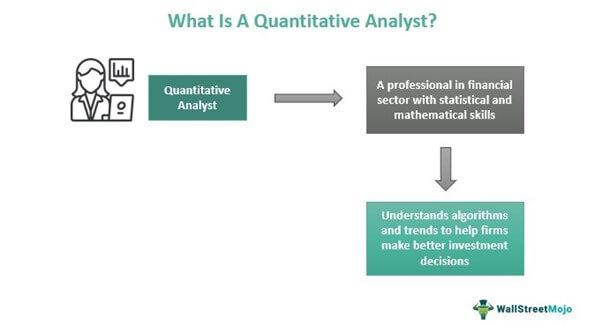

## Table of Contents

## What is a quantitative analyst and what do they do?

A quantitative analyst, often called a "quant," is a person who uses math and computer skills to help make decisions in finance. They work in banks, investment firms, and other financial places. Their main job is to create models and strategies that help predict how markets will move and how to make money from those movements.

Quants use a lot of data and complex math to build these models. They look at things like stock prices, interest rates, and economic reports. By analyzing this data, they can suggest the best ways to buy or sell investments. Their work helps traders and investors make smarter choices and reduce risks.

In simple terms, quants are like the brains behind many financial decisions. They turn numbers and data into useful advice. This helps financial companies perform better and make more money. Without quants, it would be much harder for these companies to understand and predict the markets.

## What are the basic educational requirements to become a quantitative analyst?

To become a quantitative analyst, you usually need a strong background in math, [statistics](/wiki/bayesian-statistics), and computer science. Most quants have at least a bachelor's degree in one of these fields. Some common majors include mathematics, statistics, physics, engineering, or computer science. It's important to have a solid understanding of calculus, linear algebra, and probability theory because these are the building blocks of the models quants create.

Many employers prefer candidates with advanced degrees, like a master's or a Ph.D. A master's degree in financial engineering, quantitative finance, or a related field can be very helpful. These programs often teach you how to apply math and computer skills directly to financial problems. A Ph.D. can give you an even deeper understanding and may be required for more advanced or research-focused positions.

Besides formal education, it's also important to have practical skills. This includes being good at programming languages like Python, R, or C++. You should also be comfortable working with large datasets and using software tools for data analysis. Internships or work experience in finance can give you a big advantage, as they help you understand how to apply your skills in real-world situations.

## Which undergraduate degrees are most beneficial for aspiring quantitative analysts?

The most beneficial undergraduate degrees for aspiring quantitative analysts are in mathematics, statistics, physics, engineering, and computer science. These degrees provide a strong foundation in the core skills needed for the job. Mathematics and statistics degrees teach you about calculus, linear algebra, and probability, which are essential for building financial models. Physics and engineering degrees also cover these topics and add problem-solving skills that are useful in finance. Computer science degrees focus on programming and data analysis, which are crucial for working with large datasets and creating algorithms.

In addition to these core subjects, it's helpful to take courses that apply math and computer skills to real-world problems. For example, courses in financial mathematics or econometrics can show you how to use your skills in finance. It's also a good idea to learn programming languages like Python, R, or C++, as these are commonly used in quantitative analysis. Overall, the best undergraduate degree is one that not only teaches you the necessary math and computer skills but also gives you a chance to apply them in practical ways.

## What specific math courses should I take to prepare for a career in quantitative analysis?

To prepare for a career in quantitative analysis, you should focus on taking math courses that build a strong foundation in calculus, linear algebra, and probability theory. Calculus is important because it helps you understand how things change over time, which is key for modeling financial markets. Linear algebra teaches you about vectors and matrices, which are used to solve complex systems of equations that come up in financial models. Probability theory is crucial because it helps you understand and predict random events, like stock price movements.

In addition to these core areas, you should also take courses in statistics and numerical methods. Statistics will teach you how to analyze data and make predictions, which is a big part of a quant's job. Numerical methods courses will show you how to use computers to solve math problems that are too hard to do by hand. These courses will help you build the skills you need to create and use the models that are central to quantitative analysis.

## Are there any essential computer science or programming courses I should take?

To become a good quantitative analyst, you need to learn how to program. You should take courses in computer science that teach you about programming languages like Python, R, and C++. Python is very popular in finance because it's easy to use and has lots of tools for data analysis. R is also good for statistics and data work. C++ is faster and can handle big calculations, which is important for some financial models. These courses will help you write code to build and test your financial models.

Besides learning to program, you should also take courses on data structures and algorithms. Data structures help you organize and store data in a way that's easy to use. Algorithms are like recipes that tell the computer how to solve problems. These courses will teach you how to make your programs run faster and use less memory. This is important because financial models often need to process a lot of data quickly.

It's also a good idea to take a [course](/wiki/best-algorithmic-trading-courses) on databases. Databases help you store and manage large amounts of data, which is something quants do a lot. Learning about databases will help you work with the big datasets that are common in finance. Overall, these computer science and programming courses will give you the skills you need to succeed as a quantitative analyst.

## How important is statistics in the field of quantitative analysis, and which courses should I focus on?

Statistics is very important in quantitative analysis. It helps quants understand and predict how markets will move. They use statistics to analyze data and make decisions based on that data. Without statistics, it would be hard for quants to know if their models are working well or if they need to change them. It's like the backbone of what quants do every day.

You should focus on courses that teach you the basics of statistics, like probability and data analysis. These courses will show you how to use numbers to make predictions and understand patterns. It's also good to take courses in statistical modeling and time series analysis. These will help you build models that can predict how things like stock prices will change over time. Learning about hypothesis testing and regression analysis is also important because these tools help you test your models and see if they are accurate.

## What are the advanced mathematics courses that can give me an edge in quantitative analysis?

Advanced math courses can really help you stand out as a quantitative analyst. One important course is stochastic processes. This teaches you about random events and how they change over time, which is key for understanding financial markets. Another useful course is differential equations. These help you model how things like stock prices or interest rates change over time. Learning about optimization techniques is also good because it helps you find the best solutions to complex problems, like figuring out the best way to invest money.

Taking courses in numerical analysis can give you an edge too. This teaches you how to use computers to solve math problems that are too hard to do by hand. It's important for building and testing financial models quickly and accurately. Also, learning about advanced linear algebra, like eigenvalues and eigenvectors, can help you understand and solve complex systems that come up in finance. These courses will make you better at creating and using the models that are central to quantitative analysis.

Overall, these advanced math courses will give you the tools you need to tackle the tough problems that quants face every day. They will help you understand the math behind financial markets and make better predictions. By taking these courses, you'll be more prepared and have a big advantage in your career as a quantitative analyst.

## Should I consider taking courses in financial markets and economics, and if so, which ones?

Yes, you should definitely take courses in financial markets and economics. These courses will help you understand how the financial world works. You'll learn about things like stocks, bonds, and how money moves around the world. This knowledge is important because it helps you see the bigger picture when you're building your models. Without understanding financial markets and economics, it's hard to make good predictions and give useful advice.

For financial markets, a good course to take is "Introduction to Financial Markets." This will teach you the basics of how markets work and the different types of investments. Another helpful course is "Financial Instruments and Markets," which goes into more detail about specific financial products and how they are traded. For economics, you should start with "Principles of Economics." This course covers the basics of how economies work. After that, "Macroeconomics" and "Microeconomics" will give you a deeper understanding of big economic trends and how individual markets work. These courses will make you a better quant by helping you connect your math and computer skills to real-world financial problems.

## What role does machine learning play in quantitative analysis, and what courses should I take to learn it?

Machine learning is becoming more and more important in quantitative analysis. It helps quants make better predictions by finding patterns in big sets of data. For example, [machine learning](/wiki/machine-learning) can help predict stock prices or find the best way to invest money. It's like teaching a computer to learn from past data and make smart guesses about the future. This can make financial models more accurate and help quants make better decisions.

To learn machine learning, you should start with a course called "Introduction to Machine Learning." This will teach you the basics, like how to use algorithms to find patterns in data. After that, you can take "Machine Learning for Finance." This course will show you how to use machine learning in the world of finance. It's good to also learn about "Deep Learning," which is a type of machine learning that can handle even more complex problems. These courses will give you the skills you need to use machine learning in your work as a quantitative analyst.

## Are there any certifications or specialized courses that can enhance my skills as a quantitative analyst?

Getting certifications can really help you become a better quantitative analyst. One good certification is the CFA (Chartered Financial Analyst). It teaches you a lot about finance and how to use your math skills in real-world situations. Another useful certification is the FRM (Financial Risk Manager). This one focuses on understanding and managing risks, which is a big part of what quants do. Both of these certifications can make you stand out to employers and show that you know your stuff.

There are also specialized courses that can boost your skills. For example, taking a course in "Quantitative Finance" or "Financial Engineering" can teach you how to apply math and computer skills directly to financial problems. These courses often cover things like building models, using data to make predictions, and understanding financial markets. They can give you the practical knowledge you need to succeed as a quant.

## How can I stay updated with the latest tools and techniques used in quantitative analysis through continuous learning?

To stay updated with the latest tools and techniques in quantitative analysis, you should keep learning all the time. One good way to do this is by reading blogs and articles about finance and data science. Websites like Quantopian, Towards Data Science, and the Journal of Financial Data Science often have new ideas and methods that quants are using. You can also join online communities and forums where quants share their experiences and talk about new tools. This way, you can learn from others and stay on top of what's happening in the field.

Another way to keep learning is by taking online courses and attending workshops. Platforms like Coursera, edX, and Udemy offer courses on the latest in quantitative finance, machine learning, and data analysis. These courses can help you learn new skills and understand how to use new tools. Also, going to conferences and seminars can be really helpful. You can meet other quants, learn about new research, and see how others are solving problems. By doing these things, you'll keep your skills sharp and stay up-to-date with the latest in quantitative analysis.

## What are some graduate-level courses or programs that can further my expertise in quantitative analysis?

To further your expertise in quantitative analysis, you should consider graduate-level courses or programs. A Master's degree in Financial Engineering or Quantitative Finance is a great choice. These programs teach you how to use math and computer skills to solve real financial problems. You'll learn about building models, using data to make predictions, and understanding financial markets. Some good schools for these programs are Columbia University, NYU, and MIT. They have strong courses that can help you become a better quant.

Another option is to get a Ph.D. in a related field like Finance, Economics, or Statistics. A Ph.D. program will give you a deep understanding of the theories and methods used in quantitative analysis. You'll spend a lot of time researching and working on complex problems. This can be really helpful if you want to work on advanced models or do research in finance. Schools like Stanford, University of Chicago, and Princeton are known for their strong Ph.D. programs in these areas. By getting a graduate degree, you'll be more prepared and have a big advantage in your career as a quantitative analyst.

## References & Further Reading

[1]: ["Advances in Financial Machine Learning"](https://www.amazon.com/Advances-Financial-Machine-Learning-Marcos/dp/1119482089) by Marcos Lopez de Prado

[2]: ["Evidence-Based Technical Analysis: Applying the Scientific Method and Statistical Inference to Trading Signals"](https://www.amazon.com/Evidence-Based-Technical-Analysis-Scientific-Statistical/dp/0470008741) by David Aronson

[3]: ["Machine Learning for Algorithmic Trading"](https://github.com/stefan-jansen/machine-learning-for-trading) by Stefan Jansen

[4]: ["Quantitative Trading: How to Build Your Own Algorithmic Trading Business"](https://books.google.com/books/about/Quantitative_Trading.html?id=j70yEAAAQBAJ) by Ernest P. Chan

[5]: Bergstra, J., Bardenet, R., Bengio, Y., & Kégl, B. (2011). ["Algorithms for Hyper-Parameter Optimization."](https://dl.acm.org/doi/10.5555/2986459.2986743) Advances in Neural Information Processing Systems 24.