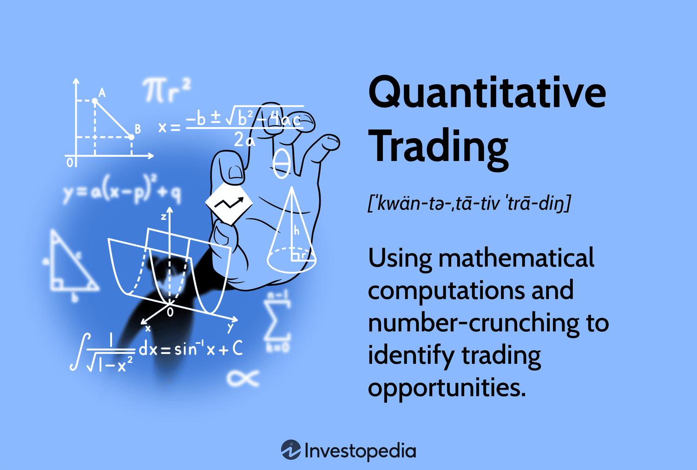

## Table of Contents

## What is quantitative trading?

Quantitative trading is a method of trading where decisions are made using mathematical models and computer programs. Instead of relying on human judgment, traders use numbers and data to decide when to buy or sell stocks, currencies, or other financial products. This approach helps to remove emotions from trading, which can often lead to mistakes.

In quantitative trading, traders collect a lot of data about the market, like prices, volumes, and other financial information. They then use this data to create models that can predict how the market might move in the future. These models are run on powerful computers that can quickly analyze large amounts of information and make trading decisions in a fraction of a second. This can give quantitative traders an advantage over those who trade manually.

## How does quantitative trading differ from traditional trading?

Quantitative trading and traditional trading are different in how they make decisions. In traditional trading, people use their experience and feelings to decide when to buy or sell. They might look at news, talk to other traders, or use their gut feeling. This means that traditional trading can be influenced a lot by emotions, which can sometimes lead to bad decisions.

On the other hand, [quantitative trading](/wiki/quantitative-trading) uses math and computers to make decisions. Traders collect a lot of data and use it to build models that predict what the market will do next. These models run on computers that can quickly look at a lot of information and make trades very fast. This way, quantitative trading tries to take emotions out of the equation and make decisions based on numbers and facts.

## What are the basic mathematical concepts used in quant trading?

In quant trading, some basic math ideas are used to make trading decisions. One important concept is [statistics](/wiki/bayesian-statistics), which helps traders understand and predict how markets might move. They use things like averages, standard deviations, and correlations to see patterns in the data. For example, if two stocks usually move together, traders might use this information to decide when to buy or sell.

Another key idea is probability, which helps traders figure out how likely certain events are to happen. They use this to make models that predict future market movements. For instance, they might calculate the chance that a stock price will go up or down based on past data. This helps them make smarter trading choices.

Lastly, linear algebra is also used in quant trading. It helps with things like portfolio optimization, where traders try to find the best mix of investments to get the highest return with the least risk. By using matrices and vectors, traders can solve complex problems quickly and efficiently. These math concepts all work together to help make trading decisions more scientific and less based on guesswork.

## What programming languages are commonly used in quant trading?

In quant trading, people often use Python because it's easy to learn and has lots of tools for working with numbers and data. Python has libraries like NumPy and Pandas that help with math and data analysis, and it's also good for making trading models and running them quickly. Many traders like Python because it's flexible and can be used for many different parts of trading, from collecting data to making trades.

Another language that's popular in quant trading is C++. It's faster than Python and good for making programs that need to work very quickly. Traders use C++ when they need to do a lot of calculations in a short time, like when they're trading in real-time. Even though C++ is harder to learn than Python, it's very powerful and can make trading systems run smoothly and efficiently.

Some traders also use R, which is great for statistics and making charts. R is used a lot for analyzing data and testing trading ideas before they're used in real trading. While it's not as fast as C++ or as easy to use as Python, R is very good at helping traders understand their data and make better decisions.

## What are the key financial instruments involved in quant trading?

In quant trading, people often trade stocks. Stocks are pieces of a company that you can buy and sell. Traders use math to decide when to buy or sell stocks to make money. They look at lots of data about how stock prices move and use computers to make quick decisions. Stocks are popular in quant trading because there's a lot of data available, and they can be traded quickly.

Another common financial instrument in quant trading is futures. Futures are agreements to buy or sell something at a set price in the future. Traders use futures to bet on where they think prices will go. They use math models to predict future prices and make trades based on those predictions. Futures are useful because they let traders make big bets with less money upfront, which can lead to big profits or losses.

Options are also used a lot in quant trading. Options give you the right, but not the obligation, to buy or sell something at a set price before a certain date. Traders use options to make money from small changes in prices. They use math to figure out the best times to buy or sell options. Options can be complex, but they offer a lot of flexibility and can be used in many different trading strategies.

## How do statistical models contribute to quant trading strategies?

Statistical models are very important in quant trading because they help traders understand and predict how the market will move. These models use a lot of data, like past prices and trading volumes, to find patterns and trends. For example, a model might look at how a stock's price has changed over time and use that information to guess what might happen next. By using statistics, traders can make better decisions about when to buy or sell, which can help them make more money.

These models also help traders manage risk. By looking at how likely certain events are to happen, traders can figure out how much risk they're taking on with each trade. For instance, a model might show that there's a high chance a stock will go down, so the trader might decide to sell it before it loses value. This way, statistical models help traders not only to find good trading opportunities but also to protect their money from big losses.

## What role does machine learning play in quantitative trading?

Machine learning is a big help in quantitative trading because it can find patterns in data that people might miss. Traders use [machine learning](/wiki/machine-learning) to look at lots of information, like stock prices and news, to make better guesses about what the market will do next. For example, a machine learning model might learn that certain news stories often make stock prices go up or down. By using this information, traders can make smarter decisions about when to buy or sell.

Machine learning also helps traders by making their trading strategies better over time. As the model sees more data, it can learn from its mistakes and improve its predictions. This means that the trading strategies can get better without the trader having to change them manually. This is really useful because the market is always changing, and machine learning can help traders keep up with those changes and make more money.

## What are the common risk management techniques in quant trading?

In quant trading, one common way to manage risk is by using stop-loss orders. A stop-loss order is like a safety net that tells the computer to sell a stock if its price drops too much. This helps traders limit how much money they can lose on a single trade. Another way is by diversifying, which means not putting all your money into one stock or one type of investment. By spreading the money around, traders can lower the risk of losing everything if one investment goes bad.

Another important technique is called position sizing. This means deciding how much money to put into each trade based on how risky it is. If a trade seems very risky, a trader might put less money into it to avoid big losses. Traders also use something called [value at risk](/wiki/var-value-at-risk) (VaR), which helps them figure out the most they could lose in a bad day. By knowing this, they can make sure they're not taking on too much risk at once.

## How do regulatory environments affect quant trading practices?

Regulatory environments can have a big impact on quant trading practices. Different countries have different rules about what traders can and can't do. For example, some places might have strict rules about how much money traders can borrow to make trades. This can limit how much risk traders are willing to take, which can change their trading strategies. Also, regulators might require traders to report a lot of information about their trades, which can make things more complicated and time-consuming.

Another way regulations affect quant trading is by setting rules about how fast trades can be made. Some countries have rules to stop traders from using super-fast computers to make trades in just a few seconds. This can slow down quant trading and make it harder for traders to take advantage of small changes in the market. Overall, traders need to keep up with these rules and change their strategies to follow them, which can be a challenge but is important for staying out of trouble.

## What advanced data analysis techniques are used in quant trading?

In quant trading, one advanced data analysis technique that traders use is called time series analysis. This technique helps traders look at how prices and other data change over time. They use it to find patterns and trends that can help them predict what might happen next in the market. For example, they might see that a stock's price goes up every time a certain economic report comes out. By understanding these patterns, traders can make better decisions about when to buy or sell.

Another technique is called machine learning, which is like teaching a computer to learn from data. Traders use machine learning to look at lots of information, like stock prices, news, and even social media posts, to find hidden patterns that can help them make better trades. The cool thing about machine learning is that it can keep learning and getting better over time, so the trading strategies can improve without the trader having to change them manually. This helps traders stay ahead in a market that's always changing.

## How can one develop and backtest a quant trading strategy?

To develop a quant trading strategy, you first need to come up with an idea about what you want to trade and how you want to do it. This could be based on things like stock prices, trading volumes, or even news events. Once you have an idea, you can use math and computer programs to turn it into a model. This model will tell you when to buy or sell based on the data you give it. You might use programming languages like Python or R to write the code for your model. It's important to make sure your model is clear and easy to understand so you can see why it's making certain decisions.

After you've developed your strategy, you need to backtest it to see if it works. Backtesting means running your model on old data to see how it would have done in the past. You can use historical stock prices and other data to see if your strategy would have made money. It's important to use a lot of data from different times to make sure your strategy works in different market conditions. If your backtest shows that your strategy would have lost money, you might need to change it and try again. Once you're happy with how your strategy performs in backtests, you can start using it in real trading, but always keep an eye on it to make sure it's still working well.

## What are the current trends and future directions in quantitative trading?

One big trend in quant trading right now is the use of [artificial intelligence](/wiki/ai-artificial-intelligence) (AI) and machine learning. Traders are using these technologies to look at huge amounts of data and find patterns that they couldn't see before. This helps them make better predictions about what the market will do next. For example, AI can look at news articles, social media posts, and even satellite images to understand what's happening in the world and how it might affect stock prices. As AI gets better, it's likely that more traders will use it to make their strategies smarter and more successful.

Another trend is the growing use of [alternative data](/wiki/best-alternative-data). This means using information that's not usually part of traditional financial data, like credit card transactions, weather data, or even foot traffic in stores. Traders use this data to get a better picture of what's happening in the economy and make more informed trading decisions. In the future, we might see even more types of alternative data being used as technology makes it easier to collect and analyze this information. This could help traders find new ways to make money and stay ahead of the competition.

## References & Further Reading

[1]: Bergstra, J., Bardenet, R., Bengio, Y., & Kégl, B. (2011). ["Algorithms for Hyper-Parameter Optimization."](https://papers.nips.cc/paper_files/paper/2011/hash/86e8f7ab32cfd12577bc2619bc635690-Abstract.html) Advances in Neural Information Processing Systems 24.

[2]: ["Advances in Financial Machine Learning"](https://www.amazon.com/Advances-Financial-Machine-Learning-Marcos/dp/1119482089) by Marcos Lopez de Prado

[3]: ["Evidence-Based Technical Analysis: Applying the Scientific Method and Statistical Inference to Trading Signals"](https://www.wiley.com/en-gb/Evidence+Based+Technical+Analysis:+Applying+the+Scientific+Method+and+Statistical+Inference+to+Trading+Signals-p-9780470008744) by David Aronson

[4]: ["Machine Learning for Algorithmic Trading"](https://www.amazon.com/Machine-Learning-Algorithmic-Trading-intelligence/dp/9918608013) by Stefan Jansen

[5]: ["Quantitative Trading: How to Build Your Own Algorithmic Trading Business"](https://www.amazon.com/Quantitative-Trading-Build-Algorithmic-Business/dp/0470284889) by Ernest P. Chan