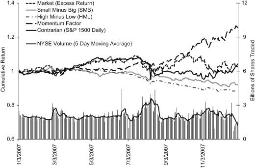

## Table of Contents

## What is a quant?

A quant, short for quantitative analyst, is a person who uses math and computer skills to help make decisions in finance. They work in banks, investment firms, and other financial places. Quants use numbers and data to predict how markets will move and to find good investments. They create models and use special computer programs to do this work.

Quants need to know a lot about math, like statistics and calculus. They also need to understand how financial markets work. Their job is important because they help companies make smart choices about where to put their money. By using data and math, quants can help reduce risks and increase profits for their employers.

## What was the financial market like in August 2007?

In August 2007, the financial market was starting to feel the effects of what would later be known as the global financial crisis. Things began to go wrong when many people couldn't pay back their home loans. This caused big problems for banks and other financial companies that had given out these loans. As a result, the value of many investments tied to these loans started to drop quickly. Investors got scared and started selling their investments, which made the situation even worse.

During this time, the stock market also became very unstable. On August 9, 2007, there was a big drop in stock prices around the world. This was one of the first signs that the financial system was in trouble. Banks became worried about lending money to each other, which made it harder for everyone to get loans. This period marked the beginning of a long and difficult time for the global economy, as the problems in the financial markets spread to other parts of the world.

## What triggered the crisis for quants in August 2007?

In August 2007, quants faced a big problem because of something called the "quant meltdown." This happened because many quants were using similar math models to make investment decisions. When the housing market started to fail, these models didn't work well anymore. As a result, many quants had to sell their investments quickly to avoid losing more money. This sudden selling caused the value of their investments to drop even more, making the situation worse.

The crisis was triggered on August 6, 2007, when a big [hedge fund](/wiki/hedge-fund-trading-strategies) called Goldman Sachs Global Alpha lost a lot of money. This made other investors panic and start selling their investments too. Because many quants were using the same strategies, the selling spread quickly across the market. This chain reaction showed how connected and risky the financial world had become, and it was a big wake-up call for quants and the whole industry.

## Which hedge funds were most affected by the quant crisis?

The quant crisis in August 2007 hit several big hedge funds hard. Goldman Sachs Global Alpha was one of the first to feel the pain. They lost a lot of money, which made other investors scared and start selling their investments too. Another fund that was badly affected was Renaissance Technologies' Medallion Fund. Even though they usually did well, they lost money during this time because their models didn't work like they used to.

AQR Capital Management also had a tough time during the crisis. Their funds dropped in value because the market was moving in ways their models couldn't predict. Highbridge Capital Management's Highbridge Statistical Opportunities Fund was another victim. They had to deal with big losses as the market turned against them. These hedge funds showed how risky it can be when many people use the same strategies and models.

## How did the quant crisis impact the broader financial markets?

The quant crisis in August 2007 made the financial markets even more unstable. When big hedge funds like Goldman Sachs Global Alpha and Renaissance Technologies started losing money, it scared other investors. They began selling their investments quickly, which made the value of stocks and other investments drop even more. This selling happened fast because many quants were using the same math models, so when one fund started to lose money, others followed. This chain reaction showed how connected the financial world is and how risky it can be when everyone uses the same strategies.

The crisis also made it harder for banks to trust each other. Banks became worried about lending money, which made it difficult for everyone to get loans. This problem spread from the quant funds to the whole financial system. The instability in the markets in August 2007 was one of the first signs of the bigger financial crisis that would come later. It showed that the problems in the housing market could affect other parts of the economy too, making it a tough time for everyone involved in finance.

## What were the main strategies used by quants that failed during the crisis?

During the quant crisis in August 2007, many quants used strategies that didn't work well anymore. One big strategy was called statistical [arbitrage](/wiki/arbitrage). This meant using math to find small differences in prices between similar investments and then buying and selling them to make a profit. But when the housing market started to fail, these small differences got bigger and the models couldn't predict them anymore. This made the quants lose money instead of making it.

Another strategy that failed was called [factor](/wiki/factor-investing)-based investing. Quants used this to pick investments based on certain factors like how big a company was or how much it was growing. They thought these factors would help them make good choices, but when the market got scared and started selling, these factors didn't work like they used to. The models couldn't handle the big changes in the market, so the quants had to sell their investments quickly, which made things even worse.

The crisis showed that when many quants use the same strategies and models, it can be very risky. If one model starts to fail, it can cause a chain reaction where everyone starts selling at the same time. This is what happened in August 2007, and it made the financial markets very unstable. It was a big lesson for quants and the whole financial industry about the dangers of relying too much on the same math models.

## What role did leverage play in the quant crisis?

Leverage played a big part in making the quant crisis worse in August 2007. Leverage means borrowing money to make bigger investments. Quants used a lot of leverage because they thought their math models would help them make more money. But when the models started to fail because of the housing market problems, the quants lost a lot of money quickly. Since they had borrowed so much, their losses were even bigger. This made them have to sell their investments fast to pay back their loans, which made the market drop even more.

The use of leverage also made the crisis spread faster. When one quant fund started losing money, it scared other funds that were using the same strategies. They also had to sell their investments quickly to cover their losses and pay back their loans. This chain reaction happened because everyone was using a lot of leverage. The more they borrowed, the bigger their losses were when things went wrong. This showed how risky it can be to use a lot of leverage, especially when everyone is using the same math models and strategies.

## How did quantitative models fail during the crisis?

During the quant crisis in August 2007, many quantitative models stopped working well because they couldn't handle the big changes in the market. These models were based on past data and math, but they didn't expect the housing market to fail so badly. When the housing market started to go down, the small differences in prices that the models used to make money got bigger and harder to predict. This made the models give wrong answers, and quants lost money instead of making it.

The models also failed because many quants were using the same ones. When one fund started losing money, it scared other funds that used similar models. They all had to sell their investments quickly to avoid losing more money, which made the market drop even more. This chain reaction showed that the models didn't work well when everyone was using them at the same time. The crisis taught quants that their models needed to be better at handling big and unexpected changes in the market.

## What were the immediate responses from affected hedge funds?

When the quant crisis hit in August 2007, the hedge funds that were losing money had to act fast. They started selling their investments quickly to try and stop their losses from getting bigger. This was because they had borrowed a lot of money to make their investments, and they needed to pay back those loans. Selling their investments fast made the market drop even more, which made things worse for everyone.

Some hedge funds also changed their strategies to try and survive the crisis. They stopped using the math models that were failing and looked for new ways to make money. This was hard because the market was very unstable, and it was tough to find good investments. The crisis showed the hedge funds that they needed to be ready for big changes in the market and not rely too much on the same models and strategies.

## What long-term changes occurred in the quant industry post-crisis?

After the quant crisis in August 2007, the quant industry changed a lot. Quants learned that they needed to be more careful with their math models. They started using models that could handle big changes in the market better. They also began to use different strategies and not just rely on the same ones. This made the industry more diverse and less risky. Quants also started to use less borrowed money, or leverage, because they saw how dangerous it could be when things went wrong.

Another big change was that quants started to pay more attention to things that their models couldn't predict, like how people feel about the market. They realized that understanding these feelings could help them make better decisions. The crisis also made quants work more closely with other parts of the financial world, like banks and regulators. This helped them share information and make the whole system safer. Overall, the quant crisis taught the industry important lessons about being ready for surprises and working together to manage risks.

## How did regulatory bodies react to the quant crisis?

After the quant crisis in August 2007, regulatory bodies started to pay more attention to how quants were using math models and borrowed money. They saw that when many quants used the same strategies, it could make the market very unstable. So, they began to make new rules to make sure quants were being more careful. They wanted to stop big problems like the quant crisis from happening again.

Regulators also started to ask for more information from hedge funds and other financial companies. They wanted to know more about the math models and strategies these companies were using. This helped them keep a closer eye on the market and make sure everyone was following the rules. The goal was to make the financial system safer and more stable for everyone.

## What lessons can be learned from the quant crisis of August 2007?

The quant crisis of August 2007 taught everyone in the financial world some big lessons. One important lesson was that using the same math models and strategies can be very risky. When many quants used the same models, it made the market unstable. If one model started to fail, it caused a chain reaction where everyone had to sell their investments quickly. This made the crisis worse. Quants learned that they need to use different strategies and be ready for big changes in the market.

Another lesson was about using borrowed money, or leverage. Quants used a lot of leverage to make bigger investments, but when their models failed, their losses were huge. This showed how dangerous it can be to borrow too much money. After the crisis, quants started to use less leverage and be more careful with their investments. They also learned to pay more attention to things their models couldn't predict, like how people feel about the market. This helped them make better decisions and make the financial system safer.

## References & Further Reading

[1]: Khandani, A. E., & Lo, A. W. (2011). ["What Happened to the Quants in August 2007?"](https://www.nber.org/papers/w14465) Journal of Financial Markets, 14(1), 1-46.

[2]: Buttonwood (2007, September 6). ["The blow-up: When quants from top-notch firms get a hiding, the damage to their reputation is serious."](https://www.princeton.edu/~markus/misc/MediaMention/Buttonwood%20_%20Economist.pdf) The Economist.

[3]: Narang, R. (2009). ["Inside the Black Box: The Simple Truth About Quantitative Trading."](https://onlinelibrary.wiley.com/doi/book/10.1002/9781118267738) Wiley.

[4]: Derman, E. (2011). ["Models.Behaving.Badly: Why Confusing Illusion with Reality Can Lead to Disaster, on Wall Street and in Life."](https://www.amazon.com/Models-Behaving-Badly-Confusing-Illusion-Reality-Disaster/dp/1439164991) Free Press.

[5]: Patterson, S. (2010). ["The Quants: How a New Breed of Math Whizzes Conquered Wall Street and Nearly Destroyed It."](https://www.amazon.com/Quants-Whizzes-Conquered-Street-Destroyed/dp/0307453383) Crown Business.