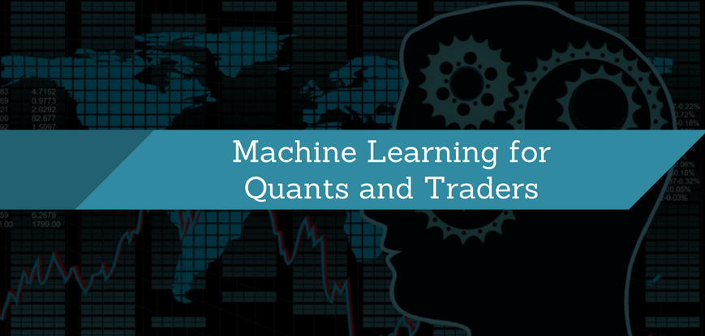

In August 2007, the world of algorithmic trading experienced an unprecedented upheaval, particularly affecting quantitative traders, or 'quants'. These traders rely on mathematical models and computational algorithms to make trading decisions, often involving long/short equity hedge funds. During this tumultuous month, there was a marked disruption in the performance of these funds, which raised significant concerns regarding the robustness and resilience of quantitative strategies.

The turbulence of August 2007 offers vital insights into the systemic risks that can accompany algorithmic trading, especially when these strategies are heavily leveraged. The markets saw unusual volatility and losses, leading to an examination of how such models handle stress and uncertainty. A multitude of factors, including overcrowded trades, liquidity shortages, and market-wide deleveraging, contributed to the disruption experienced by quant funds.

This article investigates the events that affected the quants during this period, aiming to understand the underlying causes of the market upheaval and its broader implications on financial markets. By examining the challenges faced by quantitative strategies in August 2007, we can glean lessons essential for improving the resilience and stability of algorithmic trading systems in the future.

## Table of Contents

## The Rise of Quantitative Trading

Quantitative trading is a sophisticated approach to financial markets, employing mathematical models and algorithms to discern and capitalize on trading opportunities. This methodology revolves around the analysis of vast datasets to predict market movements with precision and efficiency. As technology advanced, so did the allure of [quantitative trading](/wiki/quantitative-trading), especially in the years leading up to 2007.

One of the primary attractions of quantitative trading is its reliance on statistical [arbitrage](/wiki/arbitrage). This strategy seeks to exploit price discrepancies between related financial instruments. For instance, if two stocks typically move in tandem but temporarily diverge in price, a [statistical arbitrage](/wiki/statistical-arbitrage) model would identify this anomaly and execute trades to profit from the expected convergence. This requires intricate modeling and a deep understanding of market patterns.

High-frequency trading ([HFT](/wiki/high-frequency-trading-strategies)) represents another key component of quantitative strategies. HFT involves executing a large number of trades at incredibly fast speeds, often within milliseconds. These trades are facilitated by powerful computers and advanced algorithms capable of scanning multiple markets and securities simultaneously. High-frequency traders aim to capture minute price movements, which, when aggregated over thousands of trades, can yield significant profits.

The rise of quant trading also coincided with major technological advancements and increased availability of financial data. This enabled traders to develop more robust models capable of processing and analyzing vast datasets in real-time. As a result, quantitative trading strategies began to outperform traditional trading methodologies, attracting significant interest and capital from hedge funds and investment banks.

However, the proliferation of similar quant strategies led to concerns about market [liquidity](/wiki/liquidity-risk-premium) and systemic risk, as observed during the events of August 2007. Despite these concerns, quantitative trading remains a cornerstone of modern financial markets, continuously evolving with advancements in data science and computational technology.

## Events Leading Up to August 2007

Prior to August 2007, market activities indicated a significant accumulation of large positions in similar quantitatively-driven strategies by hedge funds and investment banks. These strategies predominantly focused on exploiting statistical arbitrage opportunities and leveraging sophisticated algorithms to predict and capitalize on market inefficiencies. The widespread adoption of similar trading techniques led to an increased concentration of trades, which in turn heightened systemic risks across financial markets.

During this period, the financial environment was marked by increasing tension as the subprime mortgage crisis began to unravel. The crisis, characterized by a sharp increase in mortgage delinquencies and foreclosures among subprime borrowers, had severe ramifications for the broader financial market. Early signs of distress became evident in the first half of 2007, with the collapse of two Bear Stearns hedge funds in June serving as a notable precursor to the impending turmoil.

By July 2007, the stress in the credit markets began to visibly manifest. As the repercussions of subprime mortgage defaults spread, credit spreads widened, and the availability of credit diminished. This environment of heightened risk aversion among investors led to increased [volatility](/wiki/volatility-trading-strategies) and uncertainty. Financial institutions, previously engaged in extensive lending and securitization activities, faced mounting challenges in sustaining liquidity and solvency amidst deteriorating market conditions.

The unfolding credit crisis prompted a reevaluation of risks across various asset classes, causing investors to become increasingly uneasy. Concerns about counterparty risk and the undervaluation of credit derivatives permeated the market, contributing to a pervasive sense of unease. This apprehension was compounded by rising defaults and the perceived inadequacies of existing risk management frameworks in addressing liquidity and leverage intricacies.

The convergence of these factors laid the groundwork for the significant market disruptions experienced in August 2007. As investors grappled with the rapid unraveling of credit markets, the stage was set for the severe losses that quant funds would soon encounter, highlighting the broader implications of correlated strategies and systemic vulnerabilities within quantitative trading paradigms.

## The Quant Meltdown

In the first week of August 2007, quantitative trading experienced a stark disruption as many quant funds were hit by unexpected and severe losses. Specifically, during this period, quant funds that had hitherto recorded consistent performance experienced a rapid decline in returns. The sudden downturn can primarily be attributed to the coordinated deleveraging of portfolios that followed similar strategies. When numerous funds attempt to liquidate similar positions simultaneously, it can lead to amplified market movements, thereby exacerbating losses across the board.

The events between August 6th and 8th were particularly impactful, as these days saw intensified selling pressure. The unwinding of positions was notably concentrated in financial sector stocks and those with high Book-to-Market ratios. These stocks were disproportionately affected because they were commonly held in many quant portfolios due to their value-leaning strategies, which typically entailed long positions in underpriced stocks (high Book-to-Market) and short positions in overpriced stocks (low Book-to-Market).

The ripple effect from this mass deleveraging and unwinding of positions created a negative feedback loop. As positions were liquidated, it triggered more significant market disturbances, prompting additional funds to sell assets to manage risk exposure, which further drove down prices. This cycle continued until the market began to stabilize as liquidity conditions improved. Understanding the dynamics of such deleveraging highlights the critical role of liquidity in maintaining market stability and showcases the inherent systemic risk when similar quantitative strategies dominate market positions.

## Understanding the Causes

The turmoil experienced by quantitative funds in August 2007 can be primarily attributed to an overcrowding of trades. This phenomenon occurs when numerous funds implement similar trading strategies, resulting in a concentration of positions across the financial markets. These concentrated positions diminish market liquidity, as the sheer [volume](/wiki/volume-trading-strategy) of trades overwhelms the capacity of the market to absorb them without significant price impacts.

One of the main reasons for this overcrowding was the widespread adoption of quantitative strategies focused on exploiting statistical arbitrage opportunities. These strategies often identified similar patterns or anomalies in securities pricing, leading to a convergence of trades around common targets. As more funds entered these trades, the liquidity necessary to facilitate smooth transactions became stretched, ultimately leading to a liquidity crunch.

During this period of stress, the need for funds to meet margin calls exacerbated the situation. Margin calls occur when the value of a trader's margin account falls below the broker's required amount, compelling the trader to either deposit additional funds or liquidate existing positions. As the market volatility spiked, many traders were forced to rapidly liquidate their positions to satisfy these margin calls, further amplifying the downward pressure on securities prices.

Additionally, there was a temporary withdrawal of market-making risk capital, which traditionally acts as a stabilizing force in the markets by providing the necessary liquidity. Market makers, who typically profit from buying and selling securities rapidly to capture bid-ask spreads, reduced their activities, perhaps due to increased uncertainty and risk. This withdrawal left a significant void, removing an essential mechanism of liquidity provision and exacerbating the liquidity crisis faced by the over-leveraged quantitative funds. 

In summary, the confluence of crowded trades, the urgency created by margin calls, and the retreat of market-makers culminated in a severe disruption, shedding light on the vulnerabilities inherent in heavily-leveraged, [algorithmic trading](/wiki/algorithmic-trading) strategies.

## The Aftermath and Lessons Learned

The events of August 2007 exposed significant vulnerabilities in quantitative trading strategies, particularly in times of financial stress. These revelations prompted hedge funds and financial institutions to reflect critically on their trading methodologies and risk management frameworks, leading to several key lessons and industry changes.

Firstly, the crisis underscored the dangers of strategy overlap among hedge funds. Many quantitative traders employed similar models, relying heavily on historical data and statistical arbitrage strategies. When these strategies became crowded, the lack of liquidity turned minor market corrections into significant financial setbacks. The realization that many traders were following analogous patterns highlighted the need for diversification not only in asset allocation but also in strategic approaches. Diversification became crucial to mitigate the systemic risk posed by homogenous trading tactics.

Secondly, the quant meltdown prompted a comprehensive re-evaluation of risk management practices. The sudden losses highlighted inadequacies in how risks were assessed and managed. This re-evaluation involved enhancing models to better account for liquidity risk and stress scenarios that were previously underestimated or ignored. Hedge funds began to adopt more robust stress testing and scenario analysis to identify potential vulnerabilities in their portfolios under extreme market conditions.

Additionally, the crisis illuminated the systemic implications of quantitative trading on financial stability. The broad adoption of similar quantitative strategies meant that systemic shocks could be amplified as funds simultaneously unwound similar positions to meet margin calls or rebalance portfolios. This realization prompted discussions on the potential systemic risks associated with algorithmic trading and the need for greater regulatory oversight to manage these risks.

As a result, regulatory bodies and financial institutions started advocating for more transparency in trading strategies and risk exposures. There was a push for better reporting and disclosure practices to enable more effective monitoring of potential systemic risks.

In summary, the aftermath of August 2007 brought about a heightened awareness of the inherent risks in quantitative trading, particularly under stress conditions. It emphasized the importance of diversification, improved risk management practices, and a consideration for the systemic impacts of trading strategies. These lessons have informed the evolution of quantitative finance, driving changes that aim to create more resilient and stable markets.

## Conclusion

The quant crisis of August 2007 underscores the intricate challenges and inherent risks within algorithmic trading. This event highlighted how highly correlated strategies and leveraged positions could lead to significant market disruptions. As the industry progresses, it is critical that quantitative traders continuously adapt their methodologies, not only leveraging technological advancements but also enhancing risk assessment and management techniques. 

The evolution of technology and data analytics provides both opportunities and challenges for algorithmic traders. Developing adaptive strategies capable of responding to unforeseen market anomalies is essential. This includes incorporating robust stress-testing frameworks, enhancing [machine learning](/wiki/machine-learning) models, and ensuring an agile response to liquidity constraints and market volatility.

Learning from historical market disruptions, such as the 2007 quant crisis, is a fundamental step in constructing more robust and resilient trading systems. These systems should aim for diversification and avoid common pitfalls, such as over-reliance on a single strategy or failing to account for liquidity risks. By integrating insights from past crises into the design of trading algorithms and infrastructure, firms can mitigate potential systemic risks and navigate future uncertainties more effectively.

Overall, the lessons from August 2007 serve as a cautionary tale, urging market participants to look beyond short-term gains and consider the long-term implications of their strategies in the continuously evolving landscape of financial markets.

## Further Reading

For those interested in gaining a deeper understanding of the quant crisis of August 2007, one of the foundational texts is the paper by Amir E. Khandani and Andrew W. Lo titled "What Happened to the Quants in August 2007?" published in the Journal of Financial Markets in 2011. This paper explores the systemic risks that emerged during this period, emphasizing the vulnerabilities in quantitative strategies when several funds were simultaneously affected by liquidity crunches and forced liquidations.

Additionally, advancements in portfolio [backtesting](/wiki/backtesting) and optimization tools have been pivotal in strategic evolutions post-2007. These tools facilitate better risk assessment and management by enabling traders to simulate multiple scenarios and stress tests, allowing for improved decision-making processes. Advances in optimization techniques, such as the use of machine learning algorithms, enhance the precision of predictive models. These improvements have led to more robust portfolio management strategies that aim to mitigate the risks of strategy overcrowding and enhance liquidity management.

For practical applications, consider experimenting with Python libraries such as TensorFlow for [neural network](/wiki/neural-network) models or PyPortfolioOpt for portfolio optimization to explore how modern computational tools can provide insights into market behaviors and risks. Understanding the mathematical and computational advancements since 2007 can provide valuable tools for developing resilient trading strategies.

## References & Further Reading

[1]: Khandani, A. E., & Lo, A. W. (2011). ["What Happened to the Quants in August 2007?"](https://www.nber.org/papers/w14465) Journal of Financial Markets, 14(1), 1-46.

[2]: Buttonwood (2007, September 6). ["The blow-up: When quants from top-notch firms get a hiding, the damage to their reputation is serious."](https://www.princeton.edu/~markus/misc/MediaMention/Buttonwood%20_%20Economist.pdf) The Economist.

[3]: Narang, R. (2009). ["Inside the Black Box: The Simple Truth About Quantitative Trading."](https://onlinelibrary.wiley.com/doi/book/10.1002/9781118267738) Wiley.

[4]: Derman, E. (2011). ["Models.Behaving.Badly: Why Confusing Illusion with Reality Can Lead to Disaster, on Wall Street and in Life."](https://www.amazon.com/Models-Behaving-Badly-Confusing-Illusion-Reality-Disaster/dp/1439164991) Free Press.

[5]: Patterson, S. (2010). ["The Quants: How a New Breed of Math Whizzes Conquered Wall Street and Nearly Destroyed It."](https://www.amazon.com/Quants-Whizzes-Conquered-Street-Destroyed/dp/0307453383) Crown Business.