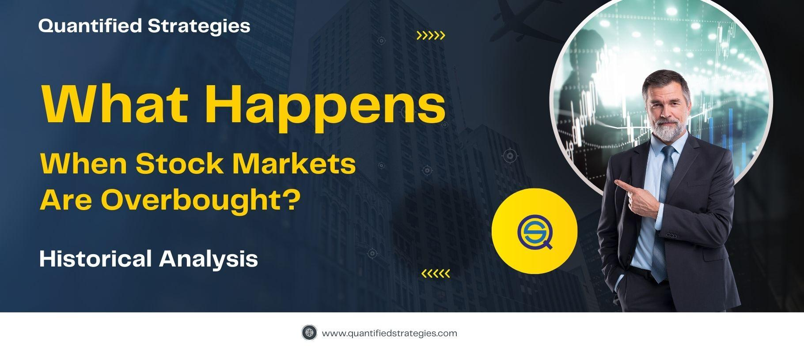

## Table of Contents

## What does it mean for a stock market to be overbought?

When people say a stock market is overbought, it means that the prices of stocks have gone up a lot and might be too high. This usually happens when many people are buying stocks quickly, pushing the prices higher than they should be based on the company's actual value. Think of it like a popular toy that everyone wants to buy, so the price goes up even if the toy hasn't changed.

Being overbought is a warning sign for investors. It suggests that the stock prices might fall soon because they can't keep going up forever. If too many people start selling their stocks at the same time, the prices can drop quickly. Investors watch for overbought conditions to decide when it might be a good time to sell their stocks before the prices go down.

## How can you identify when a stock market is overbought?

To identify when a stock market is overbought, investors often use a tool called the Relative Strength Index (RSI). The RSI is a number that goes from 0 to 100. When the RSI is above 70, it usually means the market is overbought. This is because the RSI measures how fast prices are going up and if they're going up too fast, it might be a sign that the prices are too high.

Another way to spot an overbought market is by looking at something called Bollinger Bands. These are lines drawn on a stock chart that show if prices are moving too far away from what's normal. If the price of a stock goes above the top Bollinger Band, it might mean the stock is overbought. Both the RSI and Bollinger Bands help investors see when stock prices might be too high and could fall soon.

## What are the common indicators used to determine if a market is overbought?

The most common indicator used to determine if a market is overbought is the Relative Strength Index (RSI). The RSI is a number that ranges from 0 to 100. When this number goes above 70, it means the market might be overbought. This happens because the RSI looks at how quickly prices are going up. If they're going up too fast, it's a sign that the prices might be too high and could fall soon.

Another useful tool is Bollinger Bands. These are lines on a stock chart that show if prices are moving too far from what's normal. If the price of a stock goes above the top Bollinger Band, it might mean the stock is overbought. Both the RSI and Bollinger Bands help investors see when it might be a good time to sell their stocks before the prices drop.

## What are the potential risks of investing in an overbought market?

Investing in an overbought market can be risky. When the market is overbought, it means that stock prices have gone up a lot and might be too high. If too many people start selling their stocks at the same time because they think the prices are too high, the prices can drop quickly. This can lead to big losses for investors who bought stocks at the high prices.

Another risk is that it's hard to predict when the market will start to go down. Even if the market looks overbought, it might stay that way for a while before it corrects. This can be frustrating for investors who decide to sell too early and miss out on more gains. It's important for investors to be careful and think about these risks before making decisions in an overbought market.

## How does an overbought market affect stock prices?

When a market is overbought, it means that stock prices have gone up a lot and might be too high. This happens when many people are buying stocks quickly, pushing the prices higher than they should be based on the company's actual value. It's like when everyone wants to buy a popular toy, so the price goes up even if the toy hasn't changed. Being overbought is a warning sign for investors because it suggests that the stock prices might fall soon. If too many people start selling their stocks at the same time, the prices can drop quickly.

This drop in prices can happen because when people see that the market is overbought, they might decide to sell their stocks to avoid losing money if the prices fall. This selling can cause a chain reaction where more and more people start selling, which makes the prices go down even faster. So, an overbought market can lead to big changes in stock prices, and it's important for investors to watch for signs that the market might be overbought to decide when it's a good time to sell their stocks.

## What historical examples exist of overbought markets and their outcomes?

One famous example of an overbought market was the dot-com bubble in the late 1990s and early 2000s. During this time, many internet companies were very popular, and people were buying their stocks like crazy. The prices of these stocks went up a lot, even though many of these companies were not making much money. By early 2000, the market was overbought, and the RSI was showing that the prices were too high. When people realized that these companies were not as valuable as they thought, they started selling their stocks. This caused the prices to fall quickly, and many investors lost a lot of money. The dot-com bubble burst, and it took years for the market to recover.

Another example is the housing market in the United States before the 2008 financial crisis. In the years leading up to 2008, housing prices were going up a lot because many people were buying houses with easy loans. The market became overbought, and the prices were much higher than what the houses were really worth. When people couldn't pay back their loans, they had to sell their houses, which made the prices fall. This led to a big drop in the housing market and caused a financial crisis that affected the whole world. It showed how dangerous it can be when a market becomes overbought and then crashes.

## What strategies can investors use to navigate an overbought market?

When the market is overbought, investors need to be careful and think about their strategies. One way to handle this is by watching the market closely and using tools like the Relative Strength Index (RSI) and Bollinger Bands. These tools help investors see when stock prices might be too high. If the RSI goes above 70 or if the price goes above the top Bollinger Band, it might be a good time to think about selling some stocks. This can help investors avoid big losses if the market starts to go down.

Another strategy is to take some profits. When the market is overbought, it might be a good idea to sell some stocks that have gone up a lot. This way, investors can keep some of the money they made and have it ready to use if the market goes down. It's also a good idea to not put all your money into one stock or one type of investment. By spreading out their investments, investors can lower the risk of losing a lot of money if one stock or market goes down. This approach can help investors stay safe and maybe even find new opportunities when the market changes.

## How can technical analysis help in understanding overbought conditions?

Technical analysis helps investors understand overbought conditions by using special tools like the Relative Strength Index (RSI) and Bollinger Bands. The RSI is a number that goes from 0 to 100. When it goes above 70, it's a sign that the market might be overbought. This means that stock prices have gone up a lot and might be too high. Bollinger Bands are lines on a chart that show if prices are moving too far from what's normal. If the price of a stock goes above the top Bollinger Band, it might mean the stock is overbought. These tools help investors see when it might be a good time to sell their stocks before the prices drop.

By using technical analysis, investors can make better decisions in an overbought market. For example, if the RSI shows the market is overbought, an investor might decide to sell some stocks to take profits and avoid big losses if the market goes down. Technical analysis also helps investors see patterns in stock prices that can tell them when the market might be about to change. This way, they can be ready to act quickly and maybe even find new opportunities when the market shifts.

## What role do market sentiment and investor psychology play in overbought markets?

Market sentiment and investor psychology are really important in overbought markets. When everyone feels good about the market and thinks prices will keep going up, they keep buying stocks. This makes the market overbought because so many people are buying that the prices go up a lot, even if the companies aren't worth that much. It's like when everyone wants to buy a popular toy, so the price goes up even if the toy hasn't changed.

But when people start to feel worried or scared, things can change quickly. If they think the prices are too high and might fall, they start selling their stocks. This can make the prices drop fast, and it can turn into a big sell-off. So, how people feel about the market can make it go from overbought to a big drop in prices. It's important for investors to watch how people are feeling and be ready to act if the mood changes.

## How do overbought conditions influence different sectors of the market?

When the market is overbought, it can affect different sectors in different ways. Some sectors, like technology or consumer goods, might see their stock prices go up a lot because they are popular and everyone wants to buy them. This can make these sectors even more overbought than others. For example, if everyone is excited about new tech gadgets, the tech sector might become overbought faster than other sectors.

On the other hand, sectors that are not as popular might not get as overbought. Sectors like utilities or basic materials might not see their prices go up as much because people are not as excited about them. But when the market starts to go down, these less popular sectors might not fall as much either. So, overbought conditions can make some sectors go up a lot and then fall a lot, while other sectors might stay more stable.

## What are the long-term implications of an overbought market on the economy?

When the market is overbought for a long time, it can have big effects on the whole economy. If stock prices keep going up and up, even when they are too high, it can make a bubble. This is like when everyone wants to buy a popular toy and the price goes up a lot. But if the bubble bursts and prices fall quickly, it can cause a lot of people to lose money. This can make people stop spending and businesses stop investing, which can slow down the whole economy.

But it's not all bad. Sometimes, an overbought market can mean that people feel good about the economy and are willing to take risks. This can lead to more spending and investing, which can help the economy grow. But it's important for people to be careful and not get too excited. If they keep an eye on the market and don't put all their money into one place, they can be ready for when things change and help keep the economy stable.

## How can algorithmic trading and quantitative models predict and react to overbought markets?

Algorithmic trading and quantitative models can help predict and react to overbought markets by using special math formulas and computer programs. These models look at things like the Relative Strength Index (RSI) and Bollinger Bands to see when the market might be overbought. If the RSI goes above 70 or if the price goes above the top Bollinger Band, the model can tell that the market might be overbought. This helps the computer decide when to sell stocks before the prices go down too much. By using these tools, algorithmic trading can make quick decisions and avoid big losses.

These models also look at a lot of other data, like how much people are buying and selling and what people are saying about the market. This helps the models understand how people feel about the market, which is important because when everyone feels good, the market can become overbought. If the models see that people are starting to feel worried, they can start selling stocks before everyone else does. This way, algorithmic trading can react to changes in the market faster than human investors and help keep money safe during overbought conditions.

## What is Understanding Overbought Markets?

An overbought market condition is characterized by the perception that securities are trading at prices higher than their intrinsic values. This phenomenon is not merely speculative but is often substantiated through various analytical tools and indicators that help quantify and identify such conditions. A prominent indicator used to identify overbought conditions is the Relative Strength Index (RSI), a momentum oscillator that measures the speed and change of price movements.

The RSI is typically calculated using the following formula:

$$

RSI = 100 - \left( \frac{100}{1 + RS} \right) 
$$

where $RS$ (Relative Strength) is the average gain of "n" days' up closes divided by the average loss of "n" days' down closes. The RSI provides readings on a scale from 0 to 100, where a value above 70 generally indicates an overbought condition, suggesting that the asset may have been overvalued and is possibly due for a pullback or reversal.

Identifying overbought market conditions is crucial for traders as it allows them to anticipate possible reversals or corrections. When a security is deemed overbought, it suggests that the upward price movement may be overstated, increasing the likelihood of a downturn as market participants recognize the overvaluation and adjust their positions accordingly.

The concept of overbought markets serves as an early warning system for traders, enabling them to adjust their strategies to mitigate potential losses or capitalize on the anticipated correction. Advanced [algorithmic trading](/wiki/algorithmic-trading) systems can implement technical indicators like the RSI to automate the detection and response to overbought conditions, thus optimizing the decision-making process and potentially enhancing profitability.

In summary, understanding overbought market conditions is essential for making informed trading decisions, particularly in algorithmic trading where the precision and timeliness of execution are paramount. By leveraging tools like the RSI, traders can better navigate the complexities of market valuation and anticipate possible market dynamics that could impact their trading strategies.

## What is the role of mean reversion in overbought conditions?

Mean reversion is a fundamental trading principle that postulates that asset prices and historical returns will eventually revert to their long-term mean or average level. This concept is particularly pertinent in overbought market conditions, where securities have appreciated rapidly and are trading above their intrinsic values. Traders leveraging mean reversion strategies aim to exploit these temporary deviations from the mean, anticipating a price correction.

Mean reversion strategies in overbought markets typically involve identifying assets whose prices have significantly deviated from their historical averages due to increased buying pressure. These strategies predict that prices will revert to lower levels as market participants adjust their valuations. By capitalizing on anticipated price corrections, traders can potentially profit from the retracement movements in the market.

A common mathematical representation of mean reversion is modeled using Ornstein-Uhlenbeck processes, where the price $X_t$ of an asset over time follows:

$$
dX_t = \theta(\mu - X_t)dt + \sigma dW_t
$$

In this formula:
- $\theta$ represents the speed of reversion to the mean.
- $\mu$ is the long-term mean level.
- $\sigma$ is the volatility of the asset.
- $dW_t$ is a Wiener process or Brownian motion, representing the random movements in the market.

Competitive advantage in mean reversion trading, particularly in algorithmic environments, often comes from the implementation of efficient [backtesting](/wiki/backtesting) procedures. Backtesting allows traders to simulate how mean reversion strategies would have performed on historical data, providing insights into their potential profitability and robustness under different market conditions. It involves evaluating past trading rules and strategies on historical market data to assess performance without risking actual capital.

Here's a Python snippet demonstrating a simple backtest for a mean reversion strategy using historical price data:

```python
import pandas as pd
import numpy as np

def simple_moving_average(data prices, window_size):
    return prices.rolling(window=window_size).mean()

def mean_reversion_strategy(prices, window_size, threshold):
    signals = pd.DataFrame(index=prices.index)
    signals['price'] = prices
    signals['sma'] = simple_moving_average(prices, window_size)
    signals['positions'] = 0

    # Generate buy/sell signals
    signals['positions'][window_size:] = np.where(signals['price'][window_size:] < signals['sma'][window_size:] - threshold, 1, 0)

    # Generate sell signals
    signals['positions'][window_size:] = np.where(signals['price'][window_size:] > signals['sma'][window_size:] + threshold, -1, signals['positions'][window_size:])

    # Calculate daily returns
    signals['returns'] = prices.pct_change()

    # Strategy Returns
    signals['strategy_returns'] = signals['positions'].shift(1) * signals['returns']

    return signals['strategy_returns'].cumsum()

# Example usage
prices = pd.Series([100, 102, 101, 105, 107, 108, 110, 111, 112])  # sample price data
cumulative_returns = mean_reversion_strategy(prices, window_size=3, threshold=1)
print(cumulative_returns)
```

This script demonstrates a basic mean reversion strategy by generating buy and sell signals based on whether the price deviates from the moving average by a specified threshold. The cumulative returns are then calculated to evaluate the strategy's performance.

In conclusion, applying mean reversion strategies in overbought markets can yield significant opportunities, especially if grounded in rigorous backtesting and data analysis. Understanding and leveraging mean reversion principles enables traders to make informed decisions, potentially leading to substantial market gains.

## How Can You Identify Overbought Markets Using Indicators?

Traders frequently employ technical indicators such as the Relative Strength Index (RSI) to assess market [momentum](/wiki/momentum) and identify overbought and oversold conditions. The RSI is a momentum oscillator that measures the speed and change of price movements, traditionally calculated over a 14-day period. The formula for RSI is:

$$

\text{RSI} = 100 - \left( \frac{100}{1 + \frac{\text{Average Gain}}{\text{Average Loss}}} \right)
$$

Values of the RSI range from 0 to 100, with readings above 70 typically indicating that a security is overbought, and readings below 30 suggesting that it is oversold. However, these thresholds can be adjusted based on specific trading strategies or market conditions.

In algorithmic trading, the implementation of these indicators can be automated, enabling traders to systematically detect overbought conditions without manual intervention. This is achieved through the integration of algorithms capable of continuously monitoring the RSI and other indicators to trigger trades according to predefined criteria.

Python is a preferred language for implementing such algorithms due to its robust libraries and ease of integration. Below is a simple example of how RSI can be calculated using the `pandas` and `numpy` libraries in Python:

```python
import pandas as pd
import numpy as np

def calculate_rsi(data, window=14):
    delta = data['Close'].diff()
    gain = np.where(delta > 0, delta, 0)
    loss = np.where(delta < 0, -delta, 0)

    avg_gain = pd.Series(gain).rolling(window=window, min_periods=1).mean()
    avg_loss = pd.Series(loss).rolling(window=window, min_periods=1).mean()

    rs = avg_gain / avg_loss
    rsi = 100 - (100 / (1 + rs))
    return rsi

data = pd.DataFrame({'Close': [112, 115, 113, 118, 120, 119, 123, 122, 126, 130]})
rsi = calculate_rsi(data)
print(rsi)
```

Adjusting the parameters and settings of these indicators is critical. Parameters such as the look-back period for the RSI can be customized to align with the specific [volatility](/wiki/volatility-trading-strategies) and characteristics of different markets or securities. For instance, in a more volatile market, a shorter look-back period might be more responsive to price changes, providing earlier signals.

Additionally, traders may consider applying other technical indicators alongside RSI, such as moving average convergence divergence (MACD) or stochastic oscillators, to confirm overbought conditions and enhance the effectiveness of their strategies. This multi-indicator approach can help reduce false signals and improve the reliability of the trading system in overbought market conditions.

## References & Further Reading

[1]: Bergstra, J., Bardenet, R., Bengio, Y., & Kégl, B. (2011). ["Algorithms for Hyper-Parameter Optimization."](https://dl.acm.org/doi/10.5555/2986459.2986743) Advances in Neural Information Processing Systems 24.

[2]: ["Advances in Financial Machine Learning"](https://www.amazon.com/Advances-Financial-Machine-Learning-Marcos/dp/1119482089) by Marcos Lopez de Prado

[3]: ["Evidence-Based Technical Analysis: Applying the Scientific Method and Statistical Inference to Trading Signals"](https://www.amazon.com/Evidence-Based-Technical-Analysis-Scientific-Statistical/dp/0470008741) by David Aronson

[4]: ["Machine Learning for Algorithmic Trading"](https://github.com/stefan-jansen/machine-learning-for-trading) by Stefan Jansen

[5]: ["Quantitative Trading: How to Build Your Own Algorithmic Trading Business"](https://books.google.com/books/about/Quantitative_Trading.html?id=j70yEAAAQBAJ) by Ernest P. Chan