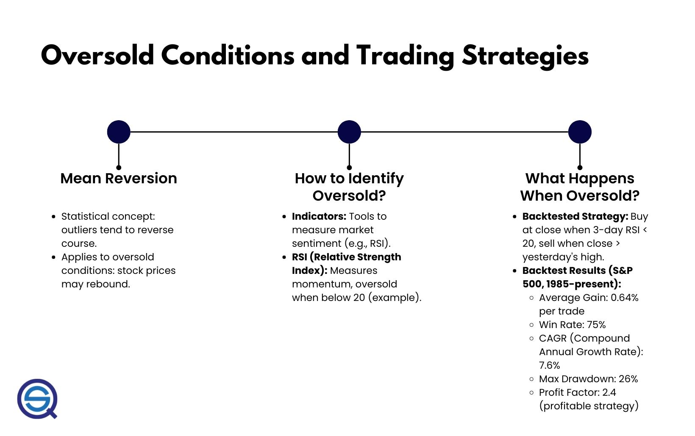

## Table of Contents

## What does it mean for a stock market to be oversold?

When people say a stock market is oversold, it means that the prices of stocks have gone down a lot and very quickly. This usually happens because a lot of people are selling their stocks at the same time. It's like when everyone wants to get out of a crowded room at once, and the rush makes things feel chaotic.

Being oversold doesn't mean the stocks are bad or that the companies are doing poorly. It just means that the market might have overreacted. Many investors see this as a buying opportunity because they believe the prices will go back up once the panic selling stops. It's like finding a good deal on something you wanted, but it was on sale because everyone was trying to sell it at the same time.

## How is the oversold condition identified in the stock market?

People use different tools to figure out if the stock market is oversold. One common tool is the Relative Strength Index, or RSI. The RSI is a number between 0 and 100 that shows how fast prices are changing. If the RSI goes below 30, it might mean the market is oversold. This is because a low RSI suggests that the price has been dropping a lot and might be due for a bounce back.

Another way to spot an oversold market is by looking at the market's price compared to its moving average. A moving average is like a smoothed-out line of the stock's price over time. If the current price is a lot lower than the moving average, it could be a sign that the market is oversold. This shows that the price has fallen quickly and might be ready to go back up. Both these methods help investors decide if it's a good time to buy stocks at lower prices.

## What are common indicators used to determine if a stock market is oversold?

One common way to tell if the stock market is oversold is by using the Relative Strength Index, or RSI. The RSI is a number that goes from 0 to 100. It shows how fast the price of stocks is changing. If the RSI drops below 30, it might mean the market is oversold. This happens because a low RSI suggests that the price has been going down a lot and might be ready to go back up.

Another way to spot an oversold market is by comparing the current price of stocks to their moving average. A moving average is like a smoothed-out line of the stock's price over time. If the current price is much lower than the moving average, it could be a sign that the market is oversold. This means the price has fallen quickly and might be ready to go back up soon. Both these methods help investors decide if it's a good time to buy stocks at a lower price.

## What are the potential causes of an oversold stock market?

An oversold stock market can happen because of a lot of people selling their stocks at the same time. This might be because of bad news, like a big company doing poorly or the whole economy not doing well. When people hear this news, they might get scared and want to sell their stocks quickly to avoid losing more money. This rush to sell can make stock prices drop a lot, even if the companies are still okay.

Another reason for an oversold market is when investors think the market is going to keep going down. They might start selling their stocks to get out before the prices drop even more. This can create a cycle where more selling leads to lower prices, which makes more people want to sell. It's like a snowball rolling down a hill, getting bigger and faster as it goes. Eventually, though, the selling might stop, and the market could start to recover.

## How does an oversold market affect individual investors?

When the stock market is oversold, it can be a scary time for individual investors. They might see the value of their investments dropping a lot and quickly. This can make them feel like they need to sell their stocks to avoid losing even more money. But if they sell when the market is oversold, they might miss out on the chance for the prices to go back up. It's like selling a good item at a yard sale for less than it's worth because you're in a hurry.

On the other hand, an oversold market can also be a good opportunity for individual investors. If they believe the market will recover, they might buy stocks at lower prices. This is like getting a discount on something you wanted to buy anyway. If the market does go back up, they could make a good profit. The key is to stay calm and not make quick decisions based on fear. By doing their research and understanding the market, investors can make smarter choices during an oversold period.

## What are the typical reactions of institutional investors to an oversold market?

When the stock market is oversold, institutional investors, like big banks and investment funds, often see it as a chance to buy stocks at lower prices. They have a lot of money and resources to study the market. So, they can tell when the market might be ready to go back up. Instead of selling like some individual investors might do, they buy more stocks. They think that once the panic selling stops, the prices will go back up, and they can make a profit.

However, not all institutional investors react the same way. Some might decide to sell their stocks if they think the market will keep going down. They want to protect their money and avoid bigger losses. But usually, these big investors have a long-term view. They know that markets go up and down, and they are ready to wait for the right time to buy or sell. So, even in an oversold market, they might stay calm and stick to their plan.

## Can an oversold market signal a buying opportunity? Why or why not?

Yes, an oversold market can signal a buying opportunity. When the market is oversold, it means that a lot of people have sold their stocks quickly, making the prices go down a lot. This can happen even if the companies are still doing okay. Investors who understand this might see it as a chance to buy stocks at a lower price. It's like finding a good deal on something you wanted to buy anyway. If the market goes back up, which it often does after being oversold, these investors could make a profit.

However, buying in an oversold market is not always a sure thing. It's important for investors to do their homework and not just buy because the prices are low. Sometimes, the market might keep going down for a while before it goes back up. So, investors need to be ready to wait and have a plan. If they believe in the long-term value of the companies they are buying, an oversold market can be a great time to invest. But it's not a guarantee, and it takes patience and understanding of the market.

## What historical examples illustrate the effects of an oversold stock market?

One famous example of an oversold market happened in the early 2000s during the dot-com bubble burst. A lot of people had invested in internet companies, thinking they would keep growing. But when these companies started to fail, everyone wanted to sell their stocks at the same time. This made the prices drop a lot, and the market became oversold. Smart investors who saw this as a buying opportunity could buy stocks at low prices. Over time, as the market recovered, they made good profits.

Another example is the financial crisis of 2008. It started with problems in the housing market, but it quickly spread to the whole economy. People were scared and started selling their stocks, which made the market go down a lot. It became oversold because the prices dropped so fast. Investors who stayed calm and bought stocks during this time could see big gains when the market started to recover. These examples show that an oversold market can be scary, but it can also be a chance to buy good stocks at a discount.

## How can traders use technical analysis to capitalize on an oversold market?

Traders can use technical analysis to find out if the market is oversold and decide when to buy stocks. One common tool they use is the Relative Strength Index, or RSI. The RSI is a number that goes from 0 to 100. If it drops below 30, it might mean the market is oversold. Traders look for this signal because it can show that the price has gone down a lot and might be ready to go back up. They might buy stocks when the RSI is low, hoping to sell them later at a higher price.

Another way traders use technical analysis is by looking at moving averages. A moving average is like a smoothed-out line of the stock's price over time. If the current price is a lot lower than the moving average, it could be a sign that the market is oversold. Traders might see this as a chance to buy stocks at a lower price. They believe that once the panic selling stops, the price will go back up towards the moving average, and they can make a profit. By using these tools, traders can make smarter decisions during an oversold market.

## What are the risks associated with investing in an oversold market?

Investing in an oversold market can be risky because the prices might keep going down before they go back up. Just because the market is oversold doesn't mean it will recover right away. Sometimes, the selling can keep going for a while, and if you buy stocks thinking they will go up soon, you might lose more money if they keep dropping. It's important to be patient and ready to wait for the market to turn around.

Another risk is that you might not pick the right stocks to buy. Even if the market as a whole is oversold, some companies might still be doing poorly. If you buy stocks from these companies, they might not recover, and you could lose your investment. It's crucial to do your homework and make sure the companies you are buying are good ones with a strong chance of bouncing back when the market does.

## How do different sectors of the economy react to an oversold market condition?

When the stock market is oversold, different parts of the economy can react in different ways. Some sectors, like technology or consumer goods, might see their stock prices drop a lot because a lot of people are selling their shares quickly. These sectors can be more sensitive to changes in the market because they often rely on people feeling good about spending money. If people are scared and selling stocks, they might not want to buy new gadgets or other products, which can hurt these companies even more.

On the other hand, sectors like utilities or healthcare might not see their prices drop as much. These sectors are often seen as more stable because people always need electricity, water, and medical care, no matter what the market is doing. Investors might even see these sectors as safe places to put their money during an oversold market, which can help keep their stock prices from falling as much as others. So, while an oversold market can affect the whole economy, some sectors can handle it better than others.

## What advanced strategies can be employed to predict and benefit from oversold market rebounds?

One advanced strategy to predict and benefit from oversold market rebounds is using a combination of technical indicators. Traders might look at the Relative Strength Index (RSI) along with other tools like the Moving Average Convergence Divergence (MACD) and Bollinger Bands. The RSI can show when a market is oversold, but the MACD can help confirm if the market is about to turn around. Bollinger Bands can show how much the price is moving and help find the best time to buy. By using these tools together, traders can make smarter guesses about when the market might go back up and buy stocks at the right time.

Another strategy is to use fundamental analysis to pick the best stocks to buy during an oversold market. This means looking at the company's financial health, like its earnings, debts, and growth potential. Even if the market is oversold, some companies might still be doing well and have a good chance of recovering quickly. By focusing on these strong companies, investors can feel more confident about their investments. This approach takes more time and research, but it can help investors find the best opportunities to make money when the market rebounds.

## What are Oversold Conditions and How Can We Understand Them?

Oversold conditions occur when a stock's price experiences a rapid decline over a short duration, often beyond what is justified by the company's intrinsic value and broader market conditions. This typically reflects an imbalance where the selling pressure outweighs buying interest, potentially driven by market sentiment or external events. Technical analysis plays a critical role in identifying such conditions, with the Relative Strength Index (RSI) being one of the most utilized indicators.

The RSI, developed by J. Welles Wilder Jr., is a [momentum](/wiki/momentum) oscillator that measures the speed and change of price movements. It oscillates between 0 and 100 and is typically used to evaluate overbought or oversold conditions in trading. The formula for RSI is:

$$

\text{RSI} = 100 - \left( \frac{100}{1 + \text{RS}} \right) 
$$

where $\text{RS}$ (Relative Strength) is the average of ‘n’ days' up closes divided by the average of ‘n’ days' down closes. A common practice is to use 14 periods to calculate the RSI.

When the RSI falls below 30, it generally signals that the asset is oversold. An oversold condition suggests that the asset may be undervalued and due for a corrective upward movement. However, it is crucial to acknowledge that while the RSI and other similar indicators provide valuable signals, they do not guarantee that a price reversal will occur. Rather, they serve as tools to help traders make more informed decisions.

For algorithmic traders, identifying oversold conditions is paramount as it allows them to anticipate potential market corrections and establish trading strategies that maximize returns. Algorithms can quickly assess RSI data alongside other market indicators, facilitating timely trading decisions when oversold signals are detected. This process often involves automated frameworks that continuously monitor price data and execute trades when predefined conditions, such as an RSI drop below 30, are met.

The capability to discern oversold conditions in stocks through technical indicators like the RSI enhances the efficacy of [algorithmic trading](/wiki/algorithmic-trading) systems by enabling them to engage in strategic buying at the optimal time. Such tactics help traders exploit short-term reversals, potentially leading to profitable outcomes. However, the effectiveness of these strategies depends significantly on the precision of the data input and the robustness of the algorithmic models employed.

## References & Further Reading

[1]: Wilder, J. W. (1978). ["New Concepts in Technical Trading Systems"](https://www.amazon.com/New-Concepts-Technical-Trading-Systems/dp/0894590278). Trend Research.

[2]: Lopez de Prado, M. (2018). ["Advances in Financial Machine Learning"](https://www.amazon.com/Advances-Financial-Machine-Learning-Marcos/dp/1119482089). Wiley.

[3]: Aronson, D. (2006). ["Evidence-Based Technical Analysis: Applying the Scientific Method and Statistical Inference to Trading Signals"](https://www.amazon.com/Evidence-Based-Technical-Analysis-Scientific-Statistical/dp/0470008741). Wiley.

[4]: Jansen, S. (2018). ["Machine Learning for Algorithmic Trading - Second Edition"](https://github.com/PacktPublishing/Machine-Learning-for-Algorithmic-Trading-Second-Edition). Packt Publishing.

[5]: Chan, E. P. (2009). ["Quantitative Trading: How to Build Your Own Algorithmic Trading Business"](https://github.com/ftvision/quant_trading_echan_book). Wiley.